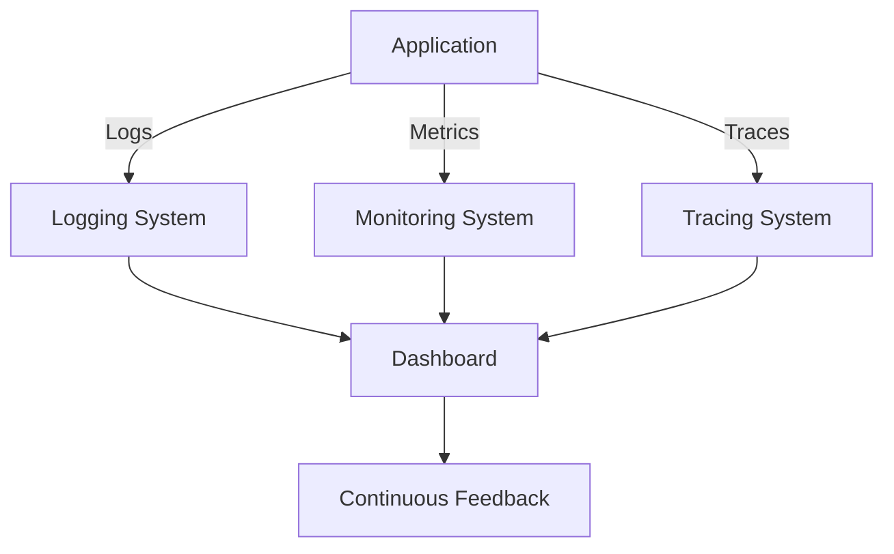

## 16.8 Continuous Observability in Production

In the realm of software engineering, particularly when working with Haskell, continuous observability in production is a critical practice for ensuring system reliability, performance, and scalability. This section delves into the intricacies of observability, focusing on how to effectively incorporate logging, monitoring, and tracing into your development cycle. By leveraging these practices, you can gain valuable insights into your system's behavior, allowing for continuous feedback and informed improvements.

### Observability Practices

Observability is the ability to infer the internal states of a system based on its external outputs. In Haskell, observability practices involve a combination of logging, monitoring, and tracing. These components work together to provide a comprehensive view of your application's performance and health.

#### Logging

Logging is the process of recording information about your application's runtime behavior. In Haskell, logging can be achieved using libraries such as `fast-logger` or `katip`. These libraries provide efficient and structured logging capabilities, allowing you to capture detailed information about your application's execution.

```haskell
import System.Log.FastLogger

main :: IO ()
main = do
    logger <- newStdoutLoggerSet defaultBufSize
    let logStr = toLogStr "Application started\n"
    pushLogStrLn logger logStr
    -- Application logic here
    flushLogStr logger
```

In this example, we use `fast-logger` to log a simple message to the console. The `toLogStr` function converts a string into a loggable format, and `pushLogStrLn` sends the log message to the logger.

#### Monitoring

Monitoring involves tracking the performance and health metrics of your application over time. Tools like Prometheus and Grafana can be integrated with Haskell applications to collect and visualize metrics such as CPU usage, memory consumption, and request latency.

```haskell
import Prometheus

main :: IO ()
main = do
    let counter = counter "http_requests_total" "Total number of HTTP requests"
    incCounter counter
    -- Application logic here
    putStrLn "Metrics recorded"
```

This snippet demonstrates how to use the `Prometheus` library to define and increment a counter metric. Such metrics can be scraped by Prometheus and visualized in Grafana dashboards.

#### Tracing

Tracing provides a detailed view of the execution flow within your application. It helps identify bottlenecks and understand the interactions between different components. Libraries like `OpenTelemetry` can be used to implement tracing in Haskell applications.

```haskell
import OpenTelemetry.Trace

main :: IO ()
main = do
    tracer <- createTracer "example-tracer"
    inSpan tracer "main-operation" $ \_ -> do
        -- Application logic here
        putStrLn "Tracing operation completed"
```

In this example, we create a tracer and use it to trace a specific operation within our application. The `inSpan` function defines a span, representing a unit of work within the trace.

### Continuous Feedback

Continuous feedback is a crucial aspect of observability, enabling you to use the data collected from logging, monitoring, and tracing to make informed decisions and improvements. By analyzing this data, you can identify patterns, detect anomalies, and optimize your application's performance.

#### Feedback Loop

Establishing a feedback loop involves regularly reviewing observability data and using it to guide development efforts. This process can be automated using continuous integration (CI) pipelines that incorporate observability tools.

```yaml
# .gitlab-ci.yml
stages:
  - build
  - test
  - deploy
  - observe

observe:
  stage: observe
  script:
    - ./deploy-observability-tools.sh
    - ./run-monitoring.sh
```

In this CI configuration, we define an `observe` stage that deploys observability tools and runs monitoring scripts. This ensures that observability is an integral part of the development lifecycle.

#### Data-Driven Improvements

Using observability data, you can prioritize improvements based on actual system behavior. For example, if tracing data reveals a slow database query, you can focus on optimizing that query to enhance performance.

### Implementation

Implementing continuous observability in production requires a strategic approach, involving the integration of observability tools into your development and deployment processes.

#### Setting Up Observability Tools

To set up observability tools, you need to choose the right combination of logging, monitoring, and tracing solutions that fit your application's needs. Consider factors such as scalability, ease of integration, and community support.

#### Integrating with CI/CD Pipelines

Integrating observability tools with CI/CD pipelines ensures that observability is continuously maintained throughout the software development lifecycle. This integration allows for automated deployment and configuration of observability tools, reducing manual effort and ensuring consistency.

```yaml
# Jenkinsfile
pipeline {
    agent any
    stages {
        stage('Build') {
            steps {
                sh 'stack build'
            }
        }
        stage('Test') {
            steps {
                sh 'stack test'
            }
        }
        stage('Deploy') {
            steps {
                sh 'stack deploy'
            }
        }
        stage('Observe') {
            steps {
                sh './setup-observability.sh'
                sh './start-monitoring.sh'
            }
        }
    }
}
```

This Jenkins pipeline includes an `Observe` stage, where observability tools are set up and monitoring is initiated. This ensures that observability is part of the deployment process.

#### Continuous Improvement

Continuous improvement is an ongoing process that involves regularly reviewing observability data and making necessary adjustments to enhance system performance and reliability. This iterative approach ensures that your application remains robust and responsive to changing demands.

### Visualizing Observability

To effectively visualize observability data, you can use tools like Grafana to create dashboards that display key metrics and traces. These visualizations provide a clear and concise view of your application's health and performance.



This diagram illustrates the flow of observability data from the application to various systems and ultimately to a dashboard that provides continuous feedback.

### Challenges and Considerations

Implementing continuous observability in production comes with its own set of challenges and considerations. It's important to address these to ensure a successful observability strategy.

#### Data Overload

One of the challenges of observability is managing the sheer volume of data generated by logging, monitoring, and tracing. It's crucial to implement strategies for filtering and aggregating data to focus on the most relevant information.

#### Performance Impact

Observability tools can introduce performance overhead. It's important to balance the level of detail captured with the impact on system performance. Consider using sampling techniques to reduce the volume of data collected.

#### Security and Privacy

When implementing observability, ensure that sensitive data is protected. Use encryption and access controls to safeguard observability data, and comply with relevant privacy regulations.

### Best Practices

To maximize the benefits of continuous observability, consider the following best practices:

- **Define Clear Objectives**: Establish clear goals for what you want to achieve with observability, such as reducing downtime or improving response times.
- **Automate Observability**: Use automation tools to deploy and configure observability solutions, reducing manual effort and ensuring consistency.
- **Regularly Review Data**: Schedule regular reviews of observability data to identify trends and areas for improvement.
- **Collaborate Across Teams**: Involve multiple teams in the observability process, including developers, operations, and security, to gain diverse perspectives and insights.

### Conclusion

Continuous observability in production is a powerful practice that enables you to maintain a high level of system performance and reliability. By integrating logging, monitoring, and tracing into your development cycle, you can gain valuable insights into your application's behavior and make informed improvements. Remember, observability is not a one-time effort but an ongoing process that requires regular review and adjustment. Embrace the journey of continuous observability, and you'll be well-equipped to tackle the challenges of modern software development.

## Quiz: Continuous Observability in Production



### What is the primary goal of observability in software systems?

- [x] To infer the internal states of a system based on its external outputs
- [ ] To increase the complexity of the system
- [ ] To reduce the number of logs generated
- [ ] To eliminate the need for monitoring

> **Explanation:** Observability aims to understand the internal states of a system by analyzing its outputs, such as logs, metrics, and traces.

### Which Haskell library is commonly used for logging?

- [x] fast-logger
- [ ] Prometheus
- [ ] OpenTelemetry
- [ ] Grafana

> **Explanation:** `fast-logger` is a popular Haskell library used for efficient and structured logging.

### What is the purpose of tracing in observability?

- [x] To provide a detailed view of the execution flow within an application
- [ ] To replace logging
- [ ] To reduce the number of metrics collected
- [ ] To eliminate the need for monitoring

> **Explanation:** Tracing helps understand the execution flow and interactions between components in an application.

### What is a feedback loop in the context of observability?

- [x] A process of regularly reviewing observability data to guide development efforts
- [ ] A method to increase logging verbosity
- [ ] A technique to reduce monitoring costs
- [ ] A way to eliminate the need for tracing

> **Explanation:** A feedback loop involves using observability data to inform and guide development and improvement efforts.

### Which tool is commonly used for visualizing observability data?

- [x] Grafana
- [ ] Jenkins
- [ ] Hspec
- [ ] Cabal

> **Explanation:** Grafana is widely used for creating dashboards to visualize observability data.

### What is a challenge associated with observability?

- [x] Managing the volume of data generated
- [ ] Eliminating the need for logging
- [ ] Reducing the complexity of the system
- [ ] Increasing the number of metrics collected

> **Explanation:** Observability can generate a large volume of data, which needs to be managed effectively.

### How can observability tools impact system performance?

- [x] They can introduce performance overhead
- [ ] They eliminate the need for monitoring
- [ ] They reduce the complexity of the system
- [ ] They increase the number of logs generated

> **Explanation:** Observability tools can introduce performance overhead, so it's important to balance detail with impact.

### What is a best practice for implementing observability?

- [x] Automate the deployment and configuration of observability solutions
- [ ] Manually configure all observability tools
- [ ] Avoid using dashboards for visualization
- [ ] Increase the number of logs generated

> **Explanation:** Automating observability deployment and configuration ensures consistency and reduces manual effort.

### What should be considered when implementing observability?

- [x] Security and privacy of observability data
- [ ] Eliminating the need for monitoring
- [ ] Increasing the complexity of the system
- [ ] Reducing the number of logs generated

> **Explanation:** It's important to protect sensitive observability data and comply with privacy regulations.

### Continuous observability is a one-time effort.

- [ ] True
- [x] False

> **Explanation:** Continuous observability is an ongoing process that requires regular review and adjustment.


