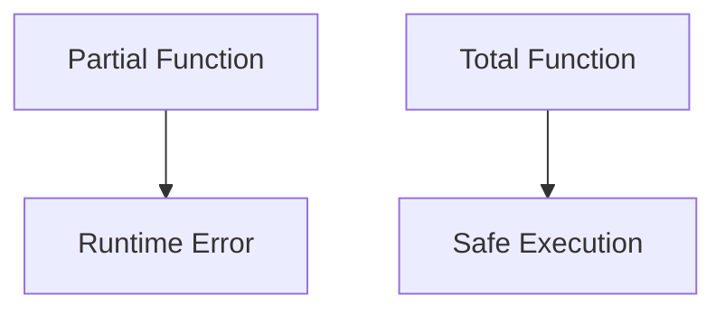
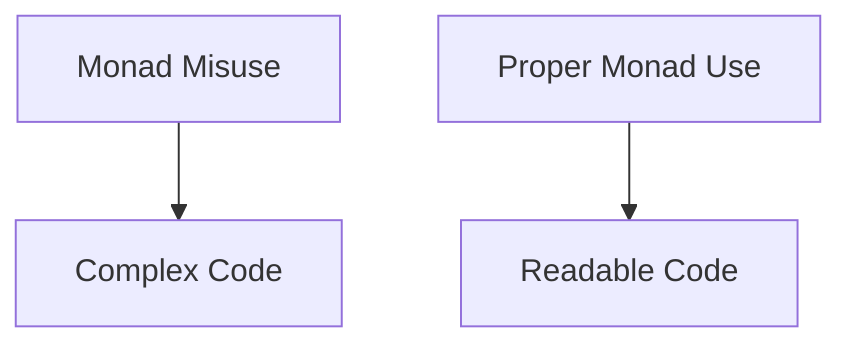

## 17.1 Recognizing Functional Anti-Patterns

In the world of software engineering, recognizing and avoiding anti-patterns is crucial for maintaining high-quality code. This is especially true in Haskell, a language that embraces functional programming paradigms. In this section, we will explore some common functional anti-patterns in Haskell, understand why they are considered anti-patterns, and learn how to avoid them.

### Definition

Functional anti-patterns are common programming practices that are ineffective or counterproductive in Haskell. They often arise from a misunderstanding of functional programming principles or an inappropriate application of concepts from other paradigms, such as object-oriented programming.

### Importance

Understanding and avoiding functional anti-patterns is essential for improving code quality, maintainability, and performance. By recognizing these pitfalls, developers can write more idiomatic Haskell code that leverages the language's strengths.

### Discussion

Let's delve into some of the most prevalent functional anti-patterns in Haskell and how to recognize them.

### 1. Overusing Partial Functions

Partial functions are functions that are not defined for all possible inputs. In Haskell, common examples include `head`, `tail`, and `fromJust`. These functions can lead to runtime errors if not used carefully.

#### Why It's an Anti-Pattern

Partial functions can cause unexpected crashes and make code less robust. They violate the principle of total functions, which are defined for all inputs.

#### How to Avoid It

- **Use Safe Alternatives**: Prefer using functions like `safeHead` or `safeTail` that return `Maybe` types.
  
  ```haskell
  safeHead :: [a] -> Maybe a
  safeHead []    = Nothing
  safeHead (x:_) = Just x
  ```

- **Pattern Matching**: Use pattern matching to handle different cases explicitly.

  ```haskell
  processList :: [Int] -> Int
  processList []     = 0
  processList (x:xs) = x + sum xs
  ```

### 2. Misuse of Monads and Monad Transformers

Monads are a powerful abstraction in Haskell, but they can be misused, leading to complex and unreadable code.

#### Why It's an Anti-Pattern

Misusing monads can result in code that is difficult to understand and maintain. It can also lead to unnecessary complexity when simpler solutions exist.

#### How to Avoid It

- **Understand Monad Laws**: Ensure that your monadic code adheres to the monad laws (left identity, right identity, and associativity).

- **Use Monad Transformers Judiciously**: Only use monad transformers when necessary. Consider whether simpler abstractions, like applicatives or functors, might suffice.

- **Keep It Simple**: Avoid stacking too many transformers, which can complicate the code.

### 3. Overcomplicating with Type-Level Programming

Haskell's type system is powerful, but overusing type-level programming can lead to overly complex code.

#### Why It's an Anti-Pattern

While type-level programming can provide strong guarantees, it can also make code difficult to read and understand, especially for those unfamiliar with advanced type system features.

#### How to Avoid It

- **Balance Type Safety and Simplicity**: Use type-level programming when it provides clear benefits, but avoid it when it adds unnecessary complexity.

- **Document Your Code**: When using advanced type features, provide thorough documentation to help others (and your future self) understand the code.

### 4. Ignoring Lazy Evaluation Pitfalls (Space Leaks)

Haskell's lazy evaluation can lead to space leaks if not managed properly.

#### Why It's an Anti-Pattern

Space leaks occur when memory is consumed unnecessarily, often due to retaining references to large data structures longer than needed.

#### How to Avoid It

- **Use Strict Evaluation**: Use strict evaluation (`seq`, `bang patterns`) where appropriate to avoid retaining unnecessary thunks.

- **Profile Your Code**: Use profiling tools to identify and address space leaks.

### 5. Excessive Use of Stringly Typed Data

Using strings to represent structured data can lead to errors and make code less maintainable.

#### Why It's an Anti-Pattern

Stringly typed data lacks type safety, making it easy to introduce errors and difficult to refactor.

#### How to Avoid It

- **Use Strongly Typed Data**: Define data types to represent structured data, leveraging Haskell's strong type system.

  ```haskell
  data User = User { userId :: Int, userName :: String }
  ```

### 6. Underutilizing the Type System

Haskell's type system is one of its greatest strengths, but failing to leverage it can lead to less robust code.

#### Why It's an Anti-Pattern

Ignoring the type system means missing out on compile-time guarantees and type safety.

#### How to Avoid It

- **Define Custom Types**: Use custom data types to represent domain concepts.

- **Leverage Type Classes**: Use type classes to define generic interfaces and polymorphic behavior.

### 7. Misapplying Object-Oriented Patterns in Haskell

Haskell is not an object-oriented language, and applying OO patterns can lead to non-idiomatic code.

#### Why It's an Anti-Pattern

Object-oriented patterns often rely on mutable state and inheritance, which do not align with Haskell's functional paradigm.

#### How to Avoid It

- **Embrace Functional Patterns**: Use functional patterns like higher-order functions, algebraic data types, and type classes.

- **Understand the Paradigm**: Learn the idiomatic ways to solve problems in Haskell.

### 8. Neglecting Error Handling and Validation

Proper error handling is crucial for robust applications, but it can be overlooked in functional programming.

#### Why It's an Anti-Pattern

Ignoring error handling can lead to brittle applications that fail unexpectedly.

#### How to Avoid It

- **Use Monads for Error Handling**: Use `Maybe`, `Either`, or custom error monads to handle errors gracefully.

  ```haskell
  divide :: Double -> Double -> Either String Double
  divide _ 0 = Left "Division by zero"
  divide x y = Right (x / y)
  ```

- **Validate Inputs**: Ensure inputs are validated before processing.

### 9. Refactoring Anti-Patterns in Haskell

Refactoring is essential for maintaining code quality, but certain practices can hinder rather than help.

#### Why It's an Anti-Pattern

Poor refactoring practices can introduce bugs and make code less readable.

#### How to Avoid It

- **Refactor Incrementally**: Make small, incremental changes and test frequently.

- **Use Tools**: Leverage tools like `hlint` to identify potential improvements.

### 10. Performance Anti-Patterns

Performance is critical in many applications, and certain patterns can degrade performance.

#### Why It's an Anti-Pattern

Ignoring performance considerations can lead to slow, inefficient code.

#### How to Avoid It

- **Profile and Optimize**: Use profiling tools to identify bottlenecks and optimize performance-critical sections.

- **Consider Algorithm Complexity**: Choose appropriate algorithms and data structures for the task.

### 11. Common Pitfalls with Monads and Effects

Monads and effects are central to Haskell, but they can be misused.

#### Why It's an Anti-Pattern

Misusing monads and effects can lead to code that is difficult to understand and maintain.

#### How to Avoid It

- **Understand the Monad Stack**: Be clear about the order and purpose of monads in a stack.

- **Use Effect Systems**: Consider using effect systems like `Polysemy` for managing effects.

### 12. Implicit Dependencies and Hidden State

Implicit dependencies and hidden state can make code difficult to understand and maintain.

#### Why It's an Anti-Pattern

They obscure the flow of data and make reasoning about code more difficult.

#### How to Avoid It

- **Make Dependencies Explicit**: Pass dependencies explicitly through function parameters or use the `Reader` monad.

- **Avoid Global State**: Use local state and pure functions wherever possible.

### 13. Poor Module Organization

Organizing code into modules is important for maintainability, but poor organization can lead to confusion.

#### Why It's an Anti-Pattern

Poor module organization can make code difficult to navigate and understand.

#### How to Avoid It

- **Follow Conventions**: Use consistent naming and organization conventions.

- **Group Related Functions**: Organize functions and types into logical modules.

### 14. Inappropriate Use of IO Operations

IO operations are necessary, but they should be used judiciously in functional programming.

#### Why It's an Anti-Pattern

Overusing IO can lead to code that is difficult to test and reason about.

#### How to Avoid It

- **Isolate IO**: Keep IO operations separate from pure logic.

- **Use the IO Monad**: Use the `IO` monad to encapsulate side effects.

### Visualizing Functional Anti-Patterns

To better understand these anti-patterns, let's visualize some of them using Mermaid.js diagrams.

#### Diagram: Partial Functions vs. Total Functions



#### Diagram: Misuse of Monads



### Try It Yourself

To solidify your understanding, try modifying the code examples provided. For instance, convert a partial function to a total function, or refactor a monad stack to use a simpler abstraction.

### Knowledge Check

- What are some common partial functions in Haskell, and how can you avoid using them?
- How can you misuse monads, and what are the consequences?
- Why is it important to leverage Haskell's type system?

### Embrace the Journey

Remember, recognizing and avoiding anti-patterns is just the beginning. As you continue to learn and grow as a Haskell developer, you'll discover more idiomatic ways to solve problems and write elegant, efficient code. Keep experimenting, stay curious, and enjoy the journey!

## Quiz: Recognizing Functional Anti-Patterns



### Which of the following is a partial function in Haskell?

- [x] `head`
- [ ] `map`
- [ ] `filter`
- [ ] `foldr`

> **Explanation:** `head` is a partial function because it is not defined for empty lists.

### What is a common consequence of misusing monads?

- [x] Complex and unreadable code
- [ ] Improved performance
- [ ] Increased type safety
- [ ] Simplified logic

> **Explanation:** Misusing monads can lead to complex and unreadable code, making it difficult to maintain.

### How can you avoid space leaks in Haskell?

- [x] Use strict evaluation
- [ ] Use more partial functions
- [ ] Avoid using types
- [ ] Increase recursion depth

> **Explanation:** Using strict evaluation helps avoid retaining unnecessary thunks, preventing space leaks.

### What is a drawback of using stringly typed data?

- [x] Lack of type safety
- [ ] Improved readability
- [ ] Easier refactoring
- [ ] Better performance

> **Explanation:** Stringly typed data lacks type safety, making it prone to errors and difficult to refactor.

### Why should you avoid applying object-oriented patterns in Haskell?

- [x] They often rely on mutable state
- [ ] They improve code readability
- [x] They do not align with Haskell's paradigm
- [ ] They enhance performance

> **Explanation:** Object-oriented patterns often rely on mutable state and inheritance, which do not align with Haskell's functional paradigm.

### What is a benefit of using the `Either` monad for error handling?

- [x] It allows for explicit error handling
- [ ] It hides errors from the user
- [ ] It improves performance
- [ ] It simplifies code

> **Explanation:** The `Either` monad allows for explicit error handling, making it clear when an error has occurred.

### How can you make dependencies explicit in Haskell?

- [x] Use the `Reader` monad
- [ ] Use global variables
- [x] Pass dependencies through function parameters
- [ ] Hide them in a module

> **Explanation:** Making dependencies explicit through the `Reader` monad or function parameters improves code clarity.

### What is a common pitfall when refactoring in Haskell?

- [x] Introducing bugs
- [ ] Improving performance
- [ ] Simplifying code
- [ ] Enhancing readability

> **Explanation:** Poor refactoring practices can introduce bugs and make code less readable.

### Which tool can help identify potential improvements in Haskell code?

- [x] `hlint`
- [ ] `grep`
- [ ] `awk`
- [ ] `sed`

> **Explanation:** `hlint` is a tool that can identify potential improvements and suggest refactoring opportunities in Haskell code.

### True or False: Overusing IO operations can make Haskell code difficult to test.

- [x] True
- [ ] False

> **Explanation:** Overusing IO operations can make code difficult to test and reason about, as it introduces side effects.


