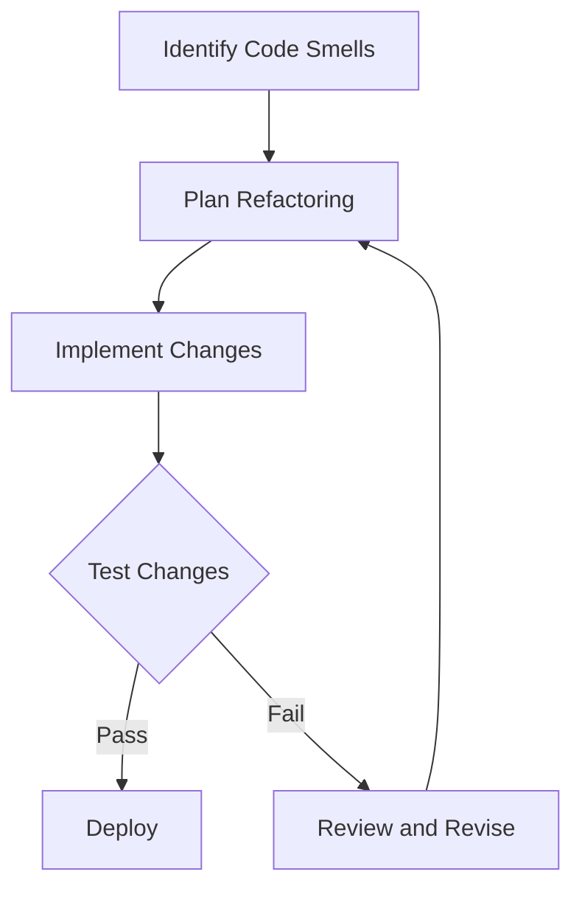

## 17.10 Refactoring Anti-Patterns in Haskell

Refactoring is a crucial aspect of software development, aimed at improving the structure and readability of code without altering its external behavior. However, when not done correctly, refactoring can introduce anti-patterns that degrade code quality and maintainability. In this section, we will explore common refactoring anti-patterns in Haskell, strategies to avoid them, and tools to aid in maintaining high-quality code.

### Understanding Refactoring Anti-Patterns

Refactoring anti-patterns are practices that, while intended to improve code, end up causing more harm than good. These can manifest as neglected code smells, increased technical debt, or even introducing new bugs. Let's delve into some common refactoring anti-patterns in Haskell and how to address them.

#### Common Issues

1. **Neglecting Code Smells**: Code smells are indicators of potential issues in the codebase. Ignoring these can lead to a buildup of technical debt, making future changes more difficult and error-prone.

2. **Accumulating Technical Debt**: Technical debt refers to the implied cost of additional rework caused by choosing an easy solution now instead of a better approach that would take longer. Accumulating technical debt can slow down development and increase the risk of bugs.

3. **Over-Refactoring**: This occurs when developers make unnecessary changes to the code, often leading to increased complexity and reduced readability.

4. **Inconsistent Naming Conventions**: Inconsistent naming can make the codebase difficult to navigate and understand, leading to confusion and errors.

5. **Ignoring Type Safety**: Haskell's strong type system is one of its greatest strengths. Ignoring type safety during refactoring can lead to runtime errors and bugs.

6. **Overuse of Language Features**: While Haskell offers powerful features like monads and type classes, overusing them can lead to complex and hard-to-maintain code.

### Strategies for Effective Refactoring

To avoid these anti-patterns, consider the following strategies:

1. **Regular Code Reviews**: Conduct regular code reviews to identify and address code smells and technical debt. Code reviews provide an opportunity for team members to share knowledge and improve code quality collectively.

2. **Incremental Improvements**: Instead of attempting large-scale refactoring, focus on making small, incremental improvements. This reduces the risk of introducing new bugs and makes it easier to track changes.

3. **Adopt Consistent Naming Conventions**: Establish and adhere to consistent naming conventions across the codebase. This improves readability and makes it easier for new developers to understand the code.

4. **Leverage Haskell's Type System**: Use Haskell's type system to your advantage by ensuring that types are well-defined and used consistently. This can help catch errors at compile time rather than runtime.

5. **Avoid Overuse of Language Features**: While Haskell's features are powerful, use them judiciously. Aim for simplicity and clarity in your code.

6. **Automated Code Analysis**: Use tools like HLint to automatically analyze your code and suggest improvements. HLint can help identify code smells and suggest refactoring opportunities.

### Tools for Refactoring in Haskell

#### HLint

HLint is a popular tool for Haskell developers that provides suggestions for improving code quality. It analyzes Haskell code and offers recommendations for refactoring, such as simplifying expressions, removing redundant code, and adhering to best practices.

- **Installation**: HLint can be installed using the Haskell package manager, Cabal, or Stack.

```bash
# Using Cabal
cabal update
cabal install hlint

# Using Stack
stack update
stack install hlint
```

- **Usage**: Run HLint on your Haskell files to receive suggestions for improvement.

```bash
hlint src/
```

- **Example Output**: HLint provides suggestions along with explanations for why a change is recommended.

```plaintext
src/Main.hs:10:1: Warning: Redundant do
Found:
  do putStrLn "Hello, World!"
Why not:
  putStrLn "Hello, World!"
```

### Code Examples

Let's explore some code examples to illustrate common refactoring anti-patterns and how to address them.

#### Example 1: Neglecting Code Smells

Consider the following code snippet:

```haskell
-- Original Code
calculateTotal :: [Int] -> Int
calculateTotal prices = foldl (+) 0 prices
```

**Issue**: The use of `foldl` can lead to stack overflow for large lists due to its non-tail-recursive nature.

**Refactored Code**:

```haskell
-- Refactored Code
calculateTotal :: [Int] -> Int
calculateTotal prices = foldl' (+) 0 prices
```

**Explanation**: By using `foldl'` from `Data.List`, we ensure that the fold operation is tail-recursive, preventing stack overflow.

#### Example 2: Over-Refactoring

```haskell
-- Original Code
greet :: String -> String
greet name = "Hello, " ++ name ++ "!"

-- Over-Refactored Code
greet :: String -> String
greet = (++) "Hello, " . (++ "!")
```

**Issue**: The refactored code uses function composition unnecessarily, reducing readability.

**Recommendation**: Keep the original code, as it is more readable and straightforward.

### Visualizing Refactoring Anti-Patterns

To better understand the impact of refactoring anti-patterns, let's visualize the process using a flowchart.



**Description**: This flowchart illustrates the refactoring process, highlighting the importance of testing changes before deployment.

### Knowledge Check

- **Question**: What is a code smell, and why is it important to address them during refactoring?
- **Question**: How can HLint assist in the refactoring process?
- **Question**: Why is it important to avoid over-refactoring?

### Embrace the Journey

Refactoring is an ongoing process that requires vigilance and a commitment to code quality. By understanding and avoiding refactoring anti-patterns, we can ensure that our Haskell code remains clean, maintainable, and efficient. Remember, this is just the beginning. As you continue to refine your skills, you'll discover more advanced techniques and tools to enhance your Haskell development experience. Keep experimenting, stay curious, and enjoy the journey!

### Quiz: Refactoring Anti-Patterns in Haskell



### What is a common issue when neglecting code smells in Haskell?

- [x] Accumulating technical debt
- [ ] Improved performance
- [ ] Enhanced readability
- [ ] Increased code simplicity

> **Explanation:** Neglecting code smells can lead to accumulating technical debt, making future changes more difficult.

### Which tool is commonly used for automated code suggestions in Haskell?

- [x] HLint
- [ ] GHC
- [ ] Stack
- [ ] Cabal

> **Explanation:** HLint is a tool that provides automated code suggestions for improving Haskell code quality.

### What is a benefit of regular code reviews?

- [x] Identifying code smells
- [ ] Increasing code complexity
- [ ] Reducing code readability
- [ ] Ignoring technical debt

> **Explanation:** Regular code reviews help identify code smells and address technical debt.

### What is the risk of over-refactoring?

- [x] Increased complexity
- [ ] Improved code clarity
- [ ] Enhanced performance
- [ ] Simplified codebase

> **Explanation:** Over-refactoring can lead to increased complexity and reduced readability.

### How can Haskell's type system aid in refactoring?

- [x] Catching errors at compile time
- [ ] Ignoring runtime errors
- [ ] Increasing code verbosity
- [ ] Reducing type safety

> **Explanation:** Haskell's type system helps catch errors at compile time, improving code reliability.

### What is a common pitfall when using Haskell's language features?

- [x] Overuse leading to complexity
- [ ] Simplifying code structure
- [ ] Enhancing readability
- [ ] Reducing code size

> **Explanation:** Overuse of Haskell's language features can lead to complex and hard-to-maintain code.

### Why is it important to adopt consistent naming conventions?

- [x] Improves readability
- [ ] Increases code complexity
- [ ] Reduces code clarity
- [ ] Ignores code smells

> **Explanation:** Consistent naming conventions improve readability and make the codebase easier to navigate.

### What is the purpose of incremental improvements in refactoring?

- [x] Reducing the risk of new bugs
- [ ] Increasing code complexity
- [ ] Ignoring technical debt
- [ ] Enhancing code verbosity

> **Explanation:** Incremental improvements reduce the risk of introducing new bugs and make changes easier to track.

### What is a potential issue with using `foldl` in Haskell?

- [x] Stack overflow for large lists
- [ ] Improved performance
- [ ] Enhanced readability
- [ ] Simplified codebase

> **Explanation:** `foldl` can lead to stack overflow for large lists due to its non-tail-recursive nature.

### True or False: Refactoring should always aim for the most complex solution.

- [ ] True
- [x] False

> **Explanation:** Refactoring should aim for simplicity and clarity, not complexity.


