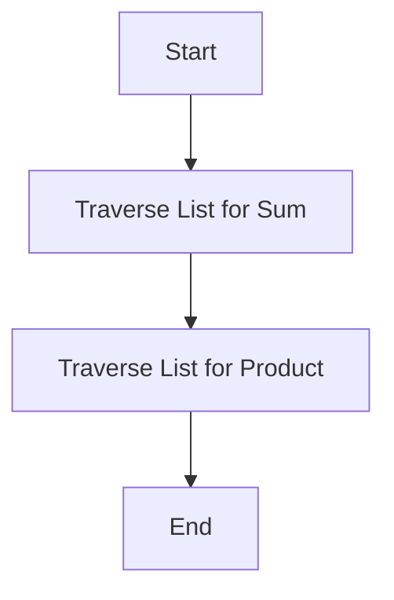

## 17.11 Performance Anti-Patterns

In the realm of Haskell programming, performance is a critical aspect that can significantly impact the efficiency and scalability of your applications. While Haskell's functional nature offers numerous advantages, it also presents unique challenges that can lead to performance pitfalls if not addressed properly. In this section, we will explore common performance anti-patterns in Haskell, understand why they occur, and learn how to avoid them. Additionally, we will delve into optimization techniques that can help you write more efficient Haskell code.

### Understanding Performance Anti-Patterns

Performance anti-patterns are common coding practices or patterns that, while they may seem logical or convenient, can lead to inefficient code execution. These anti-patterns can result in increased memory usage, slower execution times, and overall reduced application performance. By identifying and addressing these anti-patterns, you can ensure that your Haskell applications run smoothly and efficiently.

### Inefficient Patterns

#### Unnecessary List Traversals

One of the most common performance anti-patterns in Haskell is unnecessary list traversals. Lists are a fundamental data structure in Haskell, but they can be inefficient when used improperly. Traversing a list multiple times can lead to significant performance overhead, especially for large lists.

**Example:**

```haskell
-- Inefficient: Traversing the list twice
sumAndProduct :: [Int] -> (Int, Int)
sumAndProduct xs = (sum xs, product xs)
```

In the above example, the list `xs` is traversed twice: once to calculate the sum and once to calculate the product. This can be optimized by traversing the list only once.

**Optimized Version:**

```haskell
-- Optimized: Single traversal using fold
sumAndProduct :: [Int] -> (Int, Int)
sumAndProduct xs = foldl' (\\(s, p) x -> (s + x, p * x)) (0, 1) xs
```

By using `foldl'`, we can traverse the list once and compute both the sum and product simultaneously, reducing the performance overhead.

#### Excessive Recursion

Recursion is a powerful tool in functional programming, but excessive or poorly optimized recursion can lead to performance issues such as stack overflow or unnecessary computations.

**Example:**

```haskell
-- Inefficient: Naive recursive Fibonacci
fibonacci :: Int -> Int
fibonacci 0 = 0
fibonacci 1 = 1
fibonacci n = fibonacci (n - 1) + fibonacci (n - 2)
```

The naive recursive Fibonacci implementation is a classic example of excessive recursion, as it recalculates values multiple times.

**Optimized Version:**

```haskell
-- Optimized: Using memoization
import Data.Array

fibonacci :: Int -> Int
fibonacci n = fibArray ! n
  where
    fibArray = listArray (0, n) (map fib [0..n])
    fib 0 = 0
    fib 1 = 1
    fib i = fibArray ! (i - 1) + fibArray ! (i - 2)
```

By using memoization with an array, we can store previously computed Fibonacci numbers and avoid redundant calculations.

### Optimization Tips

#### Utilizing Efficient Data Structures

Choosing the right data structure can have a significant impact on performance. Haskell provides a variety of data structures, each with its own strengths and weaknesses. Understanding these can help you make informed decisions.

**Example:**

- **Lists**: Good for simple, linear data but can be inefficient for random access.
- **Vectors**: Provide efficient random access and are suitable for large datasets.
- **Maps and Sets**: Offer efficient lookup and insertion operations.

#### Applying Fusion Techniques

Fusion techniques, such as list fusion, can help eliminate intermediate data structures and improve performance by combining multiple operations into a single pass.

**Example:**

```haskell
-- Without fusion: Creates intermediate lists
processList :: [Int] -> [Int]
processList xs = map (*2) (filter even xs)

-- With fusion: Combines operations into a single pass
processList :: [Int] -> [Int]
processList = map (*2) . filter even
```

By using function composition, we can achieve fusion and avoid creating intermediate lists, leading to more efficient code execution.

### Visualizing Performance Anti-Patterns

To better understand the impact of performance anti-patterns, let's visualize the process of list traversal and recursion using Mermaid.js diagrams.

#### List Traversal Visualization



This diagram illustrates the inefficiency of traversing a list twice for different operations.

#### Recursive Fibonacci Visualization

```mermaid
graph TD;
    A[Calculate Fibonacci(n)] --> B[Calculate Fibonacci(n-1)];
    A --> C[Calculate Fibonacci(n-2)];
    B --> D[Recalculate Fibonacci(n-2)];
    C --> E[Recalculate Fibonacci(n-3)];
```

This diagram shows the redundant calculations in the naive recursive Fibonacci implementation.

### References and Further Reading

For more information on performance optimization in Haskell, consider exploring the following resources:

- [Haskell Performance Tips](https://wiki.haskell.org/Performance)
- [Real World Haskell](http://book.realworldhaskell.org/)
- [Haskell Optimization Guide](https://www.haskell.org/ghc/docs/latest/html/users_guide/optimizations.html)

### Knowledge Check

To reinforce your understanding of performance anti-patterns in Haskell, consider the following questions:

1. What are the potential drawbacks of using lists for large datasets?
2. How can memoization improve the performance of recursive functions?
3. What is the benefit of using fusion techniques in Haskell?

### Embrace the Journey

Remember, optimizing Haskell code is an ongoing journey. As you continue to explore and experiment with different techniques, you'll gain a deeper understanding of how to write efficient and performant Haskell applications. Keep pushing the boundaries, stay curious, and enjoy the process of mastering Haskell performance optimization!

## Quiz: Performance Anti-Patterns



### What is a common performance anti-pattern in Haskell?

- [x] Unnecessary list traversals
- [ ] Using higher-order functions
- [ ] Employing type classes
- [ ] Utilizing algebraic data types

> **Explanation:** Unnecessary list traversals can lead to performance overhead, especially for large lists.

### How can you optimize a function that traverses a list multiple times?

- [x] Use fold to combine operations into a single traversal
- [ ] Use recursion to traverse the list
- [ ] Use a different programming language
- [ ] Avoid using lists altogether

> **Explanation:** Using fold allows you to perform multiple operations in a single traversal, reducing performance overhead.

### What is the main issue with naive recursive implementations?

- [x] They can lead to redundant calculations
- [ ] They are difficult to understand
- [ ] They use too much memory
- [ ] They are not functional

> **Explanation:** Naive recursive implementations often recalculate values multiple times, leading to inefficiencies.

### Which data structure is more efficient for random access?

- [x] Vectors
- [ ] Lists
- [ ] Trees
- [ ] Queues

> **Explanation:** Vectors provide efficient random access, making them suitable for large datasets.

### What is the benefit of using memoization in recursive functions?

- [x] It avoids redundant calculations
- [ ] It makes the code more readable
- [ ] It reduces memory usage
- [ ] It simplifies the code

> **Explanation:** Memoization stores previously computed values, avoiding redundant calculations and improving performance.

### How can fusion techniques improve performance?

- [x] By eliminating intermediate data structures
- [ ] By increasing code readability
- [ ] By reducing memory usage
- [ ] By simplifying the code

> **Explanation:** Fusion techniques combine multiple operations into a single pass, eliminating intermediate data structures and improving performance.

### What is a potential drawback of using lists for large datasets?

- [x] Inefficient random access
- [ ] High memory usage
- [ ] Complex syntax
- [ ] Lack of flexibility

> **Explanation:** Lists are inefficient for random access, which can be a drawback for large datasets.

### How can you visualize the inefficiency of list traversals?

- [x] Using Mermaid.js diagrams
- [ ] Using pie charts
- [ ] Using bar graphs
- [ ] Using histograms

> **Explanation:** Mermaid.js diagrams can visually represent the process of list traversal and highlight inefficiencies.

### What is the main advantage of using vectors over lists?

- [x] Efficient random access
- [ ] Simplicity
- [ ] Flexibility
- [ ] Readability

> **Explanation:** Vectors provide efficient random access, making them more suitable for certain applications than lists.

### True or False: Fusion techniques can help reduce memory usage in Haskell programs.

- [x] True
- [ ] False

> **Explanation:** Fusion techniques eliminate intermediate data structures, which can help reduce memory usage.




