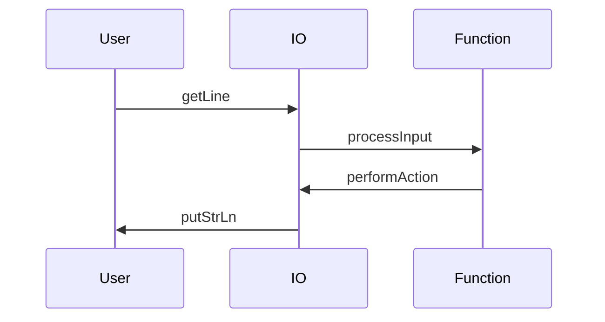

## 17.12 Common Pitfalls with Monads and Effects

Monads are a powerful and essential concept in Haskell, enabling developers to handle side effects, manage state, and structure functional programs effectively. However, they can also introduce complexity and confusion if not used carefully. In this section, we will explore common pitfalls associated with monads and effects in Haskell and provide strategies to avoid these issues, ensuring your code remains clean, maintainable, and efficient.

### Understanding Monads and Effects

Before diving into the pitfalls, let's briefly revisit what monads are and their role in handling effects in Haskell. Monads are a type class in Haskell that encapsulate computations in a context. They provide a way to chain operations together, handling the context automatically. This is particularly useful for dealing with side effects, such as IO, state, or error handling, in a purely functional way.

#### Key Monad Concepts

- **Monad Type Class**: Defines the `>>=` (bind) and `return` operations, which are used to sequence computations.
- **Effects**: Side effects are managed through monads, allowing for a clear separation between pure and impure code.
- **Common Monads**: Include `Maybe`, `Either`, `IO`, `State`, `Reader`, and `Writer`.

### Common Pitfalls

#### 1. Monadic Code That Is Hard to Follow or Reason About

One of the most common issues with monadic code is that it can become difficult to follow, especially when chaining multiple operations. This often results from overusing monads or not structuring code clearly.

**Solution**: Keep monadic code simple and use helper functions to break down complex chains. Ensure that each monadic operation is meaningful and contributes to the overall logic.

**Example**:

```haskell
-- Complex monadic chain
complexFunction :: IO ()
complexFunction = do
    input <- getLine
    let processed = processInput input
    result <- performAction processed
    putStrLn result

-- Simplified with helper functions
simplifiedFunction :: IO ()
simplifiedFunction = do
    input <- getLine
    processAndAct input

processAndAct :: String -> IO ()
processAndAct input = do
    let processed = processInput input
    result <- performAction processed
    putStrLn result
```

#### 2. Mixing Pure and Impure Code

Mixing pure and impure code can lead to confusion and make reasoning about the code more difficult. It can also introduce bugs if side effects are not managed properly.

**Solution**: Clearly separate pure and impure code. Use pure functions to process data and monadic functions to handle effects.

**Example**:

```haskell
-- Mixing pure and impure code
processData :: IO ()
processData = do
    input <- getLine
    let result = pureFunction input
    putStrLn result

-- Clear separation
processDataSeparated :: IO ()
processDataSeparated = do
    input <- getLine
    let result = pureFunction input
    outputResult result

pureFunction :: String -> String
pureFunction = map toUpper

outputResult :: String -> IO ()
outputResult = putStrLn
```

#### 3. Overusing Monads

While monads are powerful, overusing them can lead to unnecessarily complex code. Not every problem requires a monadic solution, and sometimes simpler abstractions are more appropriate.

**Solution**: Use monads judiciously and consider simpler alternatives when possible. Evaluate whether a monad is necessary for the task at hand.

**Example**:

```haskell
-- Overusing monads for simple tasks
incrementList :: [Int] -> [Int]
incrementList = map (+1)

-- Unnecessary use of monads
incrementListMonad :: [Int] -> [Int]
incrementListMonad = runIdentity . traverse (Identity . (+1))
```

#### 4. Misunderstanding Monad Transformers

Monad transformers are used to combine multiple monadic effects, but they can introduce complexity if not used correctly. A common pitfall is misunderstanding how to stack and use them effectively.

**Solution**: Understand the purpose and usage of each monad transformer. Use libraries like `mtl` to simplify the management of monad stacks.

**Example**:

```haskell
-- Using monad transformers
type App = ReaderT Config (StateT AppState IO)

runApp :: App a -> Config -> AppState -> IO (a, AppState)
runApp app config state = runStateT (runReaderT app config) state
```

#### 5. Ignoring Lazy Evaluation

Haskell's lazy evaluation can lead to unexpected behavior when combined with monads, especially in the presence of side effects. This can result in space leaks or delayed computations.

**Solution**: Be mindful of lazy evaluation and use strictness annotations or functions like `seq` to control evaluation order when necessary.

**Example**:

```haskell
-- Potential space leak due to laziness
lazyComputation :: IO ()
lazyComputation = do
    let largeData = generateLargeData
    putStrLn (show (sum largeData))

-- Using strict evaluation
strictComputation :: IO ()
strictComputation = do
    let largeData = generateLargeData
    let !sumData = sum largeData
    putStrLn (show sumData)
```

### Visualizing Monad Usage

To better understand how monads work and how they can be misused, let's visualize the flow of monadic operations using a sequence diagram.



This diagram illustrates the flow of data and effects in a typical monadic operation sequence, highlighting the interaction between pure functions and IO operations.

### Knowledge Check

To reinforce your understanding of monads and effects, consider the following questions:

- What are the key operations defined by the Monad type class?
- How can you separate pure and impure code in a Haskell program?
- Why is it important to avoid overusing monads?
- What are monad transformers, and when should you use them?
- How does lazy evaluation affect monadic code?

### Exercises

1. Refactor a complex monadic function in your codebase to use helper functions and improve readability.
2. Identify a section of code where pure and impure logic is mixed and refactor it to separate these concerns.
3. Experiment with monad transformers by creating a simple application that combines Reader and State monads.

### Embrace the Journey

Remember, mastering monads and effects in Haskell is a journey. As you continue to explore and experiment, you'll gain a deeper understanding of how to use these powerful tools effectively. Keep practicing, stay curious, and enjoy the process of learning and improving your Haskell skills!

## Quiz: Common Pitfalls with Monads and Effects



### What is a common pitfall when using monads in Haskell?

- [x] Monadic code that is hard to follow or reason about.
- [ ] Using monads for all types of computations.
- [ ] Avoiding monads altogether.
- [ ] Using monads only for IO operations.

> **Explanation:** Monadic code can become difficult to follow if not structured clearly, leading to complexity and confusion.

### How can you avoid mixing pure and impure code in Haskell?

- [x] By clearly separating pure functions from monadic functions.
- [ ] By using monads for all computations.
- [ ] By avoiding the use of IO operations.
- [ ] By using only pure functions.

> **Explanation:** Separating pure and impure code helps maintain clarity and manage side effects effectively.

### What is a potential issue with overusing monads?

- [x] It can lead to unnecessarily complex code.
- [ ] It simplifies all types of computations.
- [ ] It makes code more readable.
- [ ] It eliminates the need for pure functions.

> **Explanation:** Overusing monads can introduce complexity where simpler abstractions might suffice.

### What are monad transformers used for?

- [x] To combine multiple monadic effects.
- [ ] To simplify single monadic computations.
- [ ] To eliminate the need for monads.
- [ ] To handle only IO operations.

> **Explanation:** Monad transformers allow for stacking and managing multiple monadic effects.

### How does lazy evaluation affect monadic code?

- [x] It can lead to space leaks or delayed computations.
- [ ] It always improves performance.
- [ ] It has no impact on monadic code.
- [ ] It simplifies the evaluation order.

> **Explanation:** Lazy evaluation can cause unexpected behavior in monadic code, especially with side effects.

### What is the purpose of the `>>=` (bind) operation in monads?

- [x] To sequence computations in a monadic context.
- [ ] To define pure functions.
- [ ] To eliminate side effects.
- [ ] To handle only IO operations.

> **Explanation:** The bind operation is used to chain monadic computations together.

### Why is it important to use helper functions in monadic code?

- [x] To improve readability and maintainability.
- [ ] To avoid using monads altogether.
- [ ] To make code more complex.
- [ ] To eliminate the need for pure functions.

> **Explanation:** Helper functions can break down complex monadic chains, making code easier to follow.

### What is a key benefit of separating pure and impure code?

- [x] It helps manage side effects and maintain clarity.
- [ ] It eliminates the need for monads.
- [ ] It simplifies all computations.
- [ ] It makes code more complex.

> **Explanation:** Separating pure and impure code ensures that side effects are managed effectively and code remains clear.

### What is a common use case for the `State` monad?

- [x] Managing stateful computations in a functional way.
- [ ] Handling IO operations.
- [ ] Simplifying pure functions.
- [ ] Eliminating side effects.

> **Explanation:** The `State` monad is used to manage state in a purely functional manner.

### True or False: Monads are only used for handling IO operations in Haskell.

- [ ] True
- [x] False

> **Explanation:** Monads are used for a variety of purposes, including error handling, state management, and more, not just IO operations.



By understanding and avoiding these common pitfalls, you can harness the full power of monads and effects in Haskell, creating robust and maintainable functional programs.
