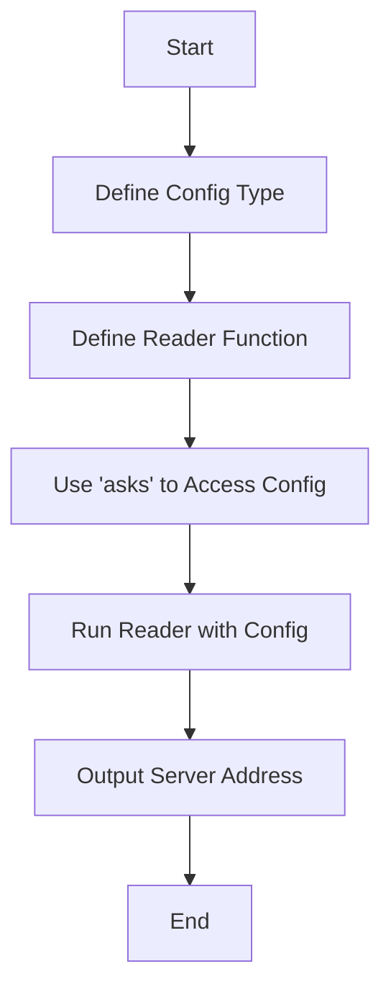

## 17.13 Implicit Dependencies and Hidden State

In the realm of software development, particularly in functional programming with Haskell, implicit dependencies and hidden state are often considered anti-patterns. These issues can lead to code that is difficult to understand, maintain, and test. In this section, we will explore the problems associated with implicit dependencies and hidden state, and provide best practices for making dependencies explicit, including the use of the `Reader` monad.

### Understanding Implicit Dependencies and Hidden State

Implicit dependencies occur when a function or module relies on external state or configuration that is not passed explicitly as an argument. This can lead to code that is tightly coupled and difficult to reason about. Hidden state refers to the use of global variables or mutable state that is not visible in the function's signature, making it challenging to track changes and understand the flow of data.

#### Problems with Implicit Dependencies

1. **Lack of Transparency**: When dependencies are not explicitly stated, it becomes difficult for developers to understand what a function relies on to operate correctly. This lack of transparency can lead to bugs and unexpected behavior.

2. **Testing Challenges**: Implicit dependencies make it challenging to write unit tests, as the hidden dependencies need to be set up correctly for the tests to pass. This can lead to fragile tests that break easily.

3. **Tight Coupling**: Code with implicit dependencies is often tightly coupled to specific configurations or environments, making it difficult to reuse or refactor.

4. **Maintenance Difficulties**: As the codebase grows, implicit dependencies can lead to maintenance nightmares, where changes in one part of the code can have unforeseen effects elsewhere.

#### Problems with Hidden State

1. **Unpredictable Behavior**: Hidden state can lead to unpredictable behavior, as the state may change in ways that are not immediately apparent from the code.

2. **Concurrency Issues**: In a concurrent environment, hidden state can lead to race conditions and other concurrency-related bugs.

3. **Debugging Complexity**: Debugging code with hidden state is challenging, as it requires understanding the entire state of the system at any given time.

4. **Difficult Refactoring**: Refactoring code with hidden state is difficult, as changes to the state management can have wide-ranging effects.

### Best Practices for Avoiding Implicit Dependencies and Hidden State

To avoid the pitfalls of implicit dependencies and hidden state, it is essential to adopt best practices that promote explicitness and transparency in your code.

#### Making Dependencies Explicit

One of the most effective ways to manage dependencies is to make them explicit. This involves passing all necessary dependencies as arguments to functions or constructors, rather than relying on external state or configuration.

- **Function Arguments**: Pass dependencies as arguments to functions. This makes the dependencies clear and allows for easier testing and refactoring.

- **Dependency Injection**: Use dependency injection to provide dependencies to modules or classes. This can be done manually or using a framework.

- **Configuration Objects**: Use configuration objects to encapsulate related dependencies and pass them as a single argument.

#### Using the Reader Monad for Dependency Management

The `Reader` monad is a powerful tool in Haskell for managing dependencies in a functional way. It allows you to pass a shared environment or configuration through your code without explicitly passing it as an argument to every function.

##### Introduction to the Reader Monad

The `Reader` monad is a type of monad that allows you to access a shared environment or configuration throughout your code. It is defined as follows:

```haskell
newtype Reader r a = Reader { runReader :: r -> a }
```

The `Reader` monad provides two primary operations:

- `ask`: Retrieves the entire environment.
- `local`: Modifies the environment for a specific computation.

##### Using the Reader Monad

Let's look at an example of how to use the `Reader` monad to manage dependencies:

```haskell
import Control.Monad.Reader

-- Define a configuration type
data Config = Config
  { configHost :: String
  , configPort :: Int
  }

-- A function that uses the Reader monad to access the configuration
getServerAddress :: Reader Config String
getServerAddress = do
  host <- asks configHost
  port <- asks configPort
  return $ host ++ ":" ++ show port

-- Running the Reader monad
main :: IO ()
main = do
  let config = Config "localhost" 8080
  let address = runReader getServerAddress config
  putStrLn $ "Server address: " ++ address
```

In this example, the `getServerAddress` function uses the `Reader` monad to access the `Config` environment, retrieving the host and port to construct the server address.

##### Benefits of the Reader Monad

- **Explicit Dependencies**: The `Reader` monad makes dependencies explicit by requiring them to be passed to the `runReader` function.

- **Separation of Concerns**: The `Reader` monad separates the logic of accessing dependencies from the business logic, leading to cleaner and more maintainable code.

- **Easier Testing**: By making dependencies explicit, the `Reader` monad makes it easier to write unit tests, as you can provide mock configurations for testing.

##### Visualizing the Reader Monad

To better understand how the `Reader` monad works, let's visualize its operation using a flowchart:



This flowchart illustrates the process of defining a configuration type, creating a `Reader` function, accessing the configuration using `asks`, running the `Reader` with a specific configuration, and outputting the result.

### Try It Yourself

To deepen your understanding of the `Reader` monad, try modifying the example code to add additional configuration parameters, such as a database connection string or API key. Experiment with using the `local` function to temporarily modify the configuration for specific computations.

### Knowledge Check

- **Question**: What are the primary problems associated with implicit dependencies?
- **Question**: How does the `Reader` monad help in managing dependencies?
- **Question**: What are the benefits of making dependencies explicit in your code?

### Conclusion

Implicit dependencies and hidden state are common anti-patterns in software development that can lead to code that is difficult to understand, maintain, and test. By making dependencies explicit and using tools like the `Reader` monad, you can create code that is more transparent, modular, and testable. Remember, the key to avoiding these anti-patterns is to embrace explicitness and transparency in your code design.

## Quiz: Implicit Dependencies and Hidden State



### What is an implicit dependency?

- [x] A dependency that is not explicitly passed as an argument
- [ ] A dependency that is always visible in the function signature
- [ ] A dependency that is only used in testing
- [ ] A dependency that is part of the standard library

> **Explanation:** An implicit dependency is a dependency that is not explicitly passed as an argument, making it hidden and potentially problematic.

### What is a hidden state?

- [x] A state that is not visible in the function's signature
- [ ] A state that is always visible in the function's signature
- [ ] A state that is only used in testing
- [ ] A state that is part of the standard library

> **Explanation:** Hidden state refers to the use of global variables or mutable state that is not visible in the function's signature.

### How does the Reader monad help in managing dependencies?

- [x] By making dependencies explicit
- [ ] By hiding dependencies
- [ ] By removing dependencies
- [ ] By adding more dependencies

> **Explanation:** The Reader monad helps in managing dependencies by making them explicit and separating them from the business logic.

### What is the primary operation of the Reader monad to access the environment?

- [x] ask
- [ ] tell
- [ ] put
- [ ] get

> **Explanation:** The primary operation of the Reader monad to access the environment is `ask`.

### What is the benefit of making dependencies explicit?

- [x] Easier testing
- [x] Better maintainability
- [ ] More complex code
- [ ] Less readable code

> **Explanation:** Making dependencies explicit leads to easier testing and better maintainability.

### What is the purpose of the `local` function in the Reader monad?

- [x] To modify the environment for a specific computation
- [ ] To remove the environment
- [ ] To add more dependencies
- [ ] To hide dependencies

> **Explanation:** The `local` function is used to modify the environment for a specific computation in the Reader monad.

### What is a common problem with hidden state?

- [x] Unpredictable behavior
- [ ] Predictable behavior
- [ ] Easier debugging
- [ ] Easier refactoring

> **Explanation:** Hidden state can lead to unpredictable behavior, making it difficult to track changes and understand the flow of data.

### What is the result of tight coupling due to implicit dependencies?

- [x] Difficult to reuse or refactor code
- [ ] Easier to reuse or refactor code
- [ ] More modular code
- [ ] Less maintainable code

> **Explanation:** Tight coupling due to implicit dependencies makes it difficult to reuse or refactor code.

### True or False: The Reader monad separates the logic of accessing dependencies from the business logic.

- [x] True
- [ ] False

> **Explanation:** The Reader monad separates the logic of accessing dependencies from the business logic, leading to cleaner and more maintainable code.

### True or False: Implicit dependencies make it easier to write unit tests.

- [ ] True
- [x] False

> **Explanation:** Implicit dependencies make it challenging to write unit tests, as the hidden dependencies need to be set up correctly for the tests to pass.



Remember, understanding and avoiding implicit dependencies and hidden state is crucial for writing clean, maintainable, and testable code in Haskell. Keep experimenting, stay curious, and enjoy the journey of mastering Haskell design patterns!
