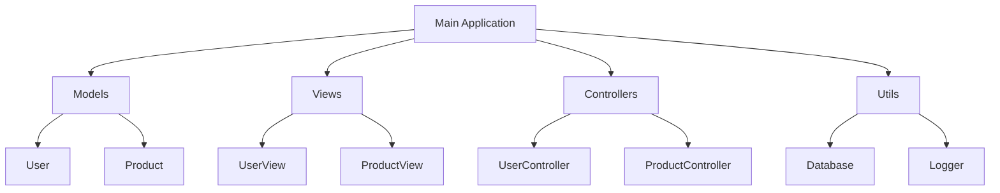

## 17.14 Poor Module Organization

In the realm of Haskell programming, module organization plays a crucial role in maintaining a clean, scalable, and efficient codebase. Poor module organization can lead to a myriad of issues, including difficult navigation, code duplication, and increased complexity. In this section, we will delve into the consequences of poor module organization, explore best practices for structuring Haskell modules, and provide practical examples to illustrate these concepts.

### Understanding the Consequences of Poor Module Organization

Poor module organization can have several detrimental effects on a Haskell codebase:

- **Difficult Navigation**: When modules are not logically grouped or named, navigating the codebase becomes challenging. Developers may struggle to locate specific functionality, leading to wasted time and effort.
  
- **Code Duplication**: Without clear module boundaries and interfaces, code duplication can occur. This not only increases the size of the codebase but also makes maintenance more difficult, as changes need to be replicated across multiple locations.
  
- **Increased Complexity**: Poorly organized modules can lead to tangled dependencies, making it difficult to understand the relationships between different parts of the codebase. This complexity can hinder development and lead to bugs.

- **Reduced Reusability**: Modules that are not designed with reusability in mind may contain tightly coupled code, reducing the ability to reuse components across different projects or parts of the same project.

### Best Practices for Module Organization in Haskell

To avoid the pitfalls of poor module organization, consider the following best practices:

#### 1. Logical Grouping of Modules

Organize modules into logical groups based on functionality. This can be achieved by creating a directory structure that reflects the different components of your application. For example, a web application might have separate directories for models, views, controllers, and utilities.

```plaintext
src/
  ├── Models/
  │   ├── User.hs
  │   ├── Product.hs
  ├── Views/
  │   ├── UserView.hs
  │   ├── ProductView.hs
  ├── Controllers/
  │   ├── UserController.hs
  │   ├── ProductController.hs
  ├── Utils/
  │   ├── Database.hs
  │   ├── Logger.hs
```

#### 2. Clear Module Interfaces

Define clear interfaces for each module by specifying which functions and types are exposed. This can be done using the `module` keyword followed by an export list. By controlling what is exposed, you can encapsulate implementation details and reduce coupling between modules.

```haskell
module User (User, createUser, getUserName) where

data User = User { userId :: Int, userName :: String }

createUser :: Int -> String -> User
createUser id name = User id name

getUserName :: User -> String
getUserName = userName
```

#### 3. Minimize Dependencies

Aim to minimize dependencies between modules. This can be achieved by adhering to the principle of separation of concerns, where each module has a single responsibility. By reducing dependencies, you make the codebase easier to understand and maintain.

#### 4. Use Descriptive Names

Choose descriptive names for modules and functions to convey their purpose. This improves readability and makes it easier for developers to understand the codebase.

#### 5. Consistent Naming Conventions

Adopt consistent naming conventions across the codebase. This includes naming modules, functions, and types in a way that is consistent and predictable. Consistency aids in navigation and understanding.

#### 6. Avoid Large Modules

Break down large modules into smaller, more manageable ones. Large modules can become unwieldy and difficult to maintain. By breaking them down, you can focus on specific functionality and improve readability.

#### 7. Regular Refactoring

Regularly refactor the codebase to improve module organization. As the codebase evolves, new patterns and structures may emerge that necessitate reorganization. Regular refactoring ensures that the codebase remains clean and maintainable.

### Code Examples

Let's explore some code examples to illustrate these best practices.

#### Example 1: Logical Grouping and Clear Interfaces

Consider a simple application that manages a list of tasks. We can organize the modules as follows:

```plaintext
src/
  ├── Task/
  │   ├── Task.hs
  │   ├── TaskManager.hs
  ├── Utils/
  │   ├── Logger.hs
```

**Task.hs**

```haskell
module Task (Task, createTask, getTaskName) where

data Task = Task { taskId :: Int, taskName :: String }

createTask :: Int -> String -> Task
createTask id name = Task id name

getTaskName :: Task -> String
getTaskName = taskName
```

**TaskManager.hs**

```haskell
module TaskManager (addTask, listTasks) where

import Task (Task, createTask)

addTask :: Task -> [Task] -> [Task]
addTask task tasks = task : tasks

listTasks :: [Task] -> [String]
listTasks = map getTaskName
```

**Logger.hs**

```haskell
module Logger (logInfo, logError) where

logInfo :: String -> IO ()
logInfo msg = putStrLn $ "[INFO] " ++ msg

logError :: String -> IO ()
logError msg = putStrLn $ "[ERROR] " ++ msg
```

#### Example 2: Minimizing Dependencies

In this example, we demonstrate how to minimize dependencies by separating concerns.

**Database.hs**

```haskell
module Database (connect, query) where

connect :: String -> IO ()
connect dbName = putStrLn $ "Connecting to database: " ++ dbName

query :: String -> IO String
query sql = do
  putStrLn $ "Executing query: " ++ sql
  return "Query result"
```

**UserController.hs**

```haskell
module UserController (getUser) where

import Database (query)

getUser :: Int -> IO String
getUser userId = do
  result <- query ("SELECT * FROM users WHERE id = " ++ show userId)
  return result
```

In this example, the `UserController` module depends only on the `Database` module for querying data, minimizing dependencies and focusing on its primary responsibility.

### Visualizing Module Organization

To better understand module organization, let's visualize a typical Haskell project structure using a Mermaid.js diagram.



**Diagram Description**: This diagram illustrates a typical Haskell project structure with logical grouping of modules into Models, Views, Controllers, and Utils. Each group contains specific modules related to its functionality.

### Knowledge Check

Let's reinforce our understanding with a few questions:

1. What are the consequences of poor module organization in Haskell?
2. How can logical grouping of modules improve code maintainability?
3. Why is it important to define clear module interfaces?
4. What is the benefit of minimizing dependencies between modules?
5. How does regular refactoring contribute to better module organization?

### Try It Yourself

Experiment with the code examples provided by making the following modifications:

- Add a new module for handling user authentication and integrate it with the existing modules.
- Refactor the `TaskManager` module to include functionality for removing tasks.
- Implement a logging mechanism that writes logs to a file instead of the console.

### References and Further Reading

- [Haskell Wiki: Modules](https://wiki.haskell.org/Modules)
- [Real World Haskell: Modules](http://book.realworldhaskell.org/read/modules.html)
- [Learn You a Haskell for Great Good: Modules](http://learnyouahaskell.com/modules)

### Conclusion

Effective module organization is essential for maintaining a clean and scalable Haskell codebase. By following best practices such as logical grouping, clear interfaces, and minimizing dependencies, you can create a codebase that is easy to navigate, maintain, and extend. Regular refactoring and adherence to naming conventions further enhance the quality of the code. Remember, good module organization is not a one-time task but an ongoing process that evolves with your codebase.

## Quiz: Poor Module Organization



### What is a consequence of poor module organization?

- [x] Difficult navigation
- [ ] Improved performance
- [ ] Reduced code complexity
- [ ] Enhanced readability

> **Explanation:** Poor module organization can lead to difficult navigation, making it hard to locate specific functionality within the codebase.

### How can logical grouping of modules benefit a Haskell project?

- [x] Improves code maintainability
- [ ] Increases code duplication
- [ ] Reduces code readability
- [ ] Complicates module interfaces

> **Explanation:** Logical grouping of modules improves code maintainability by organizing related functionality together, making it easier to manage and understand.

### Why is it important to define clear module interfaces?

- [x] To encapsulate implementation details
- [ ] To increase code duplication
- [ ] To complicate module dependencies
- [ ] To reduce code readability

> **Explanation:** Clear module interfaces encapsulate implementation details, reducing coupling between modules and enhancing maintainability.

### What is the benefit of minimizing dependencies between modules?

- [x] Easier to understand and maintain
- [ ] Increases code complexity
- [ ] Reduces code reusability
- [ ] Complicates module organization

> **Explanation:** Minimizing dependencies makes the codebase easier to understand and maintain by reducing complexity and improving separation of concerns.

### How does regular refactoring contribute to better module organization?

- [x] Ensures the codebase remains clean and maintainable
- [ ] Increases code duplication
- [ ] Reduces code readability
- [ ] Complicates module interfaces

> **Explanation:** Regular refactoring helps maintain a clean and maintainable codebase by adapting to new patterns and structures as the code evolves.

### What is a common pitfall of large modules?

- [x] They become unwieldy and difficult to maintain
- [ ] They improve code readability
- [ ] They enhance module interfaces
- [ ] They reduce code complexity

> **Explanation:** Large modules can become unwieldy and difficult to maintain, making it challenging to focus on specific functionality.

### What is a key advantage of using descriptive names for modules?

- [x] Improves readability and understanding
- [ ] Increases code duplication
- [ ] Complicates module interfaces
- [ ] Reduces code maintainability

> **Explanation:** Descriptive names improve readability and understanding by conveying the purpose of modules and functions.

### How can consistent naming conventions aid in navigation?

- [x] By making names predictable and consistent
- [ ] By increasing code duplication
- [ ] By complicating module dependencies
- [ ] By reducing code readability

> **Explanation:** Consistent naming conventions make names predictable and consistent, aiding in navigation and understanding of the codebase.

### What is the role of the `module` keyword in Haskell?

- [x] To define module interfaces and control exports
- [ ] To increase code duplication
- [ ] To complicate module dependencies
- [ ] To reduce code readability

> **Explanation:** The `module` keyword is used to define module interfaces and control exports, encapsulating implementation details.

### True or False: Poor module organization can lead to reduced reusability.

- [x] True
- [ ] False

> **Explanation:** Poor module organization can lead to reduced reusability by creating tightly coupled code that is difficult to reuse across different projects or parts of the same project.



Remember, effective module organization is a journey, not a destination. Keep refining your approach, stay curious, and enjoy the process of creating clean and maintainable Haskell codebases!
