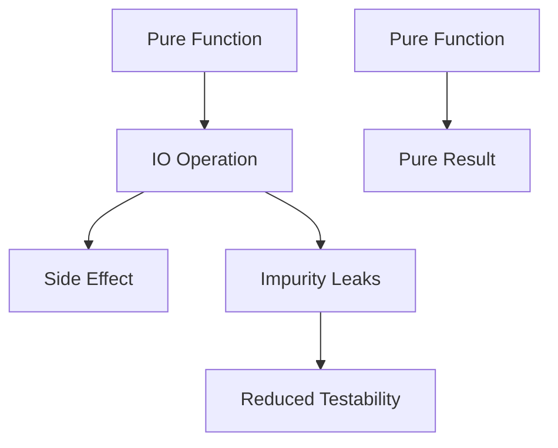

## 17.15 Inappropriate Use of IO Operations

In the realm of Haskell programming, the `IO` monad is a powerful tool that allows us to interact with the outside world. However, its misuse can lead to several issues that undermine the core principles of functional programming. In this section, we will delve into the inappropriate use of `IO` operations, understand the implications of such misuse, and explore guidelines to maintain the purity and testability of Haskell code.

### Understanding the IO Monad

The `IO` monad in Haskell is a construct that encapsulates side effects, allowing Haskell programs to interact with the external environment while maintaining a functional paradigm. It is crucial to understand that `IO` is not just a type but a monadic structure that sequences operations involving side effects.

```haskell
main :: IO ()
main = do
    putStrLn "Enter your name:"
    name <- getLine
    putStrLn ("Hello, " ++ name ++ "!")
```

In the above example, `putStrLn` and `getLine` are `IO` actions that perform side effects. The `do` notation sequences these actions, ensuring that they are executed in the correct order.

### Misuse of IO Operations

#### Overuse of the IO Monad

One common anti-pattern is the overuse of the `IO` monad when it is not necessary. This often occurs when developers, especially those new to Haskell, default to using `IO` for operations that could be pure.

**Example of Overuse:**

```haskell
-- Overuse of IO for a pure operation
addNumbers :: IO Int
addNumbers = do
    let x = 5
    let y = 10
    return (x + y)
```

In this example, there is no need for `IO` since the operation is purely computational. The use of `IO` here unnecessarily complicates the function and reduces its testability.

#### Implications of Misuse

- **Reduced Testability:** Functions wrapped in `IO` are harder to test because they involve side effects. Pure functions, on the other hand, are deterministic and easier to test.
- **Impurity Leaking into Pure Code:** Overusing `IO` can lead to impurity leaking into otherwise pure code, making it harder to reason about and maintain.

### Guidelines for Proper Use of IO

#### Isolating Side Effects

One of the key principles in functional programming is to isolate side effects. This means keeping the `IO` operations at the boundaries of your program and maintaining pure functions within the core logic.

**Example of Isolating Side Effects:**

```haskell
-- Pure function
add :: Int -> Int -> Int
add x y = x + y

-- IO function
main :: IO ()
main = do
    putStrLn "Enter two numbers:"
    x <- readLn
    y <- readLn
    let result = add x y
    putStrLn ("The sum is: " ++ show result)
```

In this example, the `add` function is pure and can be tested independently of the `IO` operations.

#### Maximizing Pure Functional Code

Aim to maximize the amount of pure functional code in your application. This involves identifying operations that can be pure and refactoring them out of the `IO` context.

**Example of Refactoring for Purity:**

```haskell
-- Original function with unnecessary IO
calculateArea :: IO Double
calculateArea = do
    let radius = 5.0
    return (pi * radius * radius)

-- Refactored pure function
calculateAreaPure :: Double -> Double
calculateAreaPure radius = pi * radius * radius

-- IO function using the pure function
main :: IO ()
main = do
    let radius = 5.0
    let area = calculateAreaPure radius
    putStrLn ("The area is: " ++ show area)
```

### Visualizing the Impact of IO Misuse

To better understand the impact of inappropriate `IO` usage, let's visualize the flow of data and side effects in a Haskell program.



In this diagram, we see how `IO` operations can lead to side effects and impurity leaks, ultimately reducing testability. By isolating side effects, we can maintain the purity of our functions and improve testability.

### Haskell Unique Features

Haskell's strong type system and lazy evaluation provide unique opportunities to manage side effects effectively. The type system ensures that `IO` operations are explicitly marked, making it easier to identify and isolate them.

#### Leveraging Type Classes

Type classes in Haskell can be used to abstract over different kinds of effects, allowing for more flexible and reusable code.

**Example Using Type Classes:**

```haskell
class Monad m => MonadLogger m where
    logMsg :: String -> m ()

instance MonadLogger IO where
    logMsg = putStrLn

logExample :: MonadLogger m => m ()
logExample = logMsg "This is a log message"
```

In this example, `MonadLogger` abstracts the logging operation, allowing it to be used in different monadic contexts, not just `IO`.

### Differences and Similarities with Other Patterns

The misuse of `IO` operations is often confused with other anti-patterns such as excessive use of global state or improper error handling. However, the key distinction is the unnecessary introduction of side effects into pure code.

### Design Considerations

When designing Haskell applications, consider the following:

- **Use `IO` Sparingly:** Only use `IO` when necessary, and keep it at the boundaries of your application.
- **Embrace Purity:** Maximize the use of pure functions to improve testability and maintainability.
- **Leverage Haskell's Type System:** Use the type system to enforce purity and isolate side effects.

### Try It Yourself

To reinforce your understanding, try refactoring a piece of code that overuses `IO` into a more pure form. Consider the following example and see if you can identify areas for improvement:

```haskell
-- Original code with excessive IO
calculateSum :: IO Int
calculateSum = do
    putStrLn "Enter two numbers:"
    x <- readLn
    y <- readLn
    return (x + y)

-- Refactor this code to isolate side effects and maximize purity
```

### Knowledge Check

- **What are the implications of overusing the `IO` monad?**
- **How can you isolate side effects in a Haskell program?**
- **Why is it important to maximize pure functional code?**

### Embrace the Journey

Remember, mastering the appropriate use of `IO` operations is a journey. As you progress, you'll find more opportunities to refactor and improve your code. Keep experimenting, stay curious, and enjoy the journey!

## Quiz: Inappropriate Use of IO Operations



### What is a common consequence of overusing the IO monad in Haskell?

- [x] Reduced testability
- [ ] Increased performance
- [ ] Enhanced readability
- [ ] Simplified code structure

> **Explanation:** Overusing the IO monad can lead to reduced testability because it introduces side effects, making it harder to test functions in isolation.


### How can you isolate side effects in a Haskell program?

- [x] By keeping IO operations at the boundaries of the program
- [ ] By using global variables
- [ ] By avoiding the use of pure functions
- [ ] By using more IO operations

> **Explanation:** Isolating side effects involves keeping IO operations at the boundaries of the program and maintaining pure functions within the core logic.


### What is the benefit of maximizing pure functional code?

- [x] Improved testability and maintainability
- [ ] Increased complexity
- [ ] Reduced performance
- [ ] More side effects

> **Explanation:** Maximizing pure functional code improves testability and maintainability because pure functions are deterministic and easier to reason about.


### Which of the following is a feature of Haskell that helps manage side effects?

- [x] Strong type system
- [ ] Dynamic typing
- [ ] Lack of type inference
- [ ] Implicit side effects

> **Explanation:** Haskell's strong type system helps manage side effects by explicitly marking IO operations, making it easier to identify and isolate them.


### What is an anti-pattern related to the misuse of IO operations?

- [x] Overuse of IO for pure operations
- [ ] Using pure functions
- [ ] Isolating side effects
- [ ] Maximizing purity

> **Explanation:** An anti-pattern related to the misuse of IO operations is the overuse of IO for operations that could be pure, leading to unnecessary complexity.


### How can type classes be used in relation to IO operations?

- [x] To abstract over different kinds of effects
- [ ] To enforce global state
- [ ] To increase side effects
- [ ] To avoid using pure functions

> **Explanation:** Type classes can be used to abstract over different kinds of effects, allowing for more flexible and reusable code.


### What is a key distinction between the misuse of IO operations and other anti-patterns?

- [x] Unnecessary introduction of side effects
- [ ] Excessive use of global state
- [ ] Improper error handling
- [ ] Lack of type safety

> **Explanation:** The key distinction is the unnecessary introduction of side effects into pure code, which is specific to the misuse of IO operations.


### What should you consider when designing Haskell applications?

- [x] Use IO sparingly and embrace purity
- [ ] Use IO extensively
- [ ] Avoid pure functions
- [ ] Ignore the type system

> **Explanation:** When designing Haskell applications, it's important to use IO sparingly and embrace purity to improve testability and maintainability.


### What is the role of the IO monad in Haskell?

- [x] To encapsulate side effects
- [ ] To perform pure computations
- [ ] To increase performance
- [ ] To simplify code structure

> **Explanation:** The IO monad in Haskell encapsulates side effects, allowing programs to interact with the external environment while maintaining a functional paradigm.


### True or False: The misuse of IO operations can lead to impurity leaking into pure code.

- [x] True
- [ ] False

> **Explanation:** True. The misuse of IO operations can lead to impurity leaking into pure code, making it harder to reason about and maintain.


