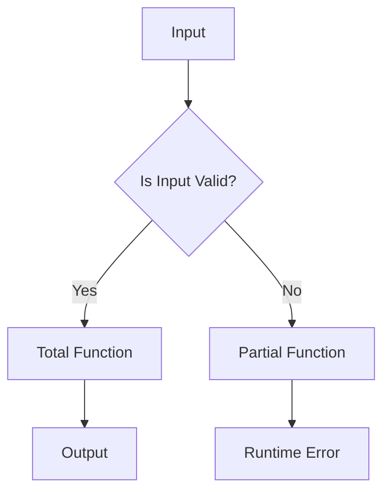

## 17.2 Overusing Partial Functions

In the realm of Haskell programming, the concept of **partial functions** is a critical topic that requires careful consideration. As expert software engineers and architects, understanding the implications of using partial functions and the alternatives available is essential for building robust and reliable systems. This section delves into the intricacies of partial functions, the risks associated with their overuse, and best practices for avoiding potential pitfalls.

### Understanding Partial Functions

**Partial functions** are functions that are not defined for all possible inputs. In Haskell, common examples of partial functions include `head`, `tail`, `fromJust`, and `!!`. These functions can lead to runtime errors if they are applied to inputs outside their domain of definition.

#### Examples of Partial Functions

- **`head`**: Extracts the first element of a list. It is partial because it fails on an empty list.
- **`tail`**: Returns the list without its first element. It is partial because it fails on an empty list.
- **`fromJust`**: Extracts the value from a `Just` constructor. It is partial because it fails on `Nothing`.
- **`!!`**: Indexes into a list. It is partial because it fails if the index is out of bounds.

```haskell
-- Example of partial function usage
headExample :: [Int] -> Int
headExample xs = head xs  -- This will fail if xs is an empty list

fromJustExample :: Maybe Int -> Int
fromJustExample mx = fromJust mx  -- This will fail if mx is Nothing
```

### Risks of Overusing Partial Functions

The primary risk of using partial functions is that they can lead to runtime exceptions, which can cause programs to crash unexpectedly. This undermines the reliability and robustness of software systems, especially in production environments.

#### Runtime Errors

Partial functions can throw exceptions when they encounter inputs outside their domain. For example, calling `head` on an empty list results in a runtime error:

```haskell
-- This will cause a runtime error
main :: IO ()
main = print (head [])
```

#### Impact on Software Reliability

Using partial functions without proper checks can lead to software that is brittle and prone to failure. This is particularly problematic in systems where reliability and uptime are critical, such as financial systems or healthcare applications.

### Best Practices for Avoiding Partial Functions

To mitigate the risks associated with partial functions, it is advisable to use total functions or handle potential failures using types like `Maybe` or `Either`.

#### Using Total Functions

**Total functions** are functions that are defined for all possible inputs. They provide a safer alternative to partial functions by ensuring that every input is handled gracefully.

##### Example: Using `safeHead`

Instead of using `head`, which is partial, we can define a total function `safeHead` that returns a `Maybe` type:

```haskell
-- Total function for safe head extraction
safeHead :: [a] -> Maybe a
safeHead []    = Nothing
safeHead (x:_) = Just x

-- Usage example
main :: IO ()
main = print (safeHead [])  -- Output: Nothing
```

#### Handling Failures with `Maybe` and `Either`

The `Maybe` and `Either` types in Haskell are powerful tools for handling potential failures without resorting to partial functions.

##### Using `Maybe`

The `Maybe` type represents a computation that might fail. It can be `Nothing` (failure) or `Just a` (success).

```haskell
-- Function using Maybe to handle potential failure
divide :: Double -> Double -> Maybe Double
divide _ 0 = Nothing
divide x y = Just (x / y)

-- Usage example
main :: IO ()
main = print (divide 10 0)  -- Output: Nothing
```

##### Using `Either`

The `Either` type provides more information about failures by allowing you to specify an error message or type.

```haskell
-- Function using Either to handle potential failure with error message
divideWithError :: Double -> Double -> Either String Double
divideWithError _ 0 = Left "Division by zero error"
divideWithError x y = Right (x / y)

-- Usage example
main :: IO ()
main = print (divideWithError 10 0)  -- Output: Left "Division by zero error"
```

### Visualizing Partial and Total Functions

To better understand the concept of partial and total functions, let's visualize their behavior using a simple flowchart.



**Caption**: This flowchart illustrates how total functions handle all inputs gracefully, while partial functions can lead to runtime errors if inputs are invalid.

### Design Considerations

When designing Haskell applications, it is crucial to consider the following:

- **Avoid Partial Functions**: Strive to use total functions wherever possible. This enhances the reliability and maintainability of your code.
- **Leverage Type Safety**: Use Haskell's strong type system to your advantage by employing `Maybe` and `Either` for error handling.
- **Document Assumptions**: Clearly document any assumptions about inputs to functions, especially if partial functions are unavoidable.

### Haskell Unique Features

Haskell's type system and functional paradigm offer unique features that facilitate the avoidance of partial functions:

- **Pattern Matching**: Use pattern matching to handle different cases explicitly, reducing the need for partial functions.
- **Type Classes**: Leverage type classes to define generic operations that work across different types, ensuring totality.

### Differences and Similarities with Other Patterns

Partial functions are often confused with other patterns, such as:

- **Exception Handling**: Unlike exception handling, which deals with runtime errors, using total functions and types like `Maybe` and `Either` prevents errors from occurring in the first place.
- **Null Checks**: In languages with null values, partial functions can be likened to operations that assume non-null inputs. Haskell's `Maybe` type provides a safer alternative.

### Try It Yourself

To deepen your understanding, try modifying the code examples provided:

- Implement a `safeTail` function that returns a `Maybe` type.
- Modify the `divideWithError` function to return a custom error type instead of a `String`.

### Knowledge Check

- What is a partial function, and why is it risky to use them in Haskell?
- How can you convert a partial function into a total function?
- What are the benefits of using `Maybe` and `Either` for error handling?

### Embrace the Journey

Remember, mastering the use of total functions and avoiding partial functions is a journey. As you progress, you'll build more reliable and robust Haskell applications. Keep experimenting, stay curious, and enjoy the journey!

### Quiz: Overusing Partial Functions



### What is a partial function in Haskell?

- [x] A function not defined for all possible inputs
- [ ] A function that always returns a value
- [ ] A function that is defined for all possible inputs
- [ ] A function that never throws an error

> **Explanation:** A partial function is one that is not defined for all possible inputs, leading to potential runtime errors.

### Which of the following is a partial function in Haskell?

- [x] `head`
- [ ] `safeHead`
- [ ] `map`
- [ ] `filter`

> **Explanation:** `head` is a partial function because it fails on an empty list, while `safeHead` is a total function that handles empty lists gracefully.

### How can you handle potential failures in Haskell?

- [x] Using `Maybe` or `Either`
- [ ] Ignoring errors
- [ ] Using `unsafePerformIO`
- [ ] Using `null`

> **Explanation:** `Maybe` and `Either` are types that allow you to handle potential failures gracefully without resorting to partial functions.

### What is the risk of using partial functions?

- [x] Runtime errors and crashes
- [ ] Improved performance
- [ ] Increased readability
- [ ] Enhanced security

> **Explanation:** Partial functions can lead to runtime errors and crashes if they encounter inputs outside their domain.

### What is a total function?

- [x] A function defined for all possible inputs
- [ ] A function that always returns `Nothing`
- [ ] A function that never returns a value
- [ ] A function that throws exceptions

> **Explanation:** A total function is defined for all possible inputs, ensuring that it handles every case gracefully.

### Which type can provide more information about failures?

- [x] `Either`
- [ ] `Maybe`
- [ ] `Int`
- [ ] `Bool`

> **Explanation:** `Either` can provide more information about failures by allowing you to specify an error message or type.

### What is the benefit of using `safeHead` over `head`?

- [x] Avoids runtime errors on empty lists
- [ ] Increases performance
- [ ] Reduces code readability
- [ ] Increases code complexity

> **Explanation:** `safeHead` avoids runtime errors by returning `Nothing` for empty lists, making it a safer alternative to `head`.

### How can you visualize the behavior of partial and total functions?

- [x] Using flowcharts
- [ ] Using bar charts
- [ ] Using pie charts
- [ ] Using scatter plots

> **Explanation:** Flowcharts can effectively illustrate the decision-making process and potential outcomes of using partial and total functions.

### What is the role of pattern matching in avoiding partial functions?

- [x] Explicitly handles different cases
- [ ] Increases code complexity
- [ ] Reduces code readability
- [ ] Causes runtime errors

> **Explanation:** Pattern matching allows you to explicitly handle different cases, reducing the need for partial functions.

### True or False: Using `Maybe` and `Either` can prevent errors from occurring.

- [x] True
- [ ] False

> **Explanation:** Using `Maybe` and `Either` allows you to handle potential failures gracefully, preventing errors from occurring in the first place.


