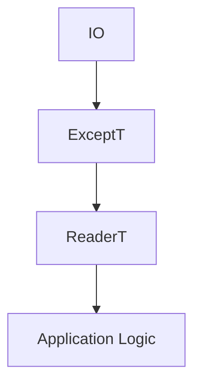

## 17.3 Misuse of Monads and Monad Transformers

Monads and monad transformers are powerful abstractions in Haskell that enable developers to manage side effects, handle computations in various contexts, and build complex applications with composability and elegance. However, their misuse can lead to overly complex code, performance issues, and maintenance challenges. In this section, we will explore common mistakes when using monads and monad transformers, provide guidelines for effective usage, and offer insights into simplifying monad stacks and choosing appropriate abstractions.

### Understanding Monads and Monad Transformers

Before diving into common pitfalls, let's briefly revisit what monads and monad transformers are and why they are essential in Haskell.

#### Monads

Monads are a design pattern used to encapsulate computations in a specific context, such as handling side effects, managing state, or dealing with computations that might fail. A monad is defined by three primary components:

1. **Type Constructor**: A type constructor `m` that represents the monadic context.
2. **Return Function**: A function `return :: a -> m a` that injects a value into the monadic context.
3. **Bind Operator**: An operator `(>>=) :: m a -> (a -> m b) -> m b` that chains computations within the monadic context.

Monads must satisfy three laws: left identity, right identity, and associativity, ensuring predictable behavior when chaining operations.

#### Monad Transformers

Monad transformers allow stacking multiple monadic effects, enabling developers to combine different monads' functionalities. A monad transformer is a type constructor that takes a monad as an argument and returns a new monad. For example, the `StateT` transformer can be used to add state-handling capabilities to another monad.

### Common Mistakes with Monads and Monad Transformers

#### Overcomplicating Code with Unnecessary Monad Transformers

One of the most common mistakes is overcomplicating code by using monad transformers when they are not needed. This can lead to complex monad stacks that are difficult to understand and maintain.

**Example:**

```haskell
import Control.Monad.Trans.State
import Control.Monad.Trans.Reader
import Control.Monad.Trans.Except

type ComplexMonad = StateT Int (ReaderT String (ExceptT String IO))

-- A function using a complex monad stack
complexFunction :: ComplexMonad ()
complexFunction = do
    state <- get
    env <- ask
    liftIO $ putStrLn $ "State: " ++ show state ++ ", Env: " ++ env
    throwError "An error occurred"
```

In this example, the monad stack combines state, environment, and error handling with IO operations. While this might be necessary in some cases, it's essential to evaluate whether such complexity is justified.

**Guideline:** Simplify monad stacks by using only the necessary transformers. Consider whether simpler alternatives, such as using `Reader` or `State` directly, might suffice.

#### Misunderstanding Monad Laws and Their Implications

Another common mistake is misunderstanding or ignoring monad laws, leading to unexpected behavior in monadic code. The monad laws ensure that monadic operations behave predictably and consistently.

**Example:**

```haskell
-- Violating the left identity law
leftIdentityViolation :: Maybe Int
leftIdentityViolation = (return 5 >>= \x -> Just (x + 1)) /= Just (5 + 1)
```

In this example, the left identity law states that `return a >>= f` should be equivalent to `f a`. Violating this law can lead to incorrect assumptions about how monadic operations compose.

**Guideline:** Always ensure that your monadic operations adhere to the monad laws. Test your monadic functions to verify their behavior aligns with these laws.

### Guidelines for Effective Use of Monads and Monad Transformers

#### Simplifying Monad Stacks

1. **Evaluate Necessity**: Before adding a monad transformer, evaluate whether its functionality is essential for your application. Avoid adding complexity without clear benefits.

2. **Use Combinators**: Leverage combinators and utility functions provided by libraries like `mtl` to simplify monadic code. Functions like `lift`, `liftIO`, and `mapM` can help manage monadic operations without deepening the monad stack.

3. **Refactor Complex Logic**: Break down complex monadic logic into smaller, more manageable functions. This can help isolate specific concerns and reduce the need for deep monad stacks.

#### Using Appropriate Abstractions

1. **Choose the Right Monad**: Select the monad that best fits the problem domain. For example, use `Maybe` for computations that might fail without an error message, and `Either` for computations that might fail with an error message.

2. **Leverage Type Classes**: Use type classes like `Monad`, `MonadIO`, and `MonadError` to abstract over different monads and monad transformers. This can help write more generic and reusable code.

3. **Understand Transformer Stacks**: Gain a deep understanding of how different transformers interact. This knowledge will help you design more efficient and maintainable monad stacks.

### Code Examples and Best Practices

Let's explore some code examples that demonstrate best practices for using monads and monad transformers effectively.

#### Example 1: Simplifying Monad Stacks

```haskell
import Control.Monad.Trans.Reader
import Control.Monad.Trans.Except
import Control.Monad.IO.Class

type SimpleMonad = ReaderT String (ExceptT String IO)

simpleFunction :: SimpleMonad ()
simpleFunction = do
    env <- ask
    liftIO $ putStrLn $ "Env: " ++ env
    throwError "An error occurred"
```

In this example, we simplify the monad stack by removing unnecessary state handling. The `ReaderT` and `ExceptT` transformers provide the needed functionality without additional complexity.

#### Example 2: Using Type Classes for Abstraction

```haskell
import Control.Monad.Reader
import Control.Monad.Except

class Monad m => MonadApp m where
    getEnv :: m String
    throwError :: String -> m ()

instance MonadApp (ReaderT String (ExceptT String IO)) where
    getEnv = ask
    throwError = lift . throwError

appFunction :: MonadApp m => m ()
appFunction = do
    env <- getEnv
    liftIO $ putStrLn $ "Env: " ++ env
    throwError "An error occurred"
```

Here, we define a `MonadApp` type class to abstract over the specific monad stack. This allows us to write more generic code that can work with any monad implementing the `MonadApp` interface.

### Visualizing Monad Stacks

To better understand how monad stacks work, let's visualize a simple monad stack using a diagram.



**Description:** This diagram illustrates a monad stack where `IO` is the base monad, `ExceptT` adds error handling, and `ReaderT` provides access to an environment. The application logic operates within this combined context.

### References and Further Reading

- [Haskell Wiki: Monad Transformers](https://wiki.haskell.org/Monad_Transformers)
- [Learn You a Haskell for Great Good!](http://learnyouahaskell.com/for-a-few-monads-more)
- [Real World Haskell](http://book.realworldhaskell.org/read/)

### Knowledge Check

1. What are the three primary components of a monad?
2. How can you simplify a complex monad stack?
3. Why is it important to adhere to monad laws?
4. What is the purpose of a monad transformer?
5. How can type classes help in writing generic monadic code?

### Embrace the Journey

Remember, mastering monads and monad transformers is a journey. As you continue to explore Haskell, you'll gain deeper insights into these powerful abstractions. Keep experimenting, stay curious, and enjoy the process of learning and refining your skills.

### Quiz: Misuse of Monads and Monad Transformers



### What is a common mistake when using monad transformers?

- [x] Overcomplicating code with unnecessary monad transformers.
- [ ] Using monad transformers for error handling.
- [ ] Combining monads for complex computations.
- [ ] Leveraging monad transformers for state management.

> **Explanation:** Overcomplicating code with unnecessary monad transformers can lead to complex and hard-to-maintain code.

### Which of the following is NOT a monad law?

- [ ] Left identity
- [ ] Right identity
- [x] Commutativity
- [ ] Associativity

> **Explanation:** Commutativity is not a monad law. The monad laws are left identity, right identity, and associativity.

### How can you simplify a monad stack?

- [x] Evaluate the necessity of each transformer.
- [ ] Add more transformers for flexibility.
- [ ] Use only the IO monad.
- [ ] Avoid using type classes.

> **Explanation:** Simplifying a monad stack involves evaluating the necessity of each transformer and using only those that are essential.

### What is the purpose of the `lift` function in monad transformers?

- [x] To lift a computation from a base monad into a monad transformer stack.
- [ ] To combine two monads into one.
- [ ] To execute IO operations within a monad.
- [ ] To transform a monad into a functor.

> **Explanation:** The `lift` function is used to lift a computation from a base monad into a monad transformer stack.

### Why is it important to adhere to monad laws?

- [x] To ensure predictable behavior of monadic operations.
- [ ] To improve performance of monadic code.
- [ ] To enable parallel execution of monads.
- [ ] To simplify the syntax of monadic expressions.

> **Explanation:** Adhering to monad laws ensures predictable behavior of monadic operations, making the code more reliable and maintainable.

### What is a benefit of using type classes with monads?

- [x] They allow for writing generic and reusable code.
- [ ] They eliminate the need for monad transformers.
- [ ] They improve the performance of monadic operations.
- [ ] They simplify the syntax of monadic expressions.

> **Explanation:** Type classes allow for writing generic and reusable code by abstracting over different monads and monad transformers.

### How can you refactor complex monadic logic?

- [x] Break it down into smaller, more manageable functions.
- [ ] Add more monad transformers to handle complexity.
- [ ] Use only the IO monad for simplicity.
- [ ] Avoid using combinators and utility functions.

> **Explanation:** Refactoring complex monadic logic involves breaking it down into smaller, more manageable functions to isolate specific concerns.

### What is the role of `MonadIO` in monadic code?

- [x] To abstract over monads that support IO operations.
- [ ] To transform a monad into an applicative.
- [ ] To eliminate the need for the IO monad.
- [ ] To improve the performance of IO operations.

> **Explanation:** `MonadIO` is a type class that abstracts over monads that support IO operations, allowing for more generic code.

### Which of the following is a guideline for using monad transformers effectively?

- [x] Use only the necessary transformers.
- [ ] Combine as many transformers as possible.
- [ ] Avoid using type classes.
- [ ] Use only the IO monad for all operations.

> **Explanation:** Using only the necessary transformers helps keep the monad stack simple and maintainable.

### True or False: Monad transformers can be used to combine multiple monadic effects.

- [x] True
- [ ] False

> **Explanation:** True. Monad transformers are used to combine multiple monadic effects, allowing for more complex computations.




