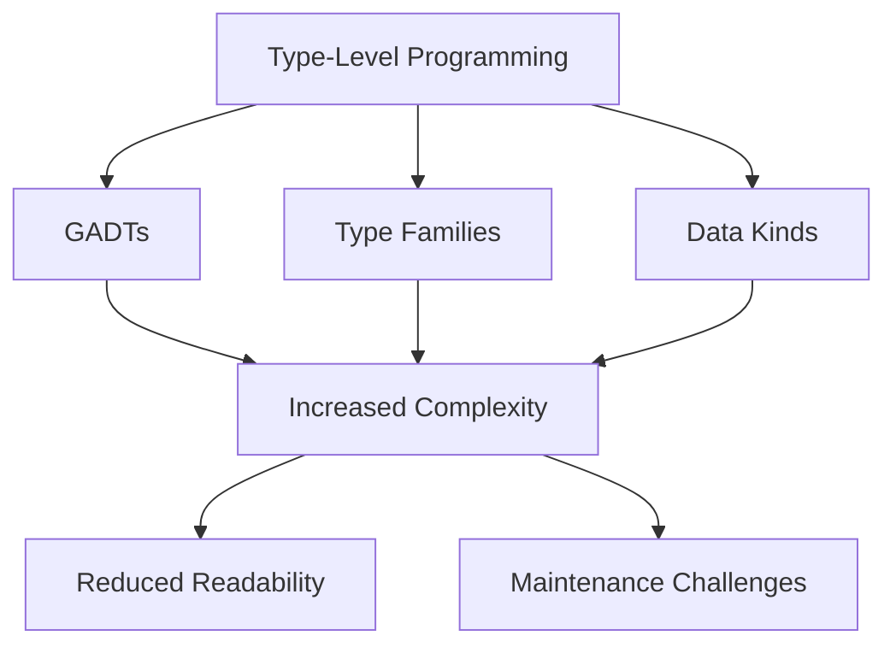

## 17.4 Overcomplicating with Type-Level Programming

In the realm of Haskell, type-level programming offers powerful tools for ensuring code safety and correctness. However, with great power comes the risk of overcomplicating your codebase. In this section, we will explore the pitfalls of overcomplicating with type-level programming, the consequences of such complexity, and recommendations for maintaining a balance between type safety and code simplicity.

### Understanding Type-Level Programming

Type-level programming in Haskell involves using the type system to enforce constraints and invariants at compile time. This can include using advanced features such as Generalized Algebraic Data Types (GADTs), Type Families, and Data Kinds. These tools allow developers to encode more information in types, reducing runtime errors and increasing code reliability.

#### Key Concepts

- **GADTs**: Generalized Algebraic Data Types extend the capabilities of regular algebraic data types, allowing more precise type annotations.
- **Type Families**: These provide a way to define functions at the type level, enabling type-level computation.
- **Data Kinds**: This extension allows types to be promoted to kinds, enabling more expressive type-level programming.

### Pitfalls of Overcomplicating with Type-Level Programming

While type-level programming can enhance code safety, it can also introduce excessive complexity. Here are some common pitfalls:

- **Overuse of Advanced Features**: Using GADTs, Type Families, and Data Kinds without a clear necessity can lead to convoluted code.
- **Reduced Readability**: Complex type-level constructs can make code difficult to understand for other developers.
- **Maintenance Challenges**: As the codebase evolves, maintaining complex type-level logic can become burdensome.

#### Example: Overuse of GADTs

Consider a scenario where GADTs are used to enforce invariants in a simple expression evaluator:

```haskell
{-# LANGUAGE GADTs #-}

data Expr a where
  IVal :: Int -> Expr Int
  BVal :: Bool -> Expr Bool
  Add  :: Expr Int -> Expr Int -> Expr Int
  Eq   :: Expr Int -> Expr Int -> Expr Bool

eval :: Expr a -> a
eval (IVal n) = n
eval (BVal b) = b
eval (Add e1 e2) = eval e1 + eval e2
eval (Eq e1 e2) = eval e1 == eval e2
```

While this example demonstrates the power of GADTs, it can be overkill for simple expressions. The complexity added by GADTs might not justify the benefits in this case.

### Consequences of Excessive Complexity

The consequences of overcomplicating with type-level programming include:

- **Steeper Learning Curve**: New developers may struggle to understand complex type-level constructs.
- **Increased Development Time**: Debugging and extending complex type-level code can be time-consuming.
- **Potential for Errors**: Ironically, the complexity intended to prevent errors can introduce new ones.

### Recommendations for Balancing Type-Level Safety with Simplicity

To avoid the pitfalls of overcomplicating with type-level programming, consider the following recommendations:

#### 1. Use Advanced Features Judiciously

Evaluate whether the benefits of using advanced type-level features outweigh the added complexity. Use them only when they provide clear advantages in terms of safety or expressiveness.

#### 2. Prioritize Readability

Aim for code that is easy to read and understand. Use descriptive type names and comments to clarify complex logic.

#### 3. Simplify Where Possible

Look for opportunities to simplify type-level constructs. Sometimes, simpler solutions can achieve the same goals with less complexity.

#### 4. Document Type-Level Logic

Provide thorough documentation for any complex type-level logic. This helps other developers understand the rationale behind the design decisions.

#### 5. Leverage Type Aliases

Use type aliases to simplify complex type signatures, making them more readable and manageable.

### Code Example: Simplifying Type-Level Logic

Let's revisit the expression evaluator example and simplify it by removing unnecessary complexity:

```haskell
data SimpleExpr
  = IVal Int
  | BVal Bool
  | Add SimpleExpr SimpleExpr
  | Eq SimpleExpr SimpleExpr

evalSimple :: SimpleExpr -> Either String Int
evalSimple (IVal n) = Right n
evalSimple (BVal _) = Left "Expected an integer expression"
evalSimple (Add e1 e2) = do
  n1 <- evalSimple e1
  n2 <- evalSimple e2
  return (n1 + n2)
evalSimple (Eq e1 e2) = do
  n1 <- evalSimple e1
  n2 <- evalSimple e2
  return (if n1 == n2 then 1 else 0)
```

In this simplified version, we use a single data type without GADTs, reducing complexity while maintaining functionality.

### Visualizing Type-Level Programming Complexity

To better understand the complexity introduced by type-level programming, consider the following diagram illustrating the relationships between different type-level constructs:



This diagram shows how different type-level constructs can contribute to increased complexity, leading to reduced readability and maintenance challenges.

### Knowledge Check

Before we conclude, let's test your understanding of the concepts covered in this section:

1. What are the potential pitfalls of overcomplicating with type-level programming?
2. How can you balance type-level safety with code simplicity?
3. What are some recommendations for using advanced type-level features judiciously?

### Embrace the Journey

Remember, mastering type-level programming in Haskell is a journey. As you gain experience, you'll learn to balance the power of the type system with the need for simplicity. Keep experimenting, stay curious, and enjoy the journey!

### Quiz: Overcomplicating with Type-Level Programming



### What is a common pitfall of overcomplicating with type-level programming?

- [x] Reduced code readability
- [ ] Increased runtime errors
- [ ] Simplified code maintenance
- [ ] Enhanced performance

> **Explanation:** Overcomplicating with type-level programming can reduce code readability, making it harder for others to understand.

### Which Haskell feature allows more precise type annotations?

- [x] GADTs
- [ ] Type Aliases
- [ ] Pattern Matching
- [ ] List Comprehensions

> **Explanation:** Generalized Algebraic Data Types (GADTs) allow more precise type annotations in Haskell.

### What is a consequence of excessive complexity in type-level programming?

- [x] Steeper learning curve
- [ ] Faster development time
- [ ] Reduced potential for errors
- [ ] Improved code readability

> **Explanation:** Excessive complexity can lead to a steeper learning curve for new developers.

### How can you simplify complex type-level constructs?

- [x] Use type aliases
- [ ] Add more type-level features
- [ ] Increase code comments
- [ ] Avoid using type-level programming

> **Explanation:** Type aliases can simplify complex type signatures, making them more readable.

### What is a benefit of documenting type-level logic?

- [x] Helps other developers understand design decisions
- [ ] Reduces code execution time
- [ ] Eliminates the need for comments
- [ ] Increases code complexity

> **Explanation:** Documenting type-level logic helps other developers understand the rationale behind design decisions.

### What should you prioritize when using advanced type-level features?

- [x] Readability
- [ ] Performance
- [ ] Complexity
- [ ] Code length

> **Explanation:** Prioritizing readability ensures that code remains understandable and maintainable.

### What is a key recommendation for balancing type-level safety with simplicity?

- [x] Use advanced features judiciously
- [ ] Avoid using type-level programming
- [ ] Increase code comments
- [ ] Focus on runtime performance

> **Explanation:** Using advanced features judiciously helps balance type-level safety with simplicity.

### What is a potential consequence of overusing GADTs?

- [x] Increased code complexity
- [ ] Simplified type signatures
- [ ] Reduced compile-time errors
- [ ] Enhanced code readability

> **Explanation:** Overusing GADTs can lead to increased code complexity, making it harder to understand.

### What is a benefit of simplifying type-level logic?

- [x] Easier code maintenance
- [ ] Increased runtime errors
- [ ] Reduced code readability
- [ ] More complex type signatures

> **Explanation:** Simplifying type-level logic makes code easier to maintain and understand.

### True or False: Type-level programming always improves code readability.

- [ ] True
- [x] False

> **Explanation:** While type-level programming can enhance safety, it does not always improve readability and can sometimes reduce it.



By understanding the potential pitfalls of overcomplicating with type-level programming and following best practices, you can harness the power of Haskell's type system without sacrificing code simplicity and maintainability.
