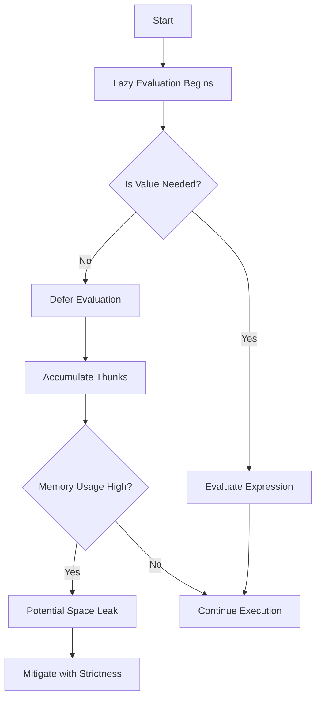

## 17.5 Ignoring Lazy Evaluation Pitfalls (Space Leaks)

Lazy evaluation is one of Haskell's most powerful features, allowing for efficient computation by deferring evaluation until absolutely necessary. However, this can also lead to unintended memory consumption, known as **space leaks**. In this section, we will delve into the concept of space leaks, how to detect them, and strategies to mitigate their impact.

### Understanding Lazy Evaluation

Lazy evaluation, or call-by-need, is a strategy where expressions are not evaluated until their values are required. This can lead to significant performance improvements by avoiding unnecessary calculations and enabling the creation of infinite data structures.

#### Key Benefits of Lazy Evaluation

- **Efficiency**: Avoids unnecessary computations.
- **Modularity**: Allows for separation of concerns, enabling more modular code.
- **Infinite Structures**: Supports the creation of infinite lists and other data structures.

### What Are Space Leaks?

Space leaks occur when memory is consumed by deferred computations that are not immediately needed, leading to increased memory usage and potential performance degradation. This often happens when large thunks (unevaluated expressions) accumulate in memory.

#### Common Causes of Space Leaks

- **Excessive Thunk Accumulation**: When thunks grow too large before being evaluated.
- **Improper Use of Lazy Data Structures**: Using lazy lists or other structures without considering their memory implications.
- **Inefficient Recursion**: Recursive functions that build up large thunks.

### Detecting Space Leaks

Detecting space leaks involves monitoring memory usage and profiling your Haskell programs. Tools like GHC's profiler can help identify areas where memory consumption is unexpectedly high.

#### Using GHC Profiler

1. **Compile with Profiling**: Use the `-prof` flag to compile your Haskell program with profiling enabled.
2. **Run with RTS Options**: Execute your program with runtime system (RTS) options to gather profiling data, e.g., `+RTS -hc -RTS`.
3. **Analyze the Output**: Use tools like `hp2ps` to visualize heap profiles and identify space leaks.

### Mitigating Space Leaks

Mitigating space leaks involves applying strictness where necessary to ensure that expressions are evaluated in a timely manner.

#### Applying Strictness Annotations

Strictness annotations can be used to force evaluation of expressions. In Haskell, you can use the `!` operator in data declarations to enforce strict evaluation.

```haskell
data Point = Point !Double !Double
```

#### Using `seq` and `deepseq`

The `seq` function forces the evaluation of its first argument before returning the second. `deepseq` is a more powerful variant that ensures complete evaluation of data structures.

```haskell
import Control.DeepSeq

forceEvaluation :: [Int] -> Int
forceEvaluation xs = sum xs `seq` 0

deepForceEvaluation :: [Int] -> Int
deepForceEvaluation xs = xs `deepseq` 0
```

### Code Example: Identifying and Fixing a Space Leak

Let's consider a simple example where a space leak might occur due to lazy evaluation.

```haskell
-- A naive implementation that can cause space leaks
sumOfSquares :: [Int] -> Int
sumOfSquares xs = sum (map (^2) xs)

-- Improved version using strict evaluation
sumOfSquaresStrict :: [Int] -> Int
sumOfSquaresStrict xs = foldl' (\acc x -> acc + x^2) 0 xs
```

In the first implementation, `map (^2) xs` creates a list of thunks that are not evaluated until `sum` is called. The second implementation uses `foldl'`, a strict version of `foldl`, to ensure that the accumulator is evaluated at each step, preventing the buildup of thunks.

### Visualizing Lazy Evaluation and Space Leaks

To better understand how lazy evaluation can lead to space leaks, let's visualize the process using a flowchart.



### References and Further Reading

- [deepseq on Hackage](https://hackage.haskell.org/package/deepseq)
- [GHC Profiling](https://downloads.haskell.org/~ghc/latest/docs/html/users_guide/profiling.html)

### Knowledge Check

- **What is lazy evaluation, and why is it beneficial?**
- **How can space leaks impact the performance of a Haskell program?**
- **What tools can be used to detect space leaks in Haskell?**
- **How does `seq` differ from `deepseq` in terms of evaluation?**

### Try It Yourself

Experiment with the provided code examples by modifying the list size and observing the impact on memory usage. Try using different strictness strategies to see how they affect performance.

### Embrace the Journey

Remember, mastering lazy evaluation and managing space leaks is a journey. As you continue to explore Haskell's powerful features, you'll gain deeper insights into optimizing your programs for performance and efficiency. Keep experimenting, stay curious, and enjoy the journey!

## Quiz: Ignoring Lazy Evaluation Pitfalls (Space Leaks)



### What is a space leak in Haskell?

- [x] Unintended memory consumption due to deferred computations.
- [ ] A syntax error in Haskell code.
- [ ] A type mismatch in Haskell functions.
- [ ] A runtime error caused by incorrect logic.

> **Explanation:** Space leaks occur when memory is consumed by deferred computations that are not immediately needed, leading to increased memory usage.

### Which tool can be used to detect space leaks in Haskell?

- [x] GHC Profiler
- [ ] HLint
- [ ] Stack
- [ ] Cabal

> **Explanation:** GHC Profiler is used to monitor memory usage and identify space leaks in Haskell programs.

### How does `seq` help in mitigating space leaks?

- [x] Forces evaluation of its first argument before returning the second.
- [ ] Delays evaluation of expressions.
- [ ] Automatically optimizes memory usage.
- [ ] Converts lazy evaluation to strict evaluation globally.

> **Explanation:** `seq` forces the evaluation of its first argument, helping to prevent the accumulation of large thunks.

### What is the difference between `seq` and `deepseq`?

- [x] `deepseq` ensures complete evaluation of data structures, while `seq` only evaluates the first argument.
- [ ] `seq` is more powerful than `deepseq`.
- [ ] `deepseq` delays evaluation, while `seq` forces it.
- [ ] Both are identical in functionality.

> **Explanation:** `deepseq` ensures complete evaluation of data structures, whereas `seq` only forces evaluation of the first argument.

### Which of the following can cause space leaks?

- [x] Excessive thunk accumulation
- [ ] Proper use of strict evaluation
- [ ] Efficient recursion
- [ ] Optimized memory management

> **Explanation:** Space leaks can occur due to excessive thunk accumulation, leading to increased memory usage.

### What is the benefit of using `foldl'` over `foldl`?

- [x] `foldl'` is strict and prevents the buildup of thunks.
- [ ] `foldl'` is lazy and defers evaluation.
- [ ] `foldl'` automatically optimizes performance.
- [ ] `foldl'` is deprecated in Haskell.

> **Explanation:** `foldl'` is a strict version of `foldl`, ensuring that the accumulator is evaluated at each step, preventing the buildup of thunks.

### What is a thunk in Haskell?

- [x] An unevaluated expression.
- [ ] A syntax error.
- [ ] A type mismatch.
- [ ] A runtime exception.

> **Explanation:** A thunk is an unevaluated expression in Haskell, which can lead to space leaks if not managed properly.

### How can strictness annotations help in Haskell?

- [x] They force evaluation of expressions, reducing space leaks.
- [ ] They delay evaluation of expressions.
- [ ] They automatically optimize code.
- [ ] They are used for type checking.

> **Explanation:** Strictness annotations force evaluation of expressions, helping to reduce space leaks by preventing the accumulation of thunks.

### What is lazy evaluation?

- [x] A strategy where expressions are not evaluated until their values are required.
- [ ] A method to force evaluation of all expressions.
- [ ] A technique to optimize memory usage.
- [ ] A way to handle runtime exceptions.

> **Explanation:** Lazy evaluation is a strategy where expressions are not evaluated until their values are required, allowing for efficient computation.

### True or False: Lazy evaluation always leads to space leaks.

- [ ] True
- [x] False

> **Explanation:** Lazy evaluation does not always lead to space leaks; it can be managed effectively with proper techniques like strictness annotations and profiling.


