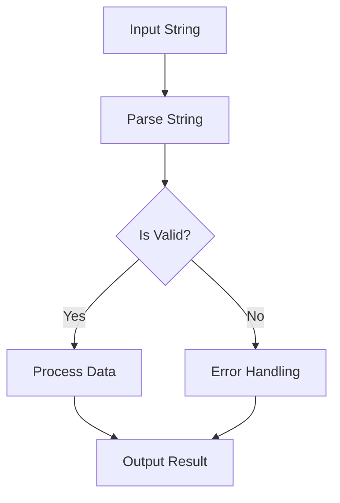

## 17.6 Excessive Use of Stringly Typed Data

In the world of software development, the term **"stringly typed data"** refers to the practice of using strings to represent structured data. While strings are a versatile and easy-to-use data type, their overuse can lead to a host of problems, especially in a language like Haskell, which offers a rich type system designed to enhance safety and expressiveness.

### Understanding Stringly Typed Data

**Stringly typed data** is a common anti-pattern where developers use strings to store and manipulate data that could be more appropriately represented using structured types. This approach often arises from a desire for simplicity or due to constraints in interfacing with systems that primarily use strings, such as databases or web APIs.

#### Issues with Stringly Typed Data

1. **Lack of Type Safety**: Strings do not provide compile-time guarantees about the structure or content of the data they represent. This can lead to runtime errors that are difficult to diagnose and fix.

2. **Readability and Maintainability**: Code that relies heavily on strings for data representation can become difficult to read and maintain. Developers must remember the expected format and meaning of each string, which can lead to errors and misunderstandings.

3. **Error-Prone**: Operations on strings, such as parsing and formatting, are prone to errors. A small mistake in string manipulation can lead to significant bugs.

4. **Performance**: Strings are not the most efficient way to store and manipulate data, especially when dealing with large datasets or complex operations.

### Alternatives to Stringly Typed Data

To avoid the pitfalls of stringly typed data, Haskell developers can leverage the language's powerful type system. Here are some alternatives:

#### 1. Defining Custom Data Types

Haskell allows developers to define custom data types that can represent structured data more accurately and safely.

```haskell
-- Define a custom data type for a user
data User = User
  { userId :: Int
  , userName :: String
  , userEmail :: String
  } deriving (Show, Eq)

-- Example usage
let user = User { userId = 1, userName = "Alice", userEmail = "alice@example.com" }
```

By using custom data types, we gain several benefits:

- **Type Safety**: The compiler can enforce constraints on the data, reducing the risk of errors.
- **Clarity**: The code becomes more readable and self-documenting.
- **Maintainability**: Changes to the data structure are localized to the type definition, making the code easier to maintain.

#### 2. Leveraging Haskell's Rich Type System

Haskell's type system offers several features that can help avoid the excessive use of strings:

- **Algebraic Data Types (ADTs)**: Use ADTs to represent data with multiple variants.

```haskell
-- Define an algebraic data type for a shape
data Shape = Circle Double | Rectangle Double Double

-- Function to calculate the area of a shape
area :: Shape -> Double
area (Circle radius) = pi * radius * radius
area (Rectangle width height) = width * height
```

- **Newtypes**: Use `newtype` to create distinct types from existing ones, providing type safety without runtime overhead.

```haskell
newtype Email = Email String

-- Function to send an email
sendEmail :: Email -> IO ()
sendEmail (Email address) = putStrLn ("Sending email to: " ++ address)
```

- **Type Classes**: Use type classes to define generic operations that can work with multiple types.

```haskell
class ToString a where
  toString :: a -> String

instance ToString User where
  toString user = "User: " ++ userName user ++ ", Email: " ++ userEmail user
```

### Code Example: Refactoring Stringly Typed Data

Let's consider a simple example where we refactor a piece of code that uses stringly typed data to a more type-safe version.

#### Original Code

```haskell
-- Function to parse a user from a string
parseUser :: String -> (String, String)
parseUser input = (name, email)
  where
    parts = words input
    name = parts !! 0
    email = parts !! 1

-- Example usage
let (name, email) = parseUser "Alice alice@example.com"
```

#### Refactored Code

```haskell
-- Define a custom data type for a user
data User = User
  { userName :: String
  , userEmail :: String
  } deriving (Show, Eq)

-- Function to parse a user from a string
parseUser :: String -> Maybe User
parseUser input =
  case words input of
    [name, email] -> Just (User name email)
    _ -> Nothing

-- Example usage
case parseUser "Alice alice@example.com" of
  Just user -> putStrLn ("Parsed user: " ++ show user)
  Nothing -> putStrLn "Failed to parse user"
```

In the refactored code, we define a `User` data type to represent the user data. The `parseUser` function now returns a `Maybe User`, indicating that parsing may fail. This approach provides better error handling and makes the code more robust.

### Visualizing the Problem

To better understand the issues with stringly typed data, let's visualize the flow of data in a system that relies heavily on strings.



**Diagram Description**: This flowchart illustrates the process of handling stringly typed data. The input string is parsed, and its validity is checked. If valid, the data is processed; otherwise, error handling is performed. This process highlights the potential for errors and the need for robust error handling.

### Design Considerations

When deciding whether to use strings or structured types, consider the following:

- **Complexity**: For simple data, strings may be sufficient. However, as complexity increases, the benefits of structured types become more apparent.
- **Interoperability**: If interfacing with systems that require strings, consider using conversion functions to maintain type safety within your application.
- **Performance**: While structured types can introduce some overhead, the benefits in terms of safety and maintainability often outweigh the performance costs.

### Haskell Unique Features

Haskell's type system offers several unique features that can help avoid the excessive use of stringly typed data:

- **Pattern Matching**: Use pattern matching to deconstruct data types and handle different cases explicitly.
- **Type Inference**: Haskell's type inference can reduce boilerplate code while maintaining type safety.
- **Lazy Evaluation**: Haskell's lazy evaluation model allows for efficient handling of large data structures without unnecessary computation.

### Differences and Similarities

Stringly typed data is a common anti-pattern across many programming languages. However, Haskell's type system provides unique tools to address this issue:

- **Similarities**: Like other languages, Haskell can suffer from the same issues with stringly typed data, such as lack of type safety and maintainability.
- **Differences**: Haskell's type system, with features like ADTs and type classes, offers more robust solutions to avoid stringly typed data compared to languages with weaker type systems.

### Try It Yourself

To deepen your understanding, try refactoring a piece of code that uses stringly typed data into a version that uses Haskell's type system. Consider the following steps:

1. Identify the strings that represent structured data.
2. Define custom data types to represent this data.
3. Refactor functions to use these data types instead of strings.
4. Test the refactored code to ensure it behaves as expected.

### Knowledge Check

- What are the main issues with using stringly typed data?
- How can custom data types improve code safety and maintainability?
- What are some features of Haskell's type system that help avoid stringly typed data?

### Embrace the Journey

Remember, avoiding stringly typed data is just one step in writing robust and maintainable Haskell code. As you continue to explore Haskell's type system, you'll discover even more ways to leverage its power for safer and more expressive code. Keep experimenting, stay curious, and enjoy the journey!

## Quiz: Excessive Use of Stringly Typed Data



### What is a primary issue with stringly typed data?

- [x] Lack of type safety
- [ ] Improved performance
- [ ] Enhanced readability
- [ ] Increased maintainability

> **Explanation:** Stringly typed data lacks type safety, leading to potential runtime errors.

### How can Haskell's type system help avoid stringly typed data?

- [x] By defining custom data types
- [ ] By using more strings
- [ ] By ignoring type safety
- [ ] By avoiding pattern matching

> **Explanation:** Haskell's type system allows for defining custom data types, enhancing type safety.

### What is a benefit of using custom data types in Haskell?

- [x] Improved code clarity
- [ ] Increased use of strings
- [ ] Decreased type safety
- [ ] Reduced readability

> **Explanation:** Custom data types improve code clarity and maintainability.

### Which Haskell feature can be used to create distinct types without runtime overhead?

- [x] Newtype
- [ ] String
- [ ] List
- [ ] Tuple

> **Explanation:** `Newtype` allows for creating distinct types without runtime overhead.

### What is a common alternative to stringly typed data in Haskell?

- [x] Algebraic Data Types (ADTs)
- [ ] More strings
- [ ] Less type safety
- [ ] Ignoring errors

> **Explanation:** ADTs provide a structured way to represent data, avoiding stringly typed data.

### What is a potential downside of using strings for structured data?

- [x] Error-prone operations
- [ ] Enhanced type safety
- [ ] Improved performance
- [ ] Increased readability

> **Explanation:** Operations on strings are error-prone and lack type safety.

### How can pattern matching help in avoiding stringly typed data?

- [x] By deconstructing data types explicitly
- [ ] By using more strings
- [ ] By ignoring type safety
- [ ] By avoiding structured types

> **Explanation:** Pattern matching allows for explicit handling of different data cases.

### What is a key advantage of Haskell's type inference?

- [x] Reducing boilerplate code
- [ ] Increasing string usage
- [ ] Decreasing type safety
- [ ] Reducing readability

> **Explanation:** Type inference reduces boilerplate code while maintaining type safety.

### How does lazy evaluation benefit handling large data structures?

- [x] By avoiding unnecessary computation
- [ ] By increasing string usage
- [ ] By decreasing performance
- [ ] By reducing type safety

> **Explanation:** Lazy evaluation allows for efficient handling of large data structures.

### True or False: Stringly typed data enhances type safety.

- [ ] True
- [x] False

> **Explanation:** Stringly typed data lacks type safety and can lead to runtime errors.




