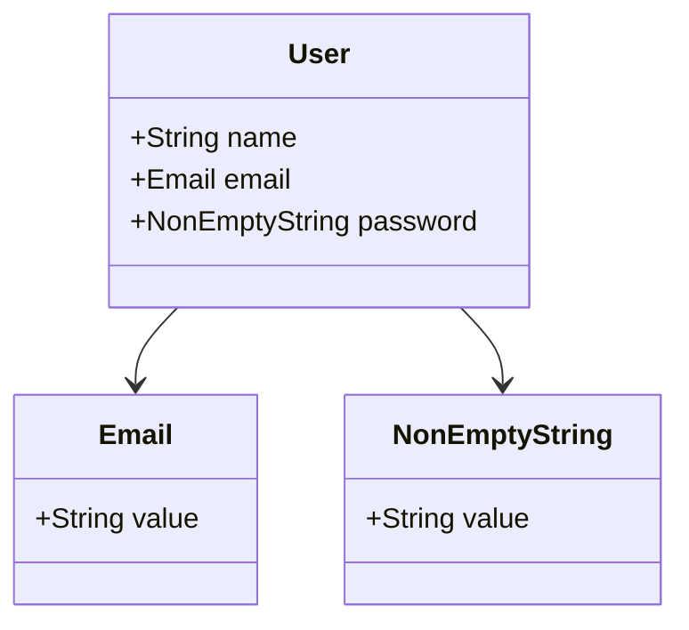

## 17.7 Underutilizing the Type System

In the world of Haskell, the type system is not just a tool for catching errors; it is a powerful ally in designing robust, maintainable, and expressive software. Yet, many developers underutilize this feature, missing opportunities to encode domain logic directly into types. In this section, we will explore the pitfalls of underutilizing the type system, the benefits of proper typing, and strategies to harness the full potential of Haskell's type system.

### Missed Opportunities

#### Not Encoding Domain Logic into Types

One of the most common mistakes in Haskell programming is failing to encode domain logic into types. This oversight can lead to code that is less expressive and more prone to runtime errors. By leveraging the type system, we can enforce constraints and invariants at compile time, reducing the likelihood of bugs.

**Example:**

Consider a simple example of a banking application where we need to represent account balances. A naive approach might use a simple `Double` to represent the balance:

```haskell
type Balance = Double

deposit :: Balance -> Double -> Balance
deposit balance amount = balance + amount
```

This approach is error-prone as it allows for negative balances, which might not be valid in our domain. Instead, we can use a newtype to enforce non-negative balances:

```haskell
newtype Balance = Balance Double deriving (Show, Eq)

deposit :: Balance -> Double -> Maybe Balance
deposit (Balance balance) amount
  | amount < 0 = Nothing
  | otherwise  = Just (Balance (balance + amount))
```

By using a `newtype`, we encapsulate the balance and can enforce domain-specific rules, such as non-negativity, directly in the type system.

### Benefits of Proper Typing

#### Enhanced Correctness

Proper use of the type system enhances the correctness of your code. By encoding invariants and constraints into types, you can leverage the compiler to verify these constraints, catching errors at compile time rather than runtime.

**Example:**

Consider a function that processes user input. Without proper typing, you might have a function like this:

```haskell
processInput :: String -> String
processInput input = "Processed: " ++ input
```

This function does not enforce any constraints on the input. By using types, you can enforce constraints such as non-empty input:

```haskell
newtype NonEmptyString = NonEmptyString String deriving (Show, Eq)

processInput :: NonEmptyString -> String
processInput (NonEmptyString input) = "Processed: " ++ input
```

Now, the compiler ensures that only non-empty strings are passed to `processInput`, enhancing the correctness of your code.

#### Compiler-Verified Constraints

The Haskell compiler is a powerful tool for verifying constraints encoded in types. By using types effectively, you can catch errors early in the development process, reducing the need for extensive runtime checks.

**Example:**

Consider a function that calculates the area of a rectangle. Without proper typing, you might have:

```haskell
area :: Double -> Double -> Double
area width height = width * height
```

This function does not enforce any constraints on the dimensions. By using types, you can enforce positive dimensions:

```haskell
newtype PositiveDouble = PositiveDouble Double deriving (Show, Eq)

area :: PositiveDouble -> PositiveDouble -> Double
area (PositiveDouble width) (PositiveDouble height) = width * height
```

Now, the compiler ensures that only positive dimensions are passed to `area`, reducing the likelihood of errors.

### Strategies for Maximizing the Type System

#### Using Newtypes

`Newtype` is a powerful feature in Haskell that allows you to create distinct types from existing ones. This is particularly useful for encapsulating domain-specific logic and enforcing invariants.

**Example:**

```haskell
newtype Email = Email String deriving (Show, Eq)

validateEmail :: String -> Maybe Email
validateEmail str
  | '@' `elem` str = Just (Email str)
  | otherwise      = Nothing
```

In this example, `Email` is a distinct type that encapsulates the logic for validating email addresses.

#### Algebraic Data Types (ADTs)

Algebraic Data Types (ADTs) are a cornerstone of Haskell's type system. They allow you to define complex data structures with multiple constructors, each potentially carrying different types of data.

**Example:**

```haskell
data Shape = Circle Double | Rectangle Double Double deriving (Show, Eq)

area :: Shape -> Double
area (Circle radius) = pi * radius * radius
area (Rectangle width height) = width * height
```

ADTs enable you to model complex domains with precision and clarity, leveraging the type system to enforce constraints and invariants.

#### Type Synonyms

Type synonyms provide a way to create more readable code by giving meaningful names to existing types. While they do not create new types, they can improve code clarity and maintainability.

**Example:**

```haskell
type Username = String
type Password = String

login :: Username -> Password -> Bool
login username password = -- implementation
```

By using type synonyms, you can make your code more expressive and easier to understand.

### Visualizing the Type System

To better understand how types can be used to encode domain logic, let's visualize a simple domain model using a class diagram.



In this diagram, we see a `User` class with fields for `name`, `email`, and `password`. The `Email` and `NonEmptyString` classes encapsulate domain-specific logic, ensuring that only valid data is stored in these fields.

### Design Considerations

When designing with types in Haskell, consider the following:

- **When to Use Newtypes**: Use `newtype` when you need a distinct type with the same underlying representation as an existing type. This is useful for encapsulating domain-specific logic and enforcing invariants.
- **When to Use ADTs**: Use ADTs when you need to model complex domains with multiple constructors. ADTs allow you to define precise data structures and enforce constraints at the type level.
- **When to Use Type Synonyms**: Use type synonyms to improve code readability and maintainability. They are useful for giving meaningful names to existing types but do not create new types.

### Haskell Unique Features

Haskell's type system offers several unique features that set it apart from other languages:

- **Type Inference**: Haskell's type inference engine automatically deduces types, reducing the need for explicit type annotations.
- **Type Classes**: Type classes provide a way to define generic interfaces that can be implemented by multiple types, enabling polymorphism and code reuse.
- **GADTs**: Generalized Algebraic Data Types (GADTs) extend the capabilities of ADTs, allowing for more precise type definitions and pattern matching.

### Differences and Similarities

It's important to distinguish between different type-related features in Haskell:

- **Newtypes vs. Type Synonyms**: `Newtype` creates a distinct type with the same underlying representation, while type synonyms are just aliases for existing types.
- **ADTs vs. GADTs**: ADTs are used for defining simple data structures, while GADTs offer more flexibility and precision in type definitions.

### Try It Yourself

To deepen your understanding of Haskell's type system, try modifying the code examples provided. Experiment with creating your own `newtype`, ADT, and type synonym to model a domain of your choice. Consider how you can leverage the type system to enforce constraints and invariants.

### Knowledge Check

- **Question**: What is the primary benefit of using `newtype` in Haskell?
- **Exercise**: Create an ADT to model a simple traffic light system with states for red, yellow, and green. Implement a function that transitions between states.

### Embrace the Journey

Remember, mastering Haskell's type system is a journey. As you continue to explore and experiment, you'll discover new ways to leverage types to write more expressive and robust code. Stay curious, keep learning, and enjoy the process!

## Quiz: Underutilizing the Type System



### What is a common mistake when using Haskell's type system?

- [x] Not encoding domain logic into types.
- [ ] Overusing type synonyms.
- [ ] Using too many newtypes.
- [ ] Avoiding algebraic data types.

> **Explanation:** A common mistake is not encoding domain logic into types, which can lead to less expressive and error-prone code.

### What is the primary benefit of using `newtype` in Haskell?

- [x] Creating distinct types with the same underlying representation.
- [ ] Improving performance.
- [ ] Simplifying code syntax.
- [ ] Avoiding type inference.

> **Explanation:** `Newtype` is used to create distinct types with the same underlying representation, allowing for encapsulation of domain-specific logic.

### How do algebraic data types (ADTs) enhance code expressiveness?

- [x] By allowing multiple constructors with different data types.
- [ ] By simplifying type inference.
- [ ] By reducing code duplication.
- [ ] By improving runtime performance.

> **Explanation:** ADTs enhance code expressiveness by allowing multiple constructors with different data types, enabling precise domain modeling.

### What is a key feature of Haskell's type system?

- [x] Type inference.
- [ ] Dynamic typing.
- [ ] Weak typing.
- [ ] Lack of polymorphism.

> **Explanation:** Haskell's type system features type inference, which automatically deduces types, reducing the need for explicit annotations.

### When should you use type synonyms in Haskell?

- [x] To improve code readability and maintainability.
- [ ] To create distinct types.
- [ ] To enforce domain-specific logic.
- [ ] To enhance performance.

> **Explanation:** Type synonyms are used to improve code readability and maintainability by giving meaningful names to existing types.

### What is the difference between `newtype` and type synonyms?

- [x] `Newtype` creates a distinct type, while type synonyms are aliases.
- [ ] `Newtype` improves performance, while type synonyms reduce code size.
- [ ] `Newtype` simplifies syntax, while type synonyms enhance readability.
- [ ] `Newtype` avoids type inference, while type synonyms enforce constraints.

> **Explanation:** `Newtype` creates a distinct type, while type synonyms are just aliases for existing types.

### How can you enforce constraints at the type level in Haskell?

- [x] By using newtypes and ADTs.
- [ ] By using type synonyms.
- [ ] By avoiding type inference.
- [ ] By using dynamic typing.

> **Explanation:** Constraints can be enforced at the type level by using newtypes and ADTs, which encapsulate domain-specific logic.

### What is a benefit of using GADTs in Haskell?

- [x] More precise type definitions and pattern matching.
- [ ] Simplified syntax.
- [ ] Improved runtime performance.
- [ ] Reduced code duplication.

> **Explanation:** GADTs offer more precise type definitions and pattern matching, extending the capabilities of ADTs.

### What is the role of type classes in Haskell?

- [x] Defining generic interfaces for polymorphism.
- [ ] Improving performance.
- [ ] Simplifying syntax.
- [ ] Avoiding type inference.

> **Explanation:** Type classes define generic interfaces that can be implemented by multiple types, enabling polymorphism and code reuse.

### True or False: Type inference in Haskell reduces the need for explicit type annotations.

- [x] True
- [ ] False

> **Explanation:** True. Haskell's type inference engine automatically deduces types, reducing the need for explicit type annotations.


