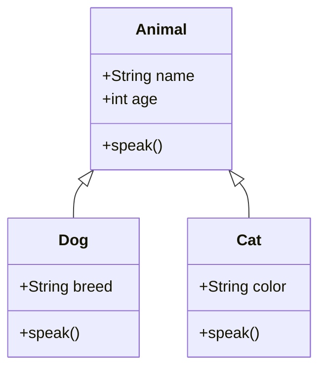
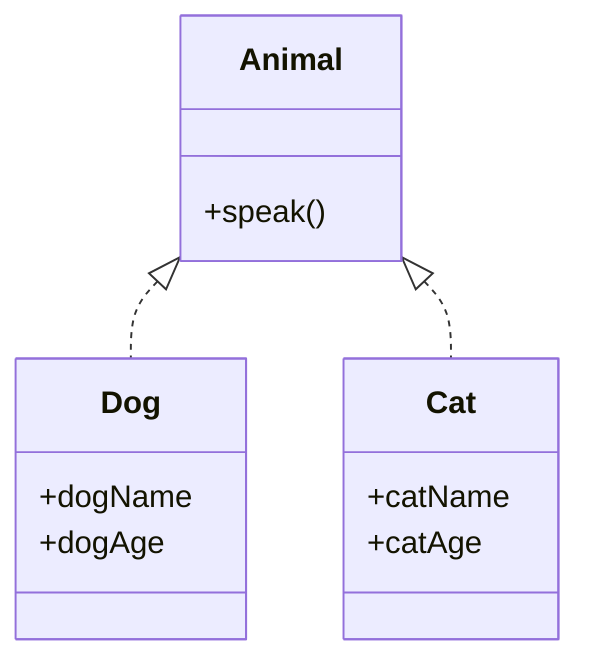

## 17.8 Misapplying Object-Oriented Patterns in Haskell

In the world of software development, design patterns serve as proven solutions to common problems. However, not all patterns are universally applicable across different programming paradigms. This is particularly true when it comes to applying Object-Oriented Programming (OOP) patterns in a functional language like Haskell. In this section, we will explore the pitfalls of misapplying OOP patterns in Haskell and provide guidance on embracing functional design patterns that are more suited to Haskell's unique features.

### Understanding the Incompatibility

#### Fundamental Differences Between OOP and Functional Programming

Object-Oriented Programming and Functional Programming are two distinct paradigms, each with its own set of principles and methodologies. OOP is centered around the concept of objects, encapsulation, inheritance, and polymorphism. In contrast, Functional Programming emphasizes immutability, first-class functions, and declarative code.

- **State Management**: OOP relies heavily on mutable state and encapsulation, whereas Haskell promotes immutability and pure functions.
- **Inheritance and Polymorphism**: OOP uses inheritance hierarchies for code reuse and polymorphism, while Haskell achieves polymorphism through type classes and higher-order functions.
- **Side Effects**: OOP often intermingles side effects with logic, whereas Haskell separates side effects using monads.

#### Why OOP Patterns Fail in Haskell

Attempting to directly apply OOP patterns in Haskell can lead to several issues:

- **Incompatibility with Immutability**: Patterns like the Singleton or Factory, which rely on mutable state, do not align with Haskell's immutable nature.
- **Complexity and Overhead**: Implementing OOP patterns can introduce unnecessary complexity and overhead in Haskell, where simpler functional solutions exist.
- **Loss of Functional Benefits**: Misapplying OOP patterns can negate the benefits of functional programming, such as referential transparency and ease of reasoning.

### Examples of Misapplied OOP Patterns

#### Classical Inheritance Hierarchies

In OOP, inheritance is a common mechanism for code reuse and polymorphism. However, in Haskell, inheritance hierarchies are not only unnecessary but also counterproductive.

```haskell
-- Attempting to mimic inheritance in Haskell
data Animal = Animal { name :: String, age :: Int }

data Dog = Dog { dogName :: String, dogAge :: Int, breed :: String }

-- This approach leads to code duplication and complexity
```

**Recommendation**: Use algebraic data types and type classes to achieve polymorphism and code reuse.

```haskell
-- Using type classes for polymorphism
class Animal a where
    speak :: a -> String

data Dog = Dog { dogName :: String, dogAge :: Int }

instance Animal Dog where
    speak _ = "Woof!"

data Cat = Cat { catName :: String, catAge :: Int }

instance Animal Cat where
    speak _ = "Meow!"
```

#### Singleton Pattern

The Singleton pattern is used in OOP to ensure a class has only one instance. In Haskell, this pattern is unnecessary due to immutability and referential transparency.

```haskell
-- Attempting a Singleton pattern in Haskell
module Singleton where

singletonInstance :: IORef (Maybe Singleton)
singletonInstance = unsafePerformIO $ newIORef Nothing

data Singleton = Singleton { value :: Int }

getInstance :: IO Singleton
getInstance = do
    instance <- readIORef singletonInstance
    case instance of
        Just s -> return s
        Nothing -> do
            let s = Singleton 42
            writeIORef singletonInstance (Just s)
            return s
```

**Recommendation**: Use pure functions and constants to achieve similar functionality without the complexity.

```haskell
-- Using a constant for Singleton-like behavior
singletonValue :: Int
singletonValue = 42
```

### Embracing Functional Design Patterns

#### Functional Alternatives to OOP Patterns

Instead of forcing OOP patterns into Haskell, embrace functional design patterns that leverage Haskell's strengths.

- **Factory Pattern**: Use smart constructors and phantom types.
- **Decorator Pattern**: Use higher-order functions and monads.
- **Observer Pattern**: Use Functional Reactive Programming (FRP) libraries.

#### Example: Factory Pattern with Smart Constructors

```haskell
-- Smart constructor for a safe data type
data User = User { username :: String, email :: String }

mkUser :: String -> String -> Maybe User
mkUser name email
    | isValidEmail email = Just (User name email)
    | otherwise = Nothing

isValidEmail :: String -> Bool
isValidEmail = -- Email validation logic
```

### Visualizing the Differences

To better understand the differences between OOP and functional approaches, let's visualize the structure of a typical OOP inheritance hierarchy versus a Haskell type class-based solution.





### Key Takeaways

- **Avoid Direct Translation**: Do not directly translate OOP patterns into Haskell. Instead, understand the problem and apply functional solutions.
- **Leverage Haskell's Features**: Use Haskell's type system, immutability, and higher-order functions to design elegant solutions.
- **Simplify and Refactor**: Embrace simplicity and refactor code to align with functional principles.

### Try It Yourself

Experiment with the provided code examples by modifying them to suit different scenarios. For instance, try adding new animal types to the type class example or implement additional validation logic in the smart constructor example.

### References and Further Reading

- [Functional Programming in Haskell](https://www.haskell.org/documentation/)
- [Type Classes in Haskell](https://wiki.haskell.org/Type_class)
- [Functional Reactive Programming](https://wiki.haskell.org/Functional_Reactive_Programming)

### Quiz: Misapplying Object-Oriented Patterns in Haskell



### Which of the following is a key difference between OOP and Functional Programming?

- [x] OOP relies on mutable state, while Functional Programming emphasizes immutability.
- [ ] OOP uses first-class functions, while Functional Programming does not.
- [ ] OOP is declarative, while Functional Programming is imperative.
- [ ] OOP separates side effects, while Functional Programming intermingles them.

> **Explanation:** OOP often relies on mutable state and encapsulation, whereas Functional Programming emphasizes immutability and pure functions.

### What is a common issue when applying OOP patterns in Haskell?

- [x] They can introduce unnecessary complexity and overhead.
- [ ] They enhance the functional nature of Haskell.
- [ ] They simplify the codebase.
- [ ] They improve performance.

> **Explanation:** OOP patterns can introduce unnecessary complexity and overhead in Haskell, where simpler functional solutions exist.

### How can polymorphism be achieved in Haskell?

- [x] Using type classes and higher-order functions.
- [ ] Using inheritance hierarchies.
- [ ] Using mutable state.
- [ ] Using Singleton patterns.

> **Explanation:** In Haskell, polymorphism is achieved through type classes and higher-order functions, not inheritance hierarchies.

### Why is the Singleton pattern unnecessary in Haskell?

- [x] Because of immutability and referential transparency.
- [ ] Because Haskell does not support classes.
- [ ] Because Haskell does not support state.
- [ ] Because Haskell does not support functions.

> **Explanation:** The Singleton pattern is unnecessary in Haskell due to its immutability and referential transparency.

### What is a functional alternative to the Factory pattern?

- [x] Smart constructors and phantom types.
- [ ] Inheritance hierarchies.
- [ ] Mutable state.
- [ ] Singleton pattern.

> **Explanation:** Smart constructors and phantom types are functional alternatives to the Factory pattern in Haskell.

### Which of the following is a benefit of using type classes in Haskell?

- [x] They provide a way to achieve polymorphism.
- [ ] They allow for mutable state.
- [ ] They enforce inheritance hierarchies.
- [ ] They require complex design patterns.

> **Explanation:** Type classes in Haskell provide a way to achieve polymorphism without the need for inheritance hierarchies.

### What is a key principle of Functional Programming?

- [x] Immutability and pure functions.
- [ ] Mutable state and encapsulation.
- [ ] Inheritance and polymorphism.
- [ ] Side effects and state management.

> **Explanation:** Functional Programming emphasizes immutability and pure functions, unlike OOP which relies on mutable state and encapsulation.

### How can side effects be managed in Haskell?

- [x] Using monads.
- [ ] Using inheritance.
- [ ] Using mutable state.
- [ ] Using Singleton patterns.

> **Explanation:** In Haskell, side effects are managed using monads, which allow for controlled execution of impure operations.

### What is a common pitfall when using OOP patterns in Haskell?

- [x] Neglecting the benefits of functional programming.
- [ ] Enhancing code readability.
- [ ] Improving performance.
- [ ] Simplifying design.

> **Explanation:** Misapplying OOP patterns can negate the benefits of functional programming, such as referential transparency and ease of reasoning.

### True or False: Haskell's type system supports classical inheritance hierarchies.

- [ ] True
- [x] False

> **Explanation:** Haskell's type system does not support classical inheritance hierarchies; instead, it uses type classes for polymorphism.



Remember, this is just the beginning. As you progress, you'll build more complex and interactive applications using Haskell's functional paradigms. Keep experimenting, stay curious, and enjoy the journey!
