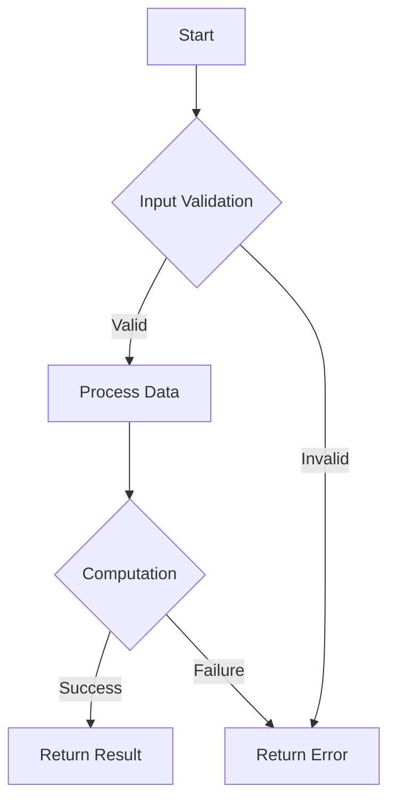

## 17.9 Neglecting Error Handling and Validation

In the realm of software development, error handling and validation are critical components that ensure the robustness and reliability of applications. In Haskell, a language renowned for its strong type system and functional programming paradigm, neglecting these aspects can lead to unhandled errors, application crashes, and a poor user experience. This section delves into the consequences of neglecting error handling and validation, explores best practices, and demonstrates how to effectively use Haskell's powerful features to manage errors and validate data.

### Consequences of Neglecting Error Handling and Validation

Neglecting error handling and validation in Haskell can have several detrimental effects on your application:

- **Unhandled Errors**: Without proper error handling, unexpected conditions can cause your application to crash, leading to data loss and a negative user experience.
- **Security Vulnerabilities**: Failing to validate input data can expose your application to security threats such as injection attacks.
- **Inconsistent State**: Errors that are not properly managed can leave your application in an inconsistent state, making it difficult to recover or debug.
- **Poor User Experience**: Users may encounter cryptic error messages or unexpected behavior, leading to frustration and loss of trust in the application.

### Best Practices for Error Handling and Validation

To mitigate these risks, it is essential to adopt best practices for error handling and validation in Haskell. This involves leveraging Haskell's type system and functional programming constructs to create robust and maintainable code.

#### Using `Either`, `Maybe`, and `Validation` Monads

Haskell provides several monads that are particularly useful for error handling and validation:

- **`Maybe` Monad**: Represents computations that might fail. It is used when a function might not return a value. The `Maybe` type has two constructors: `Just` for a successful computation and `Nothing` for a failure.

```haskell
safeDivide :: Double -> Double -> Maybe Double
safeDivide _ 0 = Nothing
safeDivide x y = Just (x / y)

-- Example usage
result = safeDivide 10 2 -- Just 5.0
```

- **`Either` Monad**: Represents computations that can fail with an error message. It is more informative than `Maybe` because it can carry an error value. The `Either` type has two constructors: `Left` for an error and `Right` for a successful computation.

```haskell
safeDivideEither :: Double -> Double -> Either String Double
safeDivideEither _ 0 = Left "Division by zero error"
safeDivideEither x y = Right (x / y)

-- Example usage
result = safeDivideEither 10 0 -- Left "Division by zero error"
```

- **`Validation` Monad**: Part of the `validation` package, it is similar to `Either` but allows for accumulating errors. This is particularly useful in scenarios where you want to validate multiple fields and report all errors at once.

```haskell
import Data.Validation

data User = User { name :: String, age :: Int }

validateName :: String -> Validation [String] String
validateName n
  | null n    = Failure ["Name cannot be empty"]
  | otherwise = Success n

validateAge :: Int -> Validation [String] Int
validateAge a
  | a < 0     = Failure ["Age cannot be negative"]
  | otherwise = Success a

validateUser :: String -> Int -> Validation [String] User
validateUser n a = User <$> validateName n <*> validateAge a

-- Example usage
result = validateUser "" (-1) -- Failure ["Name cannot be empty", "Age cannot be negative"]
```

#### Comprehensive Pattern Matching

Pattern matching is a powerful feature in Haskell that allows you to deconstruct data types and handle different cases explicitly. It is essential for handling errors and validating data effectively.

- **Pattern Matching with `Maybe`**: Use pattern matching to handle both `Just` and `Nothing` cases.

```haskell
handleMaybe :: Maybe Int -> String
handleMaybe Nothing  = "No value found"
handleMaybe (Just x) = "Value is " ++ show x
```

- **Pattern Matching with `Either`**: Use pattern matching to handle both `Left` and `Right` cases.

```haskell
handleEither :: Either String Int -> String
handleEither (Left err)  = "Error: " ++ err
handleEither (Right val) = "Value is " ++ show val
```

### Visualizing Error Handling and Validation

To better understand how error handling and validation work in Haskell, let's visualize the flow of data through these constructs using a flowchart.



**Figure 1**: Flowchart illustrating the process of input validation and error handling in Haskell.

### Haskell Unique Features for Error Handling

Haskell's type system and functional programming paradigm offer unique features that enhance error handling and validation:

- **Type Safety**: Haskell's strong static typing helps catch errors at compile time, reducing runtime errors.
- **Immutability**: Immutable data structures prevent accidental modifications, reducing the likelihood of errors.
- **Lazy Evaluation**: Allows for efficient handling of potentially infinite data structures and deferred computations.

### Differences and Similarities with Other Patterns

While `Maybe`, `Either`, and `Validation` are commonly used for error handling in Haskell, they are often confused with other patterns such as exceptions in imperative languages. Unlike exceptions, these monads provide a more declarative and compositional approach to error handling.

### Try It Yourself

To deepen your understanding, try modifying the code examples provided:

- Change the `safeDivide` function to handle more complex cases, such as returning a custom error message for negative divisors.
- Experiment with the `validateUser` function by adding more validation rules, such as checking for a minimum age.

### Knowledge Check

Before we conclude, let's reinforce what we've learned with some questions:

- What are the consequences of neglecting error handling and validation in Haskell?
- How does the `Either` monad differ from the `Maybe` monad?
- Why is pattern matching important for error handling in Haskell?

### Summary

In this section, we've explored the critical role of error handling and validation in Haskell. By leveraging monads like `Either`, `Maybe`, and `Validation`, and employing comprehensive pattern matching, we can build robust and maintainable applications. Remember, effective error handling is not just about preventing crashes; it's about creating a seamless and reliable user experience.

### Embrace the Journey

As you continue your journey in mastering Haskell, remember that error handling and validation are fundamental skills that will serve you well in building resilient applications. Keep experimenting, stay curious, and enjoy the process of learning and growing as a Haskell developer.

## Quiz: Neglecting Error Handling and Validation



### What is the primary consequence of neglecting error handling in Haskell?

- [x] Application crashes
- [ ] Improved performance
- [ ] Increased security
- [ ] Enhanced user experience

> **Explanation:** Neglecting error handling can lead to unhandled errors, causing application crashes.

### Which monad is used in Haskell to represent computations that might fail without an error message?

- [ ] Either
- [x] Maybe
- [ ] Validation
- [ ] IO

> **Explanation:** The `Maybe` monad represents computations that might fail without providing an error message.

### How does the `Either` monad differ from the `Maybe` monad?

- [x] `Either` can carry an error message
- [ ] `Either` is used for IO operations
- [ ] `Either` is less informative than `Maybe`
- [ ] `Either` is only used for validation

> **Explanation:** The `Either` monad can carry an error message, making it more informative than `Maybe`.

### What is the purpose of the `Validation` monad?

- [x] To accumulate multiple errors
- [ ] To handle IO operations
- [ ] To perform asynchronous tasks
- [ ] To manage state

> **Explanation:** The `Validation` monad is used to accumulate multiple errors, allowing for comprehensive validation.

### Why is pattern matching important in error handling?

- [x] It allows explicit handling of different cases
- [ ] It improves performance
- [ ] It simplifies code
- [ ] It is only used for lists

> **Explanation:** Pattern matching allows explicit handling of different cases, making error handling more robust.

### Which of the following is a best practice for error handling in Haskell?

- [x] Using monads like `Either` and `Maybe`
- [ ] Ignoring errors
- [ ] Using global variables
- [ ] Relying on exceptions

> **Explanation:** Using monads like `Either` and `Maybe` is a best practice for error handling in Haskell.

### What is a potential security risk of neglecting validation?

- [x] Injection attacks
- [ ] Faster execution
- [ ] Better user interface
- [ ] Increased memory usage

> **Explanation:** Neglecting validation can expose applications to security risks like injection attacks.

### How does Haskell's type system aid in error handling?

- [x] It catches errors at compile time
- [ ] It slows down execution
- [ ] It requires more memory
- [ ] It is only useful for IO operations

> **Explanation:** Haskell's strong static typing helps catch errors at compile time, reducing runtime errors.

### What is lazy evaluation's role in error handling?

- [x] It allows deferred computations
- [ ] It speeds up execution
- [ ] It simplifies code
- [ ] It is only used for lists

> **Explanation:** Lazy evaluation allows for deferred computations, which can be useful in error handling.

### True or False: The `Validation` monad is part of the standard Haskell library.

- [ ] True
- [x] False

> **Explanation:** The `Validation` monad is part of the `validation` package, not the standard Haskell library.


