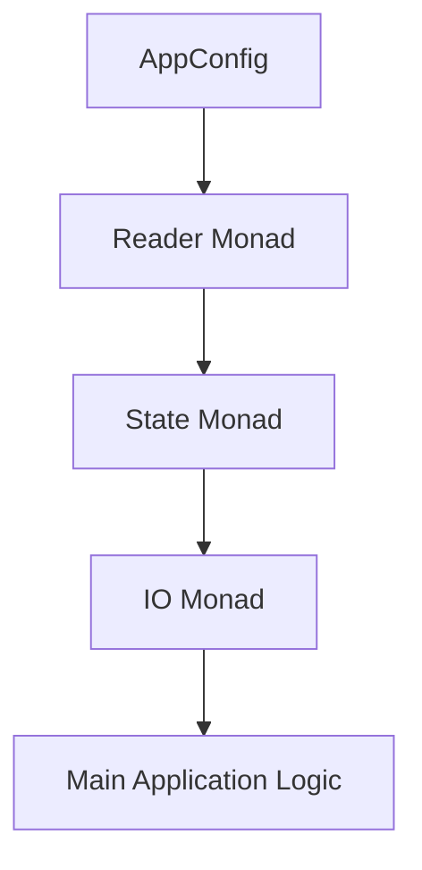

## 18.1 Combining Functional Patterns Effectively

In the realm of functional programming, particularly in Haskell, design patterns play a crucial role in crafting elegant, efficient, and scalable solutions. As expert software engineers and architects, understanding how to combine these patterns effectively is essential for solving complex problems. This section will guide you through the process of leveraging multiple design patterns, identifying complementary patterns, and integrating them seamlessly without introducing unnecessary complexity.

### Understanding the Power of Functional Patterns

Functional patterns in Haskell are not just about solving isolated problems; they are about creating a cohesive system where each part complements the others. By combining patterns, you can achieve more than the sum of their parts, leading to solutions that are robust, maintainable, and scalable.

#### Key Concepts

- **Modularity**: Functional patterns promote modularity, allowing you to break down complex problems into smaller, manageable pieces.
- **Reusability**: Patterns encourage reusability, enabling you to apply the same solution to different problems with minimal changes.
- **Composability**: Haskell's emphasis on pure functions and immutability makes it ideal for composing patterns in a way that maintains clarity and simplicity.

### Identifying Complementary Patterns

The first step in combining functional patterns is identifying which patterns complement each other. This involves understanding the strengths and weaknesses of each pattern and how they can work together to address different aspects of a problem.

#### Example: Combining Monads and Functors

Monads and Functors are two fundamental patterns in Haskell. While Functors allow you to apply a function to a wrapped value, Monads provide a way to chain operations that involve wrapped values. By combining these patterns, you can create powerful abstractions for handling side effects, managing state, and more.

```haskell
-- Example: Combining Functor and Monad
import Control.Monad (liftM, ap)

-- Functor instance for a custom data type
data MyType a = MyValue a | MyError String

instance Functor MyType where
    fmap f (MyValue x) = MyValue (f x)
    fmap _ (MyError e) = MyError e

-- Monad instance for the same data type
instance Monad MyType where
    return = MyValue
    (MyValue x) >>= f = f x
    (MyError e) >>= _ = MyError e

-- Using both Functor and Monad
processValue :: MyType Int -> MyType Int
processValue = fmap (+1) >>= return . (*2)

-- Usage
main :: IO ()
main = do
    let result = processValue (MyValue 5)
    print result  -- Output: MyValue 12
```

### Integrating Patterns Without Complexity

While combining patterns can lead to powerful solutions, it's crucial to avoid introducing unnecessary complexity. Here are some strategies to achieve this:

#### Use Abstractions Wisely

Abstractions are a double-edged sword. They can simplify complex logic, but overuse can lead to confusion. Use abstractions to encapsulate complexity, but ensure they remain transparent and intuitive.

#### Maintain Clear Boundaries

When integrating patterns, maintain clear boundaries between different parts of your system. This helps in isolating changes and understanding the flow of data and control.

#### Leverage Haskell's Type System

Haskell's strong static type system is a powerful tool for managing complexity. Use types to enforce constraints and document the relationships between different parts of your system.

### Practical Example: Building a Simple Web Application

Let's explore a practical example of combining functional patterns to build a simple web application. We'll use the following patterns:

- **Reader Monad** for dependency injection.
- **State Monad** for managing application state.
- **IO Monad** for handling side effects.

#### Step 1: Define the Application Environment

First, define the environment that your application will run in. This includes configuration settings, database connections, and other dependencies.

```haskell
-- Application environment
data AppConfig = AppConfig {
    dbConnection :: String,
    port :: Int
}

type App a = ReaderT AppConfig IO a
```

#### Step 2: Manage Application State

Use the State Monad to manage the application state, such as user sessions or cached data.

```haskell
-- Application state
data AppState = AppState {
    sessionData :: Map String String
}

type AppStateT = StateT AppState App
```

#### Step 3: Handle Side Effects

Use the IO Monad to handle side effects, such as reading from or writing to a database.

```haskell
-- Function to fetch data from the database
fetchData :: String -> AppStateT (Maybe String)
fetchData key = do
    config <- ask
    liftIO $ putStrLn ("Fetching data for key: " ++ key ++ " from " ++ dbConnection config)
    -- Simulate database fetch
    return $ Just "Sample Data"
```

#### Step 4: Combine Patterns

Combine the patterns to create the main application logic.

```haskell
-- Main application logic
runApp :: AppStateT ()
runApp = do
    result <- fetchData "user123"
    case result of
        Just data -> liftIO $ putStrLn ("Data: " ++ data)
        Nothing -> liftIO $ putStrLn "No data found"

-- Run the application
main :: IO ()
main = do
    let config = AppConfig "localhost:5432" 8080
    let initialState = AppState Map.empty
    runReaderT (evalStateT runApp initialState) config
```

### Visualizing the Integration of Patterns

To better understand how these patterns integrate, let's visualize the flow of data and control in our application using a Mermaid.js diagram.



**Diagram Description**: This flowchart illustrates the integration of the Reader Monad, State Monad, and IO Monad in our application. The AppConfig feeds into the Reader Monad, which then interacts with the State Monad to manage application state. The IO Monad handles side effects, culminating in the main application logic.

### Try It Yourself

Experiment with the code examples provided. Try modifying the application environment, adding new state variables, or introducing additional side effects. Observe how the integration of patterns affects the overall behavior of the application.

### Knowledge Check

- What are the benefits of combining functional patterns in Haskell?
- How can you identify complementary patterns for a given problem?
- What strategies can you use to integrate patterns without introducing complexity?

### Conclusion

Combining functional patterns effectively is a powerful skill that allows you to tackle complex problems with elegance and efficiency. By understanding the strengths and weaknesses of each pattern, you can create solutions that are both robust and maintainable. Remember, the key is to integrate patterns in a way that enhances clarity and simplicity, leveraging Haskell's unique features to your advantage.

### Further Reading

- [Haskell Programming from First Principles](https://haskellbook.com/)
- [Learn You a Haskell for Great Good!](http://learnyouahaskell.com/)
- [Real World Haskell](http://book.realworldhaskell.org/)

## Quiz: Combining Functional Patterns Effectively



### What is a key benefit of combining functional patterns in Haskell?

- [x] Modularity
- [ ] Increased complexity
- [ ] Reduced performance
- [ ] Less maintainability

> **Explanation:** Combining functional patterns promotes modularity, allowing you to break down complex problems into smaller, manageable pieces.

### Which pattern is used for dependency injection in the provided example?

- [x] Reader Monad
- [ ] State Monad
- [ ] IO Monad
- [ ] Functor

> **Explanation:** The Reader Monad is used for dependency injection, allowing the application to access configuration settings and other dependencies.

### What is the role of the State Monad in the example?

- [x] Managing application state
- [ ] Handling side effects
- [ ] Dependency injection
- [ ] Error handling

> **Explanation:** The State Monad is used to manage application state, such as user sessions or cached data.

### How does the IO Monad contribute to the application?

- [x] Handling side effects
- [ ] Managing application state
- [ ] Dependency injection
- [ ] Composing functions

> **Explanation:** The IO Monad is responsible for handling side effects, such as reading from or writing to a database.

### What strategy helps in integrating patterns without complexity?

- [x] Use abstractions wisely
- [ ] Overuse abstractions
- [ ] Ignore type system
- [ ] Combine unrelated patterns

> **Explanation:** Using abstractions wisely helps encapsulate complexity without making the system confusing.

### Which diagramming tool is used to visualize the integration of patterns?

- [x] Mermaid.js
- [ ] UML
- [ ] Graphviz
- [ ] PlantUML

> **Explanation:** Mermaid.js is used to create flowcharts and diagrams to visualize the integration of patterns.

### What is the main advantage of Haskell's type system in pattern integration?

- [x] Enforcing constraints
- [ ] Increasing complexity
- [ ] Reducing performance
- [ ] Limiting flexibility

> **Explanation:** Haskell's type system enforces constraints and documents relationships, aiding in managing complexity.

### What is a potential pitfall of overusing abstractions?

- [x] Confusion
- [ ] Improved clarity
- [ ] Enhanced performance
- [ ] Increased modularity

> **Explanation:** Overusing abstractions can lead to confusion, making the system harder to understand.

### What is a common use case for combining Monads and Functors?

- [x] Handling side effects
- [ ] Managing user interfaces
- [ ] Optimizing performance
- [ ] Simplifying algorithms

> **Explanation:** Combining Monads and Functors is common for handling side effects and managing state.

### True or False: Combining patterns always increases complexity.

- [ ] True
- [x] False

> **Explanation:** When done correctly, combining patterns can enhance clarity and simplicity, not necessarily increasing complexity.



Remember, this is just the beginning. As you progress, you'll build more complex and interactive systems. Keep experimenting, stay curious, and enjoy the journey!
