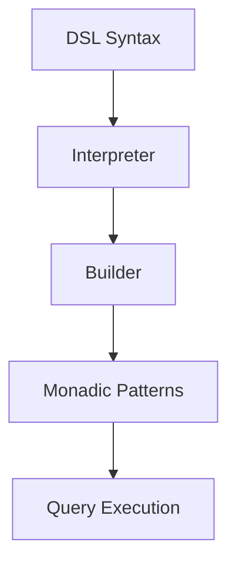

## 18.2 Case Study: Building a Domain-Specific Language (DSL)

### Overview

In this section, we will delve into the fascinating world of Domain-Specific Languages (DSLs) and explore how to design and implement a DSL in Haskell. A DSL is a specialized language tailored to a specific problem domain, offering a high level of abstraction and expressiveness. By leveraging Haskell's powerful features and design patterns, we can create an embedded DSL that is both efficient and elegant.

### Patterns Used

To build our DSL, we will employ several advanced design patterns:

- **Interpreter Pattern**: This pattern will help us define the grammar and semantics of our DSL, allowing us to interpret and execute DSL expressions.
- **Builder Pattern**: We will use this pattern to construct complex DSL expressions in a modular and flexible manner.
- **Monadic Patterns**: Monads will play a crucial role in managing side effects and enhancing the composability of our DSL.

### Implementation

Let's embark on the journey of creating an embedded DSL within Haskell. We will focus on a DSL for querying data, which can be extended to other domains such as configuring systems or defining workflows.

#### Step 1: Define the DSL Syntax

The first step in building a DSL is to define its syntax. In Haskell, we can represent the syntax using algebraic data types. Let's define a simple DSL for querying data:

```haskell
-- Define the data types for our DSL
data Query
  = Select [String] Table Condition
  | Insert Table [String] [Value]
  | Update Table [(String, Value)] Condition
  | Delete Table Condition
  deriving (Show)

data Table = Table String deriving (Show)
data Condition = Condition String deriving (Show)
data Value = IntValue Int | StringValue String deriving (Show)
```

In this example, we define a `Query` data type with constructors for `Select`, `Insert`, `Update`, and `Delete` operations. Each operation has its own parameters, such as columns, tables, and conditions.

#### Step 2: Implement the Interpreter

The Interpreter pattern allows us to define the semantics of our DSL. We will implement an interpreter that evaluates DSL expressions and performs the corresponding operations.

```haskell
-- Define a function to interpret queries
interpretQuery :: Query -> IO ()
interpretQuery (Select columns (Table tableName) (Condition condition)) = do
  putStrLn $ "Selecting " ++ show columns ++ " from " ++ tableName ++ " where " ++ condition
interpretQuery (Insert (Table tableName) columns values) = do
  putStrLn $ "Inserting " ++ show values ++ " into " ++ tableName ++ " (" ++ show columns ++ ")"
interpretQuery (Update (Table tableName) updates (Condition condition)) = do
  putStrLn $ "Updating " ++ tableName ++ " set " ++ show updates ++ " where " ++ condition
interpretQuery (Delete (Table tableName) (Condition condition)) = do
  putStrLn $ "Deleting from " ++ tableName ++ " where " ++ condition
```

This interpreter function takes a `Query` and performs the corresponding operation by printing a message to the console. In a real-world scenario, this function would interact with a database or other data source.

#### Step 3: Use the Builder Pattern

The Builder pattern helps us construct complex DSL expressions in a modular way. We will create a builder for constructing `Query` expressions.

```haskell
-- Define a builder for constructing queries
select :: [String] -> Table -> Condition -> Query
select = Select

insert :: Table -> [String] -> [Value] -> Query
insert = Insert

update :: Table -> [(String, Value)] -> Condition -> Query
update = Update

delete :: Table -> Condition -> Query
delete = Delete
```

These builder functions provide a convenient way to construct `Query` expressions. They encapsulate the creation logic and make the DSL more user-friendly.

#### Step 4: Incorporate Monadic Patterns

Monads are a powerful tool for managing side effects and enhancing composability. We will use the `Maybe` monad to handle optional conditions in our DSL.

```haskell
-- Define a function to safely interpret queries with optional conditions
interpretQuerySafe :: Query -> Maybe (IO ())
interpretQuerySafe (Select columns (Table tableName) (Condition condition)) =
  Just $ putStrLn $ "Selecting " ++ show columns ++ " from " ++ tableName ++ " where " ++ condition
interpretQuerySafe (Insert (Table tableName) columns values) =
  Just $ putStrLn $ "Inserting " ++ show values ++ " into " ++ tableName ++ " (" ++ show columns ++ ")"
interpretQuerySafe (Update (Table tableName) updates (Condition condition)) =
  Just $ putStrLn $ "Updating " ++ tableName ++ " set " ++ show updates ++ " where " ++ condition
interpretQuerySafe (Delete (Table tableName) (Condition condition)) =
  Just $ putStrLn $ "Deleting from " ++ tableName ++ " where " ++ condition
interpretQuerySafe _ = Nothing
```

The `interpretQuerySafe` function returns a `Maybe (IO ())`, allowing us to handle cases where the query is invalid or incomplete.

### Example: A DSL for Querying Data

Let's see our DSL in action with an example of querying data:

```haskell
-- Example usage of the DSL
main :: IO ()
main = do
  let query1 = select ["name", "age"] (Table "users") (Condition "age > 18")
  let query2 = insert (Table "users") ["name", "age"] [StringValue "Alice", IntValue 30]
  let query3 = update (Table "users") [("age", IntValue 31)] (Condition "name = 'Alice'")
  let query4 = delete (Table "users") (Condition "age < 18")

  interpretQuery query1
  interpretQuery query2
  interpretQuery query3
  interpretQuery query4
```

This example demonstrates how to use our DSL to construct and interpret queries. The output will be printed to the console, showing the operations being performed.

### Visualizing the DSL Architecture

To better understand the architecture of our DSL, let's visualize the components and their interactions using a Mermaid.js diagram.



**Diagram Description**: This diagram illustrates the flow of our DSL architecture. The DSL syntax is defined using algebraic data types, which are interpreted by the Interpreter. The Builder pattern constructs complex expressions, while Monadic patterns manage side effects and enhance composability. Finally, the queries are executed.

### Key Takeaways

- **DSL Design**: Designing a DSL involves defining its syntax, semantics, and execution model. Haskell's algebraic data types and pattern matching make it an ideal language for DSL design.
- **Design Patterns**: The Interpreter, Builder, and Monadic patterns are powerful tools for implementing DSLs. They provide structure, modularity, and composability.
- **Haskell Features**: Haskell's strong type system, higher-order functions, and monads are invaluable for creating expressive and safe DSLs.

### Try It Yourself

Now that we've explored the basics of building a DSL in Haskell, it's time to experiment! Try modifying the code examples to add new query operations or extend the DSL to other domains, such as configuration management or workflow automation. Remember, the possibilities are endless, and the journey of learning and exploration is just beginning!

### References and Further Reading

- [Haskell Programming Language](https://www.haskell.org/)
- [Domain-Specific Languages](https://martinfowler.com/books/dsl.html) by Martin Fowler
- [Learn You a Haskell for Great Good!](http://learnyouahaskell.com/) - A beginner's guide to Haskell

## Quiz: Case Study: Building a Domain-Specific Language (DSL)



### What is a Domain-Specific Language (DSL)?

- [x] A specialized language tailored to a specific problem domain
- [ ] A general-purpose programming language
- [ ] A language used for web development
- [ ] A language for database management

> **Explanation:** A DSL is a specialized language designed for a specific problem domain, offering high-level abstractions and expressiveness.

### Which design pattern is used to define the semantics of a DSL?

- [x] Interpreter Pattern
- [ ] Builder Pattern
- [ ] Singleton Pattern
- [ ] Observer Pattern

> **Explanation:** The Interpreter Pattern is used to define the grammar and semantics of a DSL, allowing it to interpret and execute expressions.

### What role does the Builder Pattern play in a DSL?

- [x] Constructs complex DSL expressions in a modular way
- [ ] Manages side effects in the DSL
- [ ] Defines the semantics of the DSL
- [ ] Handles concurrency in the DSL

> **Explanation:** The Builder Pattern helps construct complex DSL expressions in a modular and flexible manner.

### How do Monadic Patterns enhance a DSL?

- [x] By managing side effects and enhancing composability
- [ ] By defining the syntax of the DSL
- [ ] By optimizing performance
- [ ] By handling concurrency

> **Explanation:** Monadic Patterns manage side effects and enhance the composability of a DSL, making it more expressive and safe.

### What is the purpose of the `interpretQuery` function in the example?

- [x] To evaluate DSL expressions and perform operations
- [ ] To define the syntax of the DSL
- [ ] To construct DSL expressions
- [ ] To manage concurrency

> **Explanation:** The `interpretQuery` function evaluates DSL expressions and performs the corresponding operations, such as interacting with a database.

### Which Haskell feature is particularly useful for DSL design?

- [x] Algebraic Data Types
- [ ] Lazy Evaluation
- [ ] Concurrency
- [ ] Garbage Collection

> **Explanation:** Algebraic Data Types are particularly useful for DSL design as they allow for clear and concise representation of syntax.

### What is the output of the `interpretQuery` function in the example?

- [x] Console messages showing the operations being performed
- [ ] Database records being updated
- [ ] HTML pages being rendered
- [ ] Files being created

> **Explanation:** The `interpretQuery` function outputs console messages showing the operations being performed, such as selecting or inserting data.

### How can the DSL be extended to other domains?

- [x] By adding new operations and modifying the syntax
- [ ] By changing the programming language
- [ ] By using a different design pattern
- [ ] By optimizing performance

> **Explanation:** The DSL can be extended to other domains by adding new operations and modifying the syntax to suit the specific needs of the domain.

### What is the main advantage of using a DSL?

- [x] High-level abstraction and expressiveness for specific problem domains
- [ ] Faster execution speed
- [ ] Easier debugging
- [ ] Better memory management

> **Explanation:** The main advantage of using a DSL is its high-level abstraction and expressiveness, which makes it well-suited for specific problem domains.

### True or False: The Builder Pattern is used to manage side effects in a DSL.

- [ ] True
- [x] False

> **Explanation:** False. The Builder Pattern is used to construct complex DSL expressions in a modular way, not to manage side effects.



Remember, building a DSL is a creative and iterative process. Keep experimenting, stay curious, and enjoy the journey of creating powerful and expressive languages tailored to your specific needs!
