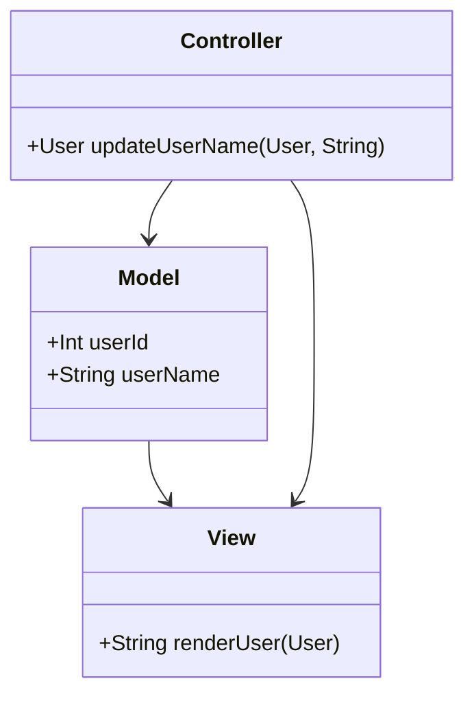
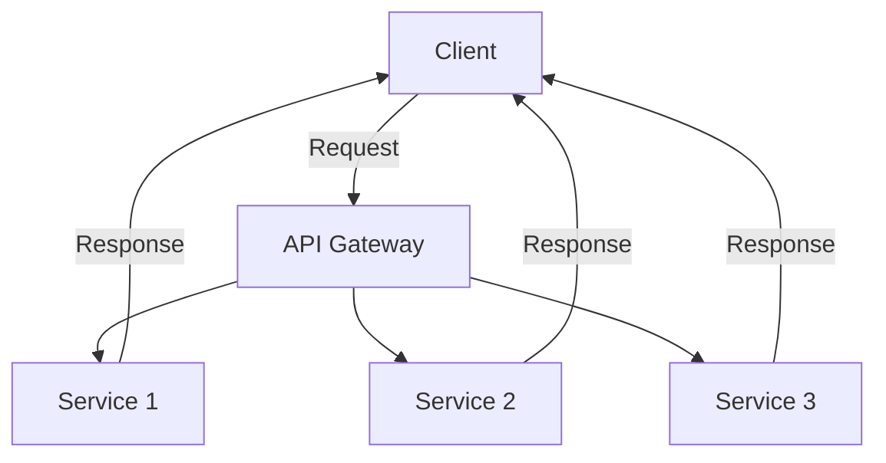
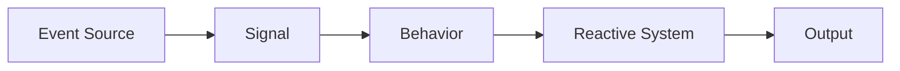

## 18.3 Case Study: Designing a Complex Application Architecture

In this case study, we will explore the design of a complex, scalable web application architecture using Haskell. We will delve into the application of three key design patterns: Model-View-Controller (MVC), Microservices, and Functional Reactive Programming (FRP). These patterns are chosen for their ability to address various architectural concerns such as separation of concerns, scalability, and responsiveness.

### Scenario: Developing a Scalable Web Application

Imagine we are tasked with developing a scalable web application that serves a large number of users with varying needs. The application must be responsive, maintainable, and capable of evolving over time to incorporate new features. To achieve these goals, we will leverage the strengths of Haskell and apply the MVC, Microservices, and FRP patterns.

### Patterns Applied

#### Model-View-Controller (MVC)

**Intent:** The MVC pattern separates an application into three interconnected components: Model, View, and Controller. This separation helps manage complex applications by dividing the responsibilities.

**Key Participants:**
- **Model:** Represents the data and business logic.
- **View:** Displays the data to the user.
- **Controller:** Handles user input and updates the Model.

**Applicability:** Use MVC when you need to separate concerns in a complex application to improve maintainability and scalability.

**Haskell Unique Features:** Haskell's strong type system and immutability make it well-suited for implementing the MVC pattern, ensuring that data flows are predictable and side effects are minimized.

#### Microservices

**Intent:** The Microservices pattern involves breaking down an application into smaller, independent services that communicate over a network. Each service is responsible for a specific business capability.

**Key Participants:**
- **Service:** A standalone unit that performs a specific function.
- **API Gateway:** Manages communication between clients and services.
- **Service Registry:** Keeps track of available services.

**Applicability:** Use Microservices when you need to build scalable and flexible systems that can be developed and deployed independently.

**Haskell Unique Features:** Haskell's concurrency model and lightweight threads (green threads) make it ideal for building efficient microservices that can handle high loads.

#### Functional Reactive Programming (FRP)

**Intent:** FRP is a paradigm for programming reactive systems. It allows developers to express dynamic data flows and automatically propagate changes through the system.

**Key Participants:**
- **Signal:** Represents a time-varying value.
- **Event:** Represents a discrete occurrence.
- **Behavior:** Represents a value that changes over time.

**Applicability:** Use FRP when you need to build responsive systems that react to changes in real-time.

**Haskell Unique Features:** Haskell's lazy evaluation and strong type system provide a solid foundation for implementing FRP, allowing for efficient and safe reactive programming.

### Discussion: How Different Patterns Address Architectural Concerns

#### Separation of Concerns with MVC

The MVC pattern helps us separate concerns by clearly defining the roles of the Model, View, and Controller. This separation allows us to:
- **Isolate Business Logic:** The Model encapsulates the business logic, making it easier to test and maintain.
- **Decouple Presentation:** The View is responsible for presenting data, allowing us to change the UI without affecting the underlying logic.
- **Simplify User Interaction:** The Controller manages user input, providing a clear entry point for handling user actions.

#### Scalability with Microservices

Microservices enable scalability by allowing us to:
- **Scale Independently:** Each service can be scaled independently based on its load.
- **Deploy Continuously:** Services can be deployed independently, reducing downtime and speeding up the release cycle.
- **Enhance Fault Isolation:** Failures in one service do not affect others, improving the overall resilience of the system.

#### Responsiveness with Functional Reactive Programming

FRP enhances responsiveness by:
- **Managing State Changes:** FRP allows us to express state changes declaratively, making it easier to reason about the system's behavior.
- **Propagating Changes Automatically:** Changes in one part of the system automatically propagate to other parts, reducing the need for manual updates.
- **Improving User Experience:** By reacting to changes in real-time, FRP provides a smooth and responsive user experience.

### Code Examples

Let's explore how these patterns can be implemented in Haskell with code examples.

#### MVC in Haskell

```haskell
-- Model
data User = User { userId :: Int, userName :: String }

-- View
renderUser :: User -> String
renderUser user = "User: " ++ userName user

-- Controller
updateUserName :: User -> String -> User
updateUserName user newName = user { userName = newName }

-- Example usage
main :: IO ()
main = do
    let user = User 1 "Alice"
    putStrLn $ renderUser user
    let updatedUser = updateUserName user "Bob"
    putStrLn $ renderUser updatedUser
```

In this example, we define a simple MVC structure for managing users. The `User` data type represents the Model, `renderUser` is the View, and `updateUserName` acts as the Controller.

#### Microservices in Haskell

```haskell
{-# LANGUAGE OverloadedStrings #-}

import Network.Wai
import Network.Wai.Handler.Warp
import Network.HTTP.Types

-- A simple microservice
app :: Application
app request respond = do
    let response = responseLBS
            status200
            [("Content-Type", "text/plain")]
            "Hello, Microservices!"
    respond response

main :: IO ()
main = run 8080 app
```

This example demonstrates a simple microservice using the `wai` and `warp` libraries. The service listens on port 8080 and responds with a plain text message.

#### Functional Reactive Programming in Haskell

```haskell
import Reactive.Banana
import Reactive.Banana.Frameworks

-- FRP example: Counter that increments on button click
main :: IO ()
main = do
    (addHandler, fire) <- newAddHandler
    network <- compile $ do
        eClick <- fromAddHandler addHandler
        let bCounter = accumB 0 (const (+1) <$> eClick)
        reactimate $ fmap print bCounter
    actuate network
    fire ()  -- Simulate a button click
    fire ()  -- Simulate another button click
```

In this FRP example, we create a simple counter that increments each time a button is clicked. The `reactive-banana` library is used to manage the event and behavior.

### Visualizing the Architecture

To better understand how these patterns work together, let's visualize the architecture using Mermaid.js diagrams.

#### MVC Architecture



**Caption:** The MVC architecture separates concerns by defining distinct roles for the Model, View, and Controller.

#### Microservices Architecture



**Caption:** The Microservices architecture allows for independent scaling and deployment of services.

#### Functional Reactive Programming Architecture



**Caption:** The FRP architecture manages dynamic data flows and automatically propagates changes through the system.

### Try It Yourself

Experiment with the code examples provided. Try modifying the MVC example to add more fields to the `User` data type or create additional microservices that communicate with each other. For the FRP example, explore different ways to handle events and behaviors.

### Knowledge Check

- How does the MVC pattern help in separating concerns?
- What are the benefits of using Microservices for scalability?
- How does FRP improve the responsiveness of an application?

### Embrace the Journey

Remember, designing a complex application architecture is an iterative process. As you gain experience, you'll develop a deeper understanding of how to apply these patterns effectively. Keep experimenting, stay curious, and enjoy the journey!

### References and Links

- [Haskell Documentation](https://www.haskell.org/documentation/)
- [Reactive Banana Library](https://hackage.haskell.org/package/reactive-banana)
- [WAI and Warp Libraries](https://hackage.haskell.org/package/warp)

## Quiz: Case Study: Designing a Complex Application Architecture



### How does the MVC pattern help in application design?

- [x] It separates concerns into Model, View, and Controller.
- [ ] It combines all logic into a single component.
- [ ] It focuses solely on user interface design.
- [ ] It eliminates the need for a database.

> **Explanation:** The MVC pattern separates concerns by dividing the application into Model, View, and Controller components, each with distinct responsibilities.

### What is a key benefit of using Microservices?

- [x] Independent scaling of services.
- [ ] Centralized deployment of all components.
- [ ] Single point of failure.
- [ ] Monolithic architecture.

> **Explanation:** Microservices allow for independent scaling of services, enabling better resource management and flexibility.

### How does FRP improve application responsiveness?

- [x] By automatically propagating changes through the system.
- [ ] By requiring manual updates for each change.
- [ ] By focusing on static data flows.
- [ ] By eliminating user interaction.

> **Explanation:** FRP improves responsiveness by automatically propagating changes, reducing the need for manual updates.

### What is the role of the Controller in MVC?

- [x] Handles user input and updates the Model.
- [ ] Displays data to the user.
- [ ] Represents the data and business logic.
- [ ] Manages database connections.

> **Explanation:** The Controller handles user input and updates the Model, acting as an intermediary between the View and the Model.

### Which pattern is best suited for building reactive systems?

- [x] Functional Reactive Programming (FRP).
- [ ] Microservices.
- [ ] Model-View-Controller (MVC).
- [ ] Monolithic architecture.

> **Explanation:** FRP is designed for building reactive systems that respond to changes in real-time.

### What is a Signal in FRP?

- [x] A time-varying value.
- [ ] A static data point.
- [ ] A user interface component.
- [ ] A database query.

> **Explanation:** In FRP, a Signal represents a time-varying value that changes over time.

### How do Microservices enhance fault isolation?

- [x] Failures in one service do not affect others.
- [ ] By centralizing all services.
- [ ] By sharing state across services.
- [ ] By using a single database for all services.

> **Explanation:** Microservices enhance fault isolation by ensuring that failures in one service do not impact others, improving system resilience.

### What is the purpose of an API Gateway in Microservices?

- [x] Manages communication between clients and services.
- [ ] Stores data for all services.
- [ ] Handles user authentication.
- [ ] Provides a user interface.

> **Explanation:** An API Gateway manages communication between clients and services, acting as a single entry point for requests.

### How does Haskell's type system benefit MVC implementation?

- [x] Ensures predictable data flows and minimizes side effects.
- [ ] Allows for dynamic typing.
- [ ] Focuses on user interface design.
- [ ] Eliminates the need for a database.

> **Explanation:** Haskell's strong type system ensures predictable data flows and minimizes side effects, making it well-suited for MVC implementation.

### True or False: FRP requires manual updates for each state change.

- [ ] True
- [x] False

> **Explanation:** False. FRP automatically propagates changes through the system, reducing the need for manual updates.


