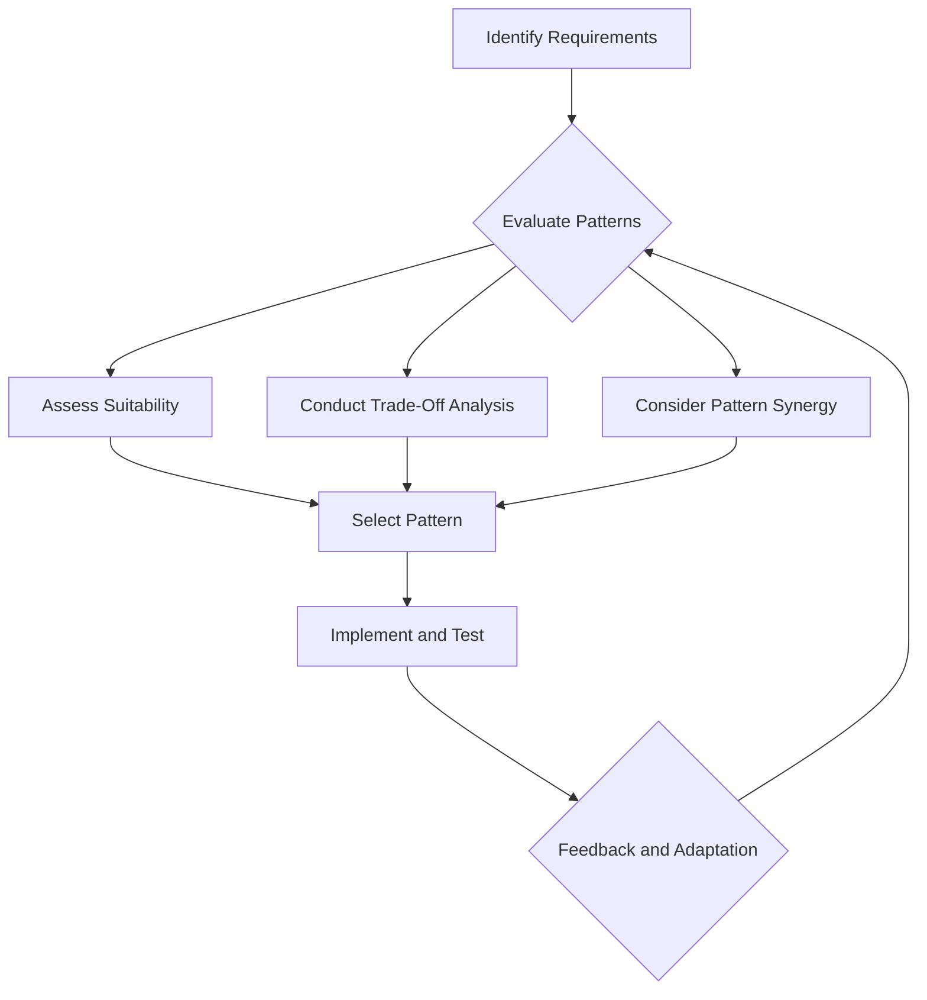

## 18.4 Trade-Offs and Design Considerations in Haskell Design Patterns

In the realm of software engineering, especially when dealing with functional programming languages like Haskell, the application of design patterns is not just about following a set of rules. It involves making informed decisions that balance various factors such as performance, maintainability, and scalability. This section delves into the trade-offs and design considerations that expert software engineers and architects must navigate when applying multiple design patterns in Haskell.

### Balancing Factors

#### Performance

Performance is a critical factor in software design. In Haskell, performance considerations often revolve around lazy evaluation, memory usage, and computational efficiency. When choosing design patterns, consider how they impact these aspects:

- **Lazy Evaluation**: Haskell's lazy evaluation can lead to performance gains by avoiding unnecessary computations. However, it can also introduce space leaks if not managed properly. Design patterns that leverage lazy evaluation should be scrutinized for potential memory overhead.
  
- **Memory Usage**: Patterns that involve complex data structures or recursion can lead to increased memory consumption. It's essential to evaluate whether a pattern introduces excessive memory usage and if optimizations like tail recursion or strict evaluation are necessary.

- **Computational Efficiency**: Some patterns may simplify code but at the cost of computational efficiency. For instance, using higher-order functions can lead to elegant solutions but might introduce overhead due to function calls.

#### Maintainability

Maintainability is about how easily a codebase can be understood, modified, and extended. Design patterns can enhance maintainability by providing clear, reusable solutions, but they can also complicate the code if overused or misapplied:

- **Code Clarity**: Patterns should improve code readability. If a pattern makes the codebase more complex or introduces unnecessary abstractions, it might hinder maintainability.

- **Reusability**: Patterns that promote code reuse can significantly enhance maintainability. Consider whether a pattern allows for modular, reusable components.

- **Complexity**: Avoid patterns that introduce unnecessary complexity. The goal is to simplify problem-solving, not to complicate it with intricate designs.

#### Scalability

Scalability refers to the ability of a system to handle growth, whether in terms of data volume, user load, or feature set. Design patterns can influence scalability in several ways:

- **Concurrency and Parallelism**: Patterns that facilitate concurrent or parallel processing can enhance scalability. Haskell's support for software transactional memory (STM) and the `async` library can be leveraged in such patterns.

- **Modularity**: Patterns that promote modularity can make it easier to scale a system by adding or modifying components without affecting the entire system.

- **Resource Management**: Consider patterns that efficiently manage resources, such as memory and CPU, to ensure the system can scale without degradation in performance.

### Decision Making

When deciding which design patterns to apply, it's crucial to evaluate the pros and cons of each pattern in the context of the specific project requirements. Here are some guidelines to aid in decision-making:

#### Evaluating Pros and Cons

- **Suitability**: Assess whether a pattern is suitable for the problem at hand. Not all patterns are applicable to every situation, and forcing a pattern can lead to suboptimal solutions.

- **Trade-Off Analysis**: Conduct a trade-off analysis to weigh the benefits and drawbacks of each pattern. Consider factors such as performance impact, complexity, and alignment with project goals.

- **Pattern Synergy**: Some patterns work well together, while others may conflict. Evaluate how multiple patterns can be combined to achieve the desired outcome without introducing conflicts.

#### Guidelines for Aligning Patterns with Project Requirements

- **Understand the Problem Domain**: A deep understanding of the problem domain is essential to select the most appropriate patterns. This involves analyzing the requirements, constraints, and expected outcomes.

- **Prioritize Requirements**: Identify and prioritize the key requirements of the project. Whether it's performance, maintainability, or scalability, knowing what matters most will guide pattern selection.

- **Iterative Approach**: Adopt an iterative approach to pattern application. Start with a simple design and gradually introduce patterns as the system evolves and requirements become clearer.

- **Feedback and Adaptation**: Continuously gather feedback from stakeholders and adapt the design as needed. Patterns should be flexible enough to accommodate changes in requirements or technology.

### Code Examples

Let's explore some code examples to illustrate these concepts. We'll look at how different patterns can be applied in Haskell, considering the trade-offs and design considerations.

#### Singleton Pattern Using Modules and Constants

The Singleton pattern ensures a class has only one instance and provides a global point of access to it. In Haskell, this can be achieved using modules and constants.

```haskell
-- Singleton.hs
module Singleton (getInstance) where

data Singleton = Singleton { value :: Int }

instanceSingleton :: Singleton
instanceSingleton = Singleton { value = 42 }

getInstance :: Singleton
getInstance = instanceSingleton
```

**Considerations**:
- **Performance**: The Singleton pattern in Haskell is efficient as it leverages Haskell's module system to ensure a single instance.
- **Maintainability**: The pattern is straightforward and easy to maintain.
- **Scalability**: While suitable for single-instance scenarios, it may not be ideal for systems requiring multiple instances or distributed environments.

#### Factory Pattern with Smart Constructors

The Factory pattern provides an interface for creating objects, allowing subclasses to alter the type of objects that will be created. In Haskell, smart constructors can be used to implement this pattern.

```haskell
-- Shape.hs
module Shape (Shape, createCircle, createSquare) where

data Shape = Circle { radius :: Double }
           | Square { side :: Double }

createCircle :: Double -> Maybe Shape
createCircle r
  | r > 0     = Just (Circle r)
  | otherwise = Nothing

createSquare :: Double -> Maybe Shape
createSquare s
  | s > 0     = Just (Square s)
  | otherwise = Nothing
```

**Considerations**:
- **Performance**: Smart constructors add a layer of validation, which may introduce slight overhead but ensures data integrity.
- **Maintainability**: The pattern enhances maintainability by encapsulating object creation logic.
- **Scalability**: The pattern is scalable as new shapes can be added without modifying existing code.

#### Composite Pattern with Recursive Data Structures

The Composite pattern allows you to compose objects into tree structures to represent part-whole hierarchies. In Haskell, recursive data structures are ideal for implementing this pattern.

```haskell
-- FileSystem.hs
module FileSystem (FileSystem(..), totalSize) where

data FileSystem = File { name :: String, size :: Int }
                | Directory { name :: String, contents :: [FileSystem] }

totalSize :: FileSystem -> Int
totalSize (File _ s) = s
totalSize (Directory _ fs) = sum (map totalSize fs)
```

**Considerations**:
- **Performance**: Recursive data structures can lead to stack overflow if not managed properly. Tail recursion or lazy evaluation can mitigate this.
- **Maintainability**: The pattern is maintainable as it mirrors real-world hierarchies.
- **Scalability**: The pattern is scalable, allowing for complex structures without significant changes to the codebase.

### Visualizing Trade-Offs

To better understand the trade-offs involved in applying design patterns, let's visualize the decision-making process using a flowchart.



**Diagram Description**: This flowchart illustrates the iterative process of selecting and applying design patterns. It begins with identifying requirements, evaluating patterns, and conducting trade-off analysis. The process is iterative, with feedback and adaptation leading to continuous improvement.

### Knowledge Check

Before we conclude, let's pose some questions to reinforce the concepts covered in this section:

- What are the key factors to consider when balancing design patterns in Haskell?
- How can lazy evaluation impact the performance of a Haskell application?
- Why is maintainability an important consideration when applying design patterns?
- How does the Composite pattern leverage recursive data structures in Haskell?
- What are the benefits of using smart constructors in the Factory pattern?

### Embrace the Journey

Remember, mastering design patterns in Haskell is a journey. As you progress, you'll encounter new challenges and opportunities to apply these patterns in innovative ways. Keep experimenting, stay curious, and enjoy the journey!

### Quiz: Trade-Offs and Design Considerations



### What is a key factor to consider when balancing design patterns in Haskell?

- [x] Performance
- [ ] Color scheme
- [ ] User interface
- [ ] Marketing strategy

> **Explanation:** Performance is a crucial factor when balancing design patterns, as it affects the efficiency and responsiveness of the application.

### How can lazy evaluation impact the performance of a Haskell application?

- [x] It can lead to space leaks if not managed properly.
- [ ] It always improves performance.
- [ ] It has no impact on performance.
- [ ] It makes the application slower.

> **Explanation:** Lazy evaluation can lead to space leaks if not managed properly, as it defers computations, potentially leading to increased memory usage.

### Why is maintainability an important consideration when applying design patterns?

- [x] It ensures the codebase can be easily understood and modified.
- [ ] It makes the codebase more colorful.
- [ ] It reduces the need for documentation.
- [ ] It increases the complexity of the codebase.

> **Explanation:** Maintainability is important because it ensures the codebase can be easily understood, modified, and extended, which is crucial for long-term project success.

### How does the Composite pattern leverage recursive data structures in Haskell?

- [x] By representing part-whole hierarchies using recursive data types.
- [ ] By using loops to iterate over data.
- [ ] By avoiding recursion altogether.
- [ ] By using global variables.

> **Explanation:** The Composite pattern leverages recursive data structures to represent part-whole hierarchies, allowing for flexible and scalable designs.

### What are the benefits of using smart constructors in the Factory pattern?

- [x] They encapsulate object creation logic and ensure data integrity.
- [ ] They make the code run faster.
- [ ] They simplify the user interface.
- [ ] They reduce the need for testing.

> **Explanation:** Smart constructors encapsulate object creation logic and ensure data integrity by validating inputs, enhancing maintainability and reliability.

### What is a potential drawback of using the Singleton pattern in distributed environments?

- [x] It may not be ideal for systems requiring multiple instances.
- [ ] It always improves performance.
- [ ] It simplifies distributed systems.
- [ ] It enhances security.

> **Explanation:** The Singleton pattern may not be ideal for distributed environments where multiple instances are required, as it enforces a single instance.

### Why is it important to conduct a trade-off analysis when selecting design patterns?

- [x] To weigh the benefits and drawbacks of each pattern.
- [ ] To make the code more colorful.
- [ ] To reduce the number of lines of code.
- [ ] To increase the complexity of the codebase.

> **Explanation:** Conducting a trade-off analysis helps weigh the benefits and drawbacks of each pattern, ensuring the most suitable pattern is selected for the problem at hand.

### How can modularity in design patterns enhance scalability?

- [x] By allowing components to be added or modified without affecting the entire system.
- [ ] By reducing the number of lines of code.
- [ ] By making the code more colorful.
- [ ] By increasing the complexity of the codebase.

> **Explanation:** Modularity allows components to be added or modified without affecting the entire system, enhancing scalability by facilitating growth and change.

### What is the role of feedback and adaptation in the pattern selection process?

- [x] To continuously improve the design based on stakeholder input.
- [ ] To make the code more colorful.
- [ ] To reduce the number of lines of code.
- [ ] To increase the complexity of the codebase.

> **Explanation:** Feedback and adaptation allow for continuous improvement of the design based on stakeholder input, ensuring the design remains aligned with project goals.

### True or False: The Factory pattern in Haskell can be implemented using smart constructors.

- [x] True
- [ ] False

> **Explanation:** True. The Factory pattern in Haskell can be implemented using smart constructors, which encapsulate object creation logic and ensure data integrity.



By understanding and applying these trade-offs and design considerations, you can make informed decisions that lead to robust, efficient, and maintainable Haskell applications. Keep exploring and refining your approach to design patterns, and you'll continue to grow as an expert software engineer and architect.
