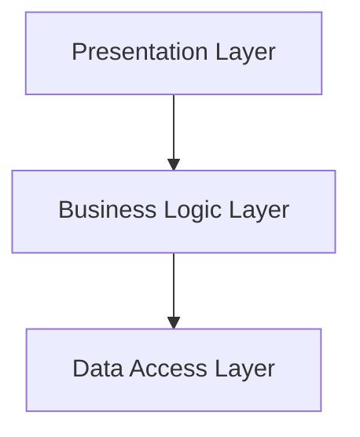

## 18.5 Scaling Patterns for Large Systems

Scaling software systems is a critical challenge faced by expert software engineers and architects. As systems grow, managing complexity becomes increasingly difficult. In this section, we will explore scaling patterns in Haskell that address these challenges through modularization, code reuse, and abstraction. We will delve into layered architecture and modular monoliths, providing insights and practical examples to help you build scalable, maintainable systems.

### Challenges in Scaling Large Systems

Scaling large systems involves several challenges, including:

- **Managing Complexity**: As codebases grow, they become harder to understand and maintain. Complexity can lead to increased development time, bugs, and technical debt.
- **Performance**: Ensuring that the system performs efficiently under increased load is crucial.
- **Maintainability**: Code should be easy to modify and extend without introducing errors.
- **Scalability**: The system should be able to handle growth in users, data, and transactions.

### Strategies for Scaling

To address these challenges, we can employ several strategies:

- **Modularization**: Breaking down the system into smaller, manageable modules.
- **Code Reuse**: Leveraging existing code to avoid duplication and reduce development time.
- **Abstraction**: Hiding complex details behind simple interfaces to reduce cognitive load.

### Patterns for Scaling

Let's explore some design patterns that facilitate scaling in Haskell:

#### Layered Architecture

**Intent**: Organize code into layers, each with a specific responsibility, to separate concerns and improve maintainability.

**Key Participants**:
- **Presentation Layer**: Handles user interactions.
- **Business Logic Layer**: Contains the core functionality and rules.
- **Data Access Layer**: Manages data storage and retrieval.

**Applicability**: Use layered architecture when you need to separate concerns and improve code organization.

**Sample Code Snippet**:

```haskell
-- Presentation Layer
module Presentation where

import BusinessLogic (processData)

handleRequest :: String -> IO ()
handleRequest input = do
    let result = processData input
    putStrLn ("Processed result: " ++ result)

-- Business Logic Layer
module BusinessLogic where

import DataAccess (fetchData)

processData :: String -> String
processData input = 
    let data = fetchData input
    in "Processed " ++ data

-- Data Access Layer
module DataAccess where

fetchData :: String -> String
fetchData key = "Data for " ++ key
```

**Design Considerations**: Ensure that each layer has a clear responsibility and interacts with adjacent layers through well-defined interfaces.

**Haskell Unique Features**: Haskell's strong type system and module system facilitate the creation of clear interfaces between layers.

**Differences and Similarities**: Layered architecture is similar to other architectural patterns like MVC but focuses more on separating technical concerns.

#### Modular Monoliths

**Intent**: Build a monolithic application with a modular structure to improve maintainability and scalability.

**Key Participants**:
- **Modules**: Independent units of functionality.
- **Interfaces**: Define how modules interact with each other.

**Applicability**: Use modular monoliths when you want the simplicity of a monolith with the flexibility of a modular system.

**Sample Code Snippet**:

```haskell
-- Module A
module ModuleA where

import qualified ModuleB

performTaskA :: IO ()
performTaskA = do
    putStrLn "Task A"
    ModuleB.performTaskB

-- Module B
module ModuleB where

performTaskB :: IO ()
performTaskB = putStrLn "Task B"
```

**Design Considerations**: Ensure that modules are loosely coupled and can be developed and tested independently.

**Haskell Unique Features**: Haskell's module system and type classes support the creation of modular monoliths by allowing for flexible and reusable code.

**Differences and Similarities**: Modular monoliths differ from microservices in that they are deployed as a single unit but share the modularity benefits.

### Visualizing Scaling Patterns

To better understand how these patterns work together, let's visualize a layered architecture using a Mermaid.js diagram:



**Diagram Description**: This diagram illustrates the flow of data through the layers of a system. The presentation layer interacts with the business logic layer, which in turn interacts with the data access layer.

### Code Examples and Exercises

Let's explore some code examples to solidify our understanding of scaling patterns:

#### Example 1: Implementing a Layered Architecture

In this example, we'll build a simple application using a layered architecture. We'll create a presentation layer to handle user input, a business logic layer to process data, and a data access layer to fetch data.

```haskell
-- Main.hs
module Main where

import Presentation (handleRequest)

main :: IO ()
main = do
    putStrLn "Enter a key:"
    key <- getLine
    handleRequest key
```

**Try It Yourself**: Modify the `fetchData` function in the data access layer to simulate fetching data from a database. Experiment with adding new layers or modifying existing ones.

#### Example 2: Building a Modular Monolith

In this example, we'll create a modular monolith with two modules, `ModuleA` and `ModuleB`. Each module will perform a simple task and interact with each other.

```haskell
-- Main.hs
module Main where

import ModuleA (performTaskA)

main :: IO ()
main = performTaskA
```

**Try It Yourself**: Add a new module, `ModuleC`, and modify `ModuleA` to interact with it. Experiment with changing the order of tasks or adding new functionality.

### References and Further Reading

- [Layered Architecture](https://martinfowler.com/eaaCatalog/layeredArchitecture.html) by Martin Fowler
- [Modular Monoliths](https://www.thoughtworks.com/insights/blog/modular-monoliths) by ThoughtWorks
- [Haskell Modules](https://www.haskell.org/onlinereport/modules.html) - Haskell 2010 Language Report

### Knowledge Check

To reinforce your understanding, consider the following questions:

1. What are the main challenges in scaling large systems?
2. How does modularization help in managing complexity?
3. What are the key participants in a layered architecture?
4. How do modular monoliths differ from microservices?
5. What are the benefits of using Haskell's module system in scaling patterns?

### Embrace the Journey

Remember, scaling large systems is a journey, not a destination. As you continue to build and scale your applications, keep experimenting with different patterns and strategies. Stay curious, and enjoy the process of creating scalable, maintainable systems.

### Quiz: Scaling Patterns for Large Systems



### What is a primary challenge in scaling large systems?

- [x] Managing complexity
- [ ] Reducing code size
- [ ] Increasing code duplication
- [ ] Decreasing performance

> **Explanation:** Managing complexity is a primary challenge in scaling large systems, as it affects maintainability and development speed.

### Which strategy helps in reducing cognitive load in large systems?

- [x] Abstraction
- [ ] Duplication
- [ ] Hardcoding
- [ ] Ignoring interfaces

> **Explanation:** Abstraction helps in reducing cognitive load by hiding complex details behind simple interfaces.

### What is a key participant in a layered architecture?

- [x] Business Logic Layer
- [ ] Singleton Layer
- [ ] Proxy Layer
- [ ] Adapter Layer

> **Explanation:** The Business Logic Layer is a key participant in a layered architecture, handling core functionality and rules.

### How do modular monoliths differ from microservices?

- [x] Deployed as a single unit
- [ ] Require separate databases
- [ ] Always use REST APIs
- [ ] Must be cloud-based

> **Explanation:** Modular monoliths are deployed as a single unit but have a modular structure, unlike microservices which are separate units.

### What is a benefit of using Haskell's module system?

- [x] Supports modularization
- [ ] Increases code duplication
- [ ] Requires dynamic typing
- [ ] Forces global variables

> **Explanation:** Haskell's module system supports modularization, allowing for flexible and reusable code.

### Which layer handles user interactions in a layered architecture?

- [x] Presentation Layer
- [ ] Data Access Layer
- [ ] Business Logic Layer
- [ ] Network Layer

> **Explanation:** The Presentation Layer handles user interactions in a layered architecture.

### What is a common characteristic of modular monoliths?

- [x] Loosely coupled modules
- [ ] Strongly coupled modules
- [ ] Single-threaded execution
- [ ] Lack of interfaces

> **Explanation:** Modular monoliths are characterized by loosely coupled modules that can be developed and tested independently.

### What is the role of the Data Access Layer?

- [x] Manages data storage and retrieval
- [ ] Handles user input
- [ ] Processes business rules
- [ ] Manages network connections

> **Explanation:** The Data Access Layer manages data storage and retrieval in a layered architecture.

### What is a benefit of code reuse?

- [x] Reduces development time
- [ ] Increases code complexity
- [ ] Requires more testing
- [ ] Decreases performance

> **Explanation:** Code reuse reduces development time by leveraging existing code, avoiding duplication.

### True or False: Modular monoliths cannot be scaled.

- [ ] True
- [x] False

> **Explanation:** False. Modular monoliths can be scaled by leveraging their modular structure to improve maintainability and scalability.



By understanding and applying these scaling patterns, you can build robust, scalable systems in Haskell that are easier to maintain and extend. Keep exploring and experimenting with different patterns to find the best fit for your projects.
