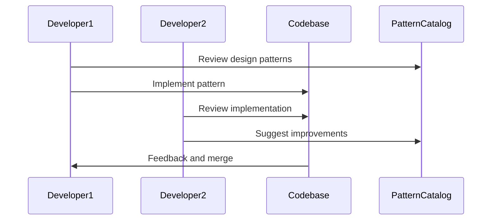

## 18.6 Collaborative Development and Pattern Integration

In the realm of software engineering, particularly when working with Haskell, the integration of design patterns within a collaborative development environment is crucial for building robust, scalable, and maintainable systems. This section delves into the intricacies of collaborative development, emphasizing the importance of team dynamics, best practices, and the seamless integration of design patterns.

### Team Dynamics

Effective collaboration within a software development team is the cornerstone of successful projects. In Haskell, where functional programming paradigms and advanced type systems are prevalent, fostering a collaborative environment requires a nuanced understanding of both technical and interpersonal dynamics.

#### Ensuring Consistent Application of Patterns

1. **Shared Understanding of Patterns**: Ensure that all team members have a common understanding of the design patterns being used. Conduct workshops or study sessions to discuss the patterns' intent, applicability, and implementation in Haskell.

2. **Pattern Catalogs**: Maintain a catalog of design patterns that the team frequently uses. This catalog should include examples, best practices, and guidelines for when and how to apply each pattern.

3. **Code Reviews and Pair Programming**: Encourage regular code reviews and pair programming sessions. These practices not only help in catching errors early but also promote knowledge sharing and consistent application of patterns across the codebase.

4. **Design Pattern Champions**: Assign team members as champions for specific design patterns. These individuals can act as go-to resources for questions and guidance on implementing their respective patterns.

5. **Continuous Learning and Adaptation**: Foster a culture of continuous learning where team members are encouraged to explore new patterns and techniques. Adapt the pattern catalog as the team learns and grows.

### Best Practices

Establishing best practices is essential for ensuring that design patterns are integrated effectively within a collaborative development environment. Here are some key practices to consider:

#### Establishing Coding Standards

1. **Consistent Style Guides**: Develop and enforce a consistent style guide for Haskell code. This includes naming conventions, indentation, and formatting rules. Tools like HLint can help automate style checks.

2. **Type Safety and Explicitness**: Emphasize the importance of type safety and explicitness in Haskell. Encourage the use of strong typing and type annotations to prevent errors and improve code readability.

3. **Modular Design**: Promote modular design by breaking down complex systems into smaller, manageable components. Use Haskell's module system to encapsulate functionality and promote reusability.

4. **Documentation and Comments**: Encourage thorough documentation and commenting of code. Use tools like Haddock to generate API documentation from annotated source code.

5. **Version Control Practices**: Implement robust version control practices using systems like Git. Encourage frequent commits with meaningful messages and use branching strategies to manage feature development and releases.

#### Using Design Documents

1. **Design Specifications**: Create detailed design specifications for each project. These documents should outline the architecture, design patterns, and key decisions made during the design phase.

2. **Pattern Integration Plans**: Develop integration plans that detail how design patterns will be applied within the project. These plans should include diagrams and examples to illustrate the intended design.

3. **Review and Approval Processes**: Establish review and approval processes for design documents. Involve stakeholders and team members in these reviews to ensure alignment and buy-in.

4. **Living Documents**: Treat design documents as living artifacts that evolve with the project. Regularly update these documents to reflect changes in design and implementation.

5. **Knowledge Sharing Sessions**: Conduct regular knowledge sharing sessions where team members can present and discuss design documents. This promotes transparency and collective ownership of the design.

### Integrating Design Patterns in Haskell

Integrating design patterns in Haskell requires a deep understanding of both the patterns themselves and the unique features of the Haskell language. Here, we explore some common patterns and how they can be effectively integrated into Haskell projects.

#### Singleton Pattern Using Modules and Constants

The Singleton pattern ensures that a class has only one instance and provides a global point of access to it. In Haskell, this can be achieved using modules and constants.

```haskell
-- Singleton.hs
module Singleton (getInstance) where

data Singleton = Singleton { value :: Int }

instanceSingleton :: Singleton
instanceSingleton = Singleton { value = 42 }

getInstance :: Singleton
getInstance = instanceSingleton
```

In this example, the `Singleton` module encapsulates the singleton instance, providing a global point of access through the `getInstance` function.

#### Factory Patterns with Smart Constructors and Phantom Types

Factory patterns are used to create objects without specifying the exact class of object that will be created. In Haskell, smart constructors and phantom types can be used to implement factory patterns.

```haskell
{-# LANGUAGE GADTs #-}

data Shape where
  Circle :: Double -> Shape
  Rectangle :: Double -> Double -> Shape

data ShapeType = CircleType | RectangleType

createShape :: ShapeType -> Double -> Double -> Shape
createShape CircleType radius _ = Circle radius
createShape RectangleType width height = Rectangle width height
```

Here, the `createShape` function acts as a factory, creating different shapes based on the `ShapeType` provided.

#### Builder Pattern with Function Chaining and Record Syntax

The Builder pattern is used to construct complex objects step by step. In Haskell, this can be achieved using function chaining and record syntax.

```haskell
data Car = Car
  { make :: String
  , model :: String
  , year :: Int
  }

defaultCar :: Car
defaultCar = Car { make = "", model = "", year = 0 }

setMake :: String -> Car -> Car
setMake m car = car { make = m }

setModel :: String -> Car -> Car
setModel m car = car { model = m }

setYear :: Int -> Car -> Car
setYear y car = car { year = y }

buildCar :: Car
buildCar = setMake "Toyota" . setModel "Corolla" . setYear 2020 $ defaultCar
```

In this example, the `buildCar` function uses function chaining to construct a `Car` object step by step.

### Visualizing Collaborative Development and Pattern Integration

To better understand the flow of collaborative development and pattern integration, let's visualize the process using a sequence diagram.



**Diagram Description**: This sequence diagram illustrates the collaborative process of integrating design patterns into a codebase. Developer1 reviews the pattern catalog and implements a pattern in the codebase. Developer2 reviews the implementation, suggests improvements, and the codebase provides feedback for merging.

### Knowledge Check

To reinforce your understanding of collaborative development and pattern integration, consider the following questions:

1. What are the key benefits of maintaining a pattern catalog within a development team?
2. How can pair programming contribute to the consistent application of design patterns?
3. Why is it important to treat design documents as living artifacts?
4. How can smart constructors and phantom types be used to implement factory patterns in Haskell?
5. What role do design pattern champions play in a development team?

### Try It Yourself

Experiment with the code examples provided in this section. Try modifying the `Singleton` pattern to include additional functionality, or extend the `Builder` pattern to include more attributes for the `Car` object. Consider how these patterns can be adapted to fit your specific project needs.

### Embrace the Journey

Remember, collaborative development and pattern integration are ongoing processes. As you continue to work with Haskell and design patterns, you'll discover new techniques and approaches that enhance your team's productivity and the quality of your code. Stay curious, keep experimenting, and enjoy the journey!

## Quiz: Collaborative Development and Pattern Integration



### What is a key benefit of maintaining a pattern catalog within a development team?

- [x] It provides a shared reference for design patterns.
- [ ] It eliminates the need for code reviews.
- [ ] It allows for the automatic generation of code.
- [ ] It reduces the need for documentation.

> **Explanation:** A pattern catalog provides a shared reference for design patterns, ensuring consistency and understanding across the team.

### How can pair programming contribute to the consistent application of design patterns?

- [x] By promoting knowledge sharing and collaboration.
- [ ] By reducing the need for documentation.
- [ ] By eliminating the need for design documents.
- [ ] By automating code reviews.

> **Explanation:** Pair programming promotes knowledge sharing and collaboration, helping team members apply design patterns consistently.

### Why is it important to treat design documents as living artifacts?

- [x] To ensure they evolve with the project.
- [ ] To reduce the need for code reviews.
- [ ] To eliminate the need for design patterns.
- [ ] To automate the development process.

> **Explanation:** Treating design documents as living artifacts ensures they evolve with the project, reflecting changes in design and implementation.

### How can smart constructors and phantom types be used to implement factory patterns in Haskell?

- [x] By creating objects without specifying the exact class.
- [ ] By enforcing strict type checking.
- [ ] By automating code generation.
- [ ] By eliminating the need for constructors.

> **Explanation:** Smart constructors and phantom types allow for the creation of objects without specifying the exact class, implementing factory patterns.

### What role do design pattern champions play in a development team?

- [x] They act as go-to resources for specific patterns.
- [ ] They eliminate the need for design documents.
- [ ] They automate the application of patterns.
- [ ] They reduce the need for code reviews.

> **Explanation:** Design pattern champions act as go-to resources for specific patterns, providing guidance and expertise to the team.

### What is the purpose of a sequence diagram in collaborative development?

- [x] To visualize the flow of processes and interactions.
- [ ] To automate code generation.
- [ ] To eliminate the need for documentation.
- [ ] To enforce coding standards.

> **Explanation:** A sequence diagram visualizes the flow of processes and interactions, aiding in understanding and communication.

### How does modular design benefit Haskell projects?

- [x] By promoting reusability and encapsulation.
- [ ] By eliminating the need for type safety.
- [ ] By automating code reviews.
- [ ] By reducing the need for documentation.

> **Explanation:** Modular design promotes reusability and encapsulation, making Haskell projects more manageable and maintainable.

### Why is type safety important in Haskell?

- [x] It prevents errors and improves code readability.
- [ ] It eliminates the need for documentation.
- [ ] It automates the development process.
- [ ] It reduces the need for design patterns.

> **Explanation:** Type safety prevents errors and improves code readability, making Haskell code more robust and understandable.

### What is the benefit of using function chaining in the Builder pattern?

- [x] It allows for step-by-step construction of objects.
- [ ] It eliminates the need for constructors.
- [ ] It automates code generation.
- [ ] It reduces the need for documentation.

> **Explanation:** Function chaining allows for step-by-step construction of objects, making the Builder pattern flexible and intuitive.

### True or False: Design pattern integration plans should include diagrams and examples.

- [x] True
- [ ] False

> **Explanation:** Design pattern integration plans should include diagrams and examples to illustrate the intended design and facilitate understanding.


