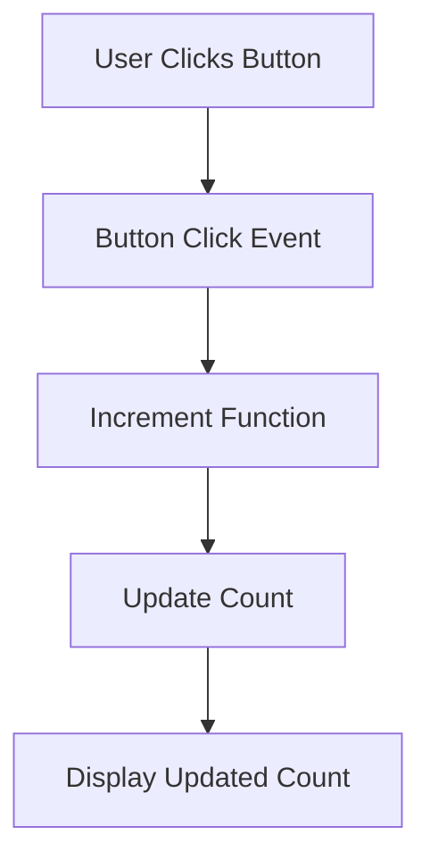

## 18.7 Integrating Functional and Reactive Patterns

In the world of software development, combining different paradigms can lead to more robust and scalable applications. In Haskell, integrating functional programming with reactive paradigms, particularly through Functional Reactive Programming (FRP), allows developers to build systems that are both responsive and maintainable. This section delves into the integration of these paradigms, providing insights, examples, and best practices for expert software engineers and architects.

### Objective

- **Combine functional programming with reactive paradigms** to leverage the strengths of both approaches.
- **Implement reactive systems** using FRP libraries within functional codebases.
- **Develop interactive applications** that respond efficiently to user events and data changes.

### Introduction to Functional and Reactive Paradigms

Functional programming (FP) emphasizes immutability, pure functions, and declarative code. It allows developers to write concise, predictable, and testable code. On the other hand, reactive programming focuses on asynchronous data streams and the propagation of change, enabling systems to react to events in real-time.

**Functional Reactive Programming (FRP)** is a paradigm that combines these two approaches. It provides a way to work with time-varying values and event streams in a functional manner, making it ideal for applications that require dynamic and responsive behavior.

### Key Concepts in FRP

1. **Signals and Behaviors**: In FRP, signals represent time-varying values, while behaviors are functions from time to values. They allow you to model dynamic data that changes over time.

2. **Event Streams**: These are sequences of events that occur over time. FRP systems can listen to these streams and react accordingly.

3. **Composability**: FRP encourages the composition of smaller, reusable components to build complex systems.

4. **Declarative Nature**: Like functional programming, FRP promotes a declarative style, where you describe what the system should do rather than how to do it.

### Implementing FRP in Haskell

Haskell's strong type system and support for higher-order functions make it an excellent choice for implementing FRP. Several libraries, such as **Reactive-banana**, **Yampa**, and **Reflex**, provide robust frameworks for building FRP applications.

#### Example: Building an Interactive UI Application

Let's explore how to build an interactive UI application using the **Reflex** library. This example will demonstrate how to respond to user events and update the UI reactively.

```haskell
{-# LANGUAGE OverloadedStrings #-}
{-# LANGUAGE RecursiveDo #-}

import Reflex.Dom

main :: IO ()
main = mainWidget $ el "div" $ do
  el "h1" $ text "Interactive Counter"
  rec
    let increment = (+1) <$ buttonClick
    count <- foldDyn ($) (0 :: Int) increment
    buttonClick <- button "Increment"
    display count
  return ()
```

**Explanation**:

- **`mainWidget`**: Initializes the Reflex application.
- **`el`**: Creates HTML elements. Here, we create a `div` and an `h1` for the title.
- **`button`**: Creates a button element that emits events when clicked.
- **`foldDyn`**: Accumulates events over time, updating the count each time the button is clicked.
- **`display`**: Displays the current count value.

### Visualizing FRP in Haskell

To better understand how FRP works, let's visualize the flow of data and events in the above example using a Mermaid.js diagram.



**Diagram Explanation**:

- **User Clicks Button**: The process starts when the user clicks the button.
- **Button Click Event**: This generates an event that triggers the increment function.
- **Increment Function**: The function updates the count.
- **Update Count**: The new count is calculated and stored.
- **Display Updated Count**: The updated count is displayed on the UI.

### Integrating FRP with Functional Codebases

Integrating FRP into existing functional codebases involves several steps:

1. **Identify Reactive Components**: Determine which parts of your application would benefit from reactive behavior, such as UI components or real-time data processing.

2. **Choose an FRP Library**: Select an appropriate FRP library based on your project's requirements. Consider factors like ease of use, performance, and community support.

3. **Refactor Code**: Refactor existing code to use FRP constructs, such as signals and event streams. This may involve rewriting imperative code in a more declarative style.

4. **Test and Optimize**: Ensure that the integrated system performs well and behaves as expected. Use property-based testing and profiling tools to identify and fix issues.

### Design Considerations

When integrating functional and reactive patterns, consider the following:

- **Complexity**: FRP can introduce additional complexity, especially in large systems. Ensure that the benefits outweigh the costs.
- **Performance**: Reactive systems can be resource-intensive. Optimize event handling and data propagation to minimize overhead.
- **Scalability**: Design your system to handle increasing loads and data volumes. Use techniques like backpressure to manage event streams effectively.

### Haskell Unique Features

Haskell's unique features, such as lazy evaluation and strong typing, enhance the integration of functional and reactive patterns:

- **Lazy Evaluation**: Allows you to work with infinite data structures and defer computations until necessary, which is beneficial in reactive systems.
- **Strong Typing**: Ensures type safety and helps catch errors at compile time, reducing runtime issues.

### Differences and Similarities

FRP is often compared to other reactive paradigms, such as Reactive Extensions (Rx) in other languages. While both share similar concepts, FRP in Haskell leverages the language's functional nature, providing a more declarative and composable approach.

### Try It Yourself

Experiment with the provided code example by modifying the increment function to decrement the count or add additional buttons for different actions. This will help you understand how FRP components interact and how changes propagate through the system.

### Knowledge Check

- **What are the key components of FRP?**
- **How does lazy evaluation benefit reactive systems?**
- **What are some challenges of integrating FRP into existing codebases?**

### Summary

Integrating functional and reactive patterns in Haskell allows developers to build responsive, scalable applications. By leveraging FRP libraries, you can create systems that efficiently handle real-time data and user interactions. Remember to consider complexity, performance, and scalability when designing your system.

### Further Reading

- [Reflex Documentation](https://reflex-frp.org/)
- [Reactive-banana Documentation](https://hackage.haskell.org/package/reactive-banana)
- [Yampa Documentation](https://hackage.haskell.org/package/Yampa)

## Quiz: Integrating Functional and Reactive Patterns



### What is the primary benefit of integrating functional and reactive patterns in Haskell?

- [x] Building responsive and scalable applications
- [ ] Simplifying code complexity
- [ ] Reducing memory usage
- [ ] Enhancing security features

> **Explanation:** Integrating functional and reactive patterns allows developers to build applications that are both responsive to user interactions and scalable to handle large data volumes.

### Which Haskell feature is particularly beneficial for reactive systems?

- [x] Lazy evaluation
- [ ] Dynamic typing
- [ ] Manual memory management
- [ ] Object-oriented programming

> **Explanation:** Lazy evaluation allows computations to be deferred until necessary, which is beneficial for handling infinite data structures and optimizing performance in reactive systems.

### What is a key component of Functional Reactive Programming (FRP)?

- [x] Event streams
- [ ] Mutable state
- [ ] Synchronous processing
- [ ] Inheritance

> **Explanation:** Event streams are sequences of events that occur over time, and they are a fundamental component of FRP, allowing systems to react to changes dynamically.

### Which library is commonly used for FRP in Haskell?

- [x] Reflex
- [ ] Pandas
- [ ] NumPy
- [ ] TensorFlow

> **Explanation:** Reflex is a popular library for implementing Functional Reactive Programming in Haskell, providing tools for building reactive applications.

### What should be considered when integrating FRP into existing codebases?

- [x] Complexity and performance
- [ ] Only performance
- [ ] Only complexity
- [ ] Neither complexity nor performance

> **Explanation:** Both complexity and performance should be considered when integrating FRP, as it can introduce additional overhead and complexity to the system.

### How does strong typing in Haskell benefit FRP?

- [x] Ensures type safety and reduces runtime errors
- [ ] Increases code verbosity
- [ ] Limits flexibility
- [ ] Requires more memory

> **Explanation:** Strong typing ensures type safety, helping to catch errors at compile time and reducing the likelihood of runtime issues, which is beneficial for maintaining reliable FRP systems.

### What is a common challenge when integrating FRP?

- [x] Managing event streams efficiently
- [ ] Lack of library support
- [ ] Difficulty in writing imperative code
- [ ] Limited scalability

> **Explanation:** Managing event streams efficiently is a common challenge in FRP, as it requires careful design to handle data propagation and avoid performance bottlenecks.

### What is a signal in FRP?

- [x] A time-varying value
- [ ] A static constant
- [ ] A mutable variable
- [ ] A synchronous event

> **Explanation:** A signal in FRP represents a time-varying value, allowing systems to model dynamic data that changes over time.

### Which of the following is NOT a feature of FRP?

- [ ] Declarative nature
- [ ] Composability
- [x] Imperative control flow
- [ ] Event-driven architecture

> **Explanation:** FRP is characterized by its declarative nature and composability, whereas imperative control flow is not a feature of FRP.

### True or False: FRP in Haskell leverages the language's functional nature to provide a more declarative approach compared to other reactive paradigms.

- [x] True
- [ ] False

> **Explanation:** FRP in Haskell leverages the functional nature of the language, providing a more declarative and composable approach compared to other reactive paradigms like Reactive Extensions (Rx).



Remember, this is just the beginning. As you progress, you'll build more complex and interactive applications. Keep experimenting, stay curious, and enjoy the journey!
