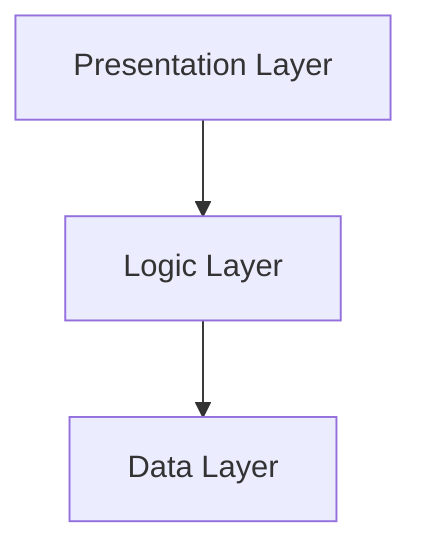

## 18.8 Layered Application Design with Multiple Patterns in Haskell

In this section, we delve into the concept of layered application architecture and how multiple design patterns can be synergistically applied within Haskell to create robust, maintainable, and scalable systems. By organizing applications into distinct layers, we achieve a clear separation of concerns, which simplifies maintenance and enhances modularity.

### Organizing Applications into Layers

A layered architecture divides an application into layers, each with a specific responsibility. This separation allows developers to focus on one aspect of the application at a time, making it easier to manage complexity. The typical layers in a layered architecture include:

1. **Presentation Layer**: Handles user interface and user interaction.
2. **Logic Layer**: Contains the business logic and rules.
3. **Data Layer**: Manages data access and persistence.

#### Visualizing Layered Architecture



**Diagram Description**: This diagram illustrates the flow of data and control from the Presentation Layer to the Logic Layer, and finally to the Data Layer.

### Patterns Applied in Layered Architecture

In a layered architecture, several design patterns can be applied to enhance the functionality and maintainability of each layer. Let's explore how the Model-View-Controller (MVC), Repository, and Service Layer patterns can be integrated into a Haskell application.

#### Model-View-Controller (MVC) Pattern

**Intent**: Separate the application into three interconnected components to separate internal representations of information from the ways that information is presented and accepted by the user.

**Key Participants**:
- **Model**: Represents the data and business logic.
- **View**: Displays data to the user and sends user commands to the controller.
- **Controller**: Handles user input and updates the model and view.

**Applicability**: Use the MVC pattern when you want to separate the user interface from the business logic and data.

**Sample Code Snippet**:

```haskell
-- Model.hs
module Model where

data User = User { userId :: Int, userName :: String }

-- View.hs
module View where

import Model

displayUser :: User -> String
displayUser user = "User: " ++ userName user

-- Controller.hs
module Controller where

import Model
import View

updateUserName :: User -> String -> User
updateUserName user newName = user { userName = newName }

main :: IO ()
main = do
    let user = User 1 "Alice"
    putStrLn $ displayUser user
    let updatedUser = updateUserName user "Bob"
    putStrLn $ displayUser updatedUser
```

**Design Considerations**: The MVC pattern is ideal for applications with complex user interfaces. It allows for independent development, testing, and maintenance of each component.

#### Repository Pattern

**Intent**: Encapsulate the logic required to access data sources, providing a collection-like interface to the application.

**Key Participants**:
- **Repository**: Manages data retrieval and persistence.
- **Data Source**: The underlying database or data storage.

**Applicability**: Use the Repository pattern when you want to separate data access logic from business logic.

**Sample Code Snippet**:

```haskell
-- Repository.hs
module Repository where

import Model

type UserRepository = [User]

findUserById :: Int -> UserRepository -> Maybe User
findUserById uid repo = find (\user -> userId user == uid) repo

addUser :: User -> UserRepository -> UserRepository
addUser user repo = user : repo
```

**Design Considerations**: The Repository pattern is useful for abstracting data access logic, making it easier to switch data sources or implement caching.

#### Service Layer Pattern

**Intent**: Define an application's boundary with a layer of services that establishes a set of available operations and coordinates the application's response in each operation.

**Key Participants**:
- **Service**: Provides business operations and logic.
- **Client**: Consumes the services.

**Applicability**: Use the Service Layer pattern when you need to encapsulate business logic and provide a clear API for clients.

**Sample Code Snippet**:

```haskell
-- Service.hs
module Service where

import Model
import Repository

getUserName :: Int -> UserRepository -> Maybe String
getUserName uid repo = userName <$> findUserById uid repo

registerUser :: String -> UserRepository -> UserRepository
registerUser name repo = addUser (User (length repo + 1) name) repo
```

**Design Considerations**: The Service Layer pattern is beneficial for applications with complex business logic, providing a centralized point for business rules and operations.

### Benefits of Layered Architecture with Multiple Patterns

By combining these patterns in a layered architecture, we achieve several benefits:

- **Separation of Concerns**: Each layer and pattern has a distinct responsibility, making the system easier to understand and maintain.
- **Modularity**: Components can be developed, tested, and maintained independently.
- **Scalability**: The architecture can be easily extended by adding new layers or patterns as needed.
- **Testability**: Each layer and pattern can be tested independently, improving the overall test coverage and reliability of the application.

### Haskell Unique Features

Haskell's strong static typing, type inference, and functional programming paradigm provide unique advantages when implementing a layered architecture with multiple design patterns:

- **Type Safety**: Haskell's type system ensures that data flows correctly between layers, reducing runtime errors.
- **Immutability**: Immutable data structures simplify reasoning about state changes across layers.
- **Higher-Order Functions**: Enable flexible composition of functions and operations across layers.

### Differences and Similarities

While the MVC, Repository, and Service Layer patterns are distinct, they share common goals of separation of concerns and modularity. It's important to understand their differences to apply them effectively:

- **MVC** focuses on separating user interface concerns from business logic.
- **Repository** abstracts data access, allowing for flexible data source management.
- **Service Layer** encapsulates business logic, providing a clear API for clients.

### Try It Yourself

To deepen your understanding, try modifying the code examples provided:

- **Experiment with Different Data Models**: Add new fields to the `User` data type and update the view and controller accordingly.
- **Implement Additional Repository Functions**: Create functions to update or delete users in the repository.
- **Enhance the Service Layer**: Add new business operations, such as user authentication or role management.

### Knowledge Check

- **Question**: What are the main benefits of using a layered architecture with multiple design patterns?
- **Exercise**: Implement a simple application using the MVC pattern in Haskell, focusing on separating concerns between the model, view, and controller.

### Embrace the Journey

Remember, mastering layered architecture with multiple design patterns in Haskell is a journey. As you progress, you'll build more complex and maintainable applications. Keep experimenting, stay curious, and enjoy the journey!

## Quiz: Layered Application with Multiple Design Patterns



### What is the primary benefit of using a layered architecture?

- [x] Separation of concerns
- [ ] Increased complexity
- [ ] Faster development
- [ ] Reduced modularity

> **Explanation:** Layered architecture provides separation of concerns, making the system easier to manage and maintain.

### Which pattern is used to separate user interface concerns from business logic?

- [x] MVC
- [ ] Repository
- [ ] Service Layer
- [ ] Singleton

> **Explanation:** The MVC pattern separates user interface concerns from business logic.

### What does the Repository pattern encapsulate?

- [x] Data access logic
- [ ] Business logic
- [ ] User interface logic
- [ ] Network communication

> **Explanation:** The Repository pattern encapsulates data access logic, providing a collection-like interface to the application.

### Which pattern provides a clear API for clients?

- [x] Service Layer
- [ ] MVC
- [ ] Repository
- [ ] Observer

> **Explanation:** The Service Layer pattern provides a clear API for clients, encapsulating business logic.

### What is a key advantage of using Haskell for layered architecture?

- [x] Type safety
- [ ] Dynamic typing
- [ ] Lack of immutability
- [ ] Weak type inference

> **Explanation:** Haskell's type safety ensures data flows correctly between layers, reducing runtime errors.

### Which pattern is beneficial for applications with complex user interfaces?

- [x] MVC
- [ ] Repository
- [ ] Service Layer
- [ ] Singleton

> **Explanation:** The MVC pattern is ideal for applications with complex user interfaces.

### What is the role of the Controller in the MVC pattern?

- [x] Handles user input and updates the model and view
- [ ] Manages data retrieval and persistence
- [ ] Provides business operations and logic
- [ ] Displays data to the user

> **Explanation:** The Controller handles user input and updates the model and view in the MVC pattern.

### Which pattern is useful for abstracting data access logic?

- [x] Repository
- [ ] MVC
- [ ] Service Layer
- [ ] Observer

> **Explanation:** The Repository pattern is useful for abstracting data access logic.

### What is the main focus of the Service Layer pattern?

- [x] Encapsulating business logic
- [ ] Separating user interface concerns
- [ ] Abstracting data access
- [ ] Managing network communication

> **Explanation:** The Service Layer pattern focuses on encapsulating business logic and providing a clear API for clients.

### True or False: The MVC, Repository, and Service Layer patterns all aim to achieve separation of concerns.

- [x] True
- [ ] False

> **Explanation:** All three patterns aim to achieve separation of concerns, enhancing modularity and maintainability.


