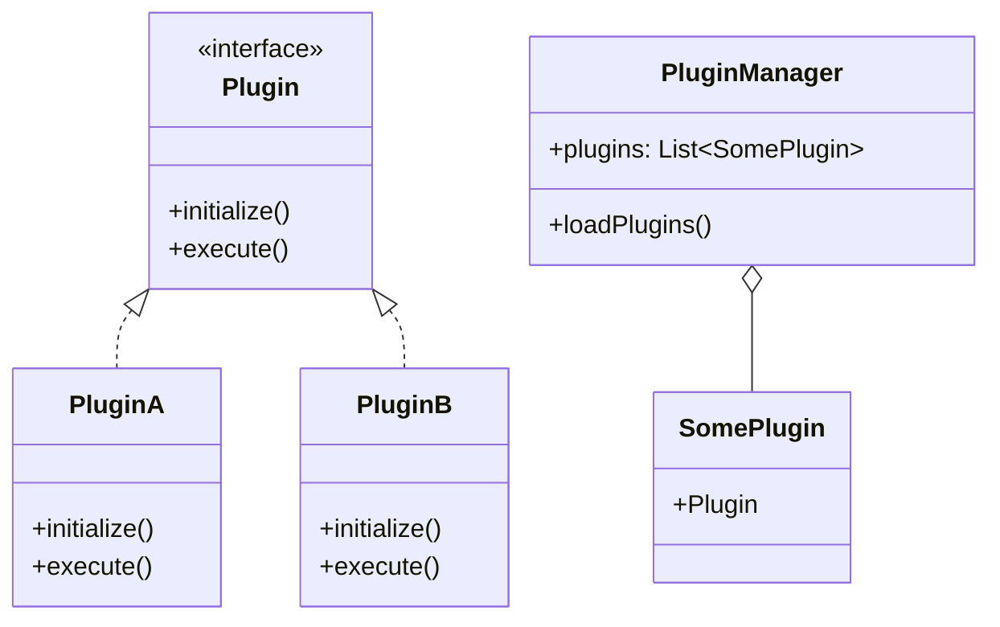

## 18.9 Evolving Systems with Patterns

In the ever-changing landscape of software development, creating systems that can evolve over time is crucial. This section delves into the concept of adaptability and extensibility in Haskell, focusing on design patterns that facilitate system evolution. We'll explore how to design systems that are not only robust but also flexible enough to accommodate future changes. 

### Adaptability in Software Systems

Adaptability refers to a system's ability to adjust to new conditions or requirements. In software engineering, this means designing systems that can evolve without requiring significant rewrites. This adaptability is crucial for maintaining relevance and functionality in a rapidly changing technological environment.

#### Key Aspects of Adaptability

1. **Modularity**: Break down systems into smaller, interchangeable components.
2. **Loose Coupling**: Minimize dependencies between components to allow independent changes.
3. **High Cohesion**: Ensure that components have a single, well-defined purpose.
4. **Encapsulation**: Hide the internal workings of components to protect against changes.

### Extensibility in Software Systems

Extensibility is the ability to add new features or components to a system without disrupting existing functionality. This is achieved through well-defined interfaces and the use of design patterns that support extension.

#### Key Aspects of Extensibility

1. **Open/Closed Principle**: Systems should be open for extension but closed for modification.
2. **Interfaces and Abstractions**: Use interfaces to define expected behaviors, allowing new implementations to be added easily.
3. **Plugin Architecture**: Enable third-party extensions through a plugin system.

### Approach: Using Patterns for Adaptability and Extensibility

Design patterns provide a structured approach to achieving adaptability and extensibility. By leveraging patterns, we can create systems that are easier to maintain and evolve.

#### Common Patterns for Evolving Systems

1. **Strategy Pattern**: Encapsulates algorithms within a family and makes them interchangeable.
2. **Observer Pattern**: Allows objects to be notified of changes in other objects.
3. **Decorator Pattern**: Adds behavior to objects dynamically.
4. **Factory Pattern**: Creates objects without specifying the exact class of object that will be created.
5. **Plugin Pattern**: Facilitates the addition of new functionality through plugins.

### Example: Implementing the Plugin Pattern for Extensibility

The Plugin pattern is a powerful tool for creating extensible systems. It allows new functionality to be added without altering the core system, making it ideal for applications that need to evolve over time.

#### Key Participants in the Plugin Pattern

- **Core System**: The main application that provides the framework for plugins.
- **Plugin Interface**: Defines the methods that plugins must implement.
- **Concrete Plugins**: Implementations of the plugin interface that provide specific functionality.
- **Plugin Manager**: Loads and manages plugins, integrating them into the core system.

#### Implementing the Plugin Pattern in Haskell

Let's explore how to implement the Plugin pattern in Haskell, leveraging its strong type system and functional programming paradigms.

```haskell
-- Define the Plugin Interface
class Plugin p where
    initialize :: p -> IO ()
    execute :: p -> IO ()

-- Define a type for the Plugin Manager
data PluginManager = PluginManager { plugins :: [SomePlugin] }

-- Existential type to hold any plugin
data SomePlugin = forall p. Plugin p => SomePlugin p

-- Function to load plugins
loadPlugins :: IO [SomePlugin]
loadPlugins = do
    -- In a real application, this might load plugins from a directory
    return [SomePlugin PluginA, SomePlugin PluginB]

-- Example Plugins
data PluginA = PluginA
instance Plugin PluginA where
    initialize _ = putStrLn "Initializing Plugin A"
    execute _ = putStrLn "Executing Plugin A"

data PluginB = PluginB
instance Plugin PluginB where
    initialize _ = putStrLn "Initializing Plugin B"
    execute _ = putStrLn "Executing Plugin B"

-- Main function to demonstrate plugin usage
main :: IO ()
main = do
    plugins <- loadPlugins
    let manager = PluginManager plugins
    mapM_ (\\(SomePlugin p) -> initialize p >> execute p) (plugins manager)
```

In this example, we define a `Plugin` type class that specifies the methods `initialize` and `execute`. We then create a `PluginManager` to manage a list of plugins, each wrapped in an existential type `SomePlugin`. This allows us to store different types of plugins in a single list. The `loadPlugins` function simulates loading plugins, and the `main` function demonstrates initializing and executing each plugin.

### Visualizing the Plugin Pattern

Below is a diagram illustrating the structure of the Plugin pattern in Haskell:



This diagram shows the relationship between the core system, plugin interface, concrete plugins, and the plugin manager.

### Design Considerations

When implementing the Plugin pattern, consider the following:

- **Versioning**: Ensure that plugins are compatible with different versions of the core system.
- **Security**: Validate and sandbox plugins to prevent malicious behavior.
- **Performance**: Monitor the impact of plugins on system performance.

### Haskell Unique Features

Haskell's strong type system and support for higher-order functions make it particularly well-suited for implementing the Plugin pattern. The use of existential types allows for flexible plugin management, while type classes provide a clear and concise way to define plugin interfaces.

### Differences and Similarities

The Plugin pattern is often confused with the Strategy pattern, as both involve interchangeable components. However, the Plugin pattern focuses on adding new functionality, while the Strategy pattern is about selecting from a set of existing algorithms.

### Try It Yourself

To deepen your understanding, try modifying the code example:

- Add a new plugin that implements a different functionality.
- Modify the `loadPlugins` function to dynamically load plugins from a directory.
- Implement a mechanism to unload or disable plugins.

### Knowledge Check

- What are the key differences between adaptability and extensibility?
- How does the Plugin pattern facilitate system evolution?
- What are the benefits of using Haskell's type system in implementing design patterns?

### Embrace the Journey

Remember, designing systems that can evolve is a journey, not a destination. As you gain experience, you'll discover new ways to leverage design patterns to create adaptable and extensible systems. Keep experimenting, stay curious, and enjoy the journey!

## Quiz: Evolving Systems with Patterns



### What is the primary goal of adaptability in software systems?

- [x] To adjust to new conditions or requirements without significant rewrites
- [ ] To increase the speed of execution
- [ ] To reduce the size of the codebase
- [ ] To enhance the graphical user interface

> **Explanation:** Adaptability focuses on a system's ability to evolve and adjust to new conditions or requirements without requiring significant rewrites.

### Which design pattern is primarily used for adding new functionality through plugins?

- [x] Plugin Pattern
- [ ] Strategy Pattern
- [ ] Observer Pattern
- [ ] Factory Pattern

> **Explanation:** The Plugin pattern is specifically designed to facilitate the addition of new functionality through plugins.

### What is a key benefit of using Haskell's type system in implementing design patterns?

- [x] It provides strong type safety and clear interfaces
- [ ] It allows for dynamic typing
- [ ] It simplifies the syntax of the code
- [ ] It reduces the need for testing

> **Explanation:** Haskell's strong type system ensures type safety and provides clear interfaces, which is beneficial in implementing design patterns.

### What is the Open/Closed Principle?

- [x] Systems should be open for extension but closed for modification
- [ ] Systems should be open for modification but closed for extension
- [ ] Systems should be open for both extension and modification
- [ ] Systems should be closed for both extension and modification

> **Explanation:** The Open/Closed Principle states that systems should be open for extension but closed for modification, allowing new functionality to be added without altering existing code.

### How does the Plugin pattern differ from the Strategy pattern?

- [x] Plugin pattern focuses on adding new functionality, while Strategy pattern focuses on selecting algorithms
- [ ] Plugin pattern focuses on selecting algorithms, while Strategy pattern focuses on adding new functionality
- [ ] Both patterns focus on adding new functionality
- [ ] Both patterns focus on selecting algorithms

> **Explanation:** The Plugin pattern is about adding new functionality, whereas the Strategy pattern is about selecting from a set of existing algorithms.

### What is a potential security concern when using plugins?

- [x] Plugins may introduce malicious behavior if not validated
- [ ] Plugins may slow down the system
- [ ] Plugins may increase the size of the codebase
- [ ] Plugins may improve system performance

> **Explanation:** Plugins can introduce malicious behavior if not properly validated and sandboxed, posing a security risk.

### What is the role of a Plugin Manager in the Plugin pattern?

- [x] To load, manage, and integrate plugins into the core system
- [ ] To execute the core system's main functionality
- [ ] To provide a user interface for the system
- [ ] To store data for the system

> **Explanation:** The Plugin Manager is responsible for loading, managing, and integrating plugins into the core system.

### Which of the following is NOT a key aspect of extensibility?

- [ ] Open/Closed Principle
- [ ] Interfaces and Abstractions
- [x] High Cohesion
- [ ] Plugin Architecture

> **Explanation:** High Cohesion is more related to adaptability, focusing on ensuring components have a single, well-defined purpose.

### What is an existential type used for in the Plugin pattern?

- [x] To store different types of plugins in a single list
- [ ] To define the plugin interface
- [ ] To execute plugins
- [ ] To initialize plugins

> **Explanation:** Existential types allow for storing different types of plugins in a single list, enabling flexible plugin management.

### True or False: The Strategy pattern and Plugin pattern are the same.

- [ ] True
- [x] False

> **Explanation:** The Strategy pattern and Plugin pattern are not the same; they serve different purposes in system design.



By understanding and applying these concepts, you can create systems that are not only robust and reliable but also adaptable and extensible, ready to meet the challenges of tomorrow.


