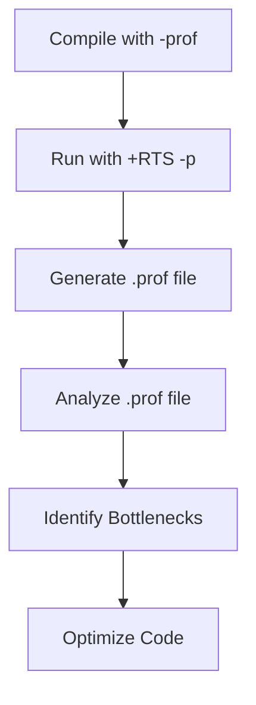
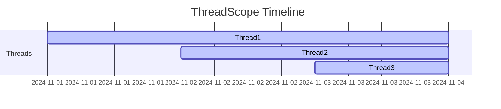

## 19.1 Profiling Haskell Applications

In the world of software development, performance optimization is a critical aspect that can make or break an application. For Haskell applications, profiling is an essential step in identifying performance bottlenecks and ensuring efficient execution. In this section, we will delve into the importance of profiling, explore the tools available for Haskell developers, and provide techniques for interpreting profiling reports to guide optimizations.

### Profiling Importance

Profiling is the process of measuring the space (memory) and time (CPU) complexity of a program. It helps in identifying the parts of an application that are consuming the most resources, allowing developers to focus their optimization efforts where they will have the greatest impact. In Haskell, profiling is particularly important due to the language's lazy evaluation model, which can sometimes lead to unexpected performance characteristics.

#### Key Benefits of Profiling

- **Identifying Bottlenecks**: Profiling helps pinpoint the slow parts of an application, allowing developers to target specific areas for optimization.
- **Understanding Resource Usage**: It provides insights into how memory and CPU resources are being utilized, helping to optimize resource allocation.
- **Improving Code Efficiency**: By identifying inefficient code paths, developers can refactor and improve the overall efficiency of the application.
- **Guiding Architectural Decisions**: Profiling data can inform architectural changes that lead to better performance and scalability.

### Tools for Profiling Haskell Applications

Haskell offers several tools for profiling applications, each with its own strengths and use cases. The two primary tools we will focus on are the GHC Profiler and ThreadScope.

#### GHC Profiler

The GHC Profiler is a built-in tool that comes with the Glasgow Haskell Compiler (GHC). It provides detailed information about the runtime behavior of Haskell programs, including memory usage, time spent in different functions, and call graphs.

- **Time Profiling**: Measures the time spent in each function, helping to identify slow code paths.
- **Space Profiling**: Analyzes memory usage to identify space leaks and optimize memory allocation.
- **Cost Center Profiling**: Allows developers to annotate specific parts of the code to gather detailed profiling information.

##### Setting Up GHC Profiler

To use the GHC Profiler, you need to compile your Haskell program with profiling enabled. This can be done by adding the `-prof` flag during compilation:

```bash
ghc -prof -fprof-auto -rtsopts MyProgram.hs
```

- `-prof`: Enables profiling.
- `-fprof-auto`: Automatically adds cost centers to all top-level functions.
- `-rtsopts`: Allows runtime options to be passed to the program.

##### Running a Profiled Program

Once compiled, you can run your program with profiling enabled by using the `+RTS` flag:

```bash
./MyProgram +RTS -p
```

This will generate a `.prof` file containing the profiling report.

#### ThreadScope

ThreadScope is a visualization tool for analyzing the performance of concurrent Haskell programs. It provides a graphical representation of the program's execution, helping to identify concurrency issues such as thread contention and idle time.

- **Concurrency Visualization**: Displays a timeline of thread activity, making it easy to spot bottlenecks in concurrent execution.
- **Event Log Analysis**: Uses event logs generated by the GHC runtime system to provide detailed insights into thread behavior.

##### Setting Up ThreadScope

To use ThreadScope, you need to compile your program with event logging enabled:

```bash
ghc -eventlog MyProgram.hs
```

Then, run your program with the `-l` flag to generate an event log:

```bash
./MyProgram +RTS -l
```

You can then open the generated `.eventlog` file in ThreadScope for analysis.

### Technique: Interpreting Profiling Reports

Interpreting profiling reports is a crucial step in the optimization process. It involves analyzing the data provided by the profiling tools to identify performance bottlenecks and guide optimization efforts.

#### Analyzing GHC Profiler Reports

The GHC Profiler generates a `.prof` file containing detailed information about the program's execution. Key sections of the report include:

- **COST CENTRE**: Lists the cost centers (functions or expressions) that were profiled.
- **MODULE**: Indicates the module in which the cost center is located.
- **%time**: Shows the percentage of total execution time spent in each cost center.
- **%alloc**: Displays the percentage of total memory allocation attributed to each cost center.

##### Example Profiling Report

Here's a simplified example of a GHC Profiler report:

```
COST CENTRE                    MODULE         %time %alloc

main                           Main             0.0    0.0
fibonacci                      Main            90.0   95.0
```

In this example, the `fibonacci` function is consuming 90% of the execution time and 95% of the memory allocation, indicating a potential area for optimization.

#### Analyzing ThreadScope Reports

ThreadScope provides a graphical representation of thread activity, making it easier to identify concurrency issues. Key aspects to analyze include:

- **Thread Activity**: Look for periods of high contention or idle time, which may indicate bottlenecks.
- **Event Timeline**: Examine the sequence of events to understand the flow of execution and identify potential improvements.

### Visualizing Profiling Data

Visualizing profiling data can greatly enhance understanding and aid in identifying performance issues. Let's explore how to use Mermaid.js diagrams to represent profiling concepts.

#### GHC Profiler Flowchart



*Caption: Flowchart illustrating the process of using GHC Profiler to identify and optimize performance bottlenecks.*

#### ThreadScope Timeline



*Caption: Gantt chart representing thread activity over time, useful for identifying concurrency bottlenecks.*

### References and Further Reading

For more information on profiling Haskell applications, consider exploring the following resources:

- [GHC User's Guide: Profiling](https://downloads.haskell.org/~ghc/latest/docs/html/users_guide/profiling.html)
- [ThreadScope on Hackage](http://hackage.haskell.org/package/threadscope)
- [Haskell Wiki: Profiling](https://wiki.haskell.org/Profiling)

### Knowledge Check

To reinforce your understanding of profiling Haskell applications, consider the following questions:

1. What are the key benefits of profiling a Haskell application?
2. How does the GHC Profiler help in identifying performance bottlenecks?
3. What is the purpose of ThreadScope in profiling concurrent Haskell programs?
4. How can you enable profiling when compiling a Haskell program with GHC?
5. What information does a `.prof` file provide?

### Embrace the Journey

Remember, profiling is just the beginning of the optimization journey. As you become more familiar with the tools and techniques, you'll be able to tackle more complex performance challenges. Keep experimenting, stay curious, and enjoy the process of making your Haskell applications faster and more efficient!

### Quiz: Profiling Haskell Applications



### What is the primary purpose of profiling a Haskell application?

- [x] Identifying performance bottlenecks
- [ ] Enhancing code readability
- [ ] Improving security
- [ ] Simplifying code structure

> **Explanation:** Profiling is primarily used to identify performance bottlenecks in an application.

### Which tool is used for visualizing concurrency in Haskell programs?

- [ ] GHC Profiler
- [x] ThreadScope
- [ ] QuickCheck
- [ ] HLint

> **Explanation:** ThreadScope is used for visualizing concurrency in Haskell programs.

### What flag is used to enable profiling when compiling a Haskell program with GHC?

- [ ] -O2
- [ ] -threaded
- [x] -prof
- [ ] -Wall

> **Explanation:** The `-prof` flag is used to enable profiling when compiling a Haskell program with GHC.

### What type of information does a `.prof` file contain?

- [x] Execution time and memory allocation details
- [ ] Syntax errors and warnings
- [ ] Code style suggestions
- [ ] Security vulnerabilities

> **Explanation:** A `.prof` file contains execution time and memory allocation details.

### How can you generate an event log for use with ThreadScope?

- [x] Compile with `-eventlog` and run with `+RTS -l`
- [ ] Compile with `-O2` and run with `+RTS -p`
- [ ] Compile with `-Wall` and run with `+RTS -t`
- [ ] Compile with `-threaded` and run with `+RTS -s`

> **Explanation:** To generate an event log for ThreadScope, compile with `-eventlog` and run with `+RTS -l`.

### What is a key benefit of using ThreadScope?

- [x] Visualizing thread activity and identifying concurrency issues
- [ ] Automatically fixing performance issues
- [ ] Generating code documentation
- [ ] Simplifying code syntax

> **Explanation:** ThreadScope is beneficial for visualizing thread activity and identifying concurrency issues.

### Which section of a GHC Profiler report indicates the percentage of total execution time spent in each cost center?

- [x] %time
- [ ] %alloc
- [ ] COST CENTRE
- [ ] MODULE

> **Explanation:** The `%time` section indicates the percentage of total execution time spent in each cost center.

### What is the purpose of cost center profiling in GHC Profiler?

- [x] To gather detailed profiling information for specific parts of the code
- [ ] To improve code readability
- [ ] To enhance security
- [ ] To simplify code structure

> **Explanation:** Cost center profiling is used to gather detailed profiling information for specific parts of the code.

### What does the `-fprof-auto` flag do when compiling a Haskell program?

- [x] Automatically adds cost centers to all top-level functions
- [ ] Enables threading support
- [ ] Optimizes code for performance
- [ ] Generates code documentation

> **Explanation:** The `-fprof-auto` flag automatically adds cost centers to all top-level functions.

### True or False: Profiling is only necessary for large-scale Haskell applications.

- [ ] True
- [x] False

> **Explanation:** Profiling is beneficial for applications of all sizes to identify and optimize performance bottlenecks.


