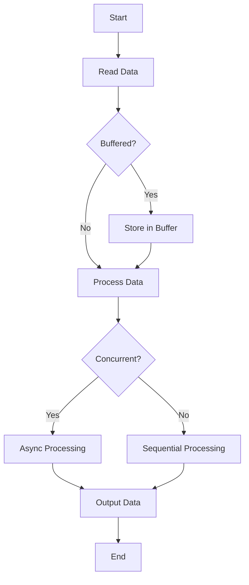

## 19.10 Optimizing I/O Operations

In the realm of Haskell programming, optimizing I/O operations is crucial for building efficient and responsive applications. As expert software engineers and architects, understanding the intricacies of I/O performance can significantly enhance the scalability and reliability of your systems. This section delves into the techniques, libraries, and best practices for optimizing I/O operations in Haskell.

### Understanding I/O Bottlenecks

I/O operations are often the bottleneck in software systems, particularly when dealing with large volumes of data or high-frequency operations. The primary reasons for I/O bottlenecks include:

- **Latency**: The time taken to initiate and complete an I/O operation.
- **Throughput**: The amount of data processed in a given time frame.
- **Concurrency**: The ability to handle multiple I/O operations simultaneously.

#### Identifying I/O Bottlenecks

To effectively optimize I/O operations, it's essential to identify where bottlenecks occur. Use profiling tools such as GHC's built-in profiler to analyze your application's performance and pinpoint slow I/O operations.

### Techniques for Optimizing I/O

#### 1. Buffering

Buffering is a fundamental technique for optimizing I/O operations. By temporarily storing data in memory before writing it to disk or sending it over a network, buffering reduces the number of I/O operations and improves performance.

- **Buffered I/O**: Use Haskell's `hSetBuffering` function to set the buffering mode for file handles. Options include `NoBuffering`, `LineBuffering`, and `BlockBuffering`.

```haskell
import System.IO

main :: IO ()
main = do
    handle <- openFile "example.txt" ReadMode
    hSetBuffering handle LineBuffering
    contents <- hGetContents handle
    putStrLn contents
    hClose handle
```

#### 2. Efficient I/O Libraries

Haskell offers several libraries designed for efficient I/O operations. Two of the most prominent are `ByteString` and `Text`.

- **ByteString**: Ideal for binary data and large text files. It provides both strict and lazy variants, allowing you to choose based on your memory and performance needs.

```haskell
import qualified Data.ByteString as B

main :: IO ()
main = do
    contents <- B.readFile "largefile.bin"
    B.putStrLn contents
```

- **Text**: Optimized for Unicode text processing, `Text` is more efficient than `String` for handling large volumes of text data.

```haskell
import qualified Data.Text as T
import qualified Data.Text.IO as TIO

main :: IO ()
main = do
    contents <- TIO.readFile "largefile.txt"
    TIO.putStrLn contents
```

#### 3. Lazy I/O

Lazy I/O allows you to process data incrementally, which can be beneficial for handling large files without loading them entirely into memory. However, it comes with caveats related to resource management and error handling.

```haskell
import qualified Data.ByteString.Lazy as BL

main :: IO ()
main = do
    contents <- BL.readFile "largefile.bin"
    BL.putStr contents
```

#### 4. Concurrency and Parallelism

Leveraging Haskell's concurrency features can significantly improve I/O performance by allowing multiple operations to proceed simultaneously.

- **Async**: Use the `async` library to perform I/O operations concurrently.

```haskell
import Control.Concurrent.Async
import qualified Data.ByteString as B

main :: IO ()
main = do
    a1 <- async $ B.readFile "file1.bin"
    a2 <- async $ B.readFile "file2.bin"
    contents1 <- wait a1
    contents2 <- wait a2
    B.putStrLn contents1
    B.putStrLn contents2
```

- **STM (Software Transactional Memory)**: Use STM for safe concurrent access to shared resources.

```haskell
import Control.Concurrent.STM
import Control.Concurrent.STM.TVar

main :: IO ()
main = do
    counter <- atomically $ newTVar 0
    atomically $ modifyTVar' counter (+1)
    count <- atomically $ readTVar counter
    print count
```

### Libraries for Efficient I/O

#### ByteString

The `ByteString` library is a powerful tool for handling binary data and large text files efficiently. It provides both strict and lazy variants, allowing you to choose based on your memory and performance needs.

- **Strict ByteString**: Suitable for smaller data sets where you want to load the entire data into memory.

- **Lazy ByteString**: Ideal for large data sets where you want to process data incrementally.

#### Text

The `Text` library is optimized for Unicode text processing, making it more efficient than `String` for handling large volumes of text data.

- **Strict Text**: Use for smaller text data that fits comfortably in memory.

- **Lazy Text**: Use for large text data that requires incremental processing.

### References and Further Reading

- [ByteString](https://hackage.haskell.org/package/bytestring)
- [Text](https://hackage.haskell.org/package/text)

### Visualizing I/O Operations

To better understand the flow of I/O operations and how buffering and concurrency can optimize performance, consider the following diagram:



**Diagram Description**: This flowchart illustrates the process of reading data, checking for buffering, processing data, and handling concurrency in I/O operations.

### Try It Yourself

Experiment with the code examples provided in this section. Try modifying the buffering modes, switching between strict and lazy data types, and implementing concurrent I/O operations using `async` and `STM`. Observe the impact on performance and resource usage.

### Knowledge Check

- What are the benefits of using buffering in I/O operations?
- How do `ByteString` and `Text` differ in handling data?
- What are the advantages and potential pitfalls of using lazy I/O?
- How can concurrency improve I/O performance in Haskell?

### Embrace the Journey

Optimizing I/O operations in Haskell is a journey that involves understanding the nuances of data handling, concurrency, and resource management. Remember, this is just the beginning. As you progress, you'll build more efficient and responsive applications. Keep experimenting, stay curious, and enjoy the journey!

### Summary

In this section, we've explored the techniques and best practices for optimizing I/O operations in Haskell. By leveraging buffering, efficient libraries like `ByteString` and `Text`, and Haskell's concurrency features, you can significantly enhance the performance of your applications. Remember to profile your applications to identify bottlenecks and continuously refine your approach to I/O optimization.

## Quiz: Optimizing I/O Operations



### What is the primary benefit of using buffering in I/O operations?

- [x] Reduces the number of I/O operations
- [ ] Increases memory usage
- [ ] Slows down data processing
- [ ] Complicates code structure

> **Explanation:** Buffering reduces the number of I/O operations by temporarily storing data in memory, which improves performance.

### Which library is optimized for handling Unicode text in Haskell?

- [ ] ByteString
- [x] Text
- [ ] String
- [ ] LazyByteString

> **Explanation:** The `Text` library is optimized for Unicode text processing, making it more efficient than `String`.

### What is a potential pitfall of using lazy I/O in Haskell?

- [ ] Increased memory usage
- [x] Resource management issues
- [ ] Faster data processing
- [ ] Simplified error handling

> **Explanation:** Lazy I/O can lead to resource management issues, as resources may not be released promptly.

### How can concurrency improve I/O performance in Haskell?

- [x] By allowing multiple operations to proceed simultaneously
- [ ] By reducing memory usage
- [ ] By simplifying code structure
- [ ] By increasing latency

> **Explanation:** Concurrency allows multiple I/O operations to proceed simultaneously, improving performance.

### What is the difference between strict and lazy `ByteString`?

- [x] Strict loads data into memory, lazy processes incrementally
- [ ] Lazy loads data into memory, strict processes incrementally
- [ ] Both load data into memory
- [ ] Both process data incrementally

> **Explanation:** Strict `ByteString` loads data into memory, while lazy `ByteString` processes data incrementally.

### Which function is used to set buffering mode for file handles in Haskell?

- [x] hSetBuffering
- [ ] setBufferMode
- [ ] bufferFile
- [ ] configureBuffer

> **Explanation:** The `hSetBuffering` function is used to set the buffering mode for file handles in Haskell.

### What is the advantage of using `async` for I/O operations?

- [x] Enables concurrent execution
- [ ] Simplifies error handling
- [ ] Reduces memory usage
- [ ] Increases latency

> **Explanation:** The `async` library enables concurrent execution of I/O operations, improving performance.

### Which library provides Software Transactional Memory (STM) in Haskell?

- [x] stm
- [ ] async
- [ ] bytestring
- [ ] text

> **Explanation:** The `stm` library provides Software Transactional Memory (STM) for safe concurrent access to shared resources.

### What is the primary use case for lazy `Text` in Haskell?

- [x] Incremental processing of large text data
- [ ] Loading small text data into memory
- [ ] Binary data processing
- [ ] Simplifying code structure

> **Explanation:** Lazy `Text` is used for incremental processing of large text data.

### True or False: Concurrency always improves I/O performance in Haskell.

- [ ] True
- [x] False

> **Explanation:** While concurrency can improve I/O performance, it depends on the specific use case and how concurrency is implemented.


