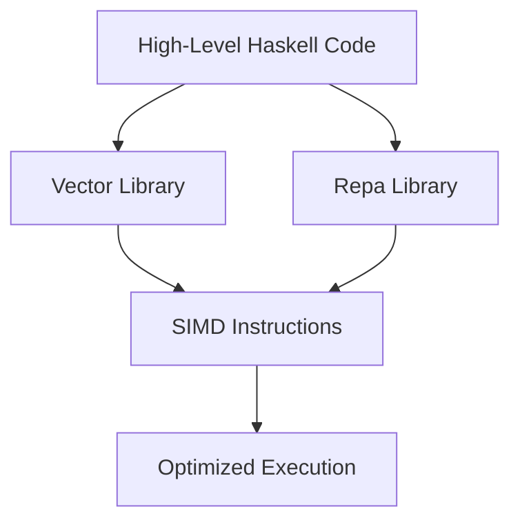

## 19.11 Leveraging SIMD and Low-Level Optimizations

In the realm of high-performance computing, leveraging Single Instruction, Multiple Data (SIMD) and low-level optimizations can significantly enhance the efficiency of your Haskell applications. This section delves into the intricacies of SIMD, explores how Haskell can utilize these optimizations, and provides practical guidance on implementing them effectively.

### Understanding SIMD

**SIMD** is a parallel computing architecture that allows a single instruction to process multiple data points simultaneously. This is particularly useful in applications that require repetitive operations on large data sets, such as image processing, scientific computations, and financial modeling.

#### Key Concepts of SIMD

- **Parallel Processing**: SIMD enables parallel execution of operations, reducing the time complexity of data-intensive tasks.
- **Data Parallelism**: It focuses on performing the same operation on multiple data points concurrently.
- **Instruction Set**: Modern CPUs come with SIMD instruction sets like SSE (Streaming SIMD Extensions) and AVX (Advanced Vector Extensions) that can be utilized for performance gains.

### SIMD in Haskell

Haskell, being a high-level functional language, abstracts away many low-level details. However, it provides mechanisms to tap into SIMD capabilities through libraries and extensions.

#### Libraries for SIMD in Haskell

1. **vector**: This library provides efficient array handling and supports operations that can be optimized using SIMD instructions.
   - [vector library documentation](https://hackage.haskell.org/package/vector)

2. **repa**: Known for its high-performance parallel array processing, repa leverages SIMD to optimize computations.
   - [repa library documentation](https://hackage.haskell.org/package/repa)

#### Using the `vector` Library

The `vector` library is a cornerstone for efficient data processing in Haskell. It provides both mutable and immutable arrays, with support for various operations that can be optimized using SIMD.

```haskell
import qualified Data.Vector as V

-- Example: Element-wise addition of two vectors
vectorAdd :: V.Vector Int -> V.Vector Int -> V.Vector Int
vectorAdd v1 v2 = V.zipWith (+) v1 v2

main :: IO ()
main = do
    let v1 = V.fromList [1, 2, 3, 4]
    let v2 = V.fromList [5, 6, 7, 8]
    print $ vectorAdd v1 v2
```

#### Using the `repa` Library

The `repa` library excels in parallel array processing, making it ideal for applications that can benefit from SIMD optimizations.

```haskell
import Data.Array.Repa as R

-- Example: Element-wise multiplication of two arrays
arrayMultiply :: Array U DIM1 Int -> Array U DIM1 Int -> Array U DIM1 Int
arrayMultiply arr1 arr2 = R.zipWith (*) arr1 arr2

main :: IO ()
main = do
    let arr1 = fromListUnboxed (Z :. 4) [1, 2, 3, 4]
    let arr2 = fromListUnboxed (Z :. 4) [5, 6, 7, 8]
    print $ computeS $ arrayMultiply arr1 arr2
```

### Low-Level Optimizations in Haskell

Beyond SIMD, Haskell offers several low-level optimization techniques to enhance performance.

#### GHC Optimizations

The Glasgow Haskell Compiler (GHC) provides numerous optimization flags that can be used to fine-tune performance.

- **-O2**: Enables a wide range of optimizations.
- **-fllvm**: Uses the LLVM backend for potentially better optimization.
- **-funbox-strict-fields**: Unboxes fields in data structures for performance gains.

#### Foreign Function Interface (FFI)

Haskell's FFI allows you to call C functions directly, enabling the use of highly optimized C libraries.

```haskell
{-# LANGUAGE ForeignFunctionInterface #-}

import Foreign.C.Types

-- Example: Using FFI to call a C function
foreign import ccall "math.h sin" c_sin :: CDouble -> CDouble

main :: IO ()
main = print $ c_sin 1.0
```

### Design Considerations

When leveraging SIMD and low-level optimizations, consider the following:

- **Applicability**: Not all applications benefit from SIMD. Evaluate the data parallelism in your application.
- **Portability**: SIMD instructions are architecture-specific. Ensure your code remains portable across different systems.
- **Complexity**: Low-level optimizations can introduce complexity. Balance performance gains with maintainability.

### Haskell Unique Features

Haskell's strong type system and purity can be leveraged to ensure correctness even when performing low-level optimizations. The use of libraries like `vector` and `repa` abstracts much of the complexity, allowing you to focus on high-level logic.

### Differences and Similarities

SIMD and low-level optimizations in Haskell differ from imperative languages due to Haskell's functional nature. While the underlying principles remain the same, the implementation and abstraction layers differ significantly.

### Try It Yourself

Experiment with the provided code examples by modifying the data sets or operations. Observe how changes impact performance and explore additional SIMD instructions or GHC optimizations.

### Visualizing SIMD and Low-Level Optimizations



*Diagram: The flow from high-level Haskell code to optimized execution using SIMD instructions.*

### Summary

Leveraging SIMD and low-level optimizations in Haskell can lead to significant performance improvements in data-intensive applications. By utilizing libraries like `vector` and `repa`, and employing GHC optimizations, you can harness the full potential of modern CPUs. Remember to balance performance with code maintainability and portability.

## Quiz: Leveraging SIMD and Low-Level Optimizations



### What does SIMD stand for?

- [x] Single Instruction, Multiple Data
- [ ] Single Instruction, Multiple Devices
- [ ] Simple Instruction, Multiple Data
- [ ] Single Instruction, Multiple Directions

> **Explanation:** SIMD stands for Single Instruction, Multiple Data, which is a parallel computing architecture.

### Which Haskell library is known for high-performance parallel array processing?

- [ ] vector
- [x] repa
- [ ] bytestring
- [ ] containers

> **Explanation:** The `repa` library is known for high-performance parallel array processing in Haskell.

### What is the primary benefit of using SIMD?

- [x] Parallel execution of operations
- [ ] Sequential execution of operations
- [ ] Reduced memory usage
- [ ] Improved code readability

> **Explanation:** SIMD allows for parallel execution of operations, which can significantly reduce execution time for data-intensive tasks.

### Which GHC optimization flag enables a wide range of optimizations?

- [x] -O2
- [ ] -O1
- [ ] -O3
- [ ] -O0

> **Explanation:** The `-O2` flag in GHC enables a wide range of optimizations for better performance.

### What is the purpose of Haskell's Foreign Function Interface (FFI)?

- [x] To call C functions directly from Haskell
- [ ] To optimize Haskell code for performance
- [ ] To provide a graphical user interface
- [ ] To manage memory allocation

> **Explanation:** Haskell's FFI allows you to call C functions directly, enabling the use of optimized C libraries.

### Which SIMD instruction set is commonly found in modern CPUs?

- [x] SSE
- [ ] ARM
- [ ] RISC
- [ ] MIPS

> **Explanation:** SSE (Streaming SIMD Extensions) is a common SIMD instruction set found in modern CPUs.

### What does the `-fllvm` GHC flag do?

- [x] Uses the LLVM backend for optimization
- [ ] Enables lazy evaluation
- [ ] Disables garbage collection
- [ ] Increases stack size

> **Explanation:** The `-fllvm` flag uses the LLVM backend, which can provide better optimization for certain code.

### What is a key consideration when using SIMD in Haskell?

- [x] Portability across different systems
- [ ] Increasing code complexity
- [ ] Reducing code size
- [ ] Simplifying data structures

> **Explanation:** SIMD instructions are architecture-specific, so ensuring portability across different systems is important.

### Which library provides efficient array handling in Haskell?

- [x] vector
- [ ] repa
- [ ] text
- [ ] binary

> **Explanation:** The `vector` library provides efficient array handling and supports operations that can be optimized using SIMD.

### True or False: Low-level optimizations in Haskell can introduce complexity.

- [x] True
- [ ] False

> **Explanation:** Low-level optimizations can introduce complexity, so it's important to balance performance gains with maintainability.



Remember, this is just the beginning. As you progress, you'll build more complex and efficient Haskell applications. Keep experimenting, stay curious, and enjoy the journey!
