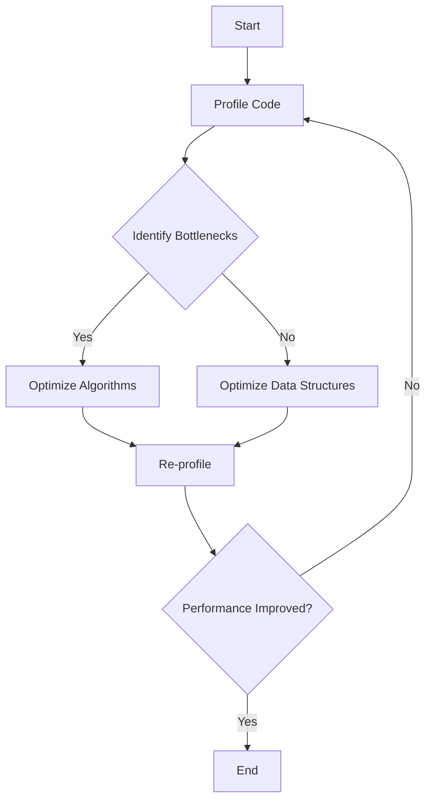

## 19.12 Best Practices for High-Performance Haskell Code

In the realm of functional programming, Haskell stands out for its expressive type system, lazy evaluation, and strong emphasis on immutability. However, achieving high performance in Haskell requires a deep understanding of its unique features and potential pitfalls. This section provides expert guidance on best practices for writing high-performance Haskell code, focusing on profiling, efficient algorithms, and optimal data structures.

### Profiling Before Optimizing

Before diving into optimization, it's crucial to identify bottlenecks in your code. Profiling helps pinpoint areas where performance improvements are most needed.

#### Tools for Profiling

1. **GHC Profiler**: The Glasgow Haskell Compiler (GHC) provides built-in profiling tools that can be used to analyze time and space usage.
   
   ```bash
   ghc -prof -fprof-auto -rtsopts MyProgram.hs
   ./MyProgram +RTS -p
   ```

   This command compiles your program with profiling enabled and generates a report that can be analyzed to identify performance bottlenecks.

2. **ThreadScope**: For concurrent Haskell programs, ThreadScope provides a graphical view of program execution, helping to visualize thread activity and identify concurrency issues.

3. **EventLog**: Use GHC's event logging to gather detailed runtime information, which can be visualized with tools like ThreadScope.

#### Profiling Strategies

- **Focus on Hotspots**: Concentrate on optimizing the parts of the code that consume the most resources.
- **Iterative Approach**: Profile, optimize, and then profile again to ensure that changes have the desired effect.

### Writing Efficient Algorithms

Efficient algorithms are the backbone of high-performance applications. In Haskell, this often involves leveraging its powerful abstractions and avoiding common pitfalls.

#### Algorithmic Complexity

- **Understand Big O Notation**: Analyze the time and space complexity of your algorithms to ensure they scale well with input size.
- **Use Tail Recursion**: Tail recursive functions can be optimized by the compiler to avoid stack overflow and reduce memory usage.

#### Example: Tail Recursion

```haskell
-- Non-tail recursive factorial
factorial :: Integer -> Integer
factorial 0 = 1
factorial n = n * factorial (n - 1)

-- Tail recursive factorial
factorialTail :: Integer -> Integer
factorialTail n = go n 1
  where
    go 0 acc = acc
    go n acc = go (n - 1) (n * acc)
```

### Avoiding Unnecessary Allocations

Memory allocation can be a significant performance bottleneck. Minimizing unnecessary allocations can lead to substantial performance gains.

#### Strategies to Reduce Allocations

- **Use Strict Data Structures**: Lazy evaluation can lead to excessive memory usage. Use strict data structures when appropriate to avoid building large thunks.
  
- **Avoid Intermediate Structures**: Use functions like `foldl'` instead of `foldl` to avoid building up large thunks.

#### Example: Strict Folding

```haskell
import Data.List (foldl')

-- Lazy foldl
sumLazy :: [Int] -> Int
sumLazy = foldl (+) 0

-- Strict foldl'
sumStrict :: [Int] -> Int
sumStrict = foldl' (+) 0
```

### Using Efficient Data Structures

Choosing the right data structure can have a profound impact on performance. Haskell offers a variety of data structures, each with its own performance characteristics.

#### Common Data Structures

- **Lists**: Simple and versatile, but can be inefficient for large datasets due to linear access times.
- **Vectors**: Provide constant-time access and are more memory-efficient than lists.
- **Maps and Sets**: Use `Data.Map` and `Data.Set` for efficient key-value storage and set operations.

#### Example: Using Vectors

```haskell
import qualified Data.Vector as V

-- Creating a vector
vectorExample :: V.Vector Int
vectorExample = V.fromList [1, 2, 3, 4, 5]

-- Accessing elements
element :: Int
element = vectorExample V.! 2
```

### Leveraging Lazy Evaluation

Lazy evaluation is a double-edged sword in Haskell. While it can lead to elegant and efficient code, it can also cause space leaks if not managed carefully.

#### Managing Lazy Evaluation

- **Use `seq` and `deepseq`**: Force evaluation of expressions to avoid building up large thunks.
- **Profile for Space Leaks**: Use profiling tools to detect and address space leaks in your code.

#### Example: Forcing Evaluation

```haskell
import Control.DeepSeq (deepseq)

-- Force evaluation of a list
forceList :: [Int] -> ()
forceList xs = xs `deepseq` ()
```

### Parallelism and Concurrency

Haskell's rich support for parallelism and concurrency can be leveraged to improve performance on multi-core systems.

#### Techniques for Parallelism

- **Use `par` and `pseq`**: These primitives allow you to specify parallel computations.
- **Software Transactional Memory (STM)**: Provides a composable way to manage shared state in concurrent programs.

#### Example: Parallel Computation

```haskell
import Control.Parallel (par, pseq)

-- Parallel sum of two lists
parallelSum :: [Int] -> [Int] -> Int
parallelSum xs ys = sumXs `par` (sumYs `pseq` (sumXs + sumYs))
  where
    sumXs = sum xs
    sumYs = sum ys
```

### Optimizing I/O Operations

I/O operations can be a significant source of performance bottlenecks. Efficient handling of I/O is crucial for high-performance applications.

#### Techniques for Efficient I/O

- **Use Lazy I/O with Caution**: While lazy I/O can be convenient, it can also lead to unpredictable performance. Consider using strict I/O when performance is critical.
- **Buffering**: Use buffered I/O to reduce the number of system calls and improve performance.

#### Example: Buffered I/O

```haskell
import System.IO

-- Reading a file with buffering
readFileBuffered :: FilePath -> IO String
readFileBuffered path = do
    handle <- openFile path ReadMode
    hSetBuffering handle (BlockBuffering Nothing)
    hGetContents handle
```

### Try It Yourself

Experiment with the code examples provided in this section. Try modifying the algorithms to see how changes affect performance. For instance, implement a tail-recursive version of a different recursive function or explore the impact of using different data structures.

### Visualizing Performance Optimization

To better understand the flow of performance optimization, consider the following diagram that outlines the process of profiling, identifying bottlenecks, and applying optimization techniques.



### References and Links

- [GHC User's Guide: Profiling](https://downloads.haskell.org/~ghc/latest/docs/html/users_guide/profiling.html)
- [Haskell Wiki: Performance](https://wiki.haskell.org/Performance)
- [Real World Haskell: Profiling and Optimization](http://book.realworldhaskell.org/read/profiling-and-optimization.html)

### Knowledge Check

- What are the benefits of using tail recursion in Haskell?
- How can you reduce memory allocations in Haskell programs?
- Why is it important to profile before optimizing?
- What are the advantages of using vectors over lists in Haskell?
- How can lazy evaluation lead to space leaks?

### Embrace the Journey

Remember, optimizing Haskell code is an iterative process. As you gain experience, you'll develop an intuition for identifying performance bottlenecks and applying the right optimization techniques. Keep experimenting, stay curious, and enjoy the journey of mastering high-performance Haskell programming!

## Quiz: Best Practices for High-Performance Haskell Code



### What is the first step in optimizing Haskell code?

- [x] Profiling the code to identify bottlenecks
- [ ] Writing efficient algorithms
- [ ] Using strict data structures
- [ ] Leveraging lazy evaluation

> **Explanation:** Profiling helps identify which parts of the code are consuming the most resources, allowing you to focus your optimization efforts effectively.

### Which tool provides a graphical view of thread activity in Haskell programs?

- [ ] GHC Profiler
- [x] ThreadScope
- [ ] EventLog
- [ ] Criterion

> **Explanation:** ThreadScope is used to visualize thread activity and concurrency issues in Haskell programs.

### What is a common technique to avoid unnecessary memory allocations in Haskell?

- [ ] Use lazy data structures
- [x] Use strict data structures
- [ ] Avoid tail recursion
- [ ] Use intermediate structures

> **Explanation:** Strict data structures help avoid building large thunks, reducing memory usage.

### How can you force evaluation of an expression in Haskell?

- [ ] Use `par`
- [ ] Use `pseq`
- [x] Use `seq` or `deepseq`
- [ ] Use `foldl`

> **Explanation:** `seq` and `deepseq` are used to force evaluation of expressions in Haskell.

### What is the advantage of using vectors over lists in Haskell?

- [x] Constant-time access
- [ ] Better readability
- [ ] Easier to implement
- [ ] Supports lazy evaluation

> **Explanation:** Vectors provide constant-time access and are more memory-efficient than lists.

### Which of the following is a technique for parallel computation in Haskell?

- [ ] Use `seq`
- [x] Use `par` and `pseq`
- [ ] Use `foldl'`
- [ ] Use `deepseq`

> **Explanation:** `par` and `pseq` are primitives used to specify parallel computations in Haskell.

### What is a potential downside of lazy I/O in Haskell?

- [ ] Improved performance
- [ ] Predictable behavior
- [x] Unpredictable performance
- [ ] Easier debugging

> **Explanation:** Lazy I/O can lead to unpredictable performance due to deferred evaluation.

### Why is it important to use buffered I/O in Haskell?

- [ ] To increase the number of system calls
- [x] To reduce the number of system calls
- [ ] To simplify code
- [ ] To support lazy evaluation

> **Explanation:** Buffered I/O reduces the number of system calls, improving performance.

### What is the purpose of using `foldl'` instead of `foldl`?

- [ ] To support lazy evaluation
- [x] To avoid building large thunks
- [ ] To simplify code
- [ ] To improve readability

> **Explanation:** `foldl'` is strict and avoids building large thunks, reducing memory usage.

### True or False: Profiling should be done after optimizing the code.

- [ ] True
- [x] False

> **Explanation:** Profiling should be done before optimizing to identify where improvements are needed.


