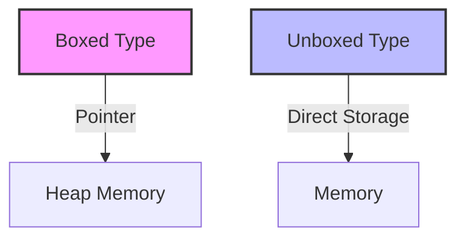

## 19.13 Using Unboxed Types and Arrays

In the realm of Haskell programming, performance optimization is a crucial aspect, especially when dealing with large-scale applications or computationally intensive tasks. One effective strategy to enhance performance is the use of unboxed types and arrays. This section delves into the intricacies of unboxed types and arrays in Haskell, providing expert insights into their implementation and benefits.

### Understanding Unboxed Types

Unboxed types in Haskell are a powerful tool for performance optimization. Unlike boxed types, which are stored as pointers to heap-allocated objects, unboxed types are stored directly in memory. This eliminates the overhead associated with pointer dereferencing and garbage collection, making unboxed types particularly beneficial for numerical computations and performance-critical applications.

#### Key Benefits of Unboxed Types

- **Reduced Memory Overhead**: By storing values directly, unboxed types reduce the memory footprint, leading to more efficient memory usage.
- **Improved Cache Performance**: Direct storage of values enhances cache locality, which can significantly speed up access times.
- **Faster Arithmetic Operations**: Unboxed types enable faster arithmetic operations as they avoid the indirection of pointers.

### Implementing Unboxed Types in Haskell

To leverage unboxed types in Haskell, we utilize the `Data.Vector.Unboxed` module, which provides a rich set of operations for working with unboxed vectors. Let's explore how to implement unboxed types through a series of examples.

#### Example: Using Unboxed Vectors

```haskell
import qualified Data.Vector.Unboxed as U

-- Create an unboxed vector of integers
let vec = U.fromList [1, 2, 3, 4, 5]

-- Access an element
let element = U.unsafeIndex vec 2  -- Output: 3

-- Perform a map operation
let doubledVec = U.map (*2) vec  -- Output: [2, 4, 6, 8, 10]
```

In this example, we create an unboxed vector of integers using `U.fromList`. We then demonstrate accessing an element and performing a map operation, showcasing the efficiency of unboxed vectors.

### Unboxed Arrays in Haskell

Unboxed arrays, similar to unboxed vectors, store elements directly in memory, providing performance benefits. The `Data.Array.Unboxed` module facilitates the use of unboxed arrays in Haskell.

#### Example: Creating and Using Unboxed Arrays

```haskell
import Data.Array.Unboxed

-- Create an unboxed array
let arr = listArray (0, 4) [1, 2, 3, 4, 5] :: UArray Int Int

-- Access an element
let element = arr ! 2  -- Output: 3

-- Update an element (requires creating a new array)
let newArr = arr // [(2, 10)]  -- Output: [1, 2, 10, 4, 5]
```

Here, we create an unboxed array using `listArray` and demonstrate element access and updates. Note that updates require creating a new array, as arrays in Haskell are immutable.

### Performance Considerations

While unboxed types and arrays offer significant performance improvements, they also come with certain considerations:

- **Type Restrictions**: Unboxed types are limited to primitive types like `Int`, `Double`, etc. This restriction is due to the need for direct memory storage.
- **Complexity in Code**: Using unboxed types can introduce complexity in code, especially when dealing with type conversions and constraints.
- **Limited Flexibility**: Unboxed arrays are less flexible compared to boxed arrays, as they cannot store polymorphic data.

### Visualizing Unboxed Types and Arrays

To better understand the concept of unboxed types and arrays, let's visualize their structure and memory layout.



**Diagram Explanation**: The diagram illustrates the difference between boxed and unboxed types. Boxed types store a pointer to heap memory, while unboxed types store values directly in memory.

### Haskell Unique Features

Haskell's type system and functional paradigm offer unique advantages when working with unboxed types and arrays:

- **Type Safety**: Haskell ensures type safety, preventing common errors associated with memory management.
- **Immutability**: The immutable nature of Haskell's data structures aligns well with the use of unboxed types, ensuring consistency and reliability.
- **Lazy Evaluation**: While unboxed types are strict by nature, Haskell's lazy evaluation can be leveraged to optimize performance further.

### Differences and Similarities with Other Patterns

Unboxed types and arrays are often compared with other performance optimization patterns, such as:

- **Strict Evaluation**: Both unboxed types and strict evaluation aim to improve performance by avoiding laziness, but unboxed types focus on memory layout.
- **Mutable Arrays**: Mutable arrays offer in-place updates, unlike unboxed arrays, which are immutable. However, unboxed arrays provide better performance for read-heavy operations.

### Try It Yourself

To deepen your understanding, try modifying the code examples provided. Experiment with different operations on unboxed vectors and arrays, and observe the performance differences. Consider using the `criterion` library for benchmarking.

### Knowledge Check

- How do unboxed types improve performance in Haskell?
- What are the limitations of using unboxed types?
- How do unboxed arrays differ from boxed arrays in terms of memory layout?

### Conclusion

Unboxed types and arrays are a powerful tool in Haskell for optimizing performance, particularly in numerical computations and performance-critical applications. By understanding their implementation and benefits, you can leverage these constructs to build efficient and high-performance Haskell applications.

### Further Reading

- [Haskell Data.Vector Documentation](https://hackage.haskell.org/package/vector)
- [Haskell Data.Array Documentation](https://hackage.haskell.org/package/array)
- [Haskell Performance Optimization Guide](https://wiki.haskell.org/Performance)

## Quiz: Using Unboxed Types and Arrays



### What is a key benefit of using unboxed types in Haskell?

- [x] Reduced memory overhead
- [ ] Increased flexibility
- [ ] Enhanced polymorphism
- [ ] Simplified code

> **Explanation:** Unboxed types reduce memory overhead by storing values directly in memory, eliminating the need for pointers.

### Which module provides operations for unboxed vectors in Haskell?

- [x] Data.Vector.Unboxed
- [ ] Data.Array.Unboxed
- [ ] Data.List
- [ ] Data.Map

> **Explanation:** The `Data.Vector.Unboxed` module provides operations for working with unboxed vectors in Haskell.

### What is a limitation of unboxed types?

- [x] Limited to primitive types
- [ ] Cannot be used in Haskell
- [ ] Require garbage collection
- [ ] Increase memory usage

> **Explanation:** Unboxed types are limited to primitive types like `Int` and `Double` due to their direct memory storage requirement.

### How do unboxed arrays differ from boxed arrays?

- [x] Unboxed arrays store values directly in memory
- [ ] Unboxed arrays use pointers
- [ ] Boxed arrays are faster
- [ ] Boxed arrays are immutable

> **Explanation:** Unboxed arrays store values directly in memory, unlike boxed arrays, which use pointers to heap-allocated objects.

### Which of the following is true about unboxed arrays?

- [x] They are immutable
- [ ] They allow in-place updates
- [ ] They support polymorphic data
- [ ] They are less efficient for read-heavy operations

> **Explanation:** Unboxed arrays are immutable, meaning updates require creating a new array.

### What is a common use case for unboxed types?

- [x] Numerical computations
- [ ] Storing complex data structures
- [ ] Enhancing polymorphism
- [ ] Simplifying code

> **Explanation:** Unboxed types are commonly used in numerical computations due to their performance benefits.

### Which of the following is a feature of Haskell that complements unboxed types?

- [x] Type safety
- [ ] Mutable state
- [ ] Dynamic typing
- [ ] Implicit memory management

> **Explanation:** Haskell's type safety complements unboxed types by preventing common memory management errors.

### What is a potential drawback of using unboxed types?

- [x] Increased code complexity
- [ ] Reduced performance
- [ ] Enhanced flexibility
- [ ] Simplified type conversions

> **Explanation:** Using unboxed types can introduce complexity in code, especially with type conversions and constraints.

### True or False: Unboxed types can store polymorphic data.

- [ ] True
- [x] False

> **Explanation:** Unboxed types cannot store polymorphic data; they are limited to primitive types.

### Which library can be used for benchmarking performance in Haskell?

- [x] criterion
- [ ] vector
- [ ] array
- [ ] base

> **Explanation:** The `criterion` library is commonly used for benchmarking performance in Haskell.



Remember, this is just the beginning. As you progress, you'll build more complex and interactive applications. Keep experimenting, stay curious, and enjoy the journey!
