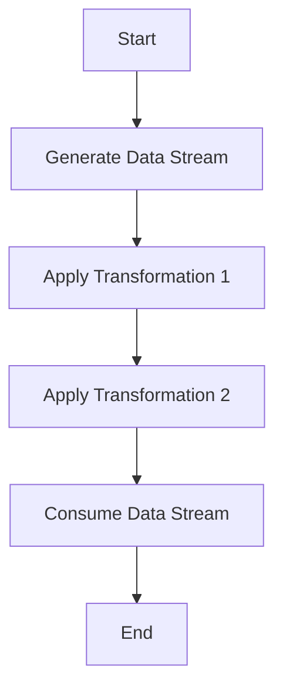

## 19.14 Stream Fusion and Optimizing Data Streams

In the realm of functional programming, Haskell stands out for its expressive power and efficiency. However, achieving optimal performance often requires a deep understanding of how data is processed. One of the key techniques for enhancing performance in Haskell is **Stream Fusion**. This technique allows us to combine multiple passes over data into a single pass, thereby avoiding the creation of intermediate data structures. In this section, we will explore the concept of stream fusion, its implementation, and how it can be used to optimize data streams in Haskell.

### Understanding Stream Fusion

Stream fusion is a technique used to optimize data processing by eliminating intermediate data structures that are typically created during multiple passes over data. This is particularly important in functional programming languages like Haskell, where operations on lists and other data structures are common.

#### Intent of Stream Fusion

The primary intent of stream fusion is to improve the performance of data processing by:

- **Reducing Memory Usage**: By eliminating intermediate data structures, stream fusion reduces the memory footprint of a program.
- **Increasing Efficiency**: Fewer data structures mean fewer allocations and deallocations, leading to faster execution times.
- **Simplifying Code**: Stream fusion can lead to more concise and readable code by abstracting away the details of data processing.

#### Key Participants in Stream Fusion

- **Producers**: Functions or constructs that generate data streams.
- **Consumers**: Functions or constructs that consume data streams.
- **Transformers**: Functions that transform data streams from one form to another.

#### Applicability of Stream Fusion

Stream fusion is applicable in scenarios where:

- Multiple transformations are applied to data streams.
- Performance is critical, and memory usage needs to be minimized.
- The codebase involves extensive use of list processing or similar data structures.

### Implementing Stream Fusion in Haskell

Haskell provides several libraries that support stream fusion, such as the `vector` library. These libraries offer a range of functions that automatically fuse operations to optimize performance.

#### Using the `vector` Library

The `vector` library in Haskell is a powerful tool for working with arrays and vectors. It provides a range of functions that support stream fusion, allowing you to write efficient and concise code.

```haskell
import qualified Data.Vector as V

-- Example: Using vector library to sum elements of a vector
sumVector :: V.Vector Int -> Int
sumVector = V.sum . V.map (*2) . V.filter even

main :: IO ()
main = do
  let vec = V.fromList [1..1000000]
  print $ sumVector vec
```

In this example, the `vector` library is used to create a vector, filter even numbers, double them, and then sum the result. The operations are fused into a single pass over the data, avoiding intermediate vectors.

#### Leveraging Stream Fusion with Lists

Haskell's standard list operations can also benefit from stream fusion. The `foldr/build` fusion framework is a common technique used to optimize list processing.

```haskell
-- Example: Using foldr/build fusion to process a list
sumList :: [Int] -> Int
sumList = foldr (+) 0 . map (*2) . filter even

main :: IO ()
main = do
  let lst = [1..1000000]
  print $ sumList lst
```

Here, the `map` and `filter` functions are fused into a single traversal of the list, reducing the overhead of creating intermediate lists.

### Visualizing Stream Fusion

To better understand how stream fusion works, let's visualize the process using a flowchart.



**Caption**: This flowchart illustrates the process of stream fusion, where multiple transformations are applied to a data stream in a single pass, avoiding intermediate data structures.

### Design Considerations for Stream Fusion

When implementing stream fusion, consider the following:

- **Complexity**: While stream fusion can simplify code, it can also introduce complexity if not used judiciously. Ensure that the fused operations are easy to understand and maintain.
- **Performance Trade-offs**: In some cases, the overhead of fusion may outweigh its benefits. Profile your code to ensure that fusion is providing the desired performance improvements.
- **Library Support**: Use libraries that support stream fusion to take advantage of optimized functions and data structures.

### Haskell's Unique Features for Stream Fusion

Haskell's lazy evaluation and strong type system make it uniquely suited for stream fusion. Lazy evaluation allows Haskell to defer computation until necessary, which aligns well with the principles of stream fusion. Additionally, Haskell's type system ensures that fused operations are type-safe and free from runtime errors.

### Differences and Similarities with Other Patterns

Stream fusion is often compared to other optimization techniques, such as loop unrolling and inlining. While these techniques also aim to improve performance, stream fusion is specifically designed for functional programming and data stream processing.

### Code Examples and Exercises

Let's explore more code examples to solidify our understanding of stream fusion.

#### Example: Optimizing a Pipeline

Consider a pipeline that processes a list of numbers by filtering, mapping, and reducing them.

```haskell
-- Example: Optimizing a pipeline with stream fusion
processNumbers :: [Int] -> Int
processNumbers = foldr (+) 0 . map (*3) . filter (>10)

main :: IO ()
main = do
  let numbers = [1..1000000]
  print $ processNumbers numbers
```

In this example, the `filter`, `map`, and `foldr` functions are fused into a single pass over the list, improving performance.

#### Try It Yourself

Experiment with the code examples by modifying the transformations or data structures. For instance, try changing the filter condition or the mapping function to see how it affects performance.

### Knowledge Check

- **Question**: What is the primary benefit of stream fusion?
  - **Answer**: Stream fusion reduces memory usage and increases efficiency by eliminating intermediate data structures.

- **Exercise**: Implement a function that processes a list of strings by filtering, mapping, and reducing them using stream fusion. Measure the performance improvement compared to a non-fused implementation.

### Embrace the Journey

Stream fusion is a powerful technique that can significantly enhance the performance of your Haskell programs. As you continue to explore Haskell's capabilities, remember that optimization is an ongoing process. Keep experimenting, stay curious, and enjoy the journey of mastering functional programming.

### References and Further Reading

- [Haskell Vector Library](https://hackage.haskell.org/package/vector)
- [Stream Fusion: From Lists to Streams to Nothing at All](https://www.microsoft.com/en-us/research/publication/stream-fusion-from-lists-to-streams-to-nothing-at-all/)
- [GHC User's Guide: Stream Fusion](https://downloads.haskell.org/~ghc/latest/docs/html/users_guide/glasgow_exts.html#stream-fusion)

## Quiz: Stream Fusion and Optimizing Data Streams



### What is the primary goal of stream fusion in Haskell?

- [x] To eliminate intermediate data structures and improve performance.
- [ ] To simplify the syntax of Haskell programs.
- [ ] To increase the memory usage of Haskell programs.
- [ ] To make Haskell programs more readable.

> **Explanation:** Stream fusion aims to eliminate intermediate data structures, thereby improving performance and reducing memory usage.

### Which Haskell library is commonly used for stream fusion?

- [x] vector
- [ ] containers
- [ ] bytestring
- [ ] text

> **Explanation:** The `vector` library is commonly used for stream fusion in Haskell, providing functions that support fusion.

### What is a key advantage of using stream fusion?

- [x] Reduced memory footprint.
- [ ] Increased code complexity.
- [ ] Slower execution times.
- [ ] More intermediate data structures.

> **Explanation:** Stream fusion reduces the memory footprint by eliminating intermediate data structures.

### How does Haskell's lazy evaluation benefit stream fusion?

- [x] It allows deferred computation, aligning well with stream fusion principles.
- [ ] It increases the number of intermediate data structures.
- [ ] It makes Haskell programs more complex.
- [ ] It reduces the efficiency of Haskell programs.

> **Explanation:** Lazy evaluation allows Haskell to defer computation until necessary, which aligns well with the principles of stream fusion.

### What is the `foldr/build` fusion framework used for?

- [x] Optimizing list processing by fusing operations.
- [ ] Increasing the complexity of Haskell programs.
- [ ] Creating more intermediate data structures.
- [ ] Reducing the readability of Haskell programs.

> **Explanation:** The `foldr/build` fusion framework is used to optimize list processing by fusing operations into a single traversal.

### Which of the following is a potential drawback of stream fusion?

- [x] Increased complexity if not used judiciously.
- [ ] Reduced performance in all cases.
- [ ] Increased memory usage.
- [ ] More intermediate data structures.

> **Explanation:** While stream fusion can simplify code, it can also introduce complexity if not used judiciously.

### What is a common use case for stream fusion?

- [x] Scenarios where multiple transformations are applied to data streams.
- [ ] Scenarios where performance is not critical.
- [ ] Scenarios where memory usage is not a concern.
- [ ] Scenarios where no data processing is involved.

> **Explanation:** Stream fusion is commonly used in scenarios where multiple transformations are applied to data streams, and performance is critical.

### How can you experiment with stream fusion in Haskell?

- [x] By modifying transformations or data structures in code examples.
- [ ] By avoiding the use of the `vector` library.
- [ ] By increasing the number of intermediate data structures.
- [ ] By writing more complex code.

> **Explanation:** Experimenting with transformations or data structures in code examples can help you understand the impact of stream fusion.

### What is the role of producers in stream fusion?

- [x] Functions or constructs that generate data streams.
- [ ] Functions or constructs that consume data streams.
- [ ] Functions that transform data streams.
- [ ] Functions that increase memory usage.

> **Explanation:** Producers are functions or constructs that generate data streams in the context of stream fusion.

### True or False: Stream fusion is only applicable to list processing in Haskell.

- [ ] True
- [x] False

> **Explanation:** Stream fusion is applicable to various data structures and scenarios, not just list processing.



By mastering stream fusion and optimizing data streams in Haskell, you can significantly enhance the performance and efficiency of your functional programming projects. Keep exploring, experimenting, and pushing the boundaries of what you can achieve with Haskell.
