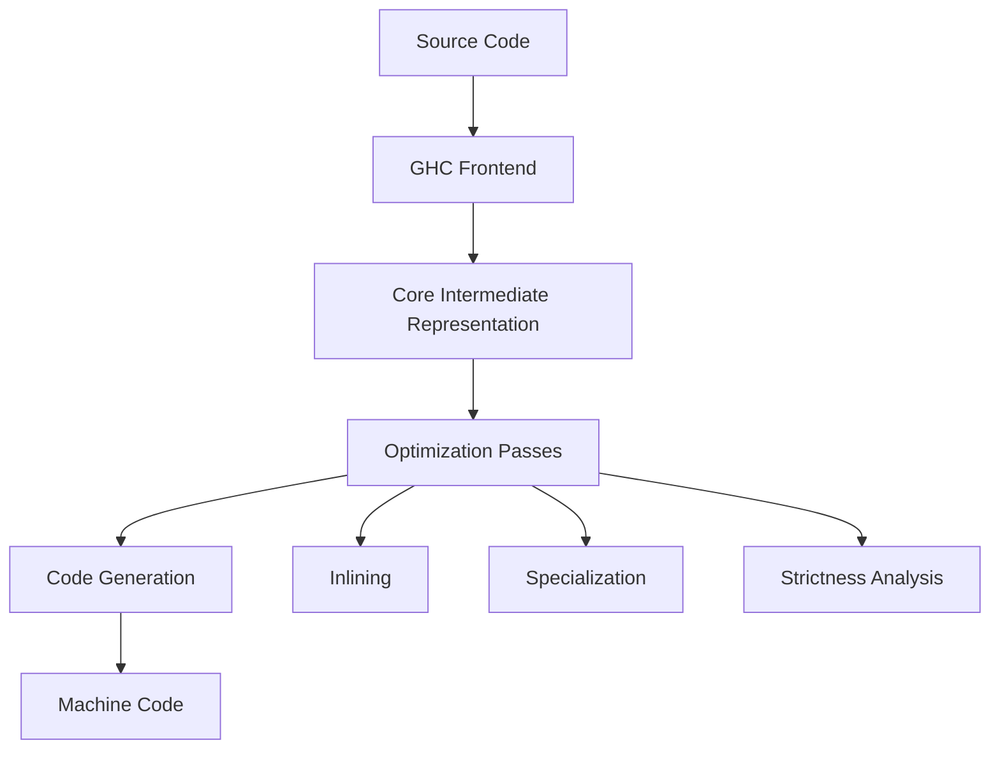

## 19.2 Understanding GHC Optimizations

As Haskell developers, we often rely on the Glasgow Haskell Compiler (GHC) to transform our high-level functional code into efficient machine code. Understanding GHC's optimization techniques is crucial for writing performant Haskell applications. In this section, we will delve into the intricacies of GHC optimizations, including inlining, specialization, and strictness analysis. We will also explore how to use compiler flags and pragmas to control these optimizations and discuss best practices for writing optimization-friendly code.

### GHC Compiler Optimizations

GHC employs a variety of optimization techniques to improve the performance of Haskell programs. Let's explore some of the key optimizations:

#### Inlining

Inlining is a powerful optimization technique where function calls are replaced with the function's body. This can reduce function call overhead and enable further optimizations like constant folding and dead code elimination.

**Example:**

```haskell
-- Original function
square :: Int -> Int
square x = x * x

-- Usage
main :: IO ()
main = print (square 5)
```

**Inlining Transformation:**

```haskell
-- Inlined version
main :: IO ()
main = print (5 * 5)
```

**Key Points:**

- **Benefits**: Inlining can significantly reduce the overhead of function calls, especially for small functions.
- **Trade-offs**: Excessive inlining can lead to code bloat, increasing the size of the compiled binary.

#### Specialization

Specialization involves generating optimized versions of polymorphic functions for specific types. This can lead to more efficient code by eliminating the overhead of type generality.

**Example:**

```haskell
-- Polymorphic function
sumList :: Num a => [a] -> a
sumList = foldr (+) 0

-- Specialized for Int
sumListInt :: [Int] -> Int
sumListInt = foldr (+) 0
```

**Key Points:**

- **Benefits**: Specialization can lead to significant performance improvements by tailoring code to specific types.
- **Trade-offs**: It increases the compilation time and binary size due to the generation of multiple versions of the function.

#### Strictness Analysis

Strictness analysis determines which function arguments are evaluated eagerly rather than lazily. This can help avoid unnecessary thunks and reduce memory usage.

**Example:**

```haskell
-- Lazy evaluation
sumLazy :: [Int] -> Int
sumLazy [] = 0
sumLazy (x:xs) = x + sumLazy xs

-- Strict evaluation
sumStrict :: [Int] -> Int
sumStrict [] = 0
sumStrict (x:xs) = x `seq` (x + sumStrict xs)
```

**Key Points:**

- **Benefits**: Strictness analysis can improve performance by reducing memory usage and avoiding the creation of thunks.
- **Trade-offs**: Overuse of strictness can lead to unnecessary computations and reduced laziness benefits.

### Flags and Pragmas

GHC provides various flags and pragmas to control optimizations. Understanding and using these options effectively can help you fine-tune the performance of your Haskell programs.

#### Compiler Flags

Compiler flags are command-line options that influence the behavior of GHC during compilation. Some important flags for optimization include:

- `-O`: Enables standard optimizations.
- `-O2`: Enables more aggressive optimizations.
- `-fno-warn-unused-imports`: Suppresses warnings about unused imports, which can be useful during optimization.
- `-funfolding-use-threshold`: Controls the threshold for inlining.

**Example Usage:**

```bash
ghc -O2 -funfolding-use-threshold=16 MyProgram.hs
```

#### Pragmas

Pragmas are special instructions embedded in the source code to guide the compiler's optimization process. Some useful pragmas include:

- `INLINE`: Suggests that a function should be inlined.
- `NOINLINE`: Prevents a function from being inlined.
- `SPECIALIZE`: Generates specialized versions of a polymorphic function.

**Example:**

```haskell
{-# INLINE square #-}
square :: Int -> Int
square x = x * x

{-# SPECIALIZE sumList :: [Int] -> Int #-}
sumList :: Num a => [a] -> a
sumList = foldr (+) 0
```

### Best Practices

Writing code that is friendly to GHC optimizations involves understanding how these optimizations work and structuring your code accordingly. Here are some best practices:

#### Use Small, Pure Functions

Small, pure functions are more likely to be inlined and optimized effectively. They also make your code more modular and easier to reason about.

#### Leverage Type Classes

Type classes can help you write generic code that GHC can specialize for specific types, improving performance.

#### Avoid Unnecessary Laziness

While laziness is a powerful feature of Haskell, it can lead to performance issues if overused. Use strictness annotations where appropriate to avoid creating unnecessary thunks.

#### Profile and Benchmark

Use profiling and benchmarking tools to identify performance bottlenecks and measure the impact of optimizations. GHC provides tools like `ghc-prof` and `criterion` for this purpose.

### Visualizing GHC Optimizations

To better understand how GHC optimizations work, let's visualize the process using a flowchart.



**Diagram Explanation:**

- **Source Code**: The original Haskell code written by the developer.
- **GHC Frontend**: The initial stage of the GHC compiler that parses and type-checks the code.
- **Core Intermediate Representation**: A simplified version of the code used for optimization.
- **Optimization Passes**: Various transformations applied to the Core representation to improve performance.
- **Inlining, Specialization, Strictness Analysis**: Specific optimization techniques applied during the optimization passes.
- **Code Generation**: The final stage where optimized Core code is translated into machine code.

### Try It Yourself

To solidify your understanding of GHC optimizations, try experimenting with the following exercises:

1. **Modify the Inlining Example**: Change the `square` function to a more complex function and observe how inlining affects performance.
2. **Experiment with Specialization**: Create a polymorphic function and use the `SPECIALIZE` pragma to generate specialized versions. Measure the performance difference.
3. **Apply Strictness Annotations**: Take a lazy function and add strictness annotations. Compare the memory usage and execution time before and after.

### Knowledge Check

- **Question**: What are the benefits and trade-offs of inlining in GHC?
- **Exercise**: Write a Haskell program that uses both lazy and strict evaluation. Profile the program to identify performance differences.

### Embrace the Journey

Remember, mastering GHC optimizations is a journey. As you continue to explore and experiment, you'll gain a deeper understanding of how to write efficient Haskell code. Keep pushing the boundaries, stay curious, and enjoy the process!

### References and Links

- [GHC User's Guide](https://downloads.haskell.org/~ghc/latest/docs/html/users_guide/)
- [Haskell Wiki: GHC Optimization](https://wiki.haskell.org/GHC_optimization)
- [Criterion: Haskell Benchmarking Library](https://www.serpentine.com/criterion/)

## Quiz: Understanding GHC Optimizations



### What is the primary benefit of inlining in GHC?

- [x] Reduces function call overhead
- [ ] Increases code readability
- [ ] Decreases binary size
- [ ] Simplifies code maintenance

> **Explanation:** Inlining reduces function call overhead by replacing function calls with the function's body, leading to more efficient execution.

### Which pragma suggests that a function should be inlined?

- [x] INLINE
- [ ] NOINLINE
- [ ] SPECIALIZE
- [ ] OPTIMIZE

> **Explanation:** The INLINE pragma suggests to the compiler that a function should be inlined to improve performance.

### What is the effect of specialization in GHC?

- [x] Generates optimized versions of polymorphic functions for specific types
- [ ] Prevents functions from being inlined
- [ ] Reduces memory usage by avoiding thunks
- [ ] Increases code readability

> **Explanation:** Specialization generates optimized versions of polymorphic functions for specific types, improving performance by eliminating type generality overhead.

### What does strictness analysis help avoid?

- [x] Unnecessary thunks
- [ ] Excessive inlining
- [ ] Code bloat
- [ ] Type errors

> **Explanation:** Strictness analysis helps avoid unnecessary thunks by determining which function arguments can be evaluated eagerly.

### Which GHC flag enables more aggressive optimizations?

- [x] -O2
- [ ] -O
- [ ] -fno-warn-unused-imports
- [ ] -funfolding-use-threshold

> **Explanation:** The -O2 flag enables more aggressive optimizations compared to the standard -O flag.

### What is a potential trade-off of excessive inlining?

- [x] Code bloat
- [ ] Reduced execution speed
- [ ] Increased memory usage
- [ ] Simplified code maintenance

> **Explanation:** Excessive inlining can lead to code bloat, increasing the size of the compiled binary.

### How can you control the threshold for inlining in GHC?

- [x] Using the -funfolding-use-threshold flag
- [ ] Using the INLINE pragma
- [ ] Using the NOINLINE pragma
- [ ] Using the SPECIALIZE pragma

> **Explanation:** The -funfolding-use-threshold flag controls the threshold for inlining, allowing fine-tuning of this optimization.

### What is the purpose of the SPECIALIZE pragma?

- [x] To generate specialized versions of a polymorphic function
- [ ] To prevent a function from being inlined
- [ ] To suggest that a function should be inlined
- [ ] To enable strictness analysis

> **Explanation:** The SPECIALIZE pragma generates specialized versions of a polymorphic function for specific types, improving performance.

### What is a benefit of using strictness annotations?

- [x] Reduces memory usage by avoiding thunks
- [ ] Increases code readability
- [ ] Simplifies code maintenance
- [ ] Decreases binary size

> **Explanation:** Strictness annotations reduce memory usage by avoiding the creation of unnecessary thunks, leading to more efficient execution.

### True or False: GHC's optimization techniques can only be controlled through compiler flags.

- [ ] True
- [x] False

> **Explanation:** GHC's optimization techniques can be controlled through both compiler flags and pragmas embedded in the source code.


