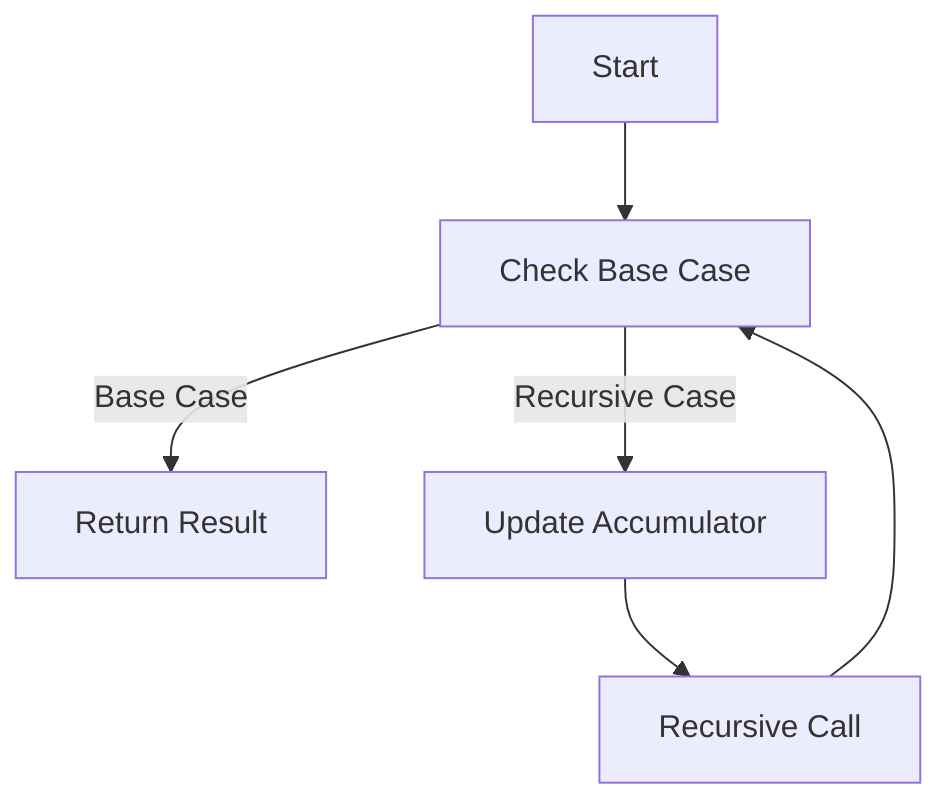

## 19.3 Tail Call Optimization and Stack Usage

In the realm of functional programming, recursion is a fundamental concept that allows us to solve problems by defining a function in terms of itself. However, recursion can lead to significant stack usage, which may result in stack overflow errors if not managed properly. This is where **Tail Call Optimization (TCO)** comes into play. In this section, we will explore the concept of tail recursion, how tail call optimization works, and how to effectively manage stack usage in Haskell.

### Understanding Tail Recursion

**Tail recursion** is a specific form of recursion where the recursive call is the last operation in the function. This means that the function returns the result of the recursive call directly, without any additional computation. Tail recursion is crucial because it allows the compiler to optimize the recursive calls, transforming them into iterative loops that do not consume additional stack space.

#### Key Characteristics of Tail Recursion

- **Last Call**: The recursive call must be the last operation in the function.
- **No Further Computation**: There should be no additional computation after the recursive call.
- **Direct Return**: The result of the recursive call is returned directly.

#### Example of Tail Recursion

Consider the following example of a tail-recursive function that calculates the factorial of a number:

```haskell
factorial :: Integer -> Integer
factorial n = go n 1
  where
    go 0 acc = acc
    go n acc = go (n - 1) (n * acc)
```

In this example, the `go` function is tail-recursive because the recursive call to `go` is the last operation performed. The accumulator `acc` carries the result of the computation, allowing the function to be optimized by the compiler.

### Implementing Tail Call Optimization

Tail call optimization is a technique used by compilers to optimize tail-recursive functions. When a function is tail-recursive, the compiler can replace the recursive call with a jump instruction, effectively transforming the recursion into iteration. This optimization eliminates the need for additional stack frames, reducing stack usage and preventing stack overflow errors.

#### Steps to Implement Tail Call Optimization

1. **Identify Tail-Recursive Functions**: Determine which functions in your code are tail-recursive.
2. **Refactor Non-Tail-Recursive Functions**: Refactor functions that are not tail-recursive to make them tail-recursive, if possible.
3. **Use Accumulators**: Introduce accumulators to carry the result of the computation through recursive calls.
4. **Leverage Compiler Optimizations**: Ensure that your compiler is configured to perform tail call optimization.

#### Refactoring to Tail Recursion

Let's refactor a non-tail-recursive function to make it tail-recursive. Consider the following non-tail-recursive implementation of the Fibonacci sequence:

```haskell
fibonacci :: Integer -> Integer
fibonacci 0 = 0
fibonacci 1 = 1
fibonacci n = fibonacci (n - 1) + fibonacci (n - 2)
```

This implementation is not tail-recursive because the recursive calls are not the last operations. We can refactor it to be tail-recursive using an accumulator:

```haskell
fibonacci :: Integer -> Integer
fibonacci n = go n 0 1
  where
    go 0 a _ = a
    go n a b = go (n - 1) b (a + b)
```

In this refactored version, the `go` function is tail-recursive, and the accumulators `a` and `b` carry the results of the computation.

### Benefits of Tail Call Optimization

Tail call optimization offers several benefits, particularly in functional programming languages like Haskell:

- **Reduced Stack Usage**: By transforming recursion into iteration, TCO reduces stack usage, preventing stack overflow errors.
- **Improved Performance**: TCO can improve the performance of recursive functions by eliminating the overhead of additional stack frames.
- **Scalability**: Tail-recursive functions can handle larger input sizes without running into stack limitations.

### Visualizing Tail Call Optimization

To better understand how tail call optimization works, let's visualize the process using a flowchart. The following diagram illustrates the transformation of a tail-recursive function into an iterative loop:



In this flowchart, the recursive call is replaced with a loop that updates the accumulator and checks the base case, effectively transforming the recursion into iteration.

### Haskell's Support for Tail Call Optimization

Haskell, as a functional programming language, provides excellent support for tail call optimization. The Glasgow Haskell Compiler (GHC) is capable of optimizing tail-recursive functions, allowing developers to write efficient recursive code without worrying about stack overflow errors.

#### Compiler Flags for Tail Call Optimization

To ensure that GHC performs tail call optimization, you can use the `-O2` optimization flag when compiling your Haskell code. This flag enables various optimizations, including TCO:

```bash
ghc -O2 MyProgram.hs
```

### Common Pitfalls and Considerations

While tail call optimization is a powerful technique, there are some common pitfalls and considerations to keep in mind:

- **Not All Recursion Can Be Tail-Recursive**: Some recursive functions cannot be refactored to be tail-recursive. In such cases, consider alternative approaches, such as using data structures like lists or trees.
- **Accumulators and State**: Introducing accumulators can complicate the logic of your functions. Ensure that the state carried by accumulators is managed correctly.
- **Compiler Limitations**: While GHC supports tail call optimization, other Haskell compilers may not. Be aware of the capabilities of the compiler you are using.

### Try It Yourself

To deepen your understanding of tail call optimization, try modifying the following code examples:

1. **Factorial Function**: Modify the tail-recursive factorial function to calculate the factorial of a number using a different approach, such as using a list to accumulate results.
2. **Fibonacci Sequence**: Experiment with different accumulator strategies in the tail-recursive Fibonacci function to see how they affect performance and stack usage.

### Further Reading

For more information on tail call optimization and stack usage in Haskell, consider exploring the following resources:

- [Haskell Wiki: Tail Recursion](https://wiki.haskell.org/Tail_recursion)
- [GHC User's Guide: Optimization](https://downloads.haskell.org/~ghc/latest/docs/html/users_guide/using-optimisation.html)
- [Functional Programming in Haskell: A Comprehensive Guide](https://www.functionalprogramming.com/haskell)

### Knowledge Check

Before we conclude, let's review some key takeaways:

- Tail recursion is a form of recursion where the recursive call is the last operation in the function.
- Tail call optimization transforms tail-recursive functions into iterative loops, reducing stack usage.
- Haskell's GHC compiler supports tail call optimization, allowing for efficient recursive code.

### Embrace the Journey

Remember, mastering tail call optimization and stack usage is just one step in your journey as a Haskell developer. As you continue to explore the world of functional programming, keep experimenting, stay curious, and enjoy the process of learning and growing.

## Quiz: Tail Call Optimization and Stack Usage



### What is tail recursion?

- [x] A form of recursion where the recursive call is the last operation in the function.
- [ ] A form of recursion that uses multiple recursive calls.
- [ ] A form of recursion that does not use accumulators.
- [ ] A form of recursion that is not optimized by the compiler.

> **Explanation:** Tail recursion is characterized by the recursive call being the last operation in the function, allowing for optimization.

### What is the primary benefit of tail call optimization?

- [x] Reduced stack usage and prevention of stack overflow errors.
- [ ] Increased complexity of recursive functions.
- [ ] Improved readability of code.
- [ ] Enhanced debugging capabilities.

> **Explanation:** Tail call optimization reduces stack usage by transforming recursion into iteration, preventing stack overflow errors.

### Which compiler flag enables tail call optimization in GHC?

- [x] `-O2`
- [ ] `-O1`
- [ ] `-O3`
- [ ] `-O0`

> **Explanation:** The `-O2` flag enables various optimizations, including tail call optimization, in GHC.

### What is a common pitfall when using accumulators in tail-recursive functions?

- [x] Complicating the logic of functions.
- [ ] Reducing the performance of functions.
- [ ] Increasing stack usage.
- [ ] Decreasing readability of code.

> **Explanation:** Introducing accumulators can complicate the logic of functions, so it's important to manage state correctly.

### Which of the following is NOT a characteristic of tail recursion?

- [ ] The recursive call is the last operation.
- [ ] No further computation after the recursive call.
- [x] Multiple recursive calls in the function.
- [ ] Direct return of the recursive call result.

> **Explanation:** Tail recursion involves a single recursive call as the last operation, with no further computation.

### How can you refactor a non-tail-recursive function to be tail-recursive?

- [x] Introduce accumulators to carry the result of the computation.
- [ ] Use multiple recursive calls.
- [ ] Remove base cases from the function.
- [ ] Increase the number of parameters.

> **Explanation:** Introducing accumulators allows the function to carry the result through recursive calls, making it tail-recursive.

### What is the role of the accumulator in a tail-recursive function?

- [x] To carry the result of the computation through recursive calls.
- [ ] To increase the complexity of the function.
- [ ] To reduce the number of parameters.
- [ ] To eliminate base cases.

> **Explanation:** The accumulator carries the result of the computation, allowing the function to be tail-recursive.

### What happens if a function is not tail-recursive and lacks tail call optimization?

- [x] It may lead to stack overflow errors.
- [ ] It will always run faster.
- [ ] It will use less memory.
- [ ] It will be easier to debug.

> **Explanation:** Without tail call optimization, non-tail-recursive functions can lead to stack overflow errors due to excessive stack usage.

### What is the purpose of the `-O2` flag in GHC?

- [x] To enable various optimizations, including tail call optimization.
- [ ] To disable all optimizations.
- [ ] To increase the number of warnings.
- [ ] To improve debugging capabilities.

> **Explanation:** The `-O2` flag enables optimizations, including tail call optimization, to improve performance.

### True or False: All recursive functions can be refactored to be tail-recursive.

- [ ] True
- [x] False

> **Explanation:** Not all recursive functions can be refactored to be tail-recursive, as some require additional computation after the recursive call.




