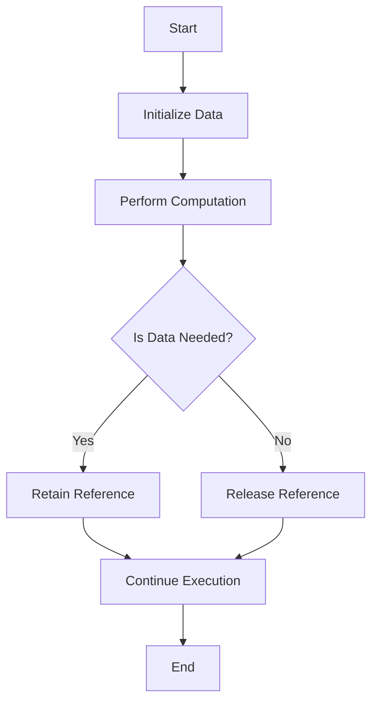

## 19.4 Memory Management and Space Leak Detection

In the realm of functional programming, Haskell stands out with its lazy evaluation strategy and strong static typing. However, these features can sometimes lead to unintended memory retention, commonly known as space leaks. In this section, we will delve into the intricacies of memory management in Haskell, explore the causes and detection of space leaks, and provide strategies to mitigate them.

### Understanding Space Leaks

**Space leaks** occur when a program uses more memory than necessary, often due to retaining references to data that is no longer needed. This can lead to increased memory usage and, in severe cases, cause the program to run out of memory.

#### Causes of Space Leaks

1. **Lazy Evaluation**: Haskell's lazy evaluation defers computation until the result is needed. While this can lead to performance improvements, it can also cause space leaks if unevaluated thunks accumulate.

2. **Inefficient Data Structures**: Using inappropriate data structures can lead to excessive memory usage. For example, lists can be inefficient for certain operations compared to arrays or vectors.

3. **Retaining References**: Holding onto references of data that are no longer needed can prevent the garbage collector from freeing memory.

4. **Recursive Functions**: Improperly defined recursive functions can lead to the accumulation of thunks, causing space leaks.

### Detecting Space Leaks

Detecting space leaks is crucial for optimizing Haskell applications. Here are some tools and techniques to help identify space leaks:

#### Profiling Tools

1. **GHC Profiler**: The Glasgow Haskell Compiler (GHC) provides a built-in profiler that can be used to analyze memory usage. By compiling your program with profiling enabled, you can generate detailed reports on memory allocation and retention.

   ```bash
   ghc -prof -fprof-auto -rtsopts MyProgram.hs
   ./MyProgram +RTS -hc -p
   ```

   This command compiles the program with profiling enabled and generates a heap profile (`MyProgram.hp`) that can be visualized using tools like `hp2ps` or `ghc-vis`.

2. **Heap Profiling**: Heap profiling provides insights into the memory usage of your program over time. By analyzing heap profiles, you can identify patterns of memory growth and pinpoint potential space leaks.

   ```bash
   ./MyProgram +RTS -hT -p
   ```

   This command generates a heap profile with detailed information about memory usage by data type.

#### Analyzing Heap Profiles

Heap profiles can be visualized using tools like `hp2ps` or `ghc-vis`. These tools convert heap profiles into graphical representations, making it easier to identify memory usage patterns and potential leaks.

```bash
hp2ps -c MyProgram.hp
```

This command generates a PostScript file (`MyProgram.ps`) that can be viewed with a PostScript viewer.

### Strategies for Mitigating Space Leaks

Once you've identified a space leak, the next step is to address it. Here are some strategies to help mitigate space leaks in Haskell:

#### Introducing Strictness

1. **Strict Data Structures**: Use strict data structures to force evaluation and prevent the accumulation of thunks. Libraries like `Data.Vector` provide strict alternatives to lazy lists.

2. **Strict Evaluation**: Use strict evaluation to force the evaluation of expressions. The `seq` function and the `BangPatterns` extension can be used to introduce strictness.

   ```haskell
   import Control.DeepSeq (deepseq)

   myFunction :: [Int] -> Int
   myFunction xs = sum xs `deepseq` length xs
   ```

   In this example, `deepseq` forces the evaluation of the sum before calculating the length.

#### Optimizing Data Structures

1. **Choosing the Right Data Structure**: Select data structures that are appropriate for your use case. For example, use `Data.Map` for efficient key-value storage and `Data.Vector` for efficient array-like operations.

2. **Avoiding Unnecessary Lists**: Avoid using lists for operations that require random access or frequent updates. Consider using arrays or vectors instead.

#### Refactoring Recursive Functions

1. **Tail Recursion**: Refactor recursive functions to use tail recursion, which can be optimized by the compiler to reduce memory usage.

   ```haskell
   factorial :: Integer -> Integer
   factorial n = go n 1
     where
       go 0 acc = acc
       go n acc = go (n - 1) (n * acc)
   ```

   This tail-recursive version of the factorial function accumulates the result in an accumulator, reducing memory usage.

2. **Using Accumulators**: Use accumulators to store intermediate results and reduce the number of thunks created during recursion.

#### Managing References

1. **Avoiding Unnecessary References**: Ensure that you do not retain references to data that is no longer needed. This can be achieved by limiting the scope of variables and using local bindings.

2. **Using Weak References**: In some cases, using weak references can help prevent space leaks by allowing the garbage collector to reclaim memory even if references exist.

### Visualizing Space Leaks

To better understand how space leaks occur and how they can be mitigated, let's visualize a simple example using a flowchart.



**Caption**: This flowchart illustrates the decision-making process in a Haskell program that can lead to space leaks. By retaining references to data that is no longer needed, memory usage can increase unnecessarily.

### Code Example: Identifying and Fixing a Space Leak

Let's consider a simple Haskell program that calculates the sum of a list of integers. We'll introduce a space leak and then demonstrate how to fix it.

#### Initial Code with Space Leak

```haskell
-- Calculate the sum of a list of integers
sumList :: [Int] -> Int
sumList [] = 0
sumList (x:xs) = x + sumList xs

main :: IO ()
main = do
    let numbers = [1..1000000]
    print (sumList numbers)
```

In this example, the `sumList` function is defined recursively, and the addition operation creates thunks that accumulate in memory, leading to a space leak.

#### Fixing the Space Leak

To fix the space leak, we can introduce strict evaluation using the `BangPatterns` extension.

```haskell
{-# LANGUAGE BangPatterns #-}

-- Calculate the sum of a list of integers with strict evaluation
sumList :: [Int] -> Int
sumList = go 0
  where
    go !acc [] = acc
    go !acc (x:xs) = go (acc + x) xs

main :: IO ()
main = do
    let numbers = [1..1000000]
    print (sumList numbers)
```

In this version, the accumulator `acc` is evaluated strictly, preventing the accumulation of thunks and eliminating the space leak.

### Try It Yourself

Experiment with the code examples provided. Try modifying the list size or introducing additional computations to observe how memory usage changes. Use the GHC profiler to analyze memory usage and identify potential space leaks in your own programs.

### Knowledge Check

- What is a space leak, and how does it differ from a memory leak?
- How can lazy evaluation contribute to space leaks in Haskell?
- What tools can be used to detect space leaks in Haskell programs?
- How does introducing strictness help mitigate space leaks?
- Why is it important to choose the right data structure for your use case?

### Summary

In this section, we've explored the concept of space leaks in Haskell, identified common causes, and provided strategies for detection and mitigation. By understanding how memory is managed in Haskell and using the tools and techniques discussed, you can optimize your programs for efficient memory usage and prevent space leaks.

Remember, mastering memory management is an ongoing journey. As you continue to develop Haskell applications, keep experimenting with different strategies and tools to ensure optimal performance.

## Quiz: Memory Management and Space Leak Detection



### What is a space leak in Haskell?

- [x] Unintended retention of memory due to unevaluated thunks
- [ ] A type of memory leak caused by improper garbage collection
- [ ] A bug in the Haskell compiler
- [ ] An error in the program's logic

> **Explanation:** A space leak occurs when memory is retained unnecessarily, often due to unevaluated thunks in lazy evaluation.

### Which tool is commonly used for profiling memory usage in Haskell?

- [x] GHC Profiler
- [ ] Valgrind
- [ ] JProfiler
- [ ] VisualVM

> **Explanation:** The GHC Profiler is a built-in tool in the Glasgow Haskell Compiler used for profiling memory usage.

### How can strict evaluation help prevent space leaks?

- [x] By forcing the evaluation of expressions, reducing the accumulation of thunks
- [ ] By delaying computation until the result is needed
- [ ] By increasing the program's execution time
- [ ] By using lazy data structures

> **Explanation:** Strict evaluation forces the evaluation of expressions, preventing the accumulation of unevaluated thunks that can lead to space leaks.

### What is the purpose of using the `BangPatterns` extension in Haskell?

- [x] To introduce strict evaluation in data structures and functions
- [ ] To enable lazy evaluation
- [ ] To improve type inference
- [ ] To allow for dynamic typing

> **Explanation:** The `BangPatterns` extension is used to introduce strict evaluation, helping to prevent space leaks by forcing evaluation.

### Which data structure is more efficient for random access operations in Haskell?

- [x] Data.Vector
- [ ] Lists
- [ ] Data.Map
- [ ] Data.Set

> **Explanation:** `Data.Vector` is more efficient for random access operations compared to lists, which are better suited for sequential access.

### What is a common cause of space leaks in recursive functions?

- [x] Accumulation of thunks due to non-tail-recursive definitions
- [ ] Use of strict evaluation
- [ ] Use of tail recursion
- [ ] Use of accumulators

> **Explanation:** Non-tail-recursive definitions can lead to the accumulation of thunks, causing space leaks in recursive functions.

### How can heap profiling help identify space leaks?

- [x] By providing insights into memory usage patterns over time
- [ ] By increasing the program's execution time
- [ ] By delaying computation until the result is needed
- [ ] By using lazy data structures

> **Explanation:** Heap profiling provides insights into memory usage patterns, helping to identify potential space leaks.

### What is the benefit of using weak references in Haskell?

- [x] They allow the garbage collector to reclaim memory even if references exist
- [ ] They prevent the garbage collector from reclaiming memory
- [ ] They increase memory usage
- [ ] They improve type inference

> **Explanation:** Weak references allow the garbage collector to reclaim memory even if references exist, helping to prevent space leaks.

### What is the role of the `deepseq` function in Haskell?

- [x] To force the evaluation of an expression to normal form
- [ ] To delay computation until the result is needed
- [ ] To enable lazy evaluation
- [ ] To improve type inference

> **Explanation:** The `deepseq` function forces the evaluation of an expression to normal form, helping to prevent space leaks by ensuring complete evaluation.

### True or False: Space leaks are a type of memory leak caused by improper garbage collection.

- [ ] True
- [x] False

> **Explanation:** Space leaks are not caused by improper garbage collection but by unintended retention of memory due to unevaluated thunks.



Remember, understanding and managing memory in Haskell is crucial for building efficient and performant applications. Keep exploring and experimenting with different strategies to master memory management in Haskell.
