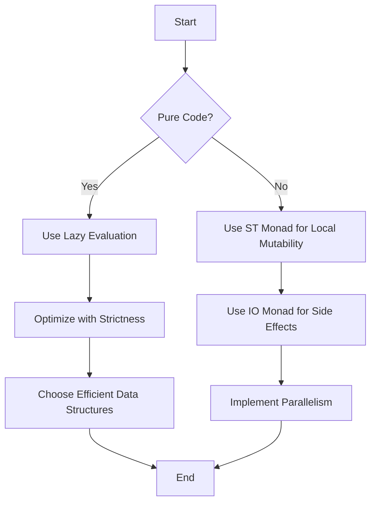

## 19.5 Optimizing Pure and Impure Code

In the realm of functional programming, Haskell stands out for its emphasis on pure functions and immutability. However, when it comes to performance optimization, especially in computationally intensive tasks, we often need to balance purity with the necessity for efficient execution. This section delves into the strategies and techniques for optimizing both pure and impure code in Haskell, ensuring that we maintain the elegance and safety of functional programming while achieving the performance required for real-world applications.

### Understanding Pure and Impure Code

Before diving into optimization techniques, it's crucial to understand the distinction between pure and impure code in Haskell:

- **Pure Code**: Functions that are deterministic and have no side effects. Given the same input, they always produce the same output. Pure functions are easier to reason about, test, and parallelize.
- **Impure Code**: Functions that may have side effects, such as modifying a variable, performing I/O operations, or relying on external state. Impure code is often necessary for interacting with the outside world or optimizing performance.

### Performance Considerations

When optimizing Haskell code, we must consider several factors:

- **Balancing Purity with Performance Needs**: While pure functions offer many benefits, there are scenarios where performance demands may necessitate the use of impure constructs. The key is to encapsulate impurity and minimize its impact on the overall system.

- **Memory Usage**: Haskell's lazy evaluation can lead to unexpected memory consumption. Understanding and controlling evaluation strategies is crucial for optimizing memory usage.

- **Algorithmic Efficiency**: Choosing the right algorithm and data structures can have a significant impact on performance. Haskell offers a variety of functional data structures that can be leveraged for efficient computation.

### Techniques for Optimizing Pure Code

#### 1. Leveraging Laziness

Haskell's lazy evaluation model allows us to defer computation until the result is needed. This can lead to performance improvements by avoiding unnecessary calculations. However, it can also result in space leaks if not managed properly.

```haskell
-- Example of lazy evaluation
infiniteList :: [Int]
infiniteList = [1..]

takeTen :: [Int]
takeTen = take 10 infiniteList
```

In this example, `infiniteList` is never fully evaluated, and only the first ten elements are computed when `takeTen` is evaluated.

#### 2. Strict Evaluation

In some cases, forcing strict evaluation can prevent space leaks and improve performance. Haskell provides mechanisms such as `seq` and `BangPatterns` to enforce strictness.

```haskell
-- Using seq to force evaluation
strictSum :: [Int] -> Int
strictSum xs = go 0 xs
  where
    go acc []     = acc
    go acc (y:ys) = let acc' = acc + y
                    in acc' `seq` go acc' ys
```

Here, `seq` ensures that `acc'` is evaluated before proceeding with the recursion, preventing the accumulation of thunks.

#### 3. Using Efficient Data Structures

Haskell's standard library offers a range of efficient data structures, such as `Data.Vector` for arrays and `Data.Map` for associative arrays. These structures provide better performance characteristics compared to lists for certain operations.

```haskell
import qualified Data.Vector as V

-- Using Data.Vector for efficient array operations
vectorSum :: V.Vector Int -> Int
vectorSum = V.foldl' (+) 0
```

### Techniques for Optimizing Impure Code

#### 1. The `ST` Monad for Local Mutability

The `ST` monad allows for mutable state within a local scope, providing a way to perform imperative-style programming without sacrificing purity. This is particularly useful for algorithms that require in-place updates.

```haskell
import Control.Monad.ST
import Data.STRef

-- Using ST monad for local mutability
factorialST :: Int -> Int
factorialST n = runST $ do
    ref <- newSTRef 1
    mapM_ (modifySTRef ref . (*)) [1..n]
    readSTRef ref
```

In this example, `STRef` is used to maintain a mutable reference, allowing us to compute the factorial in an imperative style while keeping the function pure from the outside.

#### 2. The `IO` Monad for Side Effects

The `IO` monad is used to handle side effects in Haskell. While it introduces impurity, it is essential for interacting with the outside world, such as reading from or writing to files.

```haskell
-- Using IO monad for file operations
readFileContents :: FilePath -> IO String
readFileContents path = do
    contents <- readFile path
    return contents
```

#### 3. Parallel and Concurrent Programming

Haskell provides several libraries and constructs for parallel and concurrent programming, such as `Control.Parallel` and `Control.Concurrent`. These can be used to improve performance by leveraging multi-core processors.

```haskell
import Control.Parallel.Strategies

-- Parallel map using parList
parallelMap :: (a -> b) -> [a] -> [b]
parallelMap f xs = runEval $ do
    ys <- parList rseq (map f xs)
    return ys
```

### Example: Implementing Efficient Algorithms

Let's consider an example where we implement an efficient algorithm using both pure and impure techniques. We'll compute the Fibonacci sequence using memoization to optimize performance.

```haskell
import Data.Array

-- Pure memoized Fibonacci using arrays
memoFib :: Int -> Integer
memoFib n = fibArray ! n
  where
    fibArray = listArray (0, n) [fib i | i <- [0..n]]
    fib 0 = 0
    fib 1 = 1
    fib i = fibArray ! (i - 1) + fibArray ! (i - 2)

-- Impure Fibonacci using ST monad for in-place updates
fibST :: Int -> Integer
fibST n = runST $ do
    arr <- newArray (0, n) 0
    writeArray arr 0 0
    writeArray arr 1 1
    forM_ [2..n] $ \i -> do
        a <- readArray arr (i - 1)
        b <- readArray arr (i - 2)
        writeArray arr i (a + b)
    readArray arr n
```

In the pure version, we use an immutable array to store previously computed Fibonacci numbers, while in the impure version, we use the `ST` monad to perform in-place updates.

### Visualizing Pure and Impure Code Optimization

To better understand the flow of pure and impure code optimization, let's visualize the process using a flowchart.



This flowchart illustrates the decision-making process when optimizing code, guiding us through the steps for both pure and impure scenarios.

### Try It Yourself

Experiment with the code examples provided in this section. Try modifying the Fibonacci implementations to see how changes affect performance. Consider:

- Implementing additional optimizations, such as using `Data.Vector` for the pure version.
- Comparing the performance of the pure and impure versions using benchmarking tools like `Criterion`.

### References and Further Reading

- [Haskell Wiki - Performance](https://wiki.haskell.org/Performance)
- [Real World Haskell - Performance Tuning](http://book.realworldhaskell.org/read/performance-tuning.html)
- [GHC User's Guide - Optimization](https://downloads.haskell.org/~ghc/latest/docs/html/users_guide/using-optimisation.html)

### Knowledge Check

- What are the benefits of using the `ST` monad for local mutability?
- How does lazy evaluation impact memory usage in Haskell?
- Why is it important to balance purity with performance needs?

### Embrace the Journey

Remember, optimizing Haskell code is a journey of balancing purity with performance. As you progress, you'll discover new techniques and strategies to enhance your applications. Keep experimenting, stay curious, and enjoy the journey!

## Quiz: Optimizing Pure and Impure Code



### What is a key benefit of using pure functions in Haskell?

- [x] They are deterministic and have no side effects.
- [ ] They allow for direct manipulation of state.
- [ ] They are always faster than impure functions.
- [ ] They require less memory.

> **Explanation:** Pure functions are deterministic and have no side effects, making them easier to reason about and test.

### Which monad is used for local mutability in Haskell?

- [ ] IO
- [x] ST
- [ ] Maybe
- [ ] Either

> **Explanation:** The `ST` monad is used for local mutability, allowing for imperative-style programming within a pure context.

### How can lazy evaluation lead to performance issues?

- [x] It can cause space leaks if not managed properly.
- [ ] It always increases memory usage.
- [ ] It forces all computations to be evaluated immediately.
- [ ] It prevents the use of efficient data structures.

> **Explanation:** Lazy evaluation can lead to space leaks if thunks accumulate without being evaluated.

### What is the purpose of the `seq` function in Haskell?

- [x] To force the evaluation of an expression.
- [ ] To create a new thread.
- [ ] To perform I/O operations.
- [ ] To define a new data type.

> **Explanation:** The `seq` function is used to force the evaluation of an expression, helping to prevent space leaks.

### Which data structure is recommended for efficient array operations in Haskell?

- [ ] List
- [x] Data.Vector
- [ ] Data.Map
- [ ] Data.Set

> **Explanation:** `Data.Vector` provides efficient array operations and is recommended for performance-critical tasks.

### What is a common use case for the `IO` monad in Haskell?

- [ ] Performing pure calculations.
- [x] Handling side effects like file I/O.
- [ ] Defining new data types.
- [ ] Creating immutable data structures.

> **Explanation:** The `IO` monad is used to handle side effects, such as reading from or writing to files.

### How can parallelism be achieved in Haskell?

- [ ] By using the `Maybe` monad.
- [ ] By using the `Either` monad.
- [x] By using libraries like `Control.Parallel`.
- [ ] By using only pure functions.

> **Explanation:** Parallelism can be achieved using libraries like `Control.Parallel`, which provide constructs for parallel computation.

### What is the main advantage of using the `ST` monad over the `IO` monad?

- [x] It allows for local mutability without side effects.
- [ ] It is faster for all operations.
- [ ] It can perform network operations.
- [ ] It is easier to use for beginners.

> **Explanation:** The `ST` monad allows for local mutability while maintaining purity, unlike the `IO` monad, which introduces side effects.

### True or False: Haskell's lazy evaluation always improves performance.

- [ ] True
- [x] False

> **Explanation:** Lazy evaluation does not always improve performance; it can lead to space leaks if not managed properly.

### Which optimization technique involves using `BangPatterns`?

- [ ] Lazy evaluation
- [x] Strict evaluation
- [ ] Parallel computation
- [ ] Type inference

> **Explanation:** `BangPatterns` are used to enforce strict evaluation, helping to prevent space leaks and improve performance.


