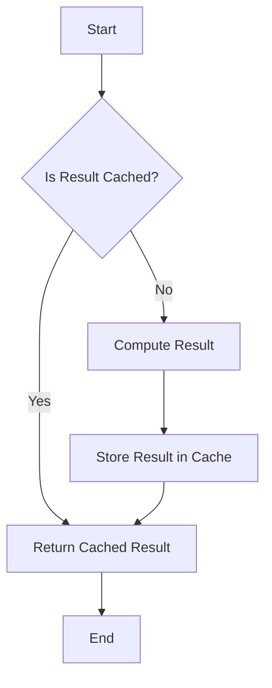

## 19.6 Caching Strategies and Memoization

In the realm of functional programming, especially in Haskell, optimizing performance is crucial for building efficient and scalable applications. One of the key techniques to achieve this is through caching and memoization. These strategies allow us to store the results of expensive computations and reuse them when needed, significantly reducing computation time and resource usage.

### Understanding Caching

**Caching** is a technique used to store the results of expensive computations or frequently accessed data in a temporary storage area, known as a cache. By doing so, we can quickly retrieve the stored results without having to recompute them, thus improving the performance of our applications.

#### Key Concepts of Caching

- **Cache Hit and Miss**: A cache hit occurs when the requested data is found in the cache, while a cache miss occurs when the data is not found, necessitating a recomputation or retrieval from the original source.
- **Cache Eviction Policies**: These policies determine which data should be removed from the cache when it reaches its storage limit. Common policies include Least Recently Used (LRU), First In First Out (FIFO), and Least Frequently Used (LFU).
- **Cache Consistency**: Ensuring that the cached data remains consistent with the original data source, especially in dynamic environments where data changes frequently.

### Memoization in Haskell

**Memoization** is a specific form of caching where the results of function calls are stored, allowing subsequent calls with the same arguments to return the cached result instead of recalculating it. In Haskell, memoization can be particularly powerful due to its lazy evaluation model.

#### Lazy Evaluation and Memoization

Haskell's lazy evaluation model allows expressions to be evaluated only when needed. This characteristic can be leveraged for memoization, as it enables the deferred computation of values until they are actually required.

```haskell
-- Example of lazy evaluation with memoization
fib :: Int -> Integer
fib = (map fib' [0 ..] !!)
  where
    fib' 0 = 0
    fib' 1 = 1
    fib' n = fib (n - 1) + fib (n - 2)
```

In this example, the Fibonacci sequence is computed using a list that memoizes the results of previous computations. The use of `map` and list indexing allows for efficient retrieval of previously computed values.

### Memoization Libraries in Haskell

Haskell offers several libraries that facilitate memoization, making it easier to implement caching strategies in your applications.

#### MemoTrie

[MemoTrie](https://hackage.haskell.org/package/MemoTrie) is a popular Haskell library that provides a generic framework for memoizing functions. It uses tries (prefix trees) to store function results, allowing for efficient retrieval.

```haskell
import Data.MemoTrie

-- Memoized Fibonacci function using MemoTrie
fibMemo :: Integer -> Integer
fibMemo = memo fib'
  where
    fib' 0 = 0
    fib' 1 = 1
    fib' n = fibMemo (n - 1) + fibMemo (n - 2)
```

In this example, `memo` is used to automatically memoize the `fib'` function, significantly improving its performance by avoiding redundant calculations.

### Implementing Caching Strategies

Implementing effective caching strategies in Haskell involves understanding the specific needs of your application and choosing the right tools and techniques.

#### Choosing the Right Cache

- **In-Memory Caches**: Suitable for applications where data can be stored in RAM for fast access. Examples include using data structures like `Data.Map` or `Data.HashMap`.
- **Persistent Caches**: Useful for applications that require data to be stored across sessions. Options include using databases or file systems.

#### Designing Cache Eviction Policies

Designing an appropriate cache eviction policy is crucial for maintaining cache efficiency. Consider the following factors:

- **Access Patterns**: Analyze how frequently data is accessed and choose a policy that aligns with these patterns.
- **Data Volatility**: For dynamic data, consider policies that prioritize freshness, such as LRU.
- **Resource Constraints**: Ensure that the cache size and eviction policy do not exceed available resources.

### Advanced Memoization Techniques

Beyond basic memoization, Haskell offers advanced techniques that can further optimize performance.

#### Function Composition and Memoization

By composing functions, we can create more complex memoization strategies that leverage the power of Haskell's type system and higher-order functions.

```haskell
-- Composing memoized functions
composeMemo :: (b -> c) -> (a -> b) -> a -> c
composeMemo f g = memo (f . g)

-- Example usage
square :: Int -> Int
square x = x * x

increment :: Int -> Int
increment x = x + 1

memoizedFunction :: Int -> Int
memoizedFunction = composeMemo square increment
```

In this example, `composeMemo` demonstrates how to memoize the composition of two functions, `square` and `increment`, resulting in a more efficient computation.

#### Memoization with Type Classes

Haskell's type classes can be used to create generic memoization strategies that work across different data types.

```haskell
class Memoizable a where
  memoize :: (a -> b) -> a -> b

instance Memoizable Int where
  memoize = memo

-- Example usage with a custom data type
data CustomType = CustomType Int

instance Memoizable CustomType where
  memoize f (CustomType x) = memo (f . CustomType) x
```

This example illustrates how to define a `Memoizable` type class that provides a generic `memoize` function, allowing for flexible memoization across various data types.

### Visualizing Caching and Memoization

To better understand caching and memoization, let's visualize the process using a flowchart.



**Figure 1: Caching and Memoization Flowchart**  
This flowchart illustrates the decision-making process involved in caching and memoization. If the result is cached, it is returned immediately; otherwise, it is computed, stored in the cache, and then returned.

### Design Considerations

When implementing caching and memoization in Haskell, consider the following:

- **Memory Usage**: Be mindful of the memory footprint of your cache, especially when dealing with large data sets.
- **Concurrency**: Ensure that your caching strategy is thread-safe if your application is concurrent.
- **Cache Invalidation**: Implement mechanisms to invalidate or update cached data when the underlying data changes.

### Haskell Unique Features

Haskell's unique features, such as lazy evaluation and strong static typing, make it particularly well-suited for implementing efficient caching and memoization strategies. By leveraging these features, you can build highly performant applications that take full advantage of Haskell's capabilities.

### Differences and Similarities

Caching and memoization are often confused with each other, but they serve different purposes:

- **Caching** is a broader concept that involves storing any data for quick access, while **memoization** specifically refers to storing function results.
- Both techniques aim to improve performance by reducing redundant computations, but memoization is typically more granular and function-specific.

### Try It Yourself

To deepen your understanding of caching and memoization in Haskell, try modifying the provided code examples:

- Experiment with different cache eviction policies and observe their impact on performance.
- Implement memoization for a different recursive function, such as factorial or Ackermann's function.
- Explore the use of other memoization libraries, such as `MemoCombinators`, and compare their performance.

### Knowledge Check

Before moving on, let's review some key concepts:

- What is the difference between caching and memoization?
- How does lazy evaluation enhance memoization in Haskell?
- What are some common cache eviction policies?

### Embrace the Journey

Remember, mastering caching and memoization in Haskell is just one step in your journey to becoming an expert in functional programming. As you continue to explore and experiment, you'll discover new ways to optimize your applications and harness the full power of Haskell. Keep pushing the boundaries, stay curious, and enjoy the process!

## Quiz: Caching Strategies and Memoization



### What is the primary purpose of caching?

- [x] To store results of expensive computations for quick access
- [ ] To increase the complexity of algorithms
- [ ] To reduce the readability of code
- [ ] To slow down program execution

> **Explanation:** Caching is used to store results of expensive computations, allowing for quick access and improved performance.

### How does memoization differ from caching?

- [x] Memoization specifically stores function results
- [ ] Memoization is a broader concept than caching
- [ ] Memoization is unrelated to caching
- [ ] Memoization is used to slow down computations

> **Explanation:** Memoization is a specific form of caching that stores the results of function calls for reuse.

### What is a cache hit?

- [x] When the requested data is found in the cache
- [ ] When the requested data is not found in the cache
- [ ] When the cache is full
- [ ] When the cache is empty

> **Explanation:** A cache hit occurs when the requested data is found in the cache, allowing for quick retrieval.

### Which Haskell feature enhances memoization?

- [x] Lazy evaluation
- [ ] Dynamic typing
- [ ] Implicit concurrency
- [ ] Weak typing

> **Explanation:** Lazy evaluation in Haskell allows expressions to be evaluated only when needed, enhancing memoization by deferring computations.

### What is a common cache eviction policy?

- [x] Least Recently Used (LRU)
- [ ] Most Recently Used (MRU)
- [ ] Random Eviction
- [ ] Always Keep

> **Explanation:** Least Recently Used (LRU) is a common cache eviction policy that removes the least recently accessed data when the cache is full.

### Which library is commonly used for memoization in Haskell?

- [x] MemoTrie
- [ ] Data.List
- [ ] Control.Monad
- [ ] System.IO

> **Explanation:** MemoTrie is a popular Haskell library used for memoizing functions efficiently.

### What is the role of cache consistency?

- [x] Ensuring cached data remains consistent with the original source
- [ ] Increasing the size of the cache
- [ ] Reducing the speed of data retrieval
- [ ] Making the cache volatile

> **Explanation:** Cache consistency ensures that the cached data remains consistent with the original data source, especially in dynamic environments.

### How can type classes be used in memoization?

- [x] To create generic memoization strategies across data types
- [ ] To slow down the memoization process
- [ ] To increase the complexity of memoization
- [ ] To make memoization impossible

> **Explanation:** Type classes in Haskell can be used to create generic memoization strategies that work across different data types.

### What is the benefit of using persistent caches?

- [x] Data can be stored across sessions
- [ ] Data is lost after each session
- [ ] Data retrieval is slower
- [ ] Data is never consistent

> **Explanation:** Persistent caches allow data to be stored across sessions, making them useful for applications that require long-term data storage.

### True or False: Memoization is unrelated to caching.

- [ ] True
- [x] False

> **Explanation:** False. Memoization is a specific form of caching that involves storing function results for reuse.


