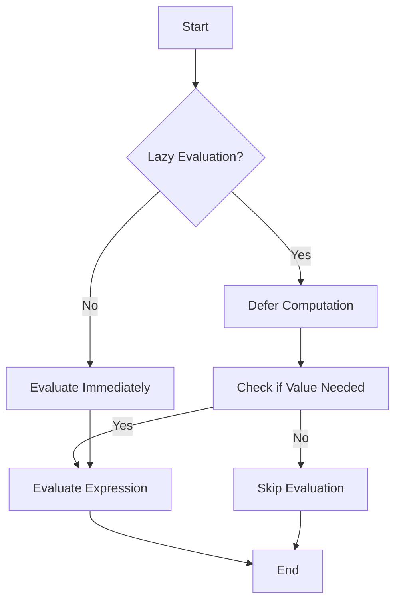

## 19.7 Lazy vs. Strict Evaluation Trade-Offs

In Haskell, understanding the nuances of lazy versus strict evaluation is crucial for optimizing performance and ensuring efficient resource utilization. As expert software engineers and architects, mastering these concepts allows us to make informed decisions that can significantly impact the behavior and efficiency of our Haskell programs.

### Understanding Evaluation

#### Lazy Evaluation

Lazy evaluation, also known as call-by-need, is a strategy where expressions are not evaluated until their values are actually needed. This approach can lead to significant performance improvements by avoiding unnecessary computations and enabling the creation of infinite data structures.

**Key Characteristics of Lazy Evaluation:**

- **Deferred Computation:** Expressions are only evaluated when required.
- **Potential for Infinite Structures:** Enables the use of constructs like infinite lists.
- **Memory Efficiency:** Can reduce memory usage by not evaluating unused expressions.

#### Strict Evaluation

Strict evaluation, or call-by-value, evaluates expressions as soon as they are bound to variables. This approach can be more predictable in terms of performance, as it avoids the overhead of managing deferred computations.

**Key Characteristics of Strict Evaluation:**

- **Immediate Computation:** Expressions are evaluated immediately.
- **Predictable Resource Usage:** More predictable memory and CPU usage.
- **Avoids Thunks:** Reduces the overhead associated with managing thunks (deferred computations).

### Impact on Performance

The choice between lazy and strict evaluation can have profound implications on both space and time efficiency.

#### Space Efficiency

Lazy evaluation can lead to space leaks if not managed carefully. A space leak occurs when memory that is no longer needed is not released, often due to unevaluated thunks accumulating in memory.

**Example of a Space Leak:**

```haskell
sumList :: [Int] -> Int
sumList = foldl (+) 0
```

In the above example, using `foldl` (which is lazy) can lead to a space leak because it builds up a large chain of unevaluated thunks. Switching to `foldl'` from `Data.List`, which is strict, can alleviate this issue:

```haskell
import Data.List (foldl')

sumListStrict :: [Int] -> Int
sumListStrict = foldl' (+) 0
```

#### Time Efficiency

Lazy evaluation can sometimes introduce additional overhead due to the need to manage thunks. In contrast, strict evaluation can lead to faster execution times by avoiding this overhead, especially in scenarios where all data is eventually needed.

**Example of Time Efficiency:**

Consider a scenario where we need to process a large list of numbers:

```haskell
processList :: [Int] -> Int
processList = sum . map (*2)
```

If the entire list is needed, using strict evaluation can be more efficient:

```haskell
processListStrict :: [Int] -> Int
processListStrict xs = sum $! map (*2) xs
```

### Strategies for Managing Evaluation

#### Using Strict Data Types

Haskell provides strict data types and fields to help manage evaluation strategies. By using strict data types, we can ensure that certain computations are performed immediately, reducing the risk of space leaks.

**Example of Strict Data Types:**

```haskell
data StrictPair a b = StrictPair !a !b
```

In this example, the `!` symbol before the type indicates that the field is strict, meaning it will be evaluated immediately.

#### Leveraging `seq` and `deepseq`

The `seq` function can be used to force the evaluation of an expression to weak head normal form (WHNF), while `deepseq` forces evaluation to normal form (NF).

**Example Using `seq`:**

```haskell
forceEvaluation :: Int -> Int -> Int
forceEvaluation x y = x `seq` y
```

**Example Using `deepseq`:**

```haskell
import Control.DeepSeq (deepseq)

forceDeepEvaluation :: [Int] -> Int
forceDeepEvaluation xs = xs `deepseq` sum xs
```

### Visualizing Lazy vs. Strict Evaluation

To better understand the differences between lazy and strict evaluation, let's visualize the evaluation process using a flowchart.



**Diagram Description:** This flowchart illustrates the decision-making process in lazy versus strict evaluation. In lazy evaluation, computation is deferred until the value is needed, whereas in strict evaluation, expressions are evaluated immediately.

### Practical Considerations

#### When to Use Lazy Evaluation

- **Infinite Data Structures:** When working with potentially infinite data structures, lazy evaluation is essential.
- **Conditional Computation:** When only a subset of data is needed based on certain conditions.
- **Avoiding Unnecessary Computation:** When you want to avoid computing values that may not be used.

#### When to Use Strict Evaluation

- **Predictable Resource Usage:** When you need predictable memory and CPU usage.
- **Avoiding Space Leaks:** When managing large data sets where space leaks are a concern.
- **Performance Optimization:** When the overhead of managing thunks outweighs the benefits of deferred computation.

### Haskell Unique Features

Haskell's lazy evaluation is a unique feature that sets it apart from many other programming languages. This feature allows for elegant solutions to complex problems, such as infinite data structures and modular program design. However, it also requires careful management to avoid pitfalls like space leaks.

### Differences and Similarities

Lazy and strict evaluation are often confused due to their subtle differences. While lazy evaluation defers computation, strict evaluation performs it immediately. Understanding these differences is crucial for making informed decisions about which strategy to use in different scenarios.

### Try It Yourself

Experiment with the following code examples to see the effects of lazy and strict evaluation in action. Try modifying the examples to observe how changes impact performance and resource usage.

```haskell
-- Lazy Evaluation Example
lazySum :: [Int] -> Int
lazySum = foldl (+) 0

-- Strict Evaluation Example
strictSum :: [Int] -> Int
strictSum = foldl' (+) 0

main :: IO ()
main = do
    let largeList = [1..1000000]
    print $ lazySum largeList
    print $ strictSum largeList
```

### Knowledge Check

- What are the key differences between lazy and strict evaluation?
- How can space leaks occur in lazy evaluation, and how can they be mitigated?
- When might strict evaluation be more beneficial than lazy evaluation?

### Embrace the Journey

Remember, mastering lazy and strict evaluation in Haskell is just the beginning. As you continue to explore these concepts, you'll gain deeper insights into how they can be leveraged to build efficient and scalable Haskell applications. Keep experimenting, stay curious, and enjoy the journey!

## Quiz: Lazy vs. Strict Evaluation Trade-Offs



### What is lazy evaluation?

- [x] Evaluation of expressions is deferred until their values are needed.
- [ ] Evaluation of expressions occurs immediately.
- [ ] Evaluation of expressions is based on a fixed schedule.
- [ ] Evaluation of expressions is random.

> **Explanation:** Lazy evaluation defers the computation of expressions until their values are actually needed, which can lead to performance improvements by avoiding unnecessary computations.

### What is a potential downside of lazy evaluation?

- [x] Space leaks due to unevaluated thunks.
- [ ] Immediate computation of all expressions.
- [ ] Inability to handle infinite data structures.
- [ ] Increased memory usage due to strict evaluation.

> **Explanation:** Lazy evaluation can lead to space leaks if unevaluated thunks accumulate in memory, consuming resources unnecessarily.

### How can strict evaluation improve performance?

- [x] By avoiding the overhead of managing thunks.
- [ ] By deferring computation until needed.
- [ ] By enabling the use of infinite data structures.
- [ ] By increasing memory usage.

> **Explanation:** Strict evaluation can improve performance by avoiding the overhead associated with managing deferred computations (thunks).

### Which function forces evaluation to weak head normal form (WHNF)?

- [x] `seq`
- [ ] `deepseq`
- [ ] `foldl`
- [ ] `map`

> **Explanation:** The `seq` function forces evaluation of an expression to weak head normal form (WHNF), which is a partial evaluation.

### What is the purpose of `deepseq`?

- [x] To force evaluation to normal form (NF).
- [ ] To defer computation until needed.
- [ ] To create infinite data structures.
- [ ] To manage thunks.

> **Explanation:** `deepseq` forces the evaluation of an expression to normal form (NF), ensuring that all parts of the expression are fully evaluated.

### When is lazy evaluation particularly useful?

- [x] When working with infinite data structures.
- [ ] When immediate computation is required.
- [ ] When managing large data sets.
- [ ] When predictable resource usage is needed.

> **Explanation:** Lazy evaluation is particularly useful when working with infinite data structures, as it allows for the creation and manipulation of such structures without evaluating them entirely.

### How can space leaks be mitigated in lazy evaluation?

- [x] By using strict data types and functions like `foldl'`.
- [ ] By deferring computation until needed.
- [ ] By using infinite data structures.
- [ ] By increasing memory usage.

> **Explanation:** Space leaks can be mitigated by using strict data types and functions like `foldl'`, which force evaluation and prevent the accumulation of unevaluated thunks.

### What is a thunk in Haskell?

- [x] A deferred computation.
- [ ] An immediate computation.
- [ ] A type of data structure.
- [ ] A strict evaluation strategy.

> **Explanation:** A thunk is a deferred computation in Haskell, representing an expression that has not yet been evaluated.

### Which evaluation strategy is more predictable in terms of resource usage?

- [x] Strict evaluation
- [ ] Lazy evaluation
- [ ] Deferred evaluation
- [ ] Random evaluation

> **Explanation:** Strict evaluation is more predictable in terms of resource usage because it evaluates expressions immediately, avoiding the overhead of managing thunks.

### True or False: Lazy evaluation always results in better performance than strict evaluation.

- [ ] True
- [x] False

> **Explanation:** Lazy evaluation does not always result in better performance. While it can be beneficial in certain scenarios, such as working with infinite data structures, it can also lead to space leaks and increased overhead due to managing thunks.


