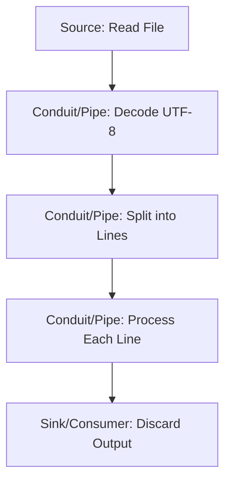

## 19.8 Handling Large Data Sets Efficiently

In the realm of software engineering, efficiently handling large data sets is a critical challenge, especially in functional programming languages like Haskell. This section delves into the strategies and tools available in Haskell to manage large data sets without succumbing to excessive memory usage. We will explore the use of streaming libraries such as **Conduit** and **Pipes**, which are designed to process data incrementally, thus optimizing memory consumption and performance.

### Challenges in Handling Large Data Sets

Handling large data sets efficiently involves several challenges:

- **Memory Usage**: Large data sets can quickly exhaust available memory if not managed properly.
- **Performance**: Processing large data sets can be time-consuming, requiring efficient algorithms and data handling techniques.
- **Concurrency**: Leveraging concurrency to process data in parallel can improve performance but introduces complexity.
- **I/O Bound Operations**: Reading from and writing to disk or network can be bottlenecks in data processing pipelines.

### Solutions for Efficient Data Handling

To address these challenges, Haskell provides powerful abstractions and libraries that facilitate efficient data processing:

- **Streaming Libraries**: Libraries like **Conduit** and **Pipes** allow for streaming data processing, which means data is processed incrementally rather than loading entire data sets into memory.
- **Lazy Evaluation**: Haskell's lazy evaluation model can be leveraged to process data only as needed, reducing memory footprint.
- **Concurrency and Parallelism**: Utilizing Haskell's concurrency primitives can help distribute data processing tasks across multiple cores.

### Streaming Data with Conduit

**Conduit** is a Haskell library that provides a framework for building streaming data processing pipelines. It allows you to process data incrementally, which is ideal for handling large data sets.

#### Key Concepts of Conduit

- **Source**: Represents a producer of data.
- **Sink**: Represents a consumer of data.
- **Conduit**: Represents a transformation of data from a source to a sink.

#### Example: Reading and Processing a Large File

Let's consider an example where we read a large file and process its contents using Conduit:

```haskell
import Conduit

-- | Process a large file line by line
processFile :: FilePath -> IO ()
processFile filePath = runConduitRes $
    sourceFile filePath .| -- Source: Read file
    decodeUtf8C .|         -- Conduit: Decode UTF-8
    linesUnboundedC .|     -- Conduit: Split into lines
    mapC processLine .|    -- Conduit: Process each line
    sinkNull              -- Sink: Discard output

-- | Example line processing function
processLine :: Text -> Text
processLine = T.toUpper
```

In this example, we use `sourceFile` to read the file, `decodeUtf8C` to decode the contents, `linesUnboundedC` to split the contents into lines, and `mapC` to process each line. Finally, `sinkNull` discards the output, but in a real application, you would replace this with a sink that writes the processed data to a file or database.

### Streaming Data with Pipes

**Pipes** is another Haskell library for streaming data processing. It provides a similar abstraction to Conduit but with a different API.

#### Key Concepts of Pipes

- **Producer**: Generates a stream of data.
- **Consumer**: Consumes a stream of data.
- **Pipe**: Transforms data from a producer to a consumer.

#### Example: Reading and Processing a Large File

Here's how you can achieve similar functionality using Pipes:

```haskell
import Pipes
import qualified Pipes.Prelude as P
import qualified Pipes.ByteString as PB
import qualified Data.ByteString.Char8 as BS

-- | Process a large file line by line
processFilePipes :: FilePath -> IO ()
processFilePipes filePath = runEffect $
    PB.fromHandle filePath >-> -- Producer: Read file
    P.map BS.unpack >->        -- Pipe: Convert ByteString to String
    P.map processLine >->      -- Pipe: Process each line
    P.drain                   -- Consumer: Discard output

-- | Example line processing function
processLine :: String -> String
processLine = map toUpper
```

In this example, `PB.fromHandle` reads the file, `P.map` applies transformations, and `P.drain` discards the output.

### Visualizing Data Streaming with Conduit and Pipes

To better understand how data flows through these streaming libraries, let's visualize the process using a flowchart:



This diagram illustrates the flow of data from a source through a series of transformations to a sink or consumer.

### Haskell Unique Features for Data Handling

Haskell's unique features, such as lazy evaluation and strong type system, play a crucial role in efficiently handling large data sets:

- **Lazy Evaluation**: Allows processing of data only when needed, reducing memory usage.
- **Strong Typing**: Ensures data transformations are type-safe, reducing runtime errors.

### Differences and Similarities Between Conduit and Pipes

While both Conduit and Pipes serve similar purposes, they have differences in their APIs and design philosophies:

- **Conduit**: Emphasizes resource management and provides a more comprehensive API for handling various data sources and sinks.
- **Pipes**: Offers a simpler, more compositional API, focusing on the elegance of data transformation.

### Design Considerations

When choosing between Conduit and Pipes, consider the following:

- **Complexity**: Conduit may be more suitable for complex data processing pipelines due to its extensive API.
- **Simplicity**: Pipes may be preferable for simpler tasks due to its compositional nature.

### Try It Yourself

To deepen your understanding, try modifying the code examples to:

- Write the processed data to a file instead of discarding it.
- Implement error handling for file I/O operations.
- Experiment with different data transformations.

### References and Further Reading

- [Conduit on Hackage](https://hackage.haskell.org/package/conduit)
- [Pipes on Hackage](https://hackage.haskell.org/package/pipes)

### Knowledge Check

- What are the key components of a Conduit pipeline?
- How does lazy evaluation help in processing large data sets?
- What are the differences between Conduit and Pipes?

### Embrace the Journey

Remember, mastering the handling of large data sets in Haskell is a journey. As you explore these libraries and techniques, you'll gain a deeper understanding of functional programming and its power in managing data efficiently. Keep experimenting, stay curious, and enjoy the journey!

## Quiz: Handling Large Data Sets Efficiently



### What is the primary advantage of using streaming libraries like Conduit and Pipes in Haskell?

- [x] They allow for incremental data processing, reducing memory usage.
- [ ] They increase the speed of data processing by using more CPU resources.
- [ ] They simplify the syntax of Haskell code.
- [ ] They automatically parallelize data processing tasks.

> **Explanation:** Streaming libraries process data incrementally, which helps in managing memory usage efficiently.

### Which of the following is a key component of a Conduit pipeline?

- [x] Source
- [ ] Producer
- [ ] Generator
- [ ] Collector

> **Explanation:** In Conduit, a Source is a key component that represents a producer of data.

### How does lazy evaluation benefit the processing of large data sets in Haskell?

- [x] It processes data only when needed, reducing memory usage.
- [ ] It speeds up the execution of code by using more CPU cores.
- [ ] It simplifies the syntax of Haskell code.
- [ ] It automatically handles concurrency.

> **Explanation:** Lazy evaluation processes data only as needed, which helps in reducing memory usage.

### What is a key difference between Conduit and Pipes?

- [x] Conduit provides a more comprehensive API for resource management.
- [ ] Pipes automatically parallelize data processing tasks.
- [ ] Conduit is simpler and more compositional than Pipes.
- [ ] Pipes are designed for handling network I/O specifically.

> **Explanation:** Conduit offers a more comprehensive API, particularly for resource management, compared to Pipes.

### Which of the following is a common challenge when handling large data sets?

- [x] Excessive memory usage
- [ ] Lack of available libraries
- [ ] Difficulty in writing Haskell code
- [ ] Limited support for concurrency

> **Explanation:** Excessive memory usage is a common challenge when dealing with large data sets.

### What does the `sinkNull` function do in a Conduit pipeline?

- [x] It discards the output of the pipeline.
- [ ] It writes the output to a file.
- [ ] It converts the output to a different format.
- [ ] It logs the output to the console.

> **Explanation:** `sinkNull` is used to discard the output of a Conduit pipeline.

### In Pipes, what is the role of a Consumer?

- [x] It consumes a stream of data.
- [ ] It generates a stream of data.
- [ ] It transforms data from one format to another.
- [ ] It manages resources for data processing.

> **Explanation:** A Consumer in Pipes is responsible for consuming a stream of data.

### How can concurrency improve the processing of large data sets?

- [x] By distributing tasks across multiple cores, improving performance.
- [ ] By simplifying the syntax of Haskell code.
- [ ] By automatically managing memory usage.
- [ ] By reducing the need for error handling.

> **Explanation:** Concurrency allows tasks to be distributed across multiple cores, which can improve performance.

### What is the purpose of the `mapC` function in a Conduit pipeline?

- [x] It applies a transformation to each element in the stream.
- [ ] It generates a stream of data.
- [ ] It consumes a stream of data.
- [ ] It manages resources for data processing.

> **Explanation:** `mapC` is used to apply a transformation to each element in a Conduit stream.

### True or False: Lazy evaluation in Haskell automatically handles concurrency.

- [ ] True
- [x] False

> **Explanation:** Lazy evaluation is about processing data only when needed, not about handling concurrency.




