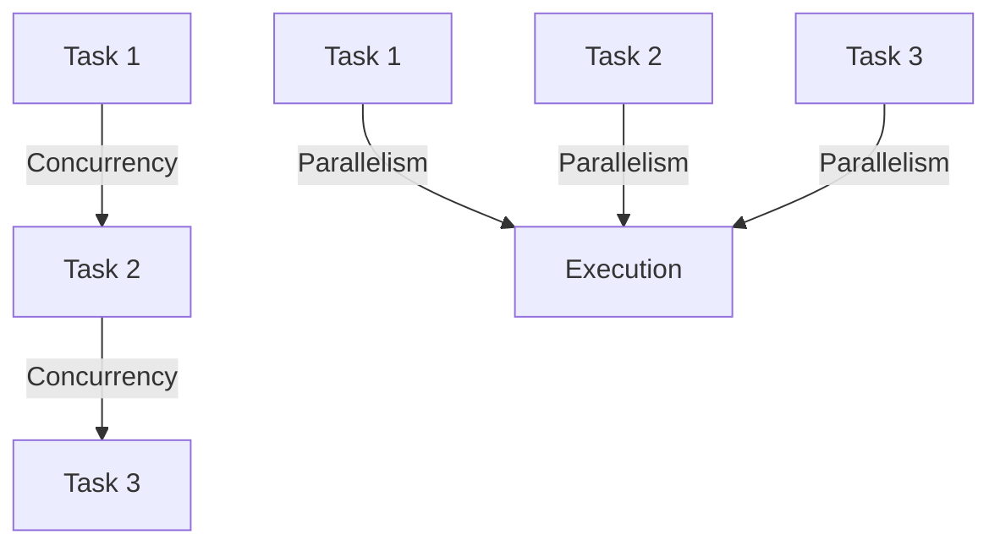
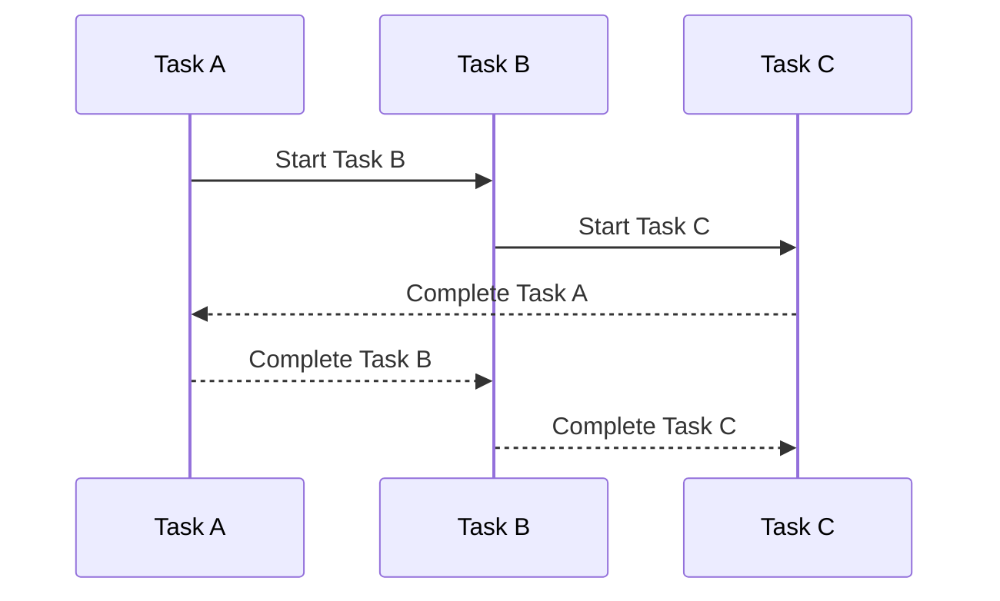

## 19.9 Concurrent and Parallel Performance Tuning

In the realm of high-performance computing, understanding and effectively utilizing concurrency and parallelism is crucial. Haskell, with its robust functional programming paradigm, offers powerful abstractions and libraries to handle concurrent and parallel computations efficiently. In this section, we will delve into the nuances of concurrency and parallelism, explore optimization techniques, and demonstrate how to leverage Haskell's libraries to achieve optimal performance.

### Understanding Concurrency vs. Parallelism

Before diving into performance tuning, it's essential to distinguish between concurrency and parallelism, as they address different types of computational problems.

- **Concurrency** involves managing multiple tasks at once but not necessarily executing them simultaneously. It's particularly useful for I/O-bound tasks where waiting for external resources (like disk or network) is common. Concurrency allows a program to remain responsive by switching between tasks.

- **Parallelism**, on the other hand, involves executing multiple tasks simultaneously, leveraging multiple CPU cores. It's ideal for CPU-bound tasks where computational power is the bottleneck.

Understanding when to apply concurrency or parallelism is key to optimizing performance. Let's visualize these concepts:



**Figure 1:** Concurrency involves task switching, while parallelism involves simultaneous execution.

### Optimization Techniques

To optimize concurrent and parallel performance in Haskell, consider the following techniques:

1. **Balancing Workload**: Distribute tasks evenly across available resources to prevent bottlenecks. Use load balancing strategies to ensure no single resource is overwhelmed.

2. **Minimizing Contention**: Reduce contention for shared resources by minimizing locks and using lock-free data structures where possible. This can significantly improve throughput.

3. **Efficient Data Structures**: Choose data structures that support concurrent access efficiently. Haskell's `STM` (Software Transactional Memory) is a powerful abstraction for managing shared state.

4. **Lazy Evaluation**: Leverage Haskell's lazy evaluation to defer computations until necessary, reducing unnecessary workload.

5. **Profiling and Benchmarking**: Use profiling tools to identify performance bottlenecks and benchmark different approaches to find the most efficient solution.

### Tools and Libraries

Haskell provides several libraries to facilitate concurrent and parallel programming:

#### `async` Library

The `async` library offers a simple interface for asynchronous programming, allowing you to run IO operations concurrently. Here's a basic example:

```haskell
import Control.Concurrent.Async

main :: IO ()
main = do
    -- Run two IO actions concurrently
    (result1, result2) <- concurrently (action1) (action2)
    print (result1, result2)

action1 :: IO String
action1 = do
    -- Simulate a long-running task
    threadDelay 1000000
    return "Action 1 completed"

action2 :: IO String
action2 = do
    -- Simulate another long-running task
    threadDelay 2000000
    return "Action 2 completed"
```

**Key Points**:
- `concurrently` runs two IO actions at the same time.
- The `async` library simplifies handling of asynchronous tasks.

#### `par` and `Strategies` Libraries

For parallelism, the `par` and `Strategies` libraries provide abstractions to parallelize pure computations. Here's an example using `par`:

```haskell
import Control.Parallel (par, pseq)

main :: IO ()
main = do
    let result = fib 35 `par` (fib 36 `pseq` (fib 35 + fib 36))
    print result

fib :: Int -> Int
fib 0 = 0
fib 1 = 1
fib n = fib (n - 1) + fib (n - 2)
```

**Key Points**:
- `par` sparks a parallel computation, while `pseq` ensures order of evaluation.
- Use `par` to hint the runtime to evaluate expressions in parallel.

#### Software Transactional Memory (STM)

STM is a concurrency control mechanism that simplifies managing shared state. Here's an example:

```haskell
import Control.Concurrent.STM

main :: IO ()
main = do
    counter <- atomically $ newTVar 0
    atomically $ modifyTVar' counter (+1)
    value <- atomically $ readTVar counter
    print value
```

**Key Points**:
- `atomically` ensures that transactions are executed in isolation.
- `TVar` is a transactional variable, providing safe concurrent access.

### Design Considerations

When designing concurrent and parallel systems in Haskell, consider the following:

- **Granularity**: Determine the appropriate level of granularity for tasks. Too fine-grained tasks can lead to overhead, while too coarse-grained tasks may not fully utilize resources.

- **Scalability**: Design systems to scale with the number of available cores. Use abstractions that adapt to varying hardware configurations.

- **Fault Tolerance**: Implement mechanisms to handle failures gracefully. Use techniques like retries and circuit breakers to enhance reliability.

- **Testing**: Concurrent and parallel code can be challenging to test. Use property-based testing and simulate different scenarios to ensure correctness.

### Haskell Unique Features

Haskell's unique features, such as lazy evaluation and strong type system, play a significant role in concurrent and parallel programming:

- **Lazy Evaluation**: Allows deferring computations, which can be beneficial in managing workloads dynamically.

- **Type System**: Ensures safety and correctness, reducing runtime errors in concurrent applications.

### Differences and Similarities

Concurrency and parallelism are often confused, but they serve different purposes. Concurrency is about managing multiple tasks, while parallelism is about executing tasks simultaneously. Both can be used together to build efficient systems.

### Try It Yourself

Experiment with the provided code examples by modifying the number of concurrent tasks or changing the computational workload. Observe how these changes affect performance and resource utilization.

### Visualizing Concurrent and Parallel Execution



**Figure 2:** Sequence diagram illustrating concurrent task execution.

### Knowledge Check

- What is the difference between concurrency and parallelism?
- How can you minimize contention in concurrent systems?
- What are the benefits of using STM in Haskell?

### Summary

In this section, we've explored the intricacies of concurrent and parallel performance tuning in Haskell. By understanding the differences between concurrency and parallelism, leveraging Haskell's powerful libraries, and applying optimization techniques, you can build efficient, scalable applications. Remember to experiment, profile, and adapt your approach to suit the specific needs of your application.

## Quiz: Concurrent and Parallel Performance Tuning



### What is the primary use of concurrency in programming?

- [x] Managing multiple tasks at once
- [ ] Executing tasks simultaneously
- [ ] Increasing CPU usage
- [ ] Reducing memory consumption

> **Explanation:** Concurrency is primarily used to manage multiple tasks at once, allowing a program to remain responsive.

### Which Haskell library is commonly used for asynchronous programming?

- [x] `async`
- [ ] `par`
- [ ] `STM`
- [ ] `Strategies`

> **Explanation:** The `async` library provides a simple interface for asynchronous programming in Haskell.

### What is the role of `par` in Haskell's parallel programming?

- [x] To spark a parallel computation
- [ ] To ensure sequential execution
- [ ] To manage shared state
- [ ] To handle I/O operations

> **Explanation:** `par` is used to spark a parallel computation, hinting the runtime to evaluate expressions in parallel.

### How does STM help in concurrent programming?

- [x] By providing transactional memory for safe concurrent access
- [ ] By ensuring sequential execution of tasks
- [ ] By optimizing CPU usage
- [ ] By reducing memory consumption

> **Explanation:** STM provides transactional memory, allowing safe concurrent access to shared state.

### What is a key benefit of lazy evaluation in Haskell?

- [x] Deferring computations until necessary
- [ ] Increasing memory usage
- [ ] Ensuring sequential execution
- [ ] Reducing CPU usage

> **Explanation:** Lazy evaluation allows computations to be deferred until necessary, optimizing resource usage.

### What is the primary difference between concurrency and parallelism?

- [x] Concurrency manages tasks, parallelism executes tasks simultaneously
- [ ] Concurrency executes tasks simultaneously, parallelism manages tasks
- [ ] Concurrency increases CPU usage, parallelism reduces memory usage
- [ ] Concurrency reduces memory usage, parallelism increases CPU usage

> **Explanation:** Concurrency is about managing tasks, while parallelism is about executing tasks simultaneously.

### Which tool is used for profiling Haskell applications?

- [x] GHC Profiler
- [ ] `async`
- [ ] `par`
- [ ] `STM`

> **Explanation:** The GHC Profiler is used for profiling Haskell applications to identify performance bottlenecks.

### What is a common strategy to minimize contention in concurrent systems?

- [x] Using lock-free data structures
- [ ] Increasing task granularity
- [ ] Reducing CPU usage
- [ ] Increasing memory usage

> **Explanation:** Using lock-free data structures can minimize contention for shared resources in concurrent systems.

### How can you ensure fault tolerance in concurrent applications?

- [x] Implementing retries and circuit breakers
- [ ] Increasing CPU usage
- [ ] Reducing memory usage
- [ ] Ensuring sequential execution

> **Explanation:** Implementing retries and circuit breakers can enhance fault tolerance in concurrent applications.

### True or False: Parallelism is ideal for I/O-bound tasks.

- [ ] True
- [x] False

> **Explanation:** Parallelism is ideal for CPU-bound tasks, while concurrency is better suited for I/O-bound tasks.



Remember, this is just the beginning of your journey into concurrent and parallel performance tuning in Haskell. Keep experimenting, stay curious, and enjoy the process of building efficient, scalable applications!
