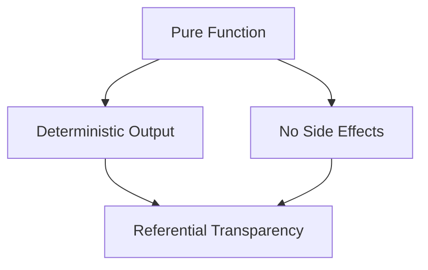

## 2.1 Pure Functions and Referential Transparency

In the realm of functional programming, Haskell stands out as a language that embraces purity and referential transparency. These concepts are not just theoretical ideals but practical tools that enable developers to write robust, maintainable, and predictable code. In this section, we will delve into the intricacies of pure functions and referential transparency, exploring their definitions, significance, and applications in Haskell.

### Understanding Purity

**Pure Functions** are the cornerstone of functional programming. A function is considered pure if it satisfies two main criteria:

1. **Deterministic Output**: For the same input, a pure function always produces the same output. This predictability is crucial for reasoning about code behavior.

2. **No Side Effects**: Pure functions do not alter any state or interact with the outside world. They do not modify variables, write to disk, or perform I/O operations.

#### Example of a Pure Function

Let's consider a simple example of a pure function in Haskell:

```haskell
-- A pure function that adds two numbers
add :: Int -> Int -> Int
add x y = x + y
```

In this example, `add` is a pure function because it consistently returns the sum of `x` and `y` without causing any side effects.

#### Benefits of Pure Functions

- **Ease of Testing**: Pure functions are easy to test because they do not depend on external state. You can test them in isolation with various inputs and expect consistent results.

- **Parallelization**: Since pure functions do not modify shared state, they can be safely executed in parallel, leading to performance improvements.

- **Memoization**: Pure functions can be memoized, meaning their results can be cached for given inputs, reducing redundant computations.

### Referential Transparency

**Referential Transparency** is a property of expressions in a program. An expression is referentially transparent if it can be replaced with its corresponding value without changing the program's behavior.

#### Example of Referential Transparency

Consider the following Haskell code:

```haskell
-- A pure function
square :: Int -> Int
square x = x * x

-- Using the function in an expression
result = square 5 + square 5
```

In this example, the expression `square 5` is referentially transparent. We can replace `square 5` with its value `25` without affecting the program's behavior:

```haskell
-- Replacing the expression with its value
result = 25 + 25
```

#### Importance of Referential Transparency

- **Simplified Reasoning**: Referential transparency allows developers to reason about code more easily. You can understand a program by examining its expressions and their values.

- **Refactoring**: Code refactoring becomes safer and more predictable when expressions are referentially transparent. You can change the structure of the code without altering its behavior.

- **Optimizations**: Compilers can perform optimizations more effectively when they can rely on referential transparency to replace expressions with their values.

### The Relationship Between Purity and Referential Transparency

Purity and referential transparency are closely related. Pure functions inherently produce referentially transparent expressions. This relationship is foundational to functional programming and is a key reason why Haskell emphasizes purity.

#### Visualizing the Concepts

To better understand the relationship between pure functions and referential transparency, let's visualize it using a diagram:



**Diagram Description**: This diagram illustrates how pure functions lead to deterministic output and lack of side effects, both of which contribute to referential transparency.

### Code Examples and Exercises

Let's explore more examples of pure functions and referential transparency in Haskell. We'll also provide exercises to reinforce these concepts.

#### Example: Calculating Factorials

Here's a pure function that calculates the factorial of a number:

```haskell
-- A pure function to calculate factorial
factorial :: Int -> Int
factorial 0 = 1
factorial n = n * factorial (n - 1)
```

This function is pure because it consistently returns the factorial of `n` without any side effects.

#### Exercise: Implement a Pure Function

**Task**: Implement a pure function `isEven` that checks if a number is even.

```haskell
-- Implement the isEven function
isEven :: Int -> Bool
isEven n = n `mod` 2 == 0
```

**Try It Yourself**: Modify the `isEven` function to check if a number is odd.

### Common Misconceptions

While pure functions and referential transparency are powerful concepts, they can sometimes be misunderstood. Let's address some common misconceptions:

- **Misconception 1**: Pure functions cannot use any variables.
  - **Clarification**: Pure functions can use variables, but they cannot modify them. They operate on inputs and return outputs without altering state.

- **Misconception 2**: Referential transparency means no variables are used.
  - **Clarification**: Referential transparency means expressions can be replaced with their values. Variables can be part of these expressions as long as they are not modified.

### Practical Applications

Understanding and applying purity and referential transparency can lead to more robust and maintainable code. Here are some practical applications:

- **Functional Libraries**: Many Haskell libraries leverage pure functions and referential transparency to provide powerful abstractions. For example, the `lens` library uses these concepts to manipulate data structures.

- **Concurrency**: Pure functions enable safe concurrent programming. Haskell's `async` library allows you to run pure computations concurrently without worrying about race conditions.

- **Domain-Specific Languages (DSLs)**: Pure functions and referential transparency are often used in designing DSLs, allowing for expressive and predictable language constructs.

### Knowledge Check

Let's test your understanding of pure functions and referential transparency with a few questions:

1. What is a pure function?
2. How does referential transparency simplify code reasoning?
3. Why are pure functions beneficial for parallelization?

### Summary

In this section, we've explored the core concepts of pure functions and referential transparency in Haskell. These principles are fundamental to functional programming and offer numerous benefits, including ease of testing, parallelization, and simplified reasoning. By embracing purity and referential transparency, you can write more predictable and maintainable code.

### Embrace the Journey

Remember, this is just the beginning. As you continue your journey in Haskell, you'll discover more ways to leverage pure functions and referential transparency to build powerful and elegant solutions. Keep experimenting, stay curious, and enjoy the journey!

## Quiz: Pure Functions and Referential Transparency



### What is a pure function?

- [x] A function that always produces the same output for the same input and has no side effects.
- [ ] A function that modifies global state.
- [ ] A function that performs I/O operations.
- [ ] A function that depends on external variables.

> **Explanation:** A pure function is deterministic and does not cause side effects, making it predictable and easy to test.

### Which of the following is an example of referential transparency?

- [x] Replacing `square 5` with `25` in an expression.
- [ ] Modifying a global variable within a function.
- [ ] Performing a database query within a function.
- [ ] Using a random number generator within a function.

> **Explanation:** Referential transparency allows expressions to be replaced with their values without changing the program's behavior.

### Why are pure functions beneficial for parallelization?

- [x] They do not modify shared state, allowing safe concurrent execution.
- [ ] They require more memory.
- [ ] They are slower to execute.
- [ ] They depend on external resources.

> **Explanation:** Pure functions do not alter shared state, making them ideal for parallel execution without race conditions.

### What is the relationship between pure functions and referential transparency?

- [x] Pure functions inherently produce referentially transparent expressions.
- [ ] Pure functions always have side effects.
- [ ] Referential transparency requires modifying global state.
- [ ] Pure functions depend on external variables.

> **Explanation:** Pure functions lead to referential transparency because they consistently produce the same output for the same input without side effects.

### How does referential transparency aid in code refactoring?

- [x] It allows expressions to be replaced with their values, making refactoring safer.
- [ ] It requires rewriting the entire codebase.
- [ ] It makes code less readable.
- [ ] It introduces more side effects.

> **Explanation:** Referential transparency ensures that expressions can be safely replaced with their values, facilitating easier refactoring.

### Which of the following is NOT a benefit of pure functions?

- [ ] Ease of testing
- [ ] Predictable behavior
- [x] Increased complexity
- [ ] Safe parallelization

> **Explanation:** Pure functions simplify testing and reasoning, and they enable safe parallelization, reducing complexity rather than increasing it.

### What does it mean for a function to have no side effects?

- [x] It does not alter any external state or perform I/O operations.
- [ ] It modifies global variables.
- [ ] It interacts with a database.
- [ ] It generates random numbers.

> **Explanation:** A function with no side effects does not change external state or perform actions like I/O, ensuring predictability.

### How can pure functions be optimized?

- [x] Through memoization, caching results for given inputs.
- [ ] By increasing their complexity.
- [ ] By adding more side effects.
- [ ] By using global variables.

> **Explanation:** Memoization allows pure functions to cache results, avoiding redundant computations and improving performance.

### What is a common misconception about pure functions?

- [x] They cannot use variables.
- [ ] They are easy to test.
- [ ] They are predictable.
- [ ] They enable parallelization.

> **Explanation:** Pure functions can use variables, but they do not modify them, maintaining their predictability and ease of testing.

### True or False: Referential transparency allows for easier reasoning about code.

- [x] True
- [ ] False

> **Explanation:** Referential transparency simplifies reasoning by allowing expressions to be replaced with their values, making code behavior more predictable.


