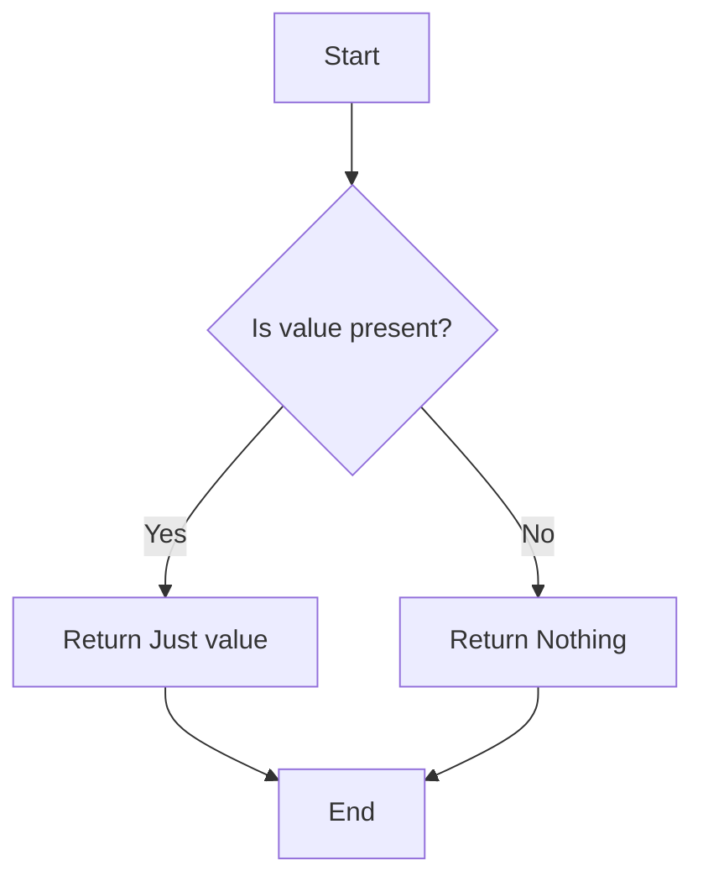
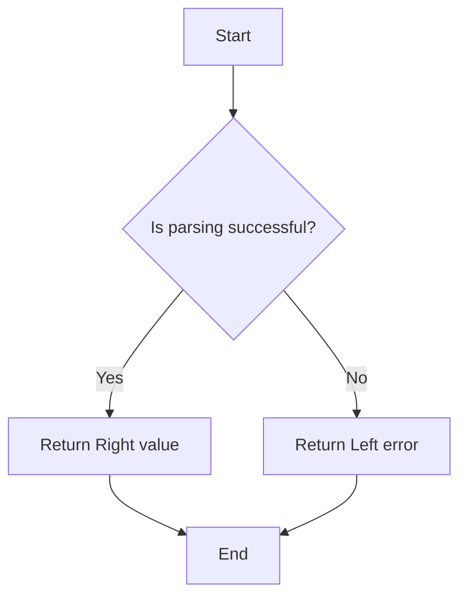

## 2.10 Error Handling with Monads (Maybe, Either)

Error handling is a crucial aspect of software development, and Haskell offers elegant solutions through its powerful type system and functional programming paradigms. In this section, we will delve into two fundamental monads used for error handling in Haskell: the `Maybe` and `Either` monads. These monads provide a structured way to manage computations that might fail, allowing developers to write robust and maintainable code.

### Understanding the Maybe Monad

The `Maybe` monad is a simple yet powerful tool for handling computations that might not return a value. It encapsulates an optional value, representing either a successful computation with a value (`Just a`) or a failure with no value (`Nothing`).

#### Key Concepts of the Maybe Monad

- **Encapsulation of Optional Values**: The `Maybe` type is used to represent computations that might not return a value. It is defined as follows:

  ```haskell
  data Maybe a = Nothing | Just a
  ```

- **Handling Absence of Values**: The `Nothing` constructor is used to represent the absence of a value, while `Just a` encapsulates a successful computation with a value.

- **Monad Instance**: The `Maybe` type is an instance of the `Monad` type class, allowing it to be used in monadic computations.

#### Using the Maybe Monad

Let's explore how to use the `Maybe` monad in practice. Consider a function that retrieves a value from a list by index:

```haskell
safeIndex :: [a] -> Int -> Maybe a
safeIndex [] _ = Nothing
safeIndex (x:xs) 0 = Just x
safeIndex (_:xs) n
  | n < 0     = Nothing
  | otherwise = safeIndex xs (n - 1)
```

In this example, `safeIndex` returns `Nothing` if the index is out of bounds, and `Just x` if the index is valid.

#### Chaining Computations with Maybe

The `Maybe` monad allows chaining computations that might fail using the `>>=` (bind) operator. Here's an example:

```haskell
import Data.Maybe (fromMaybe)

addSafe :: Maybe Int -> Maybe Int -> Maybe Int
addSafe mx my = do
  x <- mx
  y <- my
  return (x + y)

main :: IO ()
main = do
  let result = addSafe (Just 3) (Just 5)
  print $ fromMaybe 0 result  -- Output: 8
```

In this code, `addSafe` adds two `Maybe Int` values, returning `Nothing` if either value is `Nothing`.

### Visualizing Maybe Monad Operations

To better understand the flow of operations in the `Maybe` monad, let's visualize it using a flowchart:



**Figure 1**: Flowchart illustrating the operation of the `Maybe` monad.

### Exploring the Either Monad

The `Either` monad extends the concept of the `Maybe` monad by providing additional information about failures. It is used to represent computations that can fail with an error message or succeed with a value.

#### Key Concepts of the Either Monad

- **Error Information**: The `Either` type provides error information along with the failure. It is defined as follows:

  ```haskell
  data Either e a = Left e | Right a
  ```

- **Handling Errors**: The `Left e` constructor is used to represent an error with information `e`, while `Right a` represents a successful computation with a value.

- **Monad Instance**: The `Either` type is an instance of the `Monad` type class, allowing it to be used in monadic computations.

#### Using the Either Monad

Let's explore how to use the `Either` monad in practice. Consider a function that parses an integer from a string:

```haskell
import Text.Read (readMaybe)

parseInt :: String -> Either String Int
parseInt str =
  case readMaybe str of
    Nothing -> Left "Invalid number format"
    Just n  -> Right n
```

In this example, `parseInt` returns `Left "Invalid number format"` if the string cannot be parsed as an integer, and `Right n` if parsing is successful.

#### Chaining Computations with Either

The `Either` monad allows chaining computations that might fail using the `>>=` (bind) operator. Here's an example:

```haskell
addParsed :: String -> String -> Either String Int
addParsed sx sy = do
  x <- parseInt sx
  y <- parseInt sy
  return (x + y)

main :: IO ()
main = do
  let result = addParsed "3" "5"
  case result of
    Left err -> putStrLn $ "Error: " ++ err
    Right sum -> putStrLn $ "Sum: " ++ show sum  -- Output: Sum: 8
```

In this code, `addParsed` adds two parsed integers, returning an error message if either parsing fails.

### Visualizing Either Monad Operations

To better understand the flow of operations in the `Either` monad, let's visualize it using a flowchart:



**Figure 2**: Flowchart illustrating the operation of the `Either` monad.

### Using Monads for Errors

Monads provide a powerful abstraction for structuring error propagation in a functional way. By using the `Maybe` and `Either` monads, developers can handle errors gracefully without resorting to exceptions or error codes.

#### Benefits of Using Monads for Error Handling

- **Composability**: Monads allow chaining computations that might fail, making it easy to compose complex operations.

- **Explicit Error Handling**: The `Either` monad provides explicit error information, making it easier to diagnose and handle errors.

- **Type Safety**: Haskell's type system ensures that error handling is enforced at compile time, reducing runtime errors.

### Key Participants in Error Handling with Monads

- **Maybe Monad**: Used for computations that might not return a value, without providing error information.

- **Either Monad**: Used for computations that might fail with an error message, providing additional context for failures.

### Applicability of Error Handling with Monads

- **Handling Optional Values**: Use the `Maybe` monad when a computation might not return a value, and the absence of a value is acceptable.

- **Providing Error Information**: Use the `Either` monad when a computation might fail with an error message, and additional context is needed.

### Sample Code Snippet

Here's a complete example demonstrating error handling with both the `Maybe` and `Either` monads:

```haskell
import Text.Read (readMaybe)

safeDivide :: Int -> Int -> Maybe Int
safeDivide _ 0 = Nothing
safeDivide x y = Just (x `div` y)

parseAndDivide :: String -> String -> Either String Int
parseAndDivide sx sy = do
  x <- parseInt sx
  y <- parseInt sy
  case safeDivide x y of
    Nothing -> Left "Division by zero"
    Just result -> Right result

main :: IO ()
main = do
  let result = parseAndDivide "10" "2"
  case result of
    Left err -> putStrLn $ "Error: " ++ err
    Right quotient -> putStrLn $ "Quotient: " ++ show quotient  -- Output: Quotient: 5
```

### Design Considerations

- **Choosing Between Maybe and Either**: Use `Maybe` when the absence of a value is sufficient, and `Either` when additional error information is needed.

- **Error Propagation**: Monads allow for seamless error propagation, reducing the need for explicit error checks.

- **Performance**: Consider the performance implications of using monads, especially in performance-critical code.

### Haskell Unique Features

- **Type System**: Haskell's strong static type system ensures that error handling is enforced at compile time.

- **Lazy Evaluation**: Haskell's lazy evaluation model allows for efficient error handling, as computations are only performed when needed.

### Differences and Similarities

- **Maybe vs. Either**: Both monads are used for error handling, but `Maybe` does not provide error information, while `Either` does.

- **Monad Instances**: Both `Maybe` and `Either` are instances of the `Monad` type class, allowing them to be used in monadic computations.

### Try It Yourself

Experiment with the code examples provided in this section. Try modifying the `safeIndex`, `parseInt`, and `addParsed` functions to handle different scenarios. Consider adding additional error messages or handling different types of errors.

### Knowledge Check

- What is the primary purpose of the `Maybe` monad?
- How does the `Either` monad differ from the `Maybe` monad?
- What are the benefits of using monads for error handling in Haskell?
- How can you chain computations using the `Maybe` and `Either` monads?

### Embrace the Journey

Remember, mastering error handling with monads is a journey. As you progress, you'll discover more advanced techniques and patterns for managing errors in Haskell. Keep experimenting, stay curious, and enjoy the journey!

## Quiz: Error Handling with Monads (Maybe, Either)



### What is the primary purpose of the Maybe monad?

- [x] To handle computations that might not return a value
- [ ] To provide detailed error information
- [ ] To manage side effects
- [ ] To perform asynchronous computations

> **Explanation:** The `Maybe` monad is used to handle computations that might not return a value, encapsulating optional values.

### How does the Either monad differ from the Maybe monad?

- [x] It provides error information along with failure
- [ ] It is used for asynchronous computations
- [ ] It handles side effects
- [ ] It is not a monad

> **Explanation:** The `Either` monad provides error information along with failure, unlike the `Maybe` monad, which only represents the absence of a value.

### What is the benefit of using monads for error handling?

- [x] They allow for composable error handling
- [ ] They eliminate all runtime errors
- [ ] They are faster than exceptions
- [ ] They are only used in Haskell

> **Explanation:** Monads allow for composable error handling, making it easy to chain computations that might fail.

### Which constructor represents a successful computation in the Either monad?

- [x] Right a
- [ ] Left e
- [ ] Just a
- [ ] Nothing

> **Explanation:** The `Right a` constructor represents a successful computation in the `Either` monad.

### When should you use the Maybe monad?

- [x] When a computation might not return a value
- [ ] When detailed error information is needed
- [ ] When managing side effects
- [ ] When performing asynchronous computations

> **Explanation:** The `Maybe` monad is used when a computation might not return a value, and the absence of a value is acceptable.

### What does the Left constructor in the Either monad represent?

- [x] An error with information
- [ ] A successful computation
- [ ] An optional value
- [ ] A side effect

> **Explanation:** The `Left` constructor in the `Either` monad represents an error with information.

### How can you chain computations using the Maybe monad?

- [x] Using the >>= (bind) operator
- [ ] Using exceptions
- [ ] Using side effects
- [ ] Using asynchronous operations

> **Explanation:** Computations can be chained using the `>>=` (bind) operator in the `Maybe` monad.

### What is the purpose of the Just constructor in the Maybe monad?

- [x] To encapsulate a successful computation with a value
- [ ] To represent an error
- [ ] To manage side effects
- [ ] To perform asynchronous computations

> **Explanation:** The `Just` constructor in the `Maybe` monad encapsulates a successful computation with a value.

### Which monad provides explicit error information?

- [x] Either
- [ ] Maybe
- [ ] IO
- [ ] List

> **Explanation:** The `Either` monad provides explicit error information, unlike the `Maybe` monad.

### True or False: The Maybe and Either monads are instances of the Monad type class.

- [x] True
- [ ] False

> **Explanation:** Both `Maybe` and `Either` are instances of the `Monad` type class, allowing them to be used in monadic computations.


