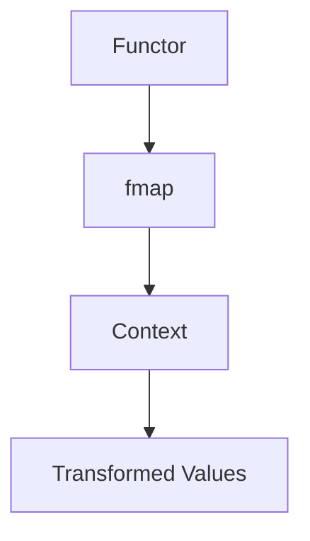
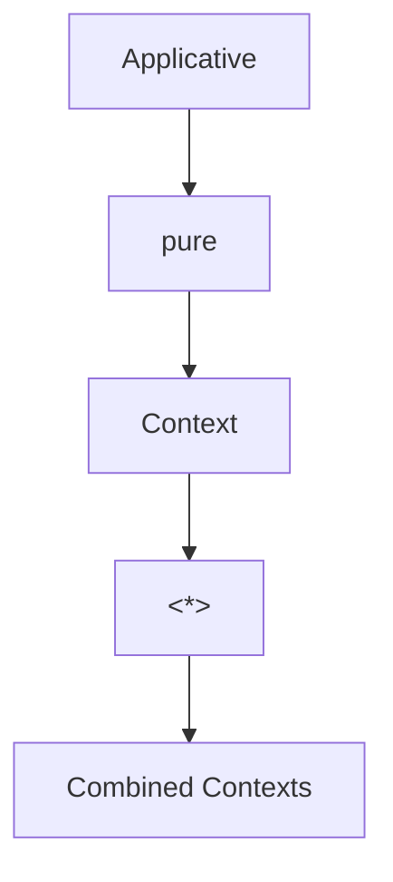
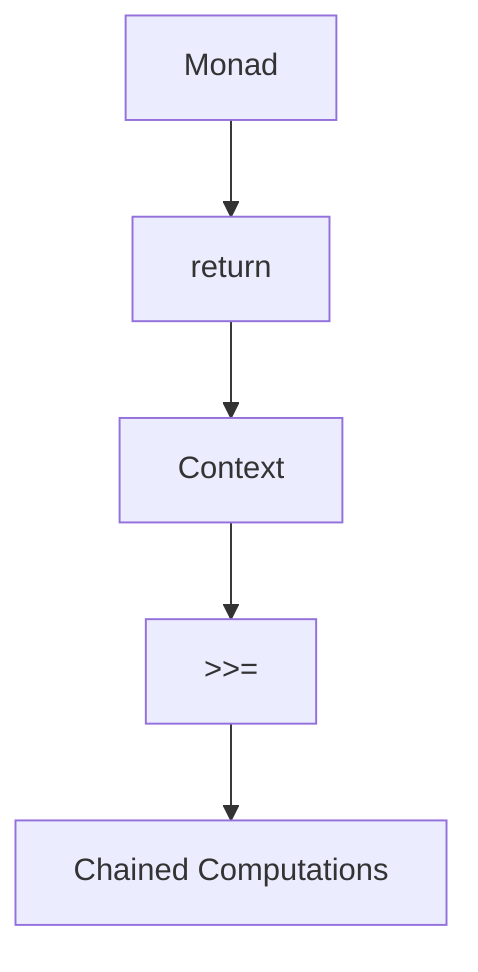
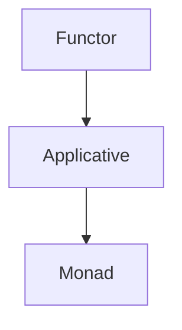

## 2.11 Monads, Functors, and Applicatives

In the world of Haskell, understanding the abstractions of Functors, Applicatives, and Monads is crucial for mastering functional programming. These concepts form the backbone of Haskell's approach to handling computations, effects, and data transformations. Let's delve into each of these abstractions, explore their relationships, and see how they empower us to write expressive and concise code.

### Functors: Types That Can Be Mapped Over

**Functors** are one of the simplest and most fundamental abstractions in Haskell. A Functor is a type class that allows us to apply a function to values wrapped in a context, such as a list, Maybe, or any other container type.

#### Key Concepts

- **Functor Type Class**: Defined by the `Functor` type class, which requires the implementation of the `fmap` function.
- **Mapping Over Contexts**: `fmap` applies a function to the wrapped values without altering the structure of the context.

#### Functor Type Class Definition

```haskell
class Functor f where
    fmap :: (a -> b) -> f a -> f b
```

#### Example: Functor Instance for Maybe

```haskell
instance Functor Maybe where
    fmap _ Nothing  = Nothing
    fmap f (Just x) = Just (f x)
```

In this example, `fmap` applies a function to the value inside a `Just`, while `Nothing` remains unchanged.

#### Visualizing Functors



**Caption**: Functors allow functions to be applied to values within a context, transforming the values while preserving the context structure.

### Applicatives: Function Application Within a Context

**Applicatives** extend Functors by allowing functions that are themselves wrapped in a context to be applied to values in another context. This is particularly useful for computations that involve multiple independent effects.

#### Key Concepts

- **Applicative Type Class**: Defined by the `Applicative` type class, which requires the implementation of `pure` and `<*>`.
- **Combining Contexts**: Applicatives enable the combination of multiple contexts.

#### Applicative Type Class Definition

```haskell
class Functor f => Applicative f where
    pure  :: a -> f a
    (<*>) :: f (a -> b) -> f a -> f b
```

#### Example: Applicative Instance for Maybe

```haskell
instance Applicative Maybe where
    pure = Just
    Nothing <*> _ = Nothing
    (Just f) <*> something = fmap f something
```

Here, `pure` lifts a value into a context, and `<*>` applies a function within a context to another context.

#### Visualizing Applicatives



**Caption**: Applicatives allow functions within a context to be applied to values in another context, enabling the combination of multiple contexts.

### Monads: Sequencing Computations

**Monads** build upon Applicatives by introducing the ability to sequence computations. They provide a way to chain operations that produce effects, allowing for more complex data flows and transformations.

#### Key Concepts

- **Monad Type Class**: Defined by the `Monad` type class, which requires the implementation of `>>=` (bind) and `return`.
- **Chaining Operations**: Monads enable the chaining of operations, where each step can depend on the result of the previous one.

#### Monad Type Class Definition

```haskell
class Applicative m => Monad m where
    (>>=)  :: m a -> (a -> m b) -> m b
    return :: a -> m a
```

#### Example: Monad Instance for Maybe

```haskell
instance Monad Maybe where
    (Just x) >>= f = f x
    Nothing  >>= _ = Nothing
    return = Just
```

In this example, `>>=` chains operations, passing the result of one computation to the next.

#### Visualizing Monads



**Caption**: Monads enable the sequencing of computations, allowing each step to depend on the result of the previous one.

### Relationships: Building on Each Other

Functors, Applicatives, and Monads are closely related, each building on the capabilities of the previous abstraction.

- **Functors** provide the ability to map over a context.
- **Applicatives** extend Functors by allowing function application within a context.
- **Monads** extend Applicatives by enabling the sequencing of computations.

#### Visualizing Relationships



**Caption**: Functors, Applicatives, and Monads build on each other, each adding more capabilities for handling computations and effects.

### Code Examples and Exercises

Let's explore some practical examples and exercises to solidify our understanding of these abstractions.

#### Example: Using Functors

```haskell
-- Define a simple function
increment :: Int -> Int
increment x = x + 1

-- Use fmap to apply the function to a list
result1 :: [Int]
result1 = fmap increment [1, 2, 3]  -- [2, 3, 4]

-- Use fmap with Maybe
result2 :: Maybe Int
result2 = fmap increment (Just 5)  -- Just 6
```

#### Example: Using Applicatives

```haskell
-- Define functions within a context
add :: Maybe (Int -> Int -> Int)
add = Just (+)

-- Apply the function to values within a context
result3 :: Maybe Int
result3 = add <*> Just 2 <*> Just 3  -- Just 5
```

#### Example: Using Monads

```haskell
-- Define a function that returns a Maybe
safeDivide :: Int -> Int -> Maybe Int
safeDivide _ 0 = Nothing
safeDivide x y = Just (x `div` y)

-- Chain computations using >>= (bind)
result4 :: Maybe Int
result4 = Just 10 >>= \x -> safeDivide x 2 >>= \y -> return (y + 1)  -- Just 6
```

### Try It Yourself

Experiment with the code examples above. Try modifying the functions and contexts to see how the behavior changes. For instance, what happens if you change `Just 5` to `Nothing` in the `fmap` example? How does the result of the `safeDivide` function affect the final outcome in the Monad example?

### Design Considerations

When using Functors, Applicatives, and Monads, consider the following:

- **Choose the Right Abstraction**: Use Functors for simple mappings, Applicatives for independent effects, and Monads for dependent computations.
- **Understand the Laws**: Each abstraction comes with laws that ensure consistent behavior. Familiarize yourself with these laws to avoid unexpected results.
- **Leverage Haskell's Type System**: Haskell's strong type system can help catch errors early and guide you in using these abstractions effectively.

### Haskell Unique Features

Haskell's type system and lazy evaluation make it particularly well-suited for leveraging Functors, Applicatives, and Monads. The language's emphasis on purity and immutability aligns with the principles of these abstractions, enabling powerful and expressive code.

### Differences and Similarities

While Functors, Applicatives, and Monads are related, they serve different purposes:

- **Functors** focus on mapping functions over contexts.
- **Applicatives** allow for function application within contexts.
- **Monads** enable sequencing of computations.

Understanding these differences will help you choose the right abstraction for your needs.

### Knowledge Check

- What is the primary purpose of a Functor?
- How do Applicatives extend the capabilities of Functors?
- What is the significance of the `>>=` operator in Monads?

### Summary

In this section, we've explored the core functional abstractions of Functors, Applicatives, and Monads in Haskell. These concepts are essential for handling computations and effects in a functional programming paradigm. By understanding their relationships and applications, we can write more expressive and concise code.

Remember, this is just the beginning. As you progress, you'll discover more advanced patterns and techniques that build on these foundational concepts. Keep experimenting, stay curious, and enjoy the journey!

## Quiz: Monads, Functors, and Applicatives



### What is the primary function of a Functor in Haskell?

- [x] To map a function over a wrapped value
- [ ] To sequence computations
- [ ] To apply functions within a context
- [ ] To handle side effects

> **Explanation:** A Functor allows you to apply a function to a value wrapped in a context, such as a list or Maybe.

### Which type class does Applicative extend?

- [x] Functor
- [ ] Monad
- [ ] Foldable
- [ ] Traversable

> **Explanation:** Applicative extends Functor, adding the ability to apply functions within a context.

### What does the `<*>` operator do in the context of Applicatives?

- [x] Applies a function wrapped in a context to a value wrapped in another context
- [ ] Sequences computations
- [ ] Maps a function over a context
- [ ] Combines two contexts

> **Explanation:** The `<*>` operator is used to apply a function within a context to a value in another context.

### What is the purpose of the `>>=` operator in Monads?

- [x] To chain computations where each step depends on the previous one
- [ ] To map a function over a context
- [ ] To apply functions within a context
- [ ] To handle side effects

> **Explanation:** The `>>=` operator, also known as bind, is used to chain computations in Monads.

### Which of the following is a law that Functors must obey?

- [x] Identity law
- [ ] Associativity law
- [ ] Commutativity law
- [ ] Distributive law

> **Explanation:** The identity law states that mapping the identity function over a Functor should return the same Functor.

### What does the `pure` function do in the context of Applicatives?

- [x] Lifts a value into a context
- [ ] Sequences computations
- [ ] Maps a function over a context
- [ ] Combines two contexts

> **Explanation:** The `pure` function takes a value and wraps it in a context, such as a Just or a list.

### How do Monads differ from Applicatives?

- [x] Monads allow sequencing of dependent computations
- [ ] Monads allow mapping over contexts
- [ ] Monads apply functions within contexts
- [ ] Monads handle side effects

> **Explanation:** Monads extend Applicatives by allowing computations to be chained, where each step can depend on the result of the previous one.

### What is a key benefit of using Monads in Haskell?

- [x] They enable sequencing of computations with side effects
- [ ] They allow mapping over contexts
- [ ] They apply functions within contexts
- [ ] They handle errors

> **Explanation:** Monads provide a way to sequence computations, especially those involving side effects, in a controlled manner.

### True or False: All Monads are Applicatives, but not all Applicatives are Monads.

- [x] True
- [ ] False

> **Explanation:** Monads are a more powerful abstraction that builds on Applicatives, so every Monad is also an Applicative.

### Which of the following is an example of a Monad in Haskell?

- [x] Maybe
- [ ] List
- [ ] Either
- [ ] IO

> **Explanation:** Maybe is a common Monad in Haskell, used for computations that may fail.


