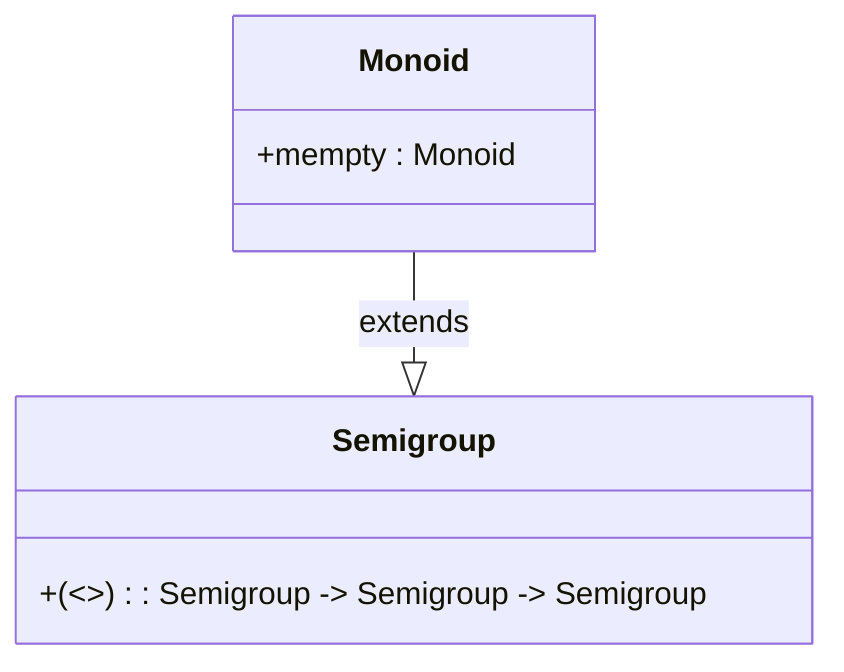

## 2.12 Monoids and Semigroups

In the realm of functional programming, particularly in Haskell, understanding the concepts of **Monoids** and **Semigroups** is crucial for mastering design patterns and building robust, scalable applications. These algebraic structures provide a framework for combining data in a consistent and predictable manner, making them indispensable tools for expert software engineers and architects.

### Introduction to Semigroups

A **Semigroup** is a mathematical structure consisting of a set equipped with an associative binary operation. In Haskell, a Semigroup is represented by the `Semigroup` type class, which defines the `(<>)` operator. This operator must satisfy the associative law:

- **Associative Law**: For any elements `a`, `b`, and `c` in a semigroup, the equation `(a <> b) <> c = a <> (b <> c)` must hold.

#### Key Participants

- **Set**: A collection of elements.
- **Binary Operation**: An operation that combines two elements of the set to produce another element of the same set.

#### Applicability

Semigroups are applicable in scenarios where you need to combine data without requiring an identity element. They are often used in conjunction with Monoids to provide more flexibility in data aggregation.

#### Sample Code Snippet

```haskell
import Data.Semigroup

-- Define a simple Semigroup instance for a custom data type
data MyData = MyData Int

instance Semigroup MyData where
    (MyData a) <> (MyData b) = MyData (a + b)

-- Usage example
combineData :: MyData -> MyData -> MyData
combineData x y = x <> y

main :: IO ()
main = do
    let a = MyData 5
    let b = MyData 10
    print $ combineData a b  -- Output: MyData 15
```

### Introduction to Monoids

A **Monoid** is an extension of a Semigroup that includes an identity element. In Haskell, the `Monoid` type class extends `Semigroup` and introduces the `mempty` element, which acts as the identity for the `(<>)` operation.

#### Key Participants

- **Identity Element**: An element `e` such that for any element `a`, the equation `e <> a = a <> e = a` holds.

#### Applicability

Monoids are widely used in Haskell for aggregating results, simplifying code, and managing state. They are particularly useful in scenarios where you need to combine multiple values into a single result, such as in logging, parsing, or building complex data structures.

#### Sample Code Snippet

```haskell
import Data.Monoid

-- Define a Monoid instance for a custom data type
data MyData = MyData Int

instance Semigroup MyData where
    (MyData a) <> (MyData b) = MyData (a + b)

instance Monoid MyData where
    mempty = MyData 0

-- Usage example
combineData :: [MyData] -> MyData
combineData = mconcat

main :: IO ()
main = do
    let dataList = [MyData 5, MyData 10, MyData 15]
    print $ combineData dataList  -- Output: MyData 30
```

### Visualizing Monoids and Semigroups

To better understand the relationship between Monoids and Semigroups, let's visualize their structure using a diagram.



**Diagram Description**: The diagram illustrates that `Monoid` extends `Semigroup`, inheriting the `(<>)` operation and adding the `mempty` identity element.

### Design Considerations

When using Monoids and Semigroups, consider the following:

- **Associativity**: Ensure that the binary operation is associative to maintain consistency.
- **Identity Element**: For Monoids, define a meaningful identity element that does not alter the result when combined with other elements.
- **Performance**: Consider the performance implications of the binary operation, especially for large data sets.

### Haskell Unique Features

Haskell's type system and higher-order functions make it uniquely suited for working with Monoids and Semigroups. The language's emphasis on immutability and pure functions aligns well with the algebraic properties of these structures.

### Differences and Similarities

- **Semigroups vs. Monoids**: The primary difference is the presence of an identity element in Monoids. Both structures rely on an associative binary operation.
- **Common Confusions**: It's important not to confuse Monoids with other algebraic structures like groups, which require an inverse element.

### Using Monoids and Semigroups in Practice

Monoids and Semigroups are not just theoretical constructs; they have practical applications in real-world Haskell programming. Let's explore some common use cases and patterns.

#### Aggregating Results

Monoids are ideal for aggregating results, such as summing a list of numbers or concatenating strings.

```haskell
import Data.Monoid

sumNumbers :: [Int] -> Int
sumNumbers = getSum . mconcat . map Sum

main :: IO ()
main = do
    let numbers = [1, 2, 3, 4, 5]
    print $ sumNumbers numbers  -- Output: 15
```

#### Simplifying Code

By leveraging Monoids, you can simplify code that involves combining multiple values. This leads to more concise and readable code.

```haskell
import Data.Monoid

concatStrings :: [String] -> String
concatStrings = mconcat

main :: IO ()
main = do
    let strings = ["Hello, ", "world", "!"]
    putStrLn $ concatStrings strings  -- Output: "Hello, world!"
```

#### Managing State

Monoids can be used to manage state in a functional way, allowing you to combine state changes in a predictable manner.

```haskell
import Data.Monoid

data State = State { count :: Int, message :: String }

instance Semigroup State where
    (State c1 m1) <> (State c2 m2) = State (c1 + c2) (m1 <> m2)

instance Monoid State where
    mempty = State 0 ""

updateState :: [State] -> State
updateState = mconcat

main :: IO ()
main = do
    let states = [State 1 "Hello", State 2 " world", State 3 "!"]
    print $ updateState states  -- Output: State {count = 6, message = "Hello world!"}
```

### Try It Yourself

To deepen your understanding of Monoids and Semigroups, try modifying the code examples above. Experiment with different data types and operations to see how they behave. Consider creating your own custom data types and implementing `Semigroup` and `Monoid` instances for them.

### Knowledge Check

- **Question**: What is the primary difference between a Semigroup and a Monoid?
- **Challenge**: Implement a Monoid instance for a custom data type that represents a shopping cart, where items can be combined, and the identity element represents an empty cart.

### Embrace the Journey

Remember, mastering Monoids and Semigroups is just one step in your journey to becoming an expert Haskell developer. These concepts are foundational to many advanced design patterns and techniques in functional programming. Keep experimenting, stay curious, and enjoy the journey!

## Quiz: Monoids and Semigroups



### What is a Semigroup?

- [x] A set with an associative binary operation
- [ ] A set with a commutative binary operation
- [ ] A set with an identity element
- [ ] A set with an inverse element

> **Explanation:** A Semigroup is defined as a set equipped with an associative binary operation.

### What additional property does a Monoid have compared to a Semigroup?

- [x] An identity element
- [ ] A commutative operation
- [ ] An inverse element
- [ ] A distributive operation

> **Explanation:** A Monoid is a Semigroup with an additional identity element.

### Which Haskell type class represents a Semigroup?

- [x] Semigroup
- [ ] Monoid
- [ ] Functor
- [ ] Applicative

> **Explanation:** The `Semigroup` type class in Haskell represents a Semigroup.

### What operator is used in Haskell to combine elements of a Semigroup?

- [x] (<>)
- [ ] (+)
- [ ] (*)
- [ ] (&&)

> **Explanation:** The `(<>)` operator is used to combine elements of a Semigroup in Haskell.

### What is the identity element for the Monoid instance of the `Sum` type?

- [x] 0
- [ ] 1
- [ ] -1
- [ ] 10

> **Explanation:** The identity element for the `Sum` Monoid is `0`, as `0 + x = x`.

### Which law must the binary operation of a Semigroup satisfy?

- [x] Associative law
- [ ] Commutative law
- [ ] Distributive law
- [ ] Inverse law

> **Explanation:** The binary operation of a Semigroup must satisfy the associative law.

### Can a Monoid be a Semigroup?

- [x] True
- [ ] False

> **Explanation:** A Monoid is a specific type of Semigroup that includes an identity element.

### What is the purpose of the `mempty` element in a Monoid?

- [x] It acts as the identity element
- [ ] It acts as the inverse element
- [ ] It acts as the commutative element
- [ ] It acts as the distributive element

> **Explanation:** The `mempty` element in a Monoid acts as the identity element.

### Which of the following is a common use case for Monoids in Haskell?

- [x] Aggregating results
- [ ] Performing division
- [ ] Sorting data
- [ ] Filtering lists

> **Explanation:** Monoids are commonly used for aggregating results in Haskell.

### Is the `(<>)` operator in Haskell commutative?

- [ ] True
- [x] False

> **Explanation:** The `(<>)` operator is associative, not necessarily commutative.


