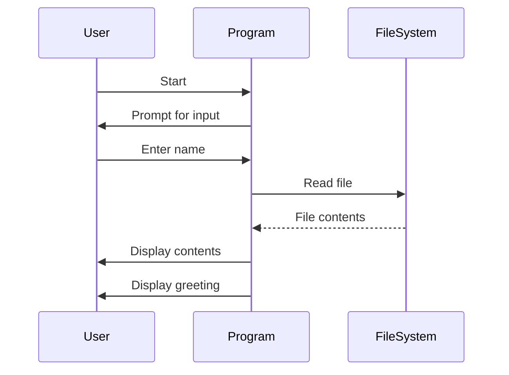

## 2.13 The IO Monad and Managing Side Effects

In the world of functional programming, Haskell stands out for its emphasis on purity and immutability. However, real-world applications often require interaction with the outside world, such as reading from files, network communication, or interacting with databases. This is where the **IO Monad** comes into play, allowing Haskell to manage side effects while maintaining its functional purity. In this section, we will explore the IO Monad in depth, understand how it encapsulates side effects, and examine practical examples of its use.

### Understanding the IO Monad

The IO Monad is a fundamental concept in Haskell that allows us to perform input and output operations while keeping the core of our programs pure. It encapsulates side effects, ensuring that they are managed in a controlled manner. Let's break down the key concepts:

#### Purity and IO

Haskell is a purely functional language, meaning that functions are expected to be deterministic and free of side effects. However, IO operations inherently involve side effects. The IO Monad provides a way to handle these operations without compromising the purity of the language. By encapsulating side effects within the IO Monad, Haskell ensures that side effects are isolated and do not interfere with the rest of the program.

#### The Type Signature of IO

The IO Monad is represented by the `IO` type constructor. A value of type `IO a` represents an action that, when executed, may perform IO operations and will produce a result of type `a`. The type signature of an IO action is:

```haskell
IO a
```

This indicates that the action will produce a result of type `a` when executed. Importantly, the action itself is a first-class value that can be passed around and composed with other actions.

#### Sequencing IO Actions

In Haskell, IO actions are sequenced using the `do` notation, which provides a convenient way to chain together multiple IO operations. Here's a simple example:

```haskell
main :: IO ()
main = do
    putStrLn "Enter your name:"
    name <- getLine
    putStrLn ("Hello, " ++ name ++ "!")
```

In this example, `putStrLn` and `getLine` are IO actions. The `do` notation allows us to sequence these actions, ensuring that they are executed in the correct order.

### Practical Examples of IO Monad

Let's explore some practical examples of using the IO Monad to perform common tasks such as reading from files and network communication.

#### Reading from Files

Reading from files is a common IO operation. Haskell provides functions like `readFile` and `writeFile` to handle file IO. Here's an example of reading from a file:

```haskell
import System.IO

main :: IO ()
main = do
    contents <- readFile "example.txt"
    putStrLn "File contents:"
    putStrLn contents
```

In this example, `readFile` is an IO action that reads the contents of a file and returns it as a string. The result is then printed to the console using `putStrLn`.

#### Network Communication

Network communication is another area where the IO Monad is essential. Haskell's `Network` library provides functions for network operations. Here's a simple example of making an HTTP request:

```haskell
import Network.HTTP.Simple

main :: IO ()
main = do
    response <- httpLBS "http://example.com"
    putStrLn "Response received:"
    print response
```

In this example, `httpLBS` is an IO action that performs an HTTP GET request and returns the response. The response is then printed to the console.

### Advanced Concepts in IO Monad

Now that we have a basic understanding of the IO Monad, let's delve into some advanced concepts that can help us manage side effects more effectively.

#### Lazy IO

Haskell supports lazy IO, which allows us to read data lazily as it is needed. This can be useful for processing large files or streams. However, it also introduces potential pitfalls, such as resource leaks. Here's an example of lazy IO:

```haskell
import System.IO

main :: IO ()
main = do
    contents <- readFile "largefile.txt"
    putStrLn (take 100 contents)  -- Only the first 100 characters are read
```

In this example, `readFile` reads the file lazily, meaning that the entire file is not loaded into memory at once. Instead, data is read as it is needed.

#### Handling Exceptions in IO

IO operations can fail, and it's important to handle exceptions gracefully. Haskell provides the `Control.Exception` module for exception handling. Here's an example:

```haskell
import Control.Exception

main :: IO ()
main = do
    result <- try (readFile "nonexistent.txt") :: IO (Either IOException String)
    case result of
        Left ex  -> putStrLn $ "Caught exception: " ++ show ex
        Right contents -> putStrLn contents
```

In this example, `try` is used to catch exceptions that may occur during the `readFile` operation. The result is an `Either` type, where `Left` represents an exception and `Right` represents a successful result.

#### The Role of Monads in IO

The IO Monad is just one example of a monad in Haskell. Monads provide a way to structure programs with effects, allowing us to compose actions in a flexible and reusable manner. The IO Monad is unique in that it deals specifically with side effects, but the same principles apply to other monads, such as `Maybe`, `Either`, and `State`.

### Visualizing the IO Monad

To better understand how the IO Monad works, let's visualize the flow of IO actions using a sequence diagram.



This diagram illustrates the sequence of interactions between the user, the program, and the file system. The program prompts the user for input, reads a file, and displays the contents and a greeting.

### Try It Yourself

Experimentation is key to mastering the IO Monad. Try modifying the code examples to perform different tasks, such as writing to a file or making a POST request. Here are some suggestions:

- Modify the file reading example to write the contents to a new file.
- Change the network communication example to make a POST request with a JSON payload.
- Implement error handling for network failures using the `Control.Exception` module.

### Key Takeaways

- The IO Monad encapsulates side effects, allowing Haskell to maintain functional purity.
- IO actions are sequenced using the `do` notation, ensuring correct execution order.
- Practical examples include reading from files and network communication.
- Advanced concepts such as lazy IO and exception handling enhance our ability to manage side effects.
- Visualization tools like sequence diagrams can help us understand the flow of IO actions.

### References and Further Reading

- [Haskell IO Monad Documentation](https://hackage.haskell.org/package/base/docs/System-IO.html)
- [Learn You a Haskell for Great Good! - Input and Output](http://learnyouahaskell.com/input-and-output)
- [Real World Haskell - Input and Output](http://book.realworldhaskell.org/read/io.html)

### Embrace the Journey

Remember, mastering the IO Monad is just one step in your Haskell journey. As you continue to explore the language, you'll discover new patterns and techniques that will enhance your ability to build robust, scalable applications. Keep experimenting, stay curious, and enjoy the journey!

## Quiz: The IO Monad and Managing Side Effects



### What is the primary purpose of the IO Monad in Haskell?

- [x] To encapsulate side effects while maintaining functional purity
- [ ] To perform mathematical calculations
- [ ] To manage memory allocation
- [ ] To optimize performance

> **Explanation:** The IO Monad encapsulates side effects, allowing Haskell to maintain functional purity while interacting with the outside world.

### How are IO actions sequenced in Haskell?

- [x] Using the `do` notation
- [ ] Using the `if` statement
- [ ] Using the `case` expression
- [ ] Using the `let` binding

> **Explanation:** The `do` notation is used to sequence IO actions, ensuring they are executed in the correct order.

### What does the type `IO a` represent?

- [x] An action that may perform IO operations and produces a result of type `a`
- [ ] A pure function that returns a value of type `a`
- [ ] A data structure containing values of type `a`
- [ ] A type alias for `Maybe a`

> **Explanation:** `IO a` represents an action that, when executed, may perform IO operations and will produce a result of type `a`.

### Which module provides functions for exception handling in IO?

- [x] `Control.Exception`
- [ ] `Data.List`
- [ ] `System.IO`
- [ ] `Network.HTTP`

> **Explanation:** The `Control.Exception` module provides functions for handling exceptions in IO operations.

### What is lazy IO?

- [x] A technique where data is read lazily as it is needed
- [ ] A method for optimizing performance
- [ ] A way to avoid side effects
- [ ] A type of monad transformer

> **Explanation:** Lazy IO allows data to be read lazily as it is needed, which can be useful for processing large files or streams.

### What is the result type of the `try` function in exception handling?

- [x] `Either IOException a`
- [ ] `Maybe a`
- [ ] `IO a`
- [ ] `Bool`

> **Explanation:** The `try` function returns an `Either` type, where `Left` represents an exception and `Right` represents a successful result.

### Which of the following is a practical example of using the IO Monad?

- [x] Reading from files
- [x] Network communication
- [ ] Sorting a list
- [ ] Calculating factorial

> **Explanation:** Reading from files and network communication are practical examples of using the IO Monad to manage side effects.

### What is the role of monads in Haskell?

- [x] To structure programs with effects
- [ ] To perform arithmetic operations
- [ ] To define data types
- [ ] To manage memory

> **Explanation:** Monads provide a way to structure programs with effects, allowing us to compose actions in a flexible and reusable manner.

### True or False: The IO Monad allows Haskell to perform side effects without compromising functional purity.

- [x] True
- [ ] False

> **Explanation:** The IO Monad encapsulates side effects, allowing Haskell to perform side effects while maintaining functional purity.

### What is the purpose of the `readFile` function in Haskell?

- [x] To read the contents of a file and return it as a string
- [ ] To write data to a file
- [ ] To delete a file
- [ ] To create a new file

> **Explanation:** The `readFile` function reads the contents of a file and returns it as a string, encapsulated in an IO action.


