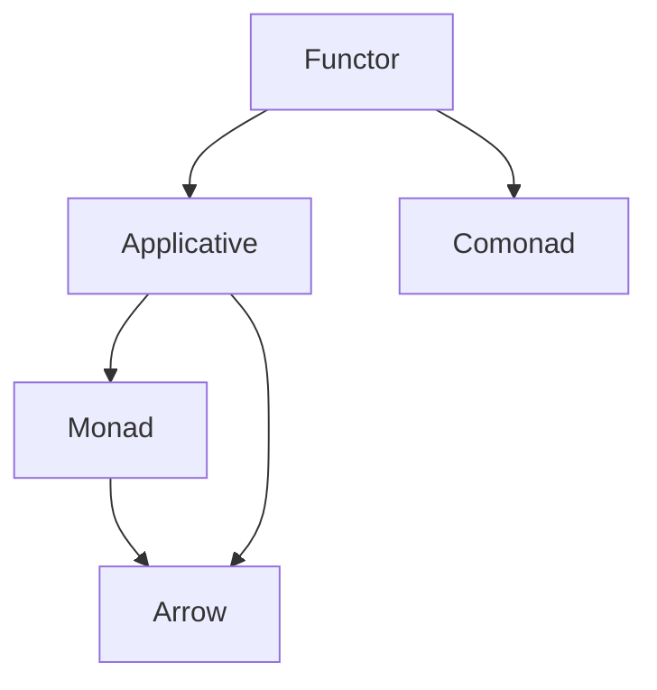

## 2.15 The Role of Category Theory in Haskell

Category theory is a mathematical theory that deals with abstract structures and relationships between them. It provides a high-level, unifying framework that can be applied to various fields, including computer science. In Haskell, category theory plays a crucial role in shaping the language's design patterns and abstractions, offering a robust foundation for functional programming.

### Introduction to Category Theory

Category theory is often described as the "mathematics of mathematics" due to its ability to abstract and generalize mathematical concepts. At its core, category theory deals with objects and morphisms (arrows) between these objects, forming a category. Let's delve into some basic concepts relevant to Haskell:

#### Objects and Morphisms

- **Objects**: In category theory, objects can be anything: numbers, sets, types, etc. In Haskell, objects are typically types.
- **Morphisms (Arrows)**: Morphisms represent relationships or transformations between objects. In Haskell, morphisms are functions that map one type to another.

#### Categories

A category consists of objects and morphisms that satisfy two main properties:

1. **Composition**: Morphisms can be composed. If there is a morphism from object A to B and another from B to C, there must be a morphism from A to C.
2. **Identity**: For every object, there is an identity morphism that maps the object to itself.

In Haskell, the category of Haskell types and functions is often referred to as **Hask**.

#### Functors

Functors are mappings between categories that preserve the structure of categories. In Haskell, a functor is a type class that implements the `fmap` function, allowing you to apply a function over wrapped values.

```haskell
class Functor f where
    fmap :: (a -> b) -> f a -> f b
```

#### Monads

Monads are a type of functor that allow for chaining operations while handling side effects. They are defined by the `Monad` type class in Haskell, which includes the `bind` operation `(>>=)` and the `return` function.

```haskell
class Monad m where
    (>>=) :: m a -> (a -> m b) -> m b
    return :: a -> m a
```

#### Natural Transformations

Natural transformations provide a way to transform one functor into another while preserving the structure. In Haskell, they can be represented as polymorphic functions.

### Application in Haskell

Category theory influences many aspects of Haskell's design patterns and abstractions. Let's explore how these concepts are applied in Haskell:

#### Functor Pattern

The functor pattern allows you to apply a function to values wrapped in a context, such as a list or a `Maybe` type. This pattern is widely used in Haskell to handle data transformations in a consistent manner.

```haskell
-- Example of Functor instance for Maybe
instance Functor Maybe where
    fmap _ Nothing  = Nothing
    fmap f (Just x) = Just (f x)
```

#### Monad Pattern

Monads provide a way to handle computations that involve side effects, such as I/O operations or state transformations. They enable chaining operations while maintaining purity.

```haskell
-- Example of Monad instance for Maybe
instance Monad Maybe where
    return = Just
    Nothing >>= _ = Nothing
    Just x  >>= f = f x
```

#### Applicative Functors

Applicative functors are an intermediate abstraction between functors and monads. They allow for applying functions wrapped in a context to values wrapped in a context.

```haskell
class Functor f => Applicative f where
    pure :: a -> f a
    (<*>) :: f (a -> b) -> f a -> f b
```

#### Arrows

Arrows are a generalization of monads that provide more structure for composing computations. They are useful for modeling complex data flows and transformations.

```haskell
class Category a => Arrow a where
    arr :: (b -> c) -> a b c
    (>>>) :: a b c -> a c d -> a b d
```

#### Comonads

Comonads are the dual of monads, focusing on extracting values from a context. They are less common in Haskell but useful for certain types of computations.

```haskell
class Functor w => Comonad w where
    extract :: w a -> a
    duplicate :: w a -> w (w a)
```

### Visualizing Category Theory in Haskell

To better understand these concepts, let's visualize the relationships between functors, monads, and other abstractions using a diagram.



**Diagram Description**: This diagram illustrates the hierarchy and relationships between different category-theoretic abstractions in Haskell. Functors form the base, with applicative functors and monads building upon them. Arrows and comonads provide additional structure and capabilities.

### Further Reading

To deepen your understanding of category theory and its application in Haskell, consider exploring the following resources:

- **"Category Theory for Programmers" by Bartosz Milewski**: A comprehensive guide that introduces category theory concepts in the context of programming.
- **"Learn You a Haskell for Great Good!" by Miran Lipovača**: A beginner-friendly introduction to Haskell that covers functors, monads, and more.
- **Haskell Wiki: Category Theory**: [Haskell Wiki](https://wiki.haskell.org/Category_theory) offers a wealth of information on category theory and its role in Haskell.

### Knowledge Check

Let's reinforce your understanding of category theory in Haskell with a few questions:

- What is a functor, and how is it used in Haskell?
- How do monads differ from functors, and what problem do they solve?
- Can you explain the role of natural transformations in Haskell?

### Embrace the Journey

Remember, category theory is a vast and complex field, but its principles can greatly enhance your understanding of Haskell and functional programming. As you continue your journey, keep experimenting with these concepts, and don't hesitate to explore further resources to deepen your knowledge.

## Quiz: The Role of Category Theory in Haskell



### What is a functor in Haskell?

- [x] A type class that allows applying a function over wrapped values
- [ ] A type class for chaining operations with side effects
- [ ] A type class for extracting values from a context
- [ ] A type class for composing computations

> **Explanation:** A functor in Haskell is a type class that allows applying a function over wrapped values, using the `fmap` function.

### How do monads differ from functors in Haskell?

- [x] Monads allow chaining operations while handling side effects
- [ ] Monads are used for applying functions over wrapped values
- [ ] Monads are used for extracting values from a context
- [ ] Monads are used for composing computations

> **Explanation:** Monads in Haskell allow chaining operations while handling side effects, using the `bind` operation `(>>=)`.

### What is the purpose of natural transformations in Haskell?

- [x] To transform one functor into another while preserving structure
- [ ] To apply a function over wrapped values
- [ ] To chain operations with side effects
- [ ] To extract values from a context

> **Explanation:** Natural transformations in Haskell provide a way to transform one functor into another while preserving the structure.

### What is an applicative functor in Haskell?

- [x] A type class that allows applying functions wrapped in a context to values wrapped in a context
- [ ] A type class for chaining operations with side effects
- [ ] A type class for extracting values from a context
- [ ] A type class for composing computations

> **Explanation:** An applicative functor in Haskell is a type class that allows applying functions wrapped in a context to values wrapped in a context.

### What is the role of arrows in Haskell?

- [x] To provide more structure for composing computations
- [ ] To apply a function over wrapped values
- [ ] To chain operations with side effects
- [ ] To extract values from a context

> **Explanation:** Arrows in Haskell provide more structure for composing computations, generalizing monads.

### What is a comonad in Haskell?

- [x] A type class for extracting values from a context
- [ ] A type class for chaining operations with side effects
- [ ] A type class for applying functions over wrapped values
- [ ] A type class for composing computations

> **Explanation:** A comonad in Haskell is a type class for extracting values from a context, focusing on the dual of monads.

### What is the identity property in category theory?

- [x] For every object, there is an identity morphism that maps the object to itself
- [ ] Morphisms can be composed
- [ ] Objects can be anything: numbers, sets, types, etc.
- [ ] Morphisms represent relationships or transformations between objects

> **Explanation:** The identity property in category theory states that for every object, there is an identity morphism that maps the object to itself.

### What is the composition property in category theory?

- [x] Morphisms can be composed
- [ ] For every object, there is an identity morphism that maps the object to itself
- [ ] Objects can be anything: numbers, sets, types, etc.
- [ ] Morphisms represent relationships or transformations between objects

> **Explanation:** The composition property in category theory states that morphisms can be composed, forming a morphism from one object to another.

### What is the category of Haskell types and functions often referred to as?

- [x] Hask
- [ ] Functor
- [ ] Monad
- [ ] Arrow

> **Explanation:** The category of Haskell types and functions is often referred to as **Hask**.

### True or False: Category theory is only applicable to Haskell.

- [ ] True
- [x] False

> **Explanation:** False. Category theory is a mathematical theory that can be applied to various fields, including computer science, not just Haskell.



By understanding the role of category theory in Haskell, you can harness the power of functional programming to create elegant, efficient, and maintainable code. Keep exploring and experimenting with these concepts to deepen your expertise in Haskell design patterns.
