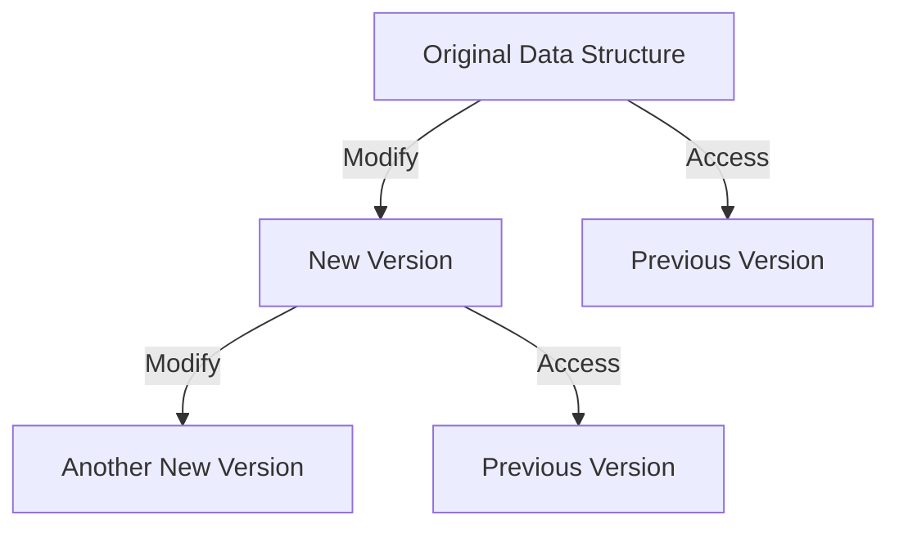

## 2.2 Immutability and Persistent Data Structures

In the realm of functional programming, immutability and persistent data structures are foundational concepts that play a crucial role in building robust, scalable, and maintainable systems. Haskell, as a purely functional language, embraces these principles, offering unique advantages in software design and architecture.

### Understanding Immutability

**Immutable Data** refers to data that cannot be changed once it is created. In Haskell, immutability is a default characteristic of data structures. This means that any operation that appears to modify a data structure actually creates a new version of it, leaving the original unchanged.

#### Benefits of Immutability

1. **Simplified Reasoning**: With immutable data, you can reason about your code more easily. Since data does not change, you can be confident that a function will always produce the same output given the same input.

2. **Concurrency**: Immutability eliminates the need for locks or other synchronization mechanisms, as there are no mutable states to protect. This makes concurrent programming more straightforward and less error-prone.

3. **Avoiding Side Effects**: By preventing changes to data, immutability helps avoid unintended side effects, leading to more predictable and reliable code.

4. **Ease of Debugging**: Immutable data structures simplify debugging, as you can trace the history of data transformations without worrying about hidden state changes.

### Persistent Data Structures

**Persistent Data Structures** are data structures that preserve their previous versions when modified. They are a natural fit for functional programming languages like Haskell, where immutability is a core principle.

#### Characteristics of Persistent Data Structures

- **Structural Sharing**: Instead of copying the entire data structure, persistent data structures share parts of the structure that remain unchanged. This makes them efficient in terms of both time and space.

- **Versioning**: Each modification results in a new version of the data structure, allowing you to access any previous version at any time.

- **Efficiency**: Despite their immutability, persistent data structures can be as efficient as their mutable counterparts, thanks to structural sharing and optimized algorithms.

### Implementing Immutability in Haskell

Haskell's type system and syntax naturally support immutability. Let's explore how you can leverage these features to implement immutable data structures.

#### Example: Immutable Lists

Lists in Haskell are immutable by default. Consider the following example:

```haskell
-- Define a list
let numbers = [1, 2, 3, 4, 5]

-- Add an element to the list
let newNumbers = 0 : numbers

-- The original list remains unchanged
print numbers     -- Output: [1, 2, 3, 4, 5]
print newNumbers  -- Output: [0, 1, 2, 3, 4, 5]
```

In this example, adding an element to the list creates a new list, leaving the original list unchanged.

#### Example: Immutable Trees

Trees are another common data structure that can be implemented immutably. Here's a simple binary tree implementation in Haskell:

```haskell
-- Define a binary tree data structure
data Tree a = Empty | Node a (Tree a) (Tree a) deriving (Show)

-- Insert an element into the tree
insert :: (Ord a) => a -> Tree a -> Tree a
insert x Empty = Node x Empty Empty
insert x (Node a left right)
    | x == a = Node x left right
    | x < a  = Node a (insert x left) right
    | x > a  = Node a left (insert x right)

-- Example usage
let tree = insert 5 (insert 3 (insert 7 Empty))
print tree  -- Output: Node 5 (Node 3 Empty Empty) (Node 7 Empty Empty)
```

In this example, each insertion operation creates a new version of the tree, preserving the previous versions.

### Persistent Data Structures in Haskell

Haskell provides several libraries and techniques for working with persistent data structures. Let's explore some of the most common ones.

#### Data.Map: Persistent Maps

The `Data.Map` module in Haskell's standard library provides an efficient implementation of persistent maps (also known as dictionaries or associative arrays).

```haskell
import qualified Data.Map as Map

-- Create a new map
let map1 = Map.fromList [(1, "one"), (2, "two"), (3, "three")]

-- Insert a new key-value pair
let map2 = Map.insert 4 "four" map1

-- The original map remains unchanged
print map1  -- Output: fromList [(1,"one"),(2,"two"),(3,"three")]
print map2  -- Output: fromList [(1,"one"),(2,"two"),(3,"three"),(4,"four")]
```

#### Data.Set: Persistent Sets

The `Data.Set` module provides a similar implementation for sets, allowing you to perform set operations efficiently.

```haskell
import qualified Data.Set as Set

-- Create a new set
let set1 = Set.fromList [1, 2, 3]

-- Add an element to the set
let set2 = Set.insert 4 set1

-- The original set remains unchanged
print set1  -- Output: fromList [1,2,3]
print set2  -- Output: fromList [1,2,3,4]
```

### Visualizing Immutability and Persistence

To better understand how immutability and persistence work, let's visualize the process of modifying a persistent data structure.



**Diagram Description**: This diagram illustrates how each modification to a persistent data structure creates a new version while preserving access to previous versions. Structural sharing ensures that unchanged parts of the data structure are reused, optimizing memory usage.

### Practical Applications

Immutability and persistent data structures have numerous practical applications in software development. Let's explore some scenarios where these concepts shine.

#### Concurrent Programming

In concurrent programming, immutability eliminates the need for locks or other synchronization mechanisms, as there are no mutable states to protect. This makes it easier to write safe and efficient concurrent code.

#### Undo/Redo Functionality

Persistent data structures are ideal for implementing undo/redo functionality, as each modification results in a new version of the data structure. You can easily revert to a previous version by keeping track of the history of changes.

#### Functional Reactive Programming (FRP)

In FRP, immutability and persistence enable the creation of time-varying values and behaviors. By representing changes over time as a series of immutable states, you can build reactive systems that are both efficient and easy to reason about.

### Try It Yourself

To deepen your understanding of immutability and persistent data structures, try modifying the code examples provided in this section. Experiment with different data structures and operations to see how immutability affects their behavior.

### Knowledge Check

- **Question**: What are the benefits of using immutable data structures in concurrent programming?
- **Challenge**: Implement a persistent stack data structure in Haskell and demonstrate its usage.

### Summary

In this section, we've explored the principles of immutability and persistent data structures in Haskell. These concepts are fundamental to functional programming, offering numerous benefits such as simplified reasoning, concurrency, and avoidance of side effects. By leveraging Haskell's powerful type system and libraries, you can build efficient and reliable systems that take full advantage of immutability and persistence.

### References and Further Reading

- [Haskell Data.Map Documentation](https://hackage.haskell.org/package/containers/docs/Data-Map.html)
- [Haskell Data.Set Documentation](https://hackage.haskell.org/package/containers/docs/Data-Set.html)
- [Purely Functional Data Structures by Chris Okasaki](https://www.cs.cmu.edu/~rwh/theses/okasaki.pdf)

## Quiz: Immutability and Persistent Data Structures



### What is immutability in the context of functional programming?

- [x] Data that cannot be altered after creation
- [ ] Data that can be changed at any time
- [ ] Data that is stored in a mutable variable
- [ ] Data that is only used in concurrent programming

> **Explanation:** Immutability refers to data that cannot be changed once it is created, which is a core principle in functional programming.

### What is a persistent data structure?

- [x] A data structure that preserves previous versions when modified
- [ ] A data structure that is stored in a database
- [ ] A data structure that is used for temporary storage
- [ ] A data structure that is only used in object-oriented programming

> **Explanation:** Persistent data structures maintain previous versions of the data structure when modifications are made, allowing access to any version at any time.

### How does immutability simplify concurrent programming?

- [x] By eliminating the need for locks or synchronization mechanisms
- [ ] By allowing data to be changed by multiple threads simultaneously
- [ ] By making data mutable and shared between threads
- [ ] By using complex synchronization techniques

> **Explanation:** Immutability simplifies concurrent programming by removing the need for locks or synchronization mechanisms, as there are no mutable states to protect.

### What is structural sharing in persistent data structures?

- [x] Reusing parts of the data structure that remain unchanged
- [ ] Copying the entire data structure for each modification
- [ ] Storing data in a shared database
- [ ] Using locks to protect shared data

> **Explanation:** Structural sharing involves reusing parts of the data structure that remain unchanged, optimizing memory usage and efficiency.

### Which Haskell module provides persistent maps?

- [x] Data.Map
- [ ] Data.List
- [ ] Data.Array
- [ ] Data.Tree

> **Explanation:** The `Data.Map` module in Haskell's standard library provides an efficient implementation of persistent maps.

### What is the benefit of using persistent data structures for undo/redo functionality?

- [x] Each modification results in a new version, allowing easy reversion to previous states
- [ ] They require complex algorithms to manage state changes
- [ ] They are only suitable for concurrent programming
- [ ] They make it difficult to track changes over time

> **Explanation:** Persistent data structures are ideal for undo/redo functionality because each modification results in a new version, allowing easy reversion to previous states.

### How does immutability help in debugging?

- [x] By allowing you to trace the history of data transformations without worrying about hidden state changes
- [ ] By making data mutable and easy to change during debugging
- [ ] By requiring complex debugging tools
- [ ] By making it difficult to track changes in data

> **Explanation:** Immutability simplifies debugging by allowing you to trace the history of data transformations without worrying about hidden state changes.

### What is the default characteristic of lists in Haskell?

- [x] Immutable
- [ ] Mutable
- [ ] Persistent
- [ ] Temporary

> **Explanation:** Lists in Haskell are immutable by default, meaning they cannot be changed once created.

### What is the main advantage of using immutable data structures in functional reactive programming (FRP)?

- [x] They enable the creation of time-varying values and behaviors
- [ ] They make it difficult to manage state changes over time
- [ ] They require complex synchronization mechanisms
- [ ] They are only suitable for concurrent programming

> **Explanation:** In FRP, immutability and persistence enable the creation of time-varying values and behaviors, making reactive systems efficient and easy to reason about.

### True or False: Immutability eliminates the need for locks in concurrent programming.

- [x] True
- [ ] False

> **Explanation:** True. Immutability eliminates the need for locks or other synchronization mechanisms, as there are no mutable states to protect.



Remember, this is just the beginning. As you progress, you'll build more complex and interactive systems using Haskell's powerful features. Keep experimenting, stay curious, and enjoy the journey!
