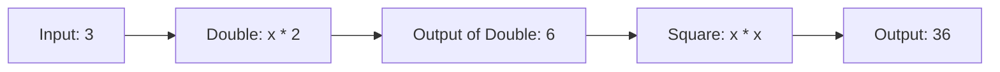

## 2.3 Higher-Order Functions and Function Composition

In the realm of functional programming, **higher-order functions** and **function composition** are foundational concepts that empower developers to write elegant, modular, and reusable code. In this section, we will delve into these concepts, explore their applications, and provide practical examples to solidify your understanding.

### Understanding Higher-Order Functions

Higher-order functions are functions that can take other functions as arguments or return them as results. This capability allows for a high degree of abstraction and flexibility in programming.

#### Key Characteristics of Higher-Order Functions

- **Abstraction**: They enable you to abstract common patterns of computation.
- **Modularity**: By encapsulating behavior, they promote modular code.
- **Reusability**: Functions can be reused across different contexts by passing different functions as arguments.

#### Examples of Higher-Order Functions

Let's start with a simple example to illustrate the concept of higher-order functions in Haskell.

```haskell
-- A higher-order function that takes a function and a list, and applies the function to each element
applyToEach :: (a -> b) -> [a] -> [b]
applyToEach f xs = map f xs

-- Example usage
increment :: Int -> Int
increment x = x + 1

main :: IO ()
main = print (applyToEach increment [1, 2, 3, 4])  -- Output: [2, 3, 4, 5]
```

In this example, `applyToEach` is a higher-order function that takes a function `f` and a list `xs`, applying `f` to each element of `xs`.

#### Common Higher-Order Functions in Haskell

Haskell provides several built-in higher-order functions that are widely used:

- **map**: Applies a function to each element of a list.
- **filter**: Selects elements of a list that satisfy a predicate.
- **foldr/foldl**: Reduces a list to a single value using a binary function.

### Function Composition

Function composition is the process of combining two or more functions to produce a new function. In Haskell, function composition is denoted by the `.` operator.

#### Benefits of Function Composition

- **Simplification**: Breaks down complex operations into simpler, reusable components.
- **Readability**: Enhances code readability by expressing operations in a declarative manner.
- **Maintainability**: Facilitates easier maintenance by isolating changes to individual functions.

#### Function Composition in Action

Consider the following example, which demonstrates function composition in Haskell:

```haskell
-- Define two simple functions
double :: Int -> Int
double x = x * 2

square :: Int -> Int
square x = x * x

-- Compose the functions
doubleThenSquare :: Int -> Int
doubleThenSquare = square . double

main :: IO ()
main = print (doubleThenSquare 3)  -- Output: 36
```

In this example, `doubleThenSquare` is a new function created by composing `square` and `double`. The composition `square . double` means "apply `double` first, then `square`."

#### Visualizing Function Composition

To better understand function composition, let's visualize the flow of data through composed functions using a Mermaid.js diagram:



This diagram illustrates how the input flows through the `double` function, producing an intermediate result, which is then passed to the `square` function to produce the final output.

### Applications of Higher-Order Functions and Function Composition

Higher-order functions and function composition are powerful tools for enhancing code modularity and reusability. Let's explore some practical applications:

#### Data Transformation

Higher-order functions like `map`, `filter`, and `foldr` are commonly used for data transformation tasks. By composing these functions, you can build complex data processing pipelines.

```haskell
-- Example: Transform a list of numbers by doubling and then filtering even numbers
processNumbers :: [Int] -> [Int]
processNumbers = filter even . map double

main :: IO ()
main = print (processNumbers [1, 2, 3, 4, 5])  -- Output: [4, 8]
```

In this example, `processNumbers` is a composed function that first doubles each number and then filters out the odd numbers.

#### Event Handling

In event-driven programming, higher-order functions can be used to define event handlers that are composed of multiple smaller functions.

```haskell
-- Define an event handler that logs and processes an event
handleEvent :: (String -> IO ()) -> (String -> IO ()) -> String -> IO ()
handleEvent log process event = do
    log event
    process event

-- Example usage
logEvent :: String -> IO ()
logEvent event = putStrLn ("Logging event: " ++ event)

processEvent :: String -> IO ()
processEvent event = putStrLn ("Processing event: " ++ event)

main :: IO ()
main = handleEvent logEvent processEvent "UserLoggedIn"
```

Here, `handleEvent` is a higher-order function that takes two functions, `log` and `process`, and an event string. It logs and processes the event using the provided functions.

#### Building DSLs (Domain-Specific Languages)

Higher-order functions and function composition are instrumental in building DSLs, allowing you to define concise and expressive syntax for specific domains.

```haskell
-- Define a simple DSL for arithmetic expressions
data Expr = Val Int | Add Expr Expr | Mul Expr Expr

-- Evaluate an expression
eval :: Expr -> Int
eval (Val n) = n
eval (Add x y) = eval x + eval y
eval (Mul x y) = eval x * eval y

-- Example usage
main :: IO ()
main = print (eval (Add (Val 1) (Mul (Val 2) (Val 3))))  -- Output: 7
```

In this example, we define a DSL for arithmetic expressions using algebraic data types. The `eval` function evaluates expressions by recursively applying operations.

### Try It Yourself

To deepen your understanding, try modifying the code examples provided:

- **Experiment with different functions**: Replace `increment` with a different function in the `applyToEach` example.
- **Compose more functions**: Add more functions to the `doubleThenSquare` composition.
- **Create a new DSL**: Extend the arithmetic DSL with additional operations like subtraction or division.

### Knowledge Check

Before we conclude, let's reinforce what we've learned:

- **What are higher-order functions?** Functions that take other functions as arguments or return them.
- **What is function composition?** The process of combining functions to create new functionality.
- **Why use higher-order functions and function composition?** To enhance code modularity, reusability, and readability.

### Embrace the Journey

Remember, mastering higher-order functions and function composition is a journey. As you continue to explore these concepts, you'll discover new ways to write more expressive and efficient Haskell code. Keep experimenting, stay curious, and enjoy the journey!

### References and Further Reading

- [Learn You a Haskell for Great Good!](http://learnyouahaskell.com/)
- [Haskell Programming from First Principles](https://haskellbook.com/)
- [Real World Haskell](http://book.realworldhaskell.org/)

## Quiz: Higher-Order Functions and Function Composition



### What is a higher-order function?

- [x] A function that takes other functions as arguments or returns them
- [ ] A function that only returns integers
- [ ] A function that does not take any arguments
- [ ] A function that only operates on strings

> **Explanation:** Higher-order functions can take other functions as arguments or return them as results, allowing for greater abstraction and flexibility.

### Which operator is used for function composition in Haskell?

- [ ] +
- [ ] *
- [x] .
- [ ] /

> **Explanation:** The `.` operator is used for function composition in Haskell, allowing you to combine functions into a new function.

### What is the output of the following code: `print (doubleThenSquare 3)`?

- [ ] 9
- [ ] 18
- [x] 36
- [ ] 12

> **Explanation:** The function `doubleThenSquare` first doubles the input (3 * 2 = 6) and then squares the result (6 * 6 = 36).

### What is the purpose of the `map` function in Haskell?

- [x] To apply a function to each element of a list
- [ ] To filter elements of a list
- [ ] To reduce a list to a single value
- [ ] To sort a list

> **Explanation:** The `map` function applies a given function to each element of a list, producing a new list of results.

### How can higher-order functions enhance code modularity?

- [x] By encapsulating behavior and allowing functions to be reused across different contexts
- [ ] By making code more complex and difficult to understand
- [ ] By reducing the number of functions in a program
- [ ] By eliminating the need for functions altogether

> **Explanation:** Higher-order functions encapsulate behavior, promoting modularity and reusability by allowing functions to be reused in different contexts.

### What is the result of composing `square` and `double` functions?

- [x] A new function that doubles a number and then squares it
- [ ] A new function that squares a number and then doubles it
- [ ] A function that only doubles a number
- [ ] A function that only squares a number

> **Explanation:** Composing `square` and `double` results in a new function that first doubles a number and then squares the result.

### Which of the following is a benefit of function composition?

- [x] Simplification of complex operations
- [ ] Increased code verbosity
- [ ] Reduced code readability
- [ ] Elimination of functions

> **Explanation:** Function composition simplifies complex operations by breaking them down into simpler, reusable components, enhancing readability and maintainability.

### What does the `filter` function do in Haskell?

- [ ] Applies a function to each element of a list
- [x] Selects elements of a list that satisfy a predicate
- [ ] Reduces a list to a single value
- [ ] Sorts a list

> **Explanation:** The `filter` function selects elements of a list that satisfy a given predicate, producing a new list of those elements.

### True or False: Function composition can only be used with two functions.

- [ ] True
- [x] False

> **Explanation:** Function composition can be used with any number of functions, allowing you to build complex functionality by chaining multiple functions together.

### What is the primary advantage of using higher-order functions in event handling?

- [x] They allow for the definition of event handlers composed of multiple smaller functions
- [ ] They eliminate the need for event handlers
- [ ] They make event handling more complex
- [ ] They reduce the number of events that can be handled

> **Explanation:** Higher-order functions enable the definition of event handlers composed of multiple smaller functions, promoting modularity and reusability.


