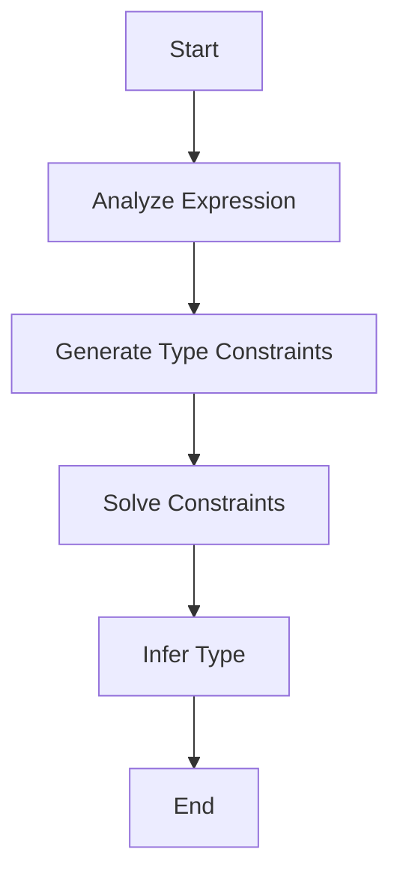

## 2.4 Strong Static Typing and Type Inference

In this section, we delve into the intricacies of Haskell's strong static typing and type inference, two cornerstone features that contribute to the language's robustness and expressiveness. Understanding these concepts is crucial for leveraging Haskell's full potential in building reliable and maintainable software systems.

### Type System Overview

Haskell's type system is one of its defining features, providing a powerful mechanism for ensuring code correctness and preventing runtime errors. The type system is static, meaning that type checking occurs at compile time, and strong, meaning that the language enforces strict type constraints.

#### Key Features of Haskell's Type System

1. **Static Typing**: Types are checked at compile time, catching errors early in the development process.
2. **Strong Typing**: Haskell enforces strict type rules, preventing operations on incompatible types.
3. **Type Inference**: Haskell can automatically deduce types, reducing the need for explicit type annotations.
4. **Polymorphism**: Haskell supports both parametric and ad-hoc polymorphism, allowing for flexible and reusable code.

### Type Inference

Type inference is a feature that allows Haskell to automatically deduce the types of expressions without requiring explicit type annotations from the programmer. This reduces boilerplate code and enhances code readability.

#### How Type Inference Works

Haskell uses the Hindley-Milner type inference algorithm, which is both sound and complete. This algorithm works by:

1. **Analyzing Expressions**: Haskell examines the structure of expressions and the operations performed on them.
2. **Generating Constraints**: The compiler generates a set of type constraints based on the operations and expressions.
3. **Solving Constraints**: The compiler solves these constraints to deduce the most general type for each expression.

#### Example of Type Inference

Consider the following Haskell function:

```haskell
add :: Num a => a -> a -> a
add x y = x + y
```

In this example, the type signature `Num a => a -> a -> a` indicates that `add` is a function that takes two arguments of the same numeric type and returns a result of that type. However, Haskell can infer this type even if we omit the type signature:

```haskell
add x y = x + y
```

The compiler deduces that `x` and `y` must be of a type that supports the `+` operation, which is captured by the `Num` type class.

### Advantages of Strong Static Typing and Type Inference

1. **Early Error Detection**: By catching type errors at compile time, Haskell prevents many common runtime errors, leading to more reliable software.
2. **Improved Documentation**: Type signatures serve as a form of documentation, making code easier to understand and maintain.
3. **Enhanced Refactoring**: The type system provides a safety net when refactoring code, ensuring that changes do not introduce type errors.
4. **Increased Abstraction**: Type inference allows developers to write more abstract and generic code without sacrificing type safety.

### Visualizing Type Inference

To better understand how type inference works, let's visualize the process using a simple flowchart.



**Figure 1: Type Inference Process Flowchart**

This flowchart illustrates the steps involved in Haskell's type inference process, from analyzing expressions to inferring the final type.

### Type Classes and Polymorphism

Haskell's type system supports polymorphism through type classes, which enable ad-hoc polymorphism. Type classes define a set of functions that can operate on multiple types, allowing for flexible and reusable code.

#### Example of a Type Class

Consider the `Eq` type class, which defines equality operations:

```haskell
class Eq a where
    (==) :: a -> a -> Bool
    (/=) :: a -> a -> Bool
```

Any type that implements the `Eq` type class must provide definitions for the `(==)` and `(/=)` functions.

#### Using Type Classes

Here's an example of using the `Eq` type class:

```haskell
data Color = Red | Green | Blue

instance Eq Color where
    Red == Red = True
    Green == Green = True
    Blue == Blue = True
    _ == _ = False
```

In this example, we define a `Color` data type and implement the `Eq` type class for it, providing custom equality logic.

### Type Inference in Practice

Let's explore a practical example to see type inference in action. Consider a function that calculates the length of a list:

```haskell
length' :: [a] -> Int
length' [] = 0
length' (_:xs) = 1 + length' xs
```

Even without the type signature, Haskell can infer that `length'` takes a list of any type `[a]` and returns an `Int`.

### Try It Yourself

Experiment with the following code by modifying the function to work with different data types or operations:

```haskell
-- Define a function that calculates the sum of a list
sumList :: Num a => [a] -> a
sumList [] = 0
sumList (x:xs) = x + sumList xs
```

Try changing the operation from addition to multiplication or using a different data type, such as `String`, to see how Haskell's type inference handles these changes.

### Knowledge Check

- What is the primary advantage of Haskell's strong static typing?
- How does type inference reduce boilerplate code?
- What role do type classes play in Haskell's type system?

### Conclusion

Haskell's strong static typing and type inference are powerful tools that enhance code reliability, readability, and maintainability. By understanding and leveraging these features, developers can write more robust and flexible software.

## Quiz: Strong Static Typing and Type Inference



### What is the primary advantage of Haskell's strong static typing?

- [x] Early error detection
- [ ] Faster runtime performance
- [ ] Simplified syntax
- [ ] Dynamic type checking

> **Explanation:** Haskell's strong static typing allows for early error detection at compile time, preventing many common runtime errors.

### How does type inference benefit Haskell developers?

- [x] Reduces boilerplate code
- [ ] Increases runtime speed
- [ ] Simplifies syntax
- [ ] Enables dynamic typing

> **Explanation:** Type inference reduces the need for explicit type annotations, leading to less boilerplate code and more readable programs.

### What algorithm does Haskell use for type inference?

- [x] Hindley-Milner
- [ ] Dijkstra's
- [ ] A* Search
- [ ] Bellman-Ford

> **Explanation:** Haskell uses the Hindley-Milner algorithm for type inference, which is both sound and complete.

### Which of the following is a feature of Haskell's type system?

- [x] Strong typing
- [ ] Weak typing
- [ ] Dynamic typing
- [ ] Untyped

> **Explanation:** Haskell's type system is characterized by strong typing, enforcing strict type rules.

### What is a type class in Haskell?

- [x] A set of functions that can operate on multiple types
- [ ] A class that defines object-oriented behavior
- [ ] A template for creating data types
- [ ] A function that infers types

> **Explanation:** A type class in Haskell defines a set of functions that can operate on multiple types, enabling polymorphism.

### How does Haskell's type system improve code documentation?

- [x] Through type signatures
- [ ] By generating comments
- [ ] By enforcing naming conventions
- [ ] By providing syntax highlighting

> **Explanation:** Type signatures in Haskell serve as a form of documentation, making code easier to understand and maintain.

### What is the role of the `Eq` type class?

- [x] To define equality operations
- [ ] To perform arithmetic operations
- [ ] To manage input/output
- [ ] To handle exceptions

> **Explanation:** The `Eq` type class defines equality operations, allowing types to implement custom equality logic.

### What does the `Num` type class represent?

- [x] Numeric types
- [ ] String types
- [ ] Boolean types
- [ ] List types

> **Explanation:** The `Num` type class represents numeric types, providing operations like addition and multiplication.

### What is the result of Haskell's type inference process?

- [x] The most general type for each expression
- [ ] The fastest execution path
- [ ] The simplest syntax
- [ ] The smallest memory footprint

> **Explanation:** Haskell's type inference process deduces the most general type for each expression, ensuring type safety.

### True or False: Haskell requires explicit type annotations for all functions.

- [ ] True
- [x] False

> **Explanation:** Haskell does not require explicit type annotations for all functions, thanks to its type inference capabilities.



Remember, mastering Haskell's type system is a journey. As you continue to explore and experiment, you'll discover new ways to leverage these features to build more robust and elegant software solutions. Keep pushing the boundaries and enjoy the process!
