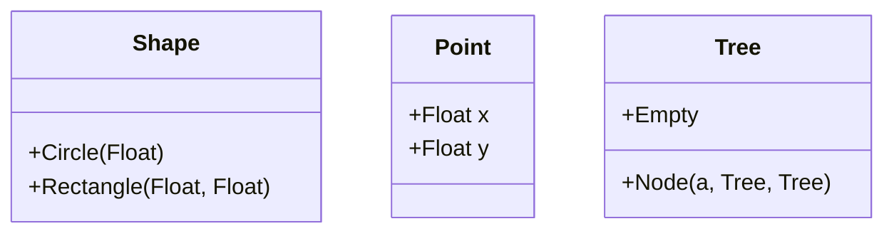

## 2.5 Pattern Matching and Algebraic Data Types

In the realm of functional programming, Haskell stands out for its expressive power and elegance, largely due to its robust support for pattern matching and algebraic data types (ADTs). These features allow developers to write concise, readable, and maintainable code by modeling complex data structures naturally. In this section, we will delve deep into these concepts, exploring their syntax, usage, and best practices in Haskell.

### Understanding Pattern Matching

Pattern matching is a powerful feature in Haskell that allows you to deconstruct data structures directly within function definitions. It provides a way to check a value against a pattern and, if it matches, to extract values from it. This feature is not only syntactically elegant but also enhances code readability and maintainability.

#### Basic Pattern Matching

Let's start with a simple example of pattern matching using a tuple:

```haskell
-- A function to add two pairs of integers
addPairs :: (Int, Int) -> (Int, Int) -> (Int, Int)
addPairs (x1, y1) (x2, y2) = (x1 + x2, y1 + y2)
```

In this example, the function `addPairs` takes two tuples as arguments and uses pattern matching to extract their components. The pattern `(x1, y1)` matches the first tuple, and `(x2, y2)` matches the second. This allows us to directly use `x1`, `y1`, `x2`, and `y2` in the function body.

#### Pattern Matching with Lists

Pattern matching is particularly useful with lists, which are a fundamental data structure in Haskell. Consider the following example:

```haskell
-- A function to compute the length of a list
listLength :: [a] -> Int
listLength [] = 0
listLength (_:xs) = 1 + listLength xs
```

Here, the function `listLength` uses pattern matching to handle two cases: an empty list `[]` and a non-empty list `(_:xs)`. The underscore `_` is a wildcard that matches any element, and `xs` represents the rest of the list.

### Advanced Pattern Matching Techniques

Haskell's pattern matching capabilities extend beyond simple deconstruction. Let's explore some advanced techniques.

#### As-Patterns

As-patterns allow you to match a pattern while keeping a reference to the entire value. They are denoted using the `@` symbol. Here's an example:

```haskell
-- A function to duplicate the first element of a list
duplicateFirst :: [a] -> [a]
duplicateFirst xs@(x:_) = x : xs
duplicateFirst [] = []
```

In this function, `xs@(x:_)` matches a non-empty list, binding `xs` to the entire list and `x` to its first element. This allows us to prepend `x` to `xs`, effectively duplicating the first element.

#### Guards and Pattern Matching

Guards can be combined with pattern matching to add conditional logic to function definitions. Here's an example:

```haskell
-- A function to classify numbers
classifyNumber :: Int -> String
classifyNumber n
  | n < 0     = "Negative"
  | n == 0    = "Zero"
  | otherwise = "Positive"
```

In this function, `classifyNumber` uses guards to classify an integer as "Negative", "Zero", or "Positive". Guards are evaluated in order, and the first true guard determines the result.

### Algebraic Data Types (ADTs)

Algebraic data types are a cornerstone of Haskell's type system, allowing you to define complex data structures using a combination of sum and product types. They enable you to model real-world data more naturally and expressively.

#### Sum Types

Sum types, also known as tagged unions or variant types, allow a value to be one of several different types. They are defined using the `data` keyword. Here's an example:

```haskell
-- A data type representing a shape
data Shape = Circle Float | Rectangle Float Float
```

In this example, `Shape` is a sum type that can be either a `Circle` with a radius or a `Rectangle` with width and height. Each variant is called a constructor.

#### Product Types

Product types, on the other hand, combine multiple values into a single type. They are akin to tuples but with named fields. Here's an example:

```haskell
-- A data type representing a point in 2D space
data Point = Point { x :: Float, y :: Float }
```

In this example, `Point` is a product type with two fields, `x` and `y`, both of type `Float`. This allows you to create more descriptive and self-documenting data structures.

### Combining Pattern Matching and ADTs

Pattern matching and algebraic data types complement each other perfectly. You can use pattern matching to deconstruct ADTs and access their components. Here's an example:

```haskell
-- A function to compute the area of a shape
area :: Shape -> Float
area (Circle r) = pi * r * r
area (Rectangle w h) = w * h
```

In this function, `area` uses pattern matching to handle different variants of the `Shape` type. It computes the area of a `Circle` using its radius `r` and the area of a `Rectangle` using its width `w` and height `h`.

### Recursive Data Types

Haskell's ADTs can also be recursive, allowing you to define complex data structures like trees and linked lists. Here's an example of a binary tree:

```haskell
-- A data type representing a binary tree
data Tree a = Empty | Node a (Tree a) (Tree a)

-- A function to compute the size of a tree
treeSize :: Tree a -> Int
treeSize Empty = 0
treeSize (Node _ left right) = 1 + treeSize left + treeSize right
```

In this example, `Tree` is a recursive data type with two constructors: `Empty` for an empty tree and `Node` for a tree node with a value and two subtrees. The function `treeSize` uses pattern matching to compute the size of the tree.

### Visualizing Algebraic Data Types

To better understand the structure of algebraic data types, let's visualize them using Mermaid.js diagrams.



In this diagram, we see the `Shape`, `Point`, and `Tree` data types represented as classes with their respective constructors and fields.

### Best Practices for Pattern Matching and ADTs

When using pattern matching and ADTs in Haskell, consider the following best practices:

- **Use Pattern Matching for Clarity**: Pattern matching can make your code more readable and concise. Use it to deconstruct data structures and handle different cases explicitly.
- **Leverage ADTs for Expressiveness**: Algebraic data types allow you to model complex data structures naturally. Use them to create self-documenting code that reflects the problem domain.
- **Avoid Overlapping Patterns**: Ensure that your patterns are non-overlapping and exhaustive. This prevents runtime errors and makes your code more robust.
- **Use Guards for Conditional Logic**: Combine pattern matching with guards to add conditional logic to your functions. This can make your code more expressive and easier to understand.
- **Document Your Data Types**: Provide clear documentation for your ADTs and their constructors. This helps other developers understand the purpose and usage of your data structures.

### Try It Yourself

To deepen your understanding of pattern matching and ADTs, try modifying the code examples provided. Here are some suggestions:

- Add a new constructor to the `Shape` data type, such as `Triangle`, and update the `area` function to handle it.
- Implement a function to compute the depth of a binary tree using the `Tree` data type.
- Create a new ADT to represent a simple arithmetic expression and write a function to evaluate it.

### References and Further Reading

For more information on pattern matching and algebraic data types in Haskell, consider the following resources:

- [Haskell 2010 Language Report](https://www.haskell.org/onlinereport/haskell2010/)
- [Learn You a Haskell for Great Good!](http://learnyouahaskell.com/)
- [Real World Haskell](http://book.realworldhaskell.org/)

### Knowledge Check

Before moving on, let's reinforce what we've learned with a few questions:

1. What is the purpose of pattern matching in Haskell?
2. How do algebraic data types enhance code expressiveness?
3. What are the differences between sum types and product types?
4. How can you use guards in combination with pattern matching?
5. What are some best practices for using pattern matching and ADTs?

### Embrace the Journey

Remember, mastering pattern matching and algebraic data types is just the beginning of your journey with Haskell. As you continue to explore functional programming, you'll discover even more powerful techniques and patterns. Keep experimenting, stay curious, and enjoy the process!

## Quiz: Pattern Matching and Algebraic Data Types



### What is the primary purpose of pattern matching in Haskell?

- [x] To deconstruct data structures and extract values
- [ ] To perform arithmetic operations
- [ ] To define new data types
- [ ] To manage memory allocation

> **Explanation:** Pattern matching is used to deconstruct data structures and extract values, making code more readable and concise.

### Which of the following is an example of a sum type in Haskell?

- [x] `data Shape = Circle Float | Rectangle Float Float`
- [ ] `data Point = Point { x :: Float, y :: Float }`
- [ ] `data Tree a = Empty | Node a (Tree a) (Tree a)`
- [ ] `data Color = Red | Green | Blue`

> **Explanation:** A sum type allows a value to be one of several different types, as seen in the `Shape` example.

### How do algebraic data types enhance code expressiveness?

- [x] By allowing complex data structures to be modeled naturally
- [ ] By simplifying arithmetic operations
- [ ] By reducing memory usage
- [ ] By increasing execution speed

> **Explanation:** Algebraic data types enable developers to model complex data structures naturally, enhancing code expressiveness.

### What is the role of guards in Haskell?

- [x] To add conditional logic to function definitions
- [ ] To define new data types
- [ ] To manage memory allocation
- [ ] To perform arithmetic operations

> **Explanation:** Guards are used to add conditional logic to function definitions, making code more expressive.

### Which of the following is a best practice for using pattern matching in Haskell?

- [x] Ensure patterns are non-overlapping and exhaustive
- [ ] Use pattern matching only for arithmetic operations
- [ ] Avoid using pattern matching with lists
- [ ] Use pattern matching to manage memory allocation

> **Explanation:** Ensuring patterns are non-overlapping and exhaustive prevents runtime errors and makes code more robust.

### What is an as-pattern in Haskell?

- [x] A pattern that matches a value while keeping a reference to the entire value
- [ ] A pattern that only matches lists
- [ ] A pattern used for arithmetic operations
- [ ] A pattern that matches only integers

> **Explanation:** As-patterns match a value while keeping a reference to the entire value, using the `@` symbol.

### Which of the following is a product type in Haskell?

- [ ] `data Shape = Circle Float | Rectangle Float Float`
- [x] `data Point = Point { x :: Float, y :: Float }`
- [ ] `data Tree a = Empty | Node a (Tree a) (Tree a)`
- [ ] `data Color = Red | Green | Blue`

> **Explanation:** A product type combines multiple values into a single type, as seen in the `Point` example.

### How can you use pattern matching with lists in Haskell?

- [x] By deconstructing lists into head and tail components
- [ ] By performing arithmetic operations on lists
- [ ] By defining new data types for lists
- [ ] By managing memory allocation for lists

> **Explanation:** Pattern matching with lists involves deconstructing them into head and tail components, as seen in the `listLength` example.

### What is a recursive data type in Haskell?

- [x] A data type that can refer to itself in its definition
- [ ] A data type used only for arithmetic operations
- [ ] A data type that cannot be pattern matched
- [ ] A data type that is always immutable

> **Explanation:** Recursive data types can refer to themselves in their definition, allowing for complex structures like trees.

### True or False: Pattern matching can only be used with algebraic data types in Haskell.

- [ ] True
- [x] False

> **Explanation:** Pattern matching can be used with various data structures, not just algebraic data types.




