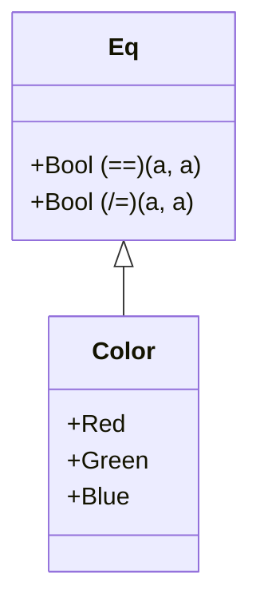

## 2.6 Type Classes and Polymorphism

In the world of Haskell, type classes and polymorphism are pivotal concepts that empower developers to write flexible, reusable, and type-safe code. This section delves into the depths of these concepts, providing expert insights and practical examples to help you master their use in Haskell.

### Understanding Type Classes

**Type Classes** in Haskell are akin to interfaces in object-oriented languages. They define a set of functions or operations that can be performed on a type. However, unlike interfaces, type classes are more flexible and powerful due to Haskell's strong type system and functional nature.

#### Key Characteristics of Type Classes

- **Abstraction**: Type classes allow you to define generic interfaces that can be implemented by various types.
- **Polymorphism**: They enable polymorphic functions that can operate on any type that implements the type class.
- **Extensibility**: New types can be easily integrated into existing type classes, enhancing code reuse.

#### Creating a Type Class

To create a type class in Haskell, you use the `class` keyword followed by the type class name and a list of function signatures. Here's a simple example:

```haskell
class Eq a where
    (==) :: a -> a -> Bool
    (/=) :: a -> a -> Bool
```

In this example, `Eq` is a type class that defines two functions: `(==)` and `(/=)`. Any type that wants to be an instance of `Eq` must provide implementations for these functions.

### Implementing Type Classes

Once a type class is defined, you can create instances of it for specific types using the `instance` keyword. Let's implement the `Eq` type class for a custom data type:

```haskell
data Color = Red | Green | Blue

instance Eq Color where
    Red == Red = True
    Green == Green = True
    Blue == Blue = True
    _ == _ = False

    x /= y = not (x == y)
```

Here, we define a `Color` data type and make it an instance of the `Eq` type class by providing implementations for `(==)` and `(/=)`.

### Polymorphism in Haskell

**Polymorphism** in Haskell allows you to write code that can operate on different types. There are two main types of polymorphism in Haskell:

1. **Parametric Polymorphism**: Functions that can operate on any type. For example, the `id` function:

    ```haskell
    id :: a -> a
    id x = x
    ```

    The `id` function works for any type `a`.

2. **Ad-hoc Polymorphism**: Achieved through type classes, allowing functions to operate on any type that implements a specific type class.

#### Example of Ad-hoc Polymorphism

Consider a function that checks if two values are equal. Using the `Eq` type class, we can write a polymorphic function:

```haskell
areEqual :: Eq a => a -> a -> Bool
areEqual x y = x == y
```

The `areEqual` function can compare any two values of a type that is an instance of `Eq`.

### Advanced Type Class Features

Haskell's type classes offer advanced features that enhance their power and flexibility.

#### Multi-Parameter Type Classes

Type classes can have multiple parameters, allowing more complex relationships between types. Here's an example:

```haskell
class Convertible a b where
    convert :: a -> b
```

This `Convertible` type class defines a conversion function between two types `a` and `b`.

#### Functional Dependencies

Functional dependencies specify relationships between type parameters in multi-parameter type classes, guiding type inference. Consider the following:

```haskell
class Convertible a b | a -> b where
    convert :: a -> b
```

The `| a -> b` part indicates that the type `b` is uniquely determined by the type `a`.

#### Associated Types

Associated types allow you to associate a type with a type class, providing a more intuitive way to express type relationships. Here's an example:

```haskell
class Container c where
    type Element c
    empty :: c
    insert :: Element c -> c -> c
```

In this `Container` type class, `Element c` is an associated type representing the type of elements in the container.

### Code Examples and Exercises

Let's explore some practical examples and exercises to solidify your understanding of type classes and polymorphism.

#### Example: Creating a Functor Type Class

The `Functor` type class is a fundamental concept in Haskell, representing types that can be mapped over. Here's how you can define and implement it:

```haskell
class Functor f where
    fmap :: (a -> b) -> f a -> f b

instance Functor Maybe where
    fmap _ Nothing = Nothing
    fmap g (Just x) = Just (g x)
```

In this example, `fmap` applies a function to the value inside a `Maybe` type.

#### Exercise: Implementing a Custom Type Class

Create a `Show` type class that converts a value to a `String`, and implement it for a custom data type.

```haskell
class Show a where
    show :: a -> String

data Person = Person { name :: String, age :: Int }

instance Show Person where
    show (Person n a) = "Name: " ++ n ++ ", Age: " ++ show a
```

Try implementing the `Show` type class for other data types and experiment with different representations.

### Visualizing Type Classes and Polymorphism

To better understand the relationships between type classes and polymorphism, let's visualize these concepts using a class diagram.



This diagram illustrates the `Eq` type class and its implementation for the `Color` data type.

### References and Further Reading

- [Haskell Documentation on Type Classes](https://www.haskell.org/onlinereport/haskell2010/haskellch6.html)
- [Learn You a Haskell for Great Good!](http://learnyouahaskell.com/types-and-typeclasses)
- [Real World Haskell](http://book.realworldhaskell.org/read/)

### Knowledge Check

- What are the key differences between parametric and ad-hoc polymorphism?
- How do functional dependencies aid in type inference?
- Implement a type class for a custom data type and test it with various instances.

### Embrace the Journey

Remember, mastering type classes and polymorphism in Haskell is a journey. As you explore these concepts, you'll unlock new ways to write concise, reusable, and powerful code. Keep experimenting, stay curious, and enjoy the process!

## Quiz: Type Classes and Polymorphism



### What is a type class in Haskell?

- [x] An interface that defines behavior for types
- [ ] A data type that holds multiple values
- [ ] A function that operates on multiple types
- [ ] A module that contains various functions

> **Explanation:** A type class in Haskell is an interface that defines a set of functions or operations that can be performed on a type.

### How do you define a type class in Haskell?

- [x] Using the `class` keyword followed by the type class name and function signatures
- [ ] Using the `data` keyword followed by the type class name and function signatures
- [ ] Using the `instance` keyword followed by the type class name and function signatures
- [ ] Using the `module` keyword followed by the type class name and function signatures

> **Explanation:** Type classes are defined using the `class` keyword, followed by the type class name and a list of function signatures.

### What is polymorphism in Haskell?

- [x] Writing code that can operate on any type that implements a certain interface
- [ ] Writing code that can only operate on a single type
- [ ] Writing code that can operate on multiple values of the same type
- [ ] Writing code that can operate on different modules

> **Explanation:** Polymorphism in Haskell allows you to write code that can operate on any type that implements a specific type class, enabling code reuse and flexibility.

### What is parametric polymorphism?

- [x] Functions that can operate on any type
- [ ] Functions that can only operate on a single type
- [ ] Functions that can operate on multiple values of the same type
- [ ] Functions that can operate on different modules

> **Explanation:** Parametric polymorphism refers to functions that can operate on any type, making them highly reusable.

### What is ad-hoc polymorphism?

- [x] Achieved through type classes, allowing functions to operate on any type that implements a specific type class
- [ ] Functions that can operate on any type
- [ ] Functions that can only operate on a single type
- [ ] Functions that can operate on different modules

> **Explanation:** Ad-hoc polymorphism is achieved through type classes, enabling functions to operate on any type that implements a specific type class.

### How do you create an instance of a type class for a specific type?

- [x] Using the `instance` keyword followed by the type class name and type
- [ ] Using the `class` keyword followed by the type class name and type
- [ ] Using the `data` keyword followed by the type class name and type
- [ ] Using the `module` keyword followed by the type class name and type

> **Explanation:** Instances of a type class for specific types are created using the `instance` keyword.

### What are functional dependencies in Haskell?

- [x] They specify relationships between type parameters in multi-parameter type classes
- [ ] They define the behavior of a type class
- [ ] They determine the order of function execution
- [ ] They manage memory allocation for types

> **Explanation:** Functional dependencies specify relationships between type parameters in multi-parameter type classes, aiding in type inference.

### What are associated types in Haskell?

- [x] Types associated with a type class, providing a more intuitive way to express type relationships
- [ ] Types that are automatically generated by the compiler
- [ ] Types that are only used within a specific module
- [ ] Types that cannot be instantiated

> **Explanation:** Associated types are types associated with a type class, allowing for more intuitive expression of type relationships.

### True or False: Type classes in Haskell are similar to interfaces in object-oriented languages.

- [x] True
- [ ] False

> **Explanation:** Type classes in Haskell are similar to interfaces in object-oriented languages, as they define a set of functions or operations that can be performed on a type.


